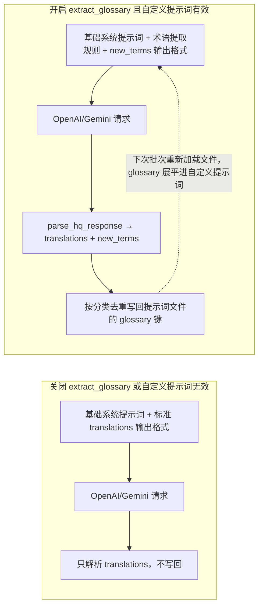
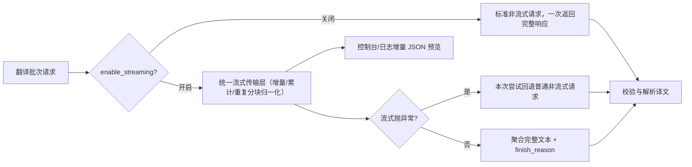

# 术语表、流式传输与断句换行

当长篇漫画需要保持一致的人名、地名和技能名，或希望翻译过程中能实时看到增量输出、让译文按原文行数断句时，本页用于配置自动术语提取（`translator.extract_glossary`）、流式传输（`translator.enable_streaming`）和 AI 断句（`render.disable_auto_wrap`）。术语提取结果会写回自定义提示词文件；流式传输只改变请求的传输方式；AI 断句通过断句提示词和 `original_region_count` 让模型输出 `[BR]` 换行标记。

这里不负责翻译器与目标语言选择（见[翻译器选择](./selection-and-languages.md)）、上下文历史与提示词组合全貌（见[上下文与提示词](./context-and-prompts.md)），也不负责渲染端自动换行、语义断句和标点清理的完整排版行为（见[排版与渲染](../settings/typesetting-and-rendering.md)）。

## 适用场景

- 当前配置模型中没有 `translator.glossary` 配置键；术语表以 `glossary` 键的形式存放在自定义 HQ 提示词文件（`translator.high_quality_prompt_path`）内，由自动提取功能写回。
- `translator.extract_glossary` 是自动术语提取开关；只有自定义 HQ 提示词成功加载时它才会进入提取分支，否则即使开关开启也走普通翻译。
- `translator.enable_streaming`（任务简报中的 `translator.stream` 即此键）只改变 OpenAI/Gemini（含 HQ 模式）请求的传输方式，不改变提示词、上下文、术语提取或最终译文。
- `render.disable_auto_wrap` 在界面中显示为“AI 断句”；它同时驱动翻译端断句提示词和渲染端的 `[BR]` 强制换行语义，渲染端自动换行等行为见排版与渲染页。
- `OPENAI_GLOSSARY_PATH`（“术语表路径”）是环境变量背书的旧式术语表路径，与 `extract_glossary` 的写回位置（自定义提示词文件）不同。

## 在桌面端设置

### 在设置页开启术语提取与流式传输

1. 打开“设置”，选择“翻译”分组。
2. 在“自动提取新术语”开关上启用或关闭。启用后右侧说明面板显示“自动从翻译结果中提取人名、地名等专有名词，确保长篇漫画翻译一致性。”
3. 在“启用流式传输”开关上启用或关闭。说明面板显示流式与普通请求的差异。
4. 术语提取需要先在“自定义提示词”中选择一个可解析的提示词文件，否则开关不会产生提取分支。
5. 打开“设置”→“排版”，在“AI 断句”开关上启用或关闭 AI 断句提示词。

### 在提示词预览中查看术语表

打开“提示词管理”，选中自定义提示词文件后点击“提示词预览”。若文件含 `glossary` 键，预览会显示“术语词典”分节和条目总数，并按 Person / Location / Org / Item / Skill / Creature 分类页签展示；没有条目时显示“没有术语条目”。

## 参数与选项

> 本页各参数的界面名称、存储键与默认值的对应关系，见[界面选项对照表](../../reference/options-i18n-matrix.md)。

#### 自动提取新术语 {#translator-extract-glossary}

- 控件：开关。
- 所在界面：设置 → 翻译。
- 可选值：开启或关闭。
- 默认值：`false`。
- 原理：开启后，翻译器在每次尝试时追加术语提取规则和带 `new_terms` 要求的扩展输出格式，从响应中提取人名、地名等专有名词并写回自定义提示词文件的 `glossary` 键。新原文会创建同名的第一条 `aliases` 叫法，并把译文写入其 `translations`；相同原文只有设置 `overwrite: true` 才能追加真正新的叫法，已经存在的叫法会被忽略，不会增加第二个 AI 译文。AI 术语增量使用 `original`、`category`、`aliases` 结构；条件、描述、覆盖开关和其他未知字段不会写回。下次批次重新加载该文件，形成“提取 → 写回 → 下次请求携带”的反馈回路。只有自定义提示词成功加载时才进入提取分支，否则即使开关开启也走普通翻译；写回会修改用户提示词文件，共享前需脱敏。



开关只改变提示词内容与写回行为；译文数量校验、重试和候选轮换仍然照常。

#### 启用流式传输 {#translator-enable-streaming}

- 控件：开关。
- 所在界面：设置 → 翻译。
- 可选值：开启或关闭。
- 默认值：`false`。
- 原理：开启后，OpenAI/Gemini（含高质量模式）优先使用统一流式传输层实时接收增量响应，并可在控制台/日志中看到增量预览；关闭时始终使用标准非流式请求。若流式请求抛出异常（如端点不支持流式），本次尝试自动回退为普通非流式请求，不会中断任务。



回退只影响单次尝试；若端点持续失败，重试与候选轮换机制照常接管。

#### AI 断句 {#render-disable-auto-wrap}

- 控件：开关。
- 所在界面：设置 → 排版。
- 可选值：开启或关闭。
- 默认值：`false`。
- 原理：开启后，翻译端在系统提示词中加入断句提示词，并让模型按原文行数输出 `[BR]` 换行标记；渲染端把 `[BR]` 视为强制换行参与排版。与“AI 断句检查”等排版选项联动，完整行为见排版与渲染页；替换翻译模式会强制开启 AI 断句与严格布局。单行区域（N=1）若模型仍返回 `[BR]`/`<br>`/`【BR】`，会在断句检查阶段自动清理成单行，该清理不依赖“AI 断句检查”开关。

```mermaid
flowchart LR
    subgraph Off["关闭 disable_auto_wrap"]
        O1["不加载断句提示词"] --> O2["用户提示词不带 original_region_count"]
        O2 --> O3["渲染：自动换行排版"]
    end
    subgraph On["开启 disable_auto_wrap"]
        A1["加载 system_prompt_line_break.yaml"] --> A2["断句提示进入系统提示词前缀"]
        A1 --> A3["每个区域附加 original_region_count"]
        A2 --> A4["OpenAI/Gemini 输出 [BR] 标记"]
        A3 --> A4
        A4 --> A5["渲染：按 [BR] 强制换行"]
        A5 --> A6{"check_br_and_retry 且区域≥2?"}
        A6 -->|译文缺 [BR]| A7["触发重试"]
        A6 -->|正常| A8["进入下一阶段"]
    end
```

渲染端自动换行、HanLP 语义断句和标点清理的完整分支见排版与渲染页；这里仅说明断句提示词如何进入翻译请求。

## 翻译请求如何处理

### 术语提取、合并与回填 {#glossary-feedback-loop}

术语提取依赖两条事实：只有自定义提示词有效且 `extract_glossary` 开启才进入提取分支；新术语写回的是自定义提示词文件（`high_quality_prompt_path`），而不是 `OPENAI_GLOSSARY_PATH` 环境变量指向的文件。写回的 `glossary` 键按标准分类组织，同一原文默认不变；只有条目显式允许自动添加时，才追加不存在的叫法，已有叫法的 AI 结果会被整条丢弃。自动合并不会修改已有译文、条件、描述、覆盖开关或其他人工内容。预览页按分类页签展示这些条目。反馈回路只在下次批次重新加载文件后生效，不修改当前已构建的请求。

### 流式传输层与回退 {#streaming-transport}

流式预览只作用于控制台/日志输出，最终仍以聚合后的完整文本参与响应校验与解析。流式失败不会切换翻译器或候选，只是本次尝试回退普通请求。

### AI 断句提示词与 `[BR]` 标记 {#ai-line-break}

用户提示词附带 `original_region_count`，渲染端据此判断译文中的 `[BR]` 数量是否符合原文行数；`check_br_and_retry` 只对区域数≥2 且缺少 `[BR]` 的译文触发重试。单行区域（`original_region_count=1`）即使模型返回了 `[BR]`/`<br>`/`【BR】`，也会自动清理成单行；该清理只依赖 `disable_auto_wrap`，与 `check_br_and_retry` 开关无关。

## 模型、网络与质量

- `extract_glossary` 与 `high_quality_prompt_path` 强相关：没有有效自定义提示词就不会进入提取分支，术语也不会写回。
- `enable_streaming` 与提示词、上下文、术语提取相互独立；它只改变传输方式。
- `disable_auto_wrap` 同时影响翻译与渲染两个阶段；`optimize_line_breaks`、`semantic_linebreak`、`remove_linebreak_punctuation`、`check_br_and_retry` 的完整组合见排版与渲染页。
- 流式、RPM、普通重试与 API 候选轮换在同一请求路径上叠加；这些机制不改变术语与断句内容。
- 术语表与提示词文件可能包含业务文本。共享日志、请求导出或调试目录前必须删除请求正文、术语条目、路径与凭据。
