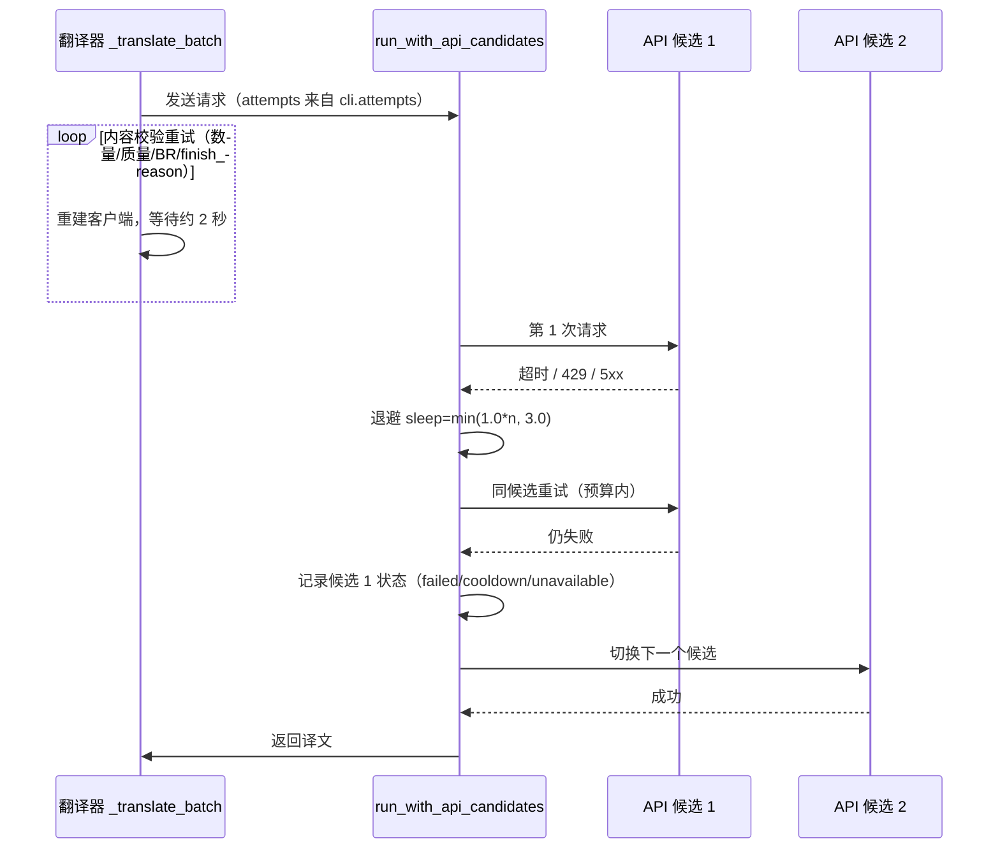
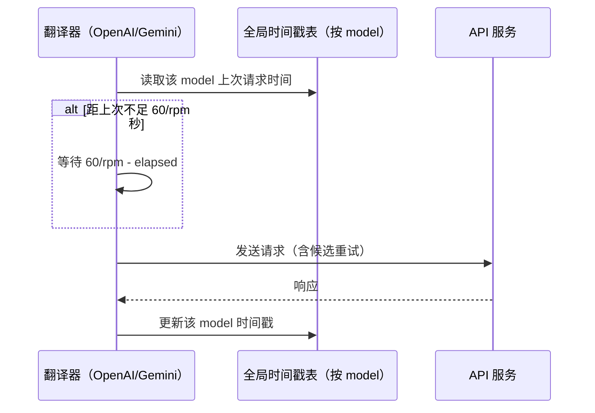
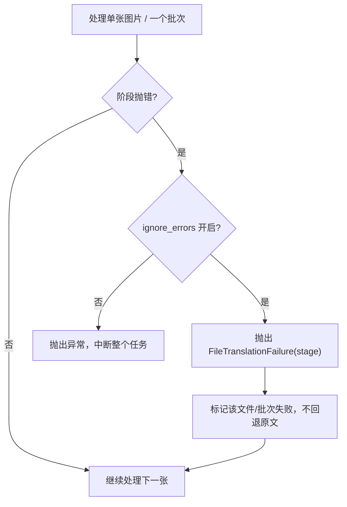
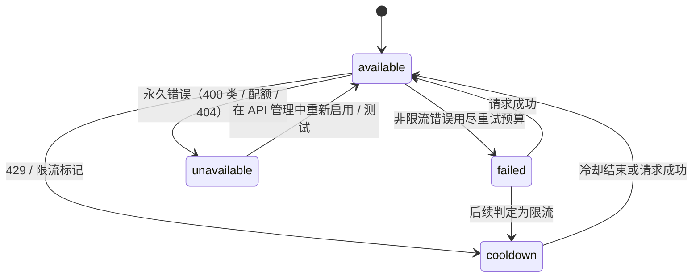
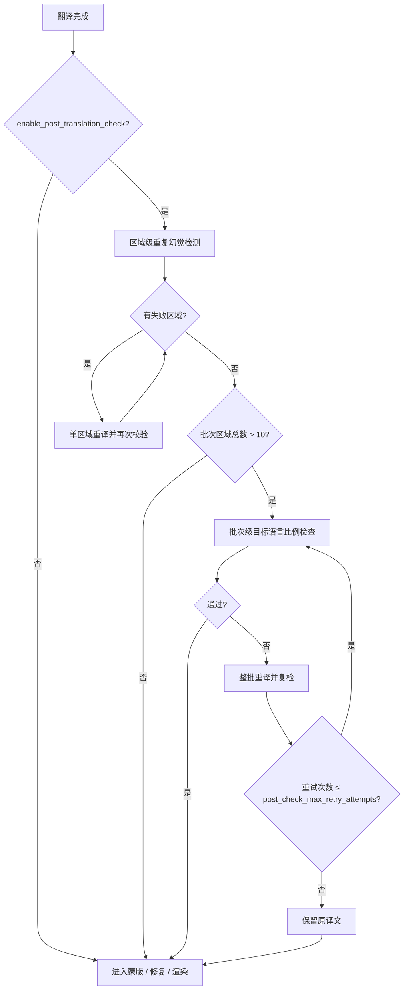

# 重试、限流与翻译质量

当翻译请求偶发超时、触发速率限制，或者需要控制 API 成本和失败对整批任务的影响时，使用本页配置重试次数（`cli.attempts`）、每分钟最大请求数（`translator.max_requests_per_minute`）、忽略错误（`cli.ignore_errors`）以及译后质量检查参数。这里不负责选择翻译器（见[翻译器选择与语言](./selection-and-languages.md)）、提示词与上下文组合（见[上下文与提示词](./context-and-prompts.md)），也不负责 API 候选槽的增删、`failover`/`round_robin` 策略和冷却恢复（见 API 管理页面）。

## 适用场景

- **负责**：`cli.attempts` 决定翻译请求在传输层与内容校验层的重试预算；`translator.max_requests_per_minute` 决定每分钟实际请求节奏；`cli.ignore_errors` 决定失败在文件/批次层面的隔离方式；`translator.enable_post_translation_check` 与三个 `post_check_*` 阈值参数决定译后质量检查。
- **不负责**：`OPENAI_API_KEY`/`_2`/`_3` 等候选槽的增删、轮换策略、冷却与不可用状态属于 API 管理；`cli.save_quality`（图像保存质量）是输出文件压缩质量，不是翻译质量。
- 高质量翻译（`openai_hq`/`gemini_hq`）与自定义提示词影响译文质量，但属于翻译器选择与提示词页面；这里仅说明它们不参与重试计数。
- `cli.attempts` 与 `translator.post_check_max_retry_attempts` 是两个独立的重试预算：前者覆盖请求发送，后者覆盖译后检查，不能互相替代。

## 在桌面端设置

### 在设置页配置重试与错误处理

1. 打开“设置”，选择“通用”分组。
2. 在“重试次数”输入整数：`-1` 表示无限重试，`0` 表示首次失败后不再重试，正数表示额外重试次数。
3. 打开“忽略错误”后，单张图片或单个批次失败会被标记并继续处理后续图片；关闭时任一阶段异常会中断整个任务。

### 在设置页配置请求节奏

1. 在“设置”中选择“翻译”分组。
2. 在“每分钟最大请求数”输入非负整数：`0` 表示不限制，正数表示每分钟最多发出的请求数。

### 译后质量检查选项

当前桌面设置布局的“翻译”分组不包含译后检查开关和阈值行；这些参数由后端配置读取，仅通过 CLI/JSON 配置生效，不能当作界面可见控件。

## 参数与选项

> 本页各参数的界面名称、存储键与默认值的对应关系，见[界面选项对照表](../../reference/options-i18n-matrix.md)。

#### 重试次数 {#cli-attempts}

“重试次数”是通用分组下的整数输入框，设置翻译请求失败后的重试次数：`-1` 表示无限重试，`0` 表示首次失败后不再重试，正数表示额外重试次数。详细说明见[CLI、批量与输出](../settings/cli-batch-and-output.md)。

#### 每分钟最大请求数 {#max-requests-per-minute}

- 控件：整数输入框。
- 所在界面：设置 → 翻译。
- 可选值：非负整数；`0` 表示不限制。
- 默认值：`0`。
- 原理：正值表示每分钟最多发出的请求数，相邻请求至少间隔 `60 / rpm` 秒；重试也会重新进入节奏检查。它只是请求速率上限，不自动处理 429。

#### 忽略错误 {#cli-ignore-errors}

“忽略错误”是通用分组下的开关：开启后，单张图片或单个批次失败会被标记并继续处理后续图片；关闭时任一阶段异常会中断整个任务。详细说明见[CLI、批量与输出](../settings/cli-batch-and-output.md)。

#### 启用翻译后检查 {#enable-post-translation-check}

- 控件：无界面控件（当前桌面设置布局未绑定；通过 CLI/JSON 配置启用）。
- 所在界面：后端配置。
- 可选值：开启或关闭。
- 默认值：`false`。
- 原理：开启后，对每个文本区域做重复内容幻觉检测，失败区域会按“翻译检查最大重试次数”重译；批次区域总数超过 10 时还会整批做目标语言比例检查。最终仍不合格时保留原译文。

#### 翻译检查最大重试次数 {#post-check-max-retry-attempts}

- 控件：无界面控件（通过 CLI/JSON 配置）。
- 所在界面：后端配置。
- 可选值：非负整数。
- 默认值：`3`。
- 原理：译后质量检查失败时，对单个区域重新翻译并再次校验，最多重试该次数；达到上限仍未通过时保留原译文。

#### 重复检测阈值 {#post-check-repetition-threshold}

- 控件：无界面控件（通过 CLI/JSON 配置）。
- 所在界面：后端配置。
- 可选值：正整数。
- 默认值：`20`。
- 原理：依次检查字符级连续重复、词语/汉字连续重复和短语重复；达到阈值即判定为重复幻觉并触发重译。阈值越小越敏感。

#### 目标语言比例阈值 {#post-check-target-lang-threshold}

- 控件：无界面控件（通过 CLI/JSON 配置）。
- 所在界面：后端配置。
- 可选值：`0`–`1` 之间的比例值。
- 默认值：`0.5`。
- 原理：批次内文本区域总数超过 10 时，合并该批次所有区域的译文并检测语言；不是目标语言时按“翻译检查最大重试次数”整批重译。

## 翻译请求如何处理

### 重试层级与候选轮换 {#retry-layers}

`cli.attempts` 是“重试次数”，不是“总请求次数”。它同时被两个嵌套层使用：候选轮换层在同一个 API 候选上重试可重试错误，直到预算用尽或遇到永久错误才切换候选；内容校验层对“数量不匹配、质量检查失败、BR 标记缺失、异常 finish_reason”重试。因此一次翻译操作可能发出远多于 `attempts + 1` 次 HTTP 请求。

### RPM 请求节奏 {#rpm-pacing}

`translator.max_requests_per_minute` 为 `0` 时不限流；为正数时相邻请求至少间隔 `60 / rpm` 秒。重试也会重新进入节奏检查。

### 失败隔离与候选状态 {#failure-isolation}

失败隔离有两层。文件/批次层由 `cli.ignore_errors` 控制：关闭时异常直接中断任务，开启时标记当前文件失败并继续。候选层中，只有 `unavailable` 和仍在冷却期的 `cooldown` 会从候选列表中排除，普通 `failed` 状态不排除候选，下次请求仍可再试。

候选状态机如下。冷却时长默认 60 秒，若响应带 `Retry-After` 则采用该值，上限 600 秒；永久错误（400 类、402、404、配额、无效密钥）直接进入 `unavailable`，只能通过 API 管理中重新启用或测试来清除。

### 译后质量检查流程 {#post-check-flow}

译后检查只在 `translator.enable_post_translation_check=true` 时运行，且当前桌面布局未暴露该开关。检查分两层：先对每个区域做重复幻觉检测并对失败区域单区域重译，再对整批做目标语言比例检查并对整批重译；两个循环都受 `post_check_max_retry_attempts` 约束。

## 模型、网络与质量

- `cli.attempts`、`translator.max_requests_per_minute`、`cli.ignore_errors` 与译后检查是四个独立维度：重试预算、请求节奏、失败隔离和质量检查互不替代。
- `attempts=-1` 与内容过滤/持续 5xx 叠加可能长时间不退出；`max_requests_per_minute` 只限制发送节奏，不降低单次请求成本。
- `ignore_errors` 是文件/批次级隔离；区域内单条失败仍会走质量重试或保留原文，不受该开关影响。
- 候选轮换只在存在多个 API 候选时发挥作用；单候选时 `cli.attempts` 决定该候选上的重试预算。候选状态跨任务保留在进程内，不写入配置文件。
- `save_quality`（图像保存质量）与 `context_size`（上下文页数）也会影响“质量”观感，但它们分别是输出压缩质量和上下文质量，见[CLI 批量与输出](../settings/cli-batch-and-output.md)和[上下文与提示词](./context-and-prompts.md)。
