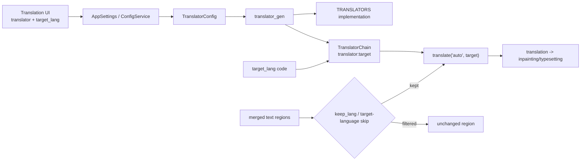
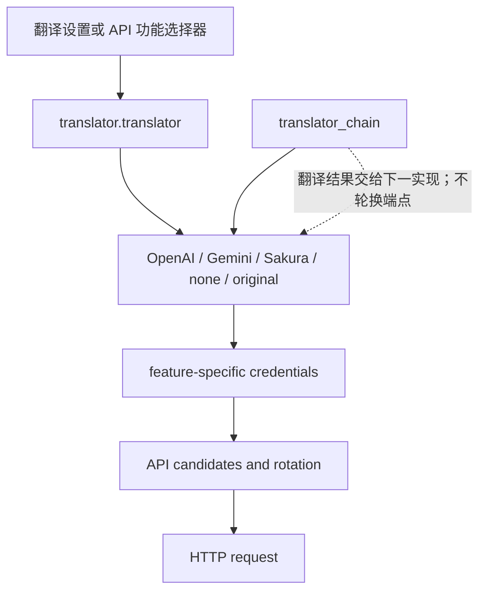

# 翻译器选择与目标语言

这里说明桌面设置中的翻译器选择、目标语言以及合并后的源语言过滤。它决定使用哪个翻译实现和翻译成什么语言，不负责 API 密钥槽轮换、提示词编辑、上下文构造或翻译链的详细策略。

## 适用场景

- `translator.translator` 选择 OpenAI、Gemini、Sakura、高质量变体、无翻译或保留原文；它改变翻译实现，不是同一提供商内的 API 候选切换。
- `translator.target_lang` 使用三字母存储代码，作为单个翻译请求的目标语言。
- `translator.keep_lang` 在文本行合并后按检测到的源语言筛选继续处理的区域；不匹配的区域保留原图，不擦除、不翻译、不渲染。
- `translator.no_text_lang_skip` 控制是否跳过已经是目标语言的文本；开启“不跳过目标语言文本”时强制送入翻译。
- API Key/Base/Model、`failover`/`round_robin`、提示词、术语、流式、RPM 和质量重试属于 API 管理或其他翻译器页面。

## 在桌面端设置

### 在“翻译”设置页选择

1. 打开设置页并选择“翻译”页签。
2. 在“翻译器”下拉框选择实现；显示值来自界面的本地化映射，不直接显示内部枚举名。
3. 在“目标语言”下拉框选择语言；显示值由界面语言文件生成，保存时反向映射回代码，例如“英语”保存为 `ENG`。
4. 在“保留源语言”中选择源语言或“不过滤”。选择语言后，只有检测为该语言的区域继续到翻译和后续图像处理。
5. 打开“不跳过目标语言文本”后，目标语言检测结果也会被强制翻译；修改会立即更新内存配置并持久化。

API 管理页的翻译器功能选择器也写入同一个“翻译器”配置键，并刷新所需凭据分组；它不是另一个独立翻译器配置。API 槽只改变已选提供商内部的请求端点。

## 参数

> 本页各参数的界面名称、存储键与默认值的对应关系，见[界面选项对照表](../../reference/options-i18n-matrix.md)。

### 翻译器

“翻译器”下拉框位于“设置 → 翻译”，决定使用哪个翻译实现：

- OpenAI：使用 OpenAI 兼容 API。
- OpenAI High Quality（OpenAI高质量翻译）：使用 OpenAI 兼容 API，启用高质量提示词/结构化处理；默认选项。
- Google Gemini：使用 Gemini API。
- Gemini High Quality（Gemini高质量翻译）：使用 Gemini API，启用高质量提示词/结构化处理。
- Sakura：使用 Sakura 服务地址/字典配置。
- None（无）：不执行翻译。
- Original（原文）：保留原文结果。

默认值：`openai_hq`。

### 目标语言

“目标语言”下拉框位于“设置 → 翻译”，选择单个翻译请求的目标语言，当前提供 25 种语言：简体中文、繁体中文、捷克语、荷兰语、英语、法语、德语、匈牙利语、意大利语、日语、韩语、波兰语、葡萄牙语（巴西）、罗马尼亚语、俄语、西班牙语、土耳其语、乌克兰语、越南语、阿拉伯语、塞尔维亚语、克罗地亚语、泰语、印度尼西亚语、菲律宾语（他加禄语）。显示值由界面语言文件生成，保存时反向映射为三字母代码。

默认值：`CHS`。

### 保留源语言

“保留源语言”下拉框位于“设置 → 翻译”，在文本行合并后按检测到的源语言筛选继续处理的区域：选择“不过滤”关闭筛选；选择语言后，只有检测为该语言的区域继续到翻译和后续图像处理，不匹配的区域保留原图，不擦除、不翻译、不渲染。可选语言为简体中文、繁体中文、英语、日语、韩语等，具体集合由后端决定。

默认值：`none`（不过滤）。

### 不跳过目标语言文本

“不跳过目标语言文本”开关位于“设置 → 翻译”。开启后，目标语言检测结果也会被强制送入翻译；会增加请求和 API 成本。

默认值：`false`。

## 翻译请求如何处理

保存的翻译器枚举和目标语言代码会被解析成链，实现按链顺序执行。`translator_chain` 或 `selective_translation` 是串联/按语言选择，不是 API 槽轮换。API 管理仍可改变同一个 `translator.translator` 键；候选解析和冷却属于 API 管理范围。

## 模型、网络与质量

- Detection/OCR 必须先产生文本区域和源语言信息，`keep_lang` 才能工作；它在合并后执行。
- `none` 不执行翻译，`original` 明确保留原文结果。二者都不需要远程 API，后续排版仍由工作流决定。
- HQ 选项依赖对应高质量提示词资源；`extract_glossary` 也依赖 HQ 提示词配置。
- 改变目标语言会改变请求和排版输入，但不会自动改变 OCR 语言、渲染方向或提供商。
- `keep_lang` 按源语言过滤；`no_text_lang_skip` 控制目标语言跳过。源语言过滤仍先执行。

## 翻译器与 API 选择边界

翻译器选择改变实现；API 功能选择器是另一个 UI 写入点；Key/Base/Model 槽与 `failover`/`round_robin` 只在已选实现内部轮换；`translator_chain` 把结果传给下一翻译器。
