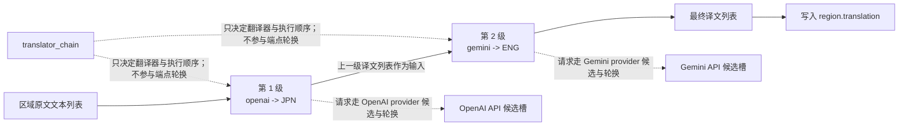
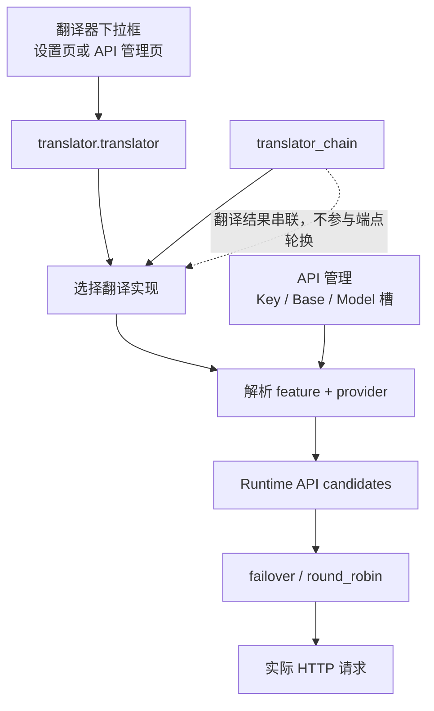

# 翻译器串联

当同一批文本需要先由一个翻译器译到中间语言、再由另一个翻译器继续译到最终语言时，使用 `translator_chain`。它把上一级翻译器的输出文本列表直接交给下一级翻译器，按配置顺序逐级执行。这里说明链字符串的配置形式、执行顺序、与 API 候选槽轮换的区别，以及与上下文/提示词的边界。

## 适用场景

- `translator.translator_chain` 是核心 `TranslatorConfig` 的字符串字段，默认 `null`；它把翻译拆成多个“翻译器:目标语言”阶段并依次执行。
- 链式翻译只决定“用哪些翻译器、按什么顺序、每级翻译到什么语言”；它不选择请求端点，也不处理重试、冷却、不可用或恢复。
- 链式翻译不改变上下文与提示词配置：`cli.context_size` 历史页数、`translator.high_quality_prompt_path`、`extract_glossary` 等仍按各自机制生效。
- 它与单一 `translator` 是互斥的选择来源：`translator_gen` 的构造优先级是 `selective_translation` > `translator_chain` > 单一 `translator`。
- `selective_translation` 是同级字段，解析到同一个 `TranslatorChain`（按检测语言选择翻译器），这里不展开；见[翻译器引擎分发](./engine-dispatch.md)。
- 桌面设置页的 Translation 分组没有 `translator_chain` 控件行；Web UI 默认把该字段列入隐藏高级参数。

## 配置形式

### 链字符串格式

`translator_chain` 的值是一个用 `;` 分隔的链字符串，每一段是 `翻译器:语言代码`，例如 `openai:JPN;gemini:ENG`。链字符串按段解析：

- 翻译器名必须是 `Translator` 枚举成员名（`openai`、`openai_hq`、`gemini`、`gemini_hq`、`sakura`、`none`、`original`），并且必须在 `TRANSLATORS` 注册表中。
- 语言代码必须是 `VALID_LANGUAGES` 的三字母存储代码（如 `JPN`、`ENG`、`CHS`、`CHT`、`KOR`），大小写敏感。
- 每级的源语言固定传 `auto`，目标语言使用该级代码；`prepare_translation()` 在运行前逐级校验 `supports_languages('auto', 目标语言)`。
- 空串、缺少 `:`、未知翻译器名或未知语言代码都会在配置解析时抛错，不会在翻译时静默跳过。

`openai:JPN;gemini:ENG` 的含义：先用 OpenAI 把原文翻译到日语，再把日语译文交给 Gemini 翻译到英语。

### 配置入口与界面文案

`translator_chain` 不是桌面设置页的一行控件，它的可配置位置如下：

- 配置文件：JSON 键 `translator.translator_chain`（例如 `config/config.json`；它是核心 `TranslatorConfig` 字段，默认 `null`，Qt 模型与发行模板不含该字段）。
- CLI：local 模式通过 `--config <file>` 读取配置文件；当前 `args.py` 没有独立的 `--translator-chain` 参数（`config.py` 异常消息里的 `--translator ... -l ...` 是历史示例，不作为当前 CLI 参数）。
- Web/服务端：`/config` 配置 API 可读写该字段，但 `translator.translator_chain` 被列入服务端与 Web 前端的隐藏键集合，默认不显示给用户。

## 执行顺序与数据流

链按配置顺序逐级执行：每一级先解析配置，再把文本列表翻译到本级目标语言。上一级返回的译文列表直接作为下一级的输入，最后一级的返回值写回区域的译文字段。

图例说明：`S1` 的输出不是文件也不是中间渲染图，而是内存中的译文字符串列表；它原样作为 `S2` 的查询输入。`A1`/`A2` 表示每个链级内部仍会解析自己 provider 的 Key/Base/Model 候选，并在请求时执行 `failover`/`round_robin`；这些轮换发生在每一级的请求内部，`translator_chain` 本身不参与。

批量查询按同一链语义处理，链的结构不变。

## 与 API 候选槽轮换的区别

- 链决定“用哪些翻译器、按什么顺序、每级翻译到什么语言”；候选槽决定“已选 provider 内部选哪个请求端点”。
- 每个链级是独立翻译器实例，仍会解析自己的 Key/Base/Model 候选（OpenAI 级解析 OpenAI 分组，Gemini 级解析 Gemini 分组），并在请求时处理重试、冷却和恢复。
- `translator_chain` 与 `OPENAI_API_KEY_2` 这类编号槽没有对应关系；链不会因为某级失败就切到另一个 API 候选。
- API 管理页的 Key/Base/Model 槽与 `failover`/`round_robin` 属于[API 通道与轮询策略](../api-management/slots-and-rotation.md)。

## 与上下文和提示词的边界

- `cli.context_size`（历史页数）与提示词字段仍由整体翻译阶段使用；链本身不构造历史消息，也不改变提示词组合。
- 链式翻译分支以纯文本列表传递，不构造历史消息。多页历史注入、区域级 AI 断句和 HQ 批量数据由单翻译器分支与上下文机制处理。
- 每个链级都读取同一份 `TranslatorConfig`，因此流式、RPM、普通重试等配置按各自翻译器实例生效，但不属于本页的链语义。
- 上下文与提示词的配置边界详见[上下文与提示词](./context-and-prompts.md)。

## 限制与注意事项

- 链中每个 provider 都需要满足自己的凭据与语言能力；`prepare_translation()` 会在运行前逐级校验目标语言。
- 把 `none` 放进链会输出空字符串并继续传给下一级，一般不作为链级使用；`original` 原样透传。
- 链中若包含 HQ 级（`openai_hq`/`gemini_hq`），其区域级批量行为与单翻译器路径不同。

- 每级都会产生一次（或多级多次）翻译请求；链越长，API 调用与成本成倍增加，错误面也更大。
