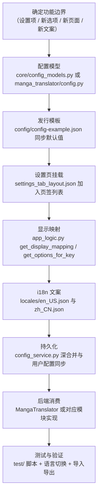

# 新增或修改功能

当你想给 Manga Translator 增加一个新功能（新的设置项、新的翻译器/OCR/渲染器选项、新的页面，或新的界面文案），或者修改一个现有功能时，这里说明从配置到界面再到运行时消费的完整开发路径。它不是架构总览（见[架构与代码边界](./architecture-and-code-boundaries.md)），也不展开测试方法论、打包发布或 HTTP API 的细节（分别见[测试与代码质量](./tests-and-code-quality.md)、[打包与发布](./packaging-and-release.md)以及 `developer/http-api/` 下的页面）。

## 涉及的代码 {#feature-boundary}

- 这里仅处理“改代码后功能如何生效”的链路：配置模型 → 设置页挂载 → i18n → 持久化 → 后端消费 → 测试与人工验证。
- 桌面 UI、业务逻辑、服务层和后端流水线的具体模块边界见[架构与代码边界](./architecture-and-code-boundaries.md)；这里仅给出新增功能时每一层通常要改的文件。
- 新增 API 密钥、通道或轮询策略不在这里描述，见 API 管理页面；新增提示词文件、批量方案或富文本规则见对应的功能页。
- 这里不包含真实 `.env`、用户 `config.json`、API Key、Token、用户名、私有绝对路径或私有提示词；示例默认值均来自仓库跟踪的模板与代码。

## 功能开发流程 {#development-workflow}

新增或修改一个功能通常走下面的路径。不是每一步都必须改动：纯文案修改只改 i18n，纯后端算法改动可能不碰设置页；但新增一个“用户可配置参数”时，下面每一步都要检查。

1. **确定边界**：先判断改动属于哪个模块——`desktop_qt_ui/`（界面与业务逻辑）、`manga_translator/`（流水线与算法）、`config/`（发行模板）、`locales/`（文案）。
2. **改配置模型**：用户可配置项在 `desktop_qt_ui/core/config_models.py` 的 `AppSettings` 子模型中加字段；后端运行时需要的配置在 `manga_translator/config.py` 的 `Config` 子模型中加字段。两者字段名、类型和默认值应保持一致。
3. **同步发行模板**：把新字段和默认值写进 `config/config-example.json`。桌面端启动优先级是用户 `config/config.json` > `config/config-example.json` > Qt 模型默认值（见 `config_service.py`）。
4. **挂载设置页**：在 `desktop_qt_ui/ui/main_page/settings_tab_layout.json` 对应页签的 `items` 中追加配置键；页签标题本身也是 i18n key。
5. **补显示映射**：在 `desktop_qt_ui/app_logic.py#get_display_mapping` 的 `labels` 中添加 `key -> label_*` 映射；有下拉选项时还要在 `get_options_for_key` / `get_display_mapping` 中提供选项与显示名。
6. **加 i18n 文案**：`label_*` 标签和 `desc_*` 说明分别写入 `locales/en_US.json` 与 `zh_CN.json`（见下节）。`en_US` 通常直接用英文文案本身作为值。
7. **确认持久化**：`config_service.py` 的深合并会按 `AppSettings` 逐键校验；`_sync_user_config` 会把发行模板新增的字段补进用户配置、删除模板中已不存在的字段，并保留用户修改过的值。
8. **接后端消费**：`manga_translator/config.py` 的 `Config` 读到新字段后，由 `manga_translator/manga_translator.py` 或对应模块（检测/OCR/翻译/修复/排版/超分/上色）真正消费。
9. **测试与验证**：在 `test/` 下写 pytest 风格回归脚本（首行 `import _bootstrap`），用 `uv run pytest` 运行；再做一次语言切换和配置导入导出的人工验证。

## 添加 i18n 文案 {#adding-i18n}

界面文案统一走 `desktop_qt_ui/locales/` 下的 JSON 语言包。`I18nManager.translate(key)` 在当前语言包里找不到 key 时直接返回 key 本身（见 `i18n_service.py`），所以新 key 未翻译前界面会显示 key 字符串，而不是报错。

键有三种常见形态：

- **英文句子即 key**：菜单、按钮、提示语等直接把英文文案当 key，例如 `Settings`、`Export Config`；`en_US.json` 中 value 与 key 相同，`zh_CN.json` 中放中文。
- **`label_*`**：设置项名称，由 `get_display_mapping('labels')` 绑定到配置键，例如 `label_context_size`。
- **`desc_*`**：设置说明面板的说明文字，格式为 `desc_{full_key}`（点号换成下划线），例如 `desc_cli_context_size`；缺失时说明面板显示“暂无说明”。

语言包包括 `zh_CN`、`zh_TW`、`en_US`、`ja_JP`、`ko_KR`、`es_ES` 六个；一次性脚本 `scripts/add_batch_edit_locale_keys.py` 演示了“缺则加、已有不动、en_US 用 key 自身”的批量补 key 方式。

Wiki 侧的 i18n 证据由 `doc/wiki/scripts/build-i18n-catalog.mjs` 从两个语言包生成到 `doc/wiki/data/i18n.generated.json`（`--check` 检查是否过期）；设置字段目录由 `doc/wiki/scripts/build-settings-catalog.py` 从 `app_logic.py#get_display_mapping`、发行模板和两个语言包生成到 `doc/wiki/data/settings.generated.json`。修改语言包后应重跑这两个脚本，不能手工改生成的 JSON。

## 约束与注意事项 {#dependencies-and-conflicts}

- 新增用户可配置参数时，`config_models.py` 与 `manga_translator/config.py` 的字段名/类型必须一致，否则桌面端保存的值到后端可能对不上。
- 设置项标签走 `get_display_mapping('labels')`；漏加映射时，`dynamic_settings.py` 会退回显示字段名（如 `min_box_area_ratio`），不报错，但界面文案缺失。
- `desc_*` 说明缺失不会报错，说明面板显示“暂无说明”（`Settings Desc No Description`）；两种语言都要如实补齐。
- i18n 缺 key 时 `translate()` 返回 key 本身：`en_US` 里 key 与值相同一般看不出来，但 `zh_CN` 缺 key 会直接显示英文 key，应在语言切换后检查。
- 修改 `settings_tab_layout.json` 会改变设置页的可见参数集合与分组；`doc/wiki/data/settings.generated.json` 的基线是 109 个可见字段，改动后应重新生成并核对。
- 不要修改 `doc/wiki/data/`、`doc/wiki/scripts/` 之外的生成物，也不要读取或提交真实 `.env`、用户 `config.json`、密钥、令牌或私有绝对路径。

## 开发指南 {#developer-guide}

### 选项中英对照 {#option-matrix}

下面是与本页流程直接相关的界面文案（key → `en_US` 实际值 → `zh_CN` 实际值）：

| UI 调用 key | English 实际值 | 简体中文实际值 |
| --- | --- | --- |
| `Settings` | Settings | 设置 |
| `Settings Page Title` | Settings | 参数设置 |
| `Settings Page Subtitle` | Adjust translation pipeline parameters. Changes are saved automatically. | 调整翻译流程的各项参数。修改后将自动保存。 |
| `Settings Desc Header` | Parameter Description | 参数说明 |
| `Settings Desc Key` | Parameter Key: {config_key} | 参数键：{config_key} |
| `Settings Desc No Description` | No description available. | 暂无说明。 |
| `Settings Desc Placeholder` | Click any setting on the left to view details | 点击左侧任意设置项查看详细说明 |
| `Export Config` | Export Config | 导出配置 |
| `Import Config` | Import Config | 导入配置 |
| `General` | General | 通用 |
| `OCR` | OCR | 文字识别 |
| `Detection` | Detection | 检测 |
| `Translation` | Translation | 翻译 |
| `Inpainting` | Inpainting | 修复 |
| `Typesetting` | Typesetting | 排版 |
| `Mode Specific` | Mode Specific | 模式相关 |
| `&Language` | &Language | &语言 |
| `Language:` | Language: | 语言： |
| `Apply` | Apply | 应用 |
| `Save` | Save | 保存 |
| `Cancel` | Cancel | 取消 |
| `OK` | OK | 确定 |
| `label_translator` | Translator | 翻译器 |
| `label_context_size` | Context Pages | 上下文页数 |
| `desc_cli_context_size` | Translation context page count for multi-page joint translation. Larger values improve quality but consume more tokens. | 翻译上下文页面数，用于多页联合翻译。值越大翻译质量越好，但 token 消耗越多。 |
| `label_batch_concurrent` | Concurrent Batch Processing | 并发批量处理 |

### 代码位置 {#source-evidence}
| 层级 | 文件 | 本页核对内容 |
| --- | --- | --- |
| 配置模型 | `desktop_qt_ui/core/config_models.py`、`manga_translator/config.py` | `AppSettings` / `Config` 子模型与默认值 |
| 发行模板 | `config/config-example.json` | Release 默认值与 `get_default_config_path` 引用 |
| 设置 UI | `desktop_qt_ui/ui/main_page/settings_tab_layout.json`、`dynamic_settings.py`、`pages/settings_page.py` | 页签分组、参数行、说明面板与语言刷新 |
| 显示映射 | `desktop_qt_ui/app_logic.py` | `get_display_mapping`、`get_options_for_key`、`_t` |
| i18n | `desktop_qt_ui/services/i18n_service.py`、`locales/en_US.json`、`zh_CN.json` | 六语言加载、缺 key 回退、key/实际值三列 |
| 持久化 | `desktop_qt_ui/services/config_service.py` | 优先级加载、逐键校验、用户配置同步 |
| 后端消费 | `manga_translator/manga_translator.py`、`manga_translator/translators/__init__.py` | 参数进入流水线、翻译器注册 |
| 测试约定 | `test/README.md`、`pyproject.toml` | `import _bootstrap`、pytest 的 `testpaths` / `pythonpath` |
| Wiki 工具 | `doc/wiki/scripts/build-i18n-catalog.mjs`、`build-settings-catalog.py` | i18n 与设置目录的生成与检查 |
