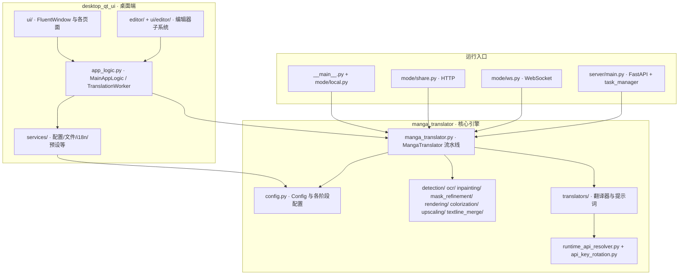

# 架构与代码边界

在修改或排查某个功能前，先用本页定位它属于哪一层、跨越哪些模块边界。仓库由 `desktop_qt_ui`（PyQt6 桌面端）和 `manga_translator`（核心引擎、CLI 与服务器）两个包组成；桌面端和 CLI 的 `local` 模式共享同一套 `MangaTranslator` 流水线，Web/共享/WebSocket 模式也复用同一核心，只是入口和传输方式不同。这里仅画模块边界和调用关系，不重复各功能的操作与参数细节（见对应功能页）。

## 涉及的代码

- `desktop_qt_ui` 负责界面、i18n、文件列表、设置持久化和任务编排；不直接实现检测、OCR、翻译或渲染算法。
- `manga_translator` 负责配置模型、处理流水线、各阶段实现和 API 调用；不包含 Qt 窗口，但 `rendering` 的字体排版依赖 PyQt6 离屏渲染。
- 桌面 `TranslationWorker`、CLI `local`、共享 `shared`、WebSocket `ws` 和 Web 服务器都会实例化 `manga_translator.manga_translator.MangaTranslator`，区别只在参数来源、进度上报和结果传输方式。
- Web 服务器模式不直接持有翻译实例：`server/core/task_manager.py` 用信号量限制并发，并通过 `translation_integration` 在权限、配额、历史和日志包裹下调用核心。
- 不要把“翻译器选择”“API 功能选择器”“API 槽轮换”和 `translator_chain` 混为一层：它们分别归属桌面翻译器页、API 管理页与核心的 `runtime_api_resolver.py` / `api_key_rotation.py`。

## 操作方法

### 在桌面端观察模块入口

启动桌面端后，左侧导航对应 `desktop_qt_ui/ui/main_window.py` 中注册的七个主页面，外加编辑器视图。每个主页面都是 `ui/main_page/pages/` 下的独立构造函数，由 `MainView` 创建后交给 `FluentWindow` 托管。

### 工作流模式选择器

翻译页的“翻译流程模式”下拉框把一次选择映射为 `cli` 配置中唯一的工作流布尔字段（`runtime.py#on_workflow_mode_changed` 先全部清空再置位），这是观察“UI 状态 -> 核心参数”边界的直接入口。

工作流下拉框只改变 `cli` 的八个布尔字段；具体行为差异由核心 `translate_batch()` 的分支决定（详见[工作流与文件模式](../cli/workflow-and-file-modes.md)）。

## 分层与模块边界

图中的实线是源码中的直接调用：桌面 `TranslationWorker` 构造 `MangaTranslator` 并调用 `translate_batch()`；各阶段模块统一暴露 `get_*`、`prepare()`、`dispatch()`（以及部分 `unload()`）接口。`config.py` 是唯一的核心配置来源，`desktop_qt_ui/core/config_models.py` 的 `AppSettings` 是 Qt 侧的镜像模型；两者的键并非一一对应。

## 调用关系

### 单图标准流水线

`translate_batch()` 对每张图按固定顺序推进阶段；上色和超分按配置条件执行，其余阶段是否跳过由检测/OCR 结果决定：

### 三种非桌面入口

`local`、`shared`、`ws` 三个模式与桌面端共享同一个 `MangaTranslator`：`local` 复用桌面 `FileService` 收集输入；`shared` 在 5003 端口暴露 HTTP 接口；`ws` 通过 WebSocket 把图片和配置交给核心。`web` 服务器模式则通过 `task_manager` + `translation_integration` 调用核心，并把翻译实例放入线程池执行，避免阻塞 FastAPI 事件循环。

## 约束与注意事项

- 桌面端直接 import `manga_translator`（如 `app_logic.py`、`mode/local.py`），因此修改核心公共接口时必须同时核对桌面、CLI 和服务器三类调用方。
- `rendering` 依赖 PyQt6 离屏渲染，而服务器与共享模式也使用同一渲染实现；无显示环境运行时需自行准备 Qt 平台插件，这不是模块边界问题。
- `.env` 由各入口在启动时加载，`runtime_api_resolver` 只读取环境变量；不要把真实密钥写进配置文件或文档。
- `batch_concurrent` 只对“正常翻译”工作流生效，导入/导出、仅上色/超分/修复和替换翻译会强制回退到顺序流水线。
- 服务端并发受 `task_manager` 信号量控制；桌面端并发受 `TranslationWorker` 的 QRunnable 线程池控制，两者互不感知。

## 开发指南 {#developer-guide}

### 选项中英对照 {#option-matrix}

#### 在桌面端观察模块入口

| UI 调用 key | English 实际值 | 简体中文实际值 |
| --- | --- | --- |
| `Translation Interface` | Translation Interface | 翻译界面 |
| `Settings` | Settings | 设置 |
| `API Management` | API Management | API 管理 |
| `Prompt Management` | Prompt Management | 提示词管理 |
| `Replacement Rules` | Replacement Rules | 替换规则 |
| `Rich Text Rules` | Rich Text Rules | 富文本规则 |
| `Batch Management` | Batch Management | 批量管理 |
| `Editor` | Editor | 编辑器 |
| `Editor View` | Editor View | 编辑器视图 |

#### 工作流模式选择器

| UI 调用 key | English 实际值 | 简体中文实际值 |
| --- | --- | --- |
| `Translation Workflow Mode:` | Translation Workflow Mode: | 翻译流程模式： |
| `Normal Translation` | Normal Translation | 正常翻译流程 |
| `Export Translation` | Export Translation | 导出翻译 |
| `Export Original Text` | Export Original Text | 导出原文 |
| `Translate JSON Only` | Translate JSON Only | 仅翻译（JSON） |
| `Import Translation and Render` | Import Translation and Render | 导入翻译并渲染 |
| `Colorize Only` | Colorize Only | 仅上色 |
| `Upscale Only` | Upscale Only | 仅超分 |
| `Inpaint Only` | Inpaint Only | 仅修复 |
| `Replace Translation` | Replace Translation | 替换翻译 |
| `Start Translation` | Start Translation | 开始翻译 |

### 关联文件与格式

| 文件/目录 | 本页实际作用 | 注意 |
| --- | --- | --- |
| `desktop_qt_ui/main.py` | 桌面入口：日志、环境、QApplication | 打包后 `sys.frozen` 分支改变日志与资源目录 |
| `desktop_qt_ui/ui/main_window.py` | 主窗口、导航注册和编辑器装配 | 七个主页面加一个编辑器视图 |
| `desktop_qt_ui/app_logic.py` | 控制器与 `TranslationWorker` | 桌面到核心的唯一任务编排点 |
| `desktop_qt_ui/services/` | 服务容器与依赖注入 | `ServiceManager` 提供全局单例访问 |
| `desktop_qt_ui/core/config_models.py` | Qt 侧 `AppSettings` 镜像模型 | 与核心 `Config` 的键存在差异 |
| `manga_translator/config.py` | 核心 `Config` 与枚举 | 服务器、CLI、桌面的共同配置来源 |
| `manga_translator/manga_translator.py` | 核心流水线 `MangaTranslator` | 所有入口的最终消费者 |
| `manga_translator/mode/` | local/shared/ws 入口 | `subprocess_manager.py` 负责 CLI 内存管理 |
| `manga_translator/server/` | FastAPI 服务器与核心服务 | 路由、鉴权、配额、历史、清理等 |
| `desktop_qt_ui/locales/en_US.json` / `zh_CN.json` | UI 文案来源 | 本页表格逐项核对过实际值 |

### Mermaid 数据流限制

上图画的是源码中的分层和调用关系，不是“每个请求都会经过全部节点”。特殊工作流（导出原文、仅上色、替换翻译等）会跳过大部分阶段；`batch_concurrent` 开启时检测、OCR、翻译、修复并行推进。，也没有包含真实密钥。

### 代码位置 {#source-evidence}
| 层级 | 文件 | 本页核对内容 |
| --- | --- | --- |
| 桌面入口 | `desktop_qt_ui/main.py`、`ui/main_window.py` | 导航注册、编辑器初始化和窗口装配 |
| 桌面控制器 | `desktop_qt_ui/app_logic.py` | `TranslationWorker` 构造 `MangaTranslator`、进度钩子与 `translate_batch` 调用 |
| 桌面服务 | `desktop_qt_ui/services/__init__.py`、`core/config_models.py` | 服务容器与 `AppSettings` 镜像 |
| 核心配置 | `manga_translator/config.py` | `Config` 分组、枚举和默认值 |
| 核心流水线 | `manga_translator/manga_translator.py` | `translate_batch` 阶段顺序、特殊工作流分支与并发流水线 |
| 阶段模块 | `manga_translator/detection/__init__.py` 等 | `get_*` / `prepare()` / `dispatch()` 契约 |
| 翻译与 API | `manga_translator/translators/__init__.py`、`runtime_api_resolver.py`、`api_key_rotation.py` | 翻译器分派、候选解析和轮换 |
| CLI/模式 | `manga_translator/__main__.py`、`mode/local.py`、`mode/share.py`、`mode/ws.py` | 四种模式入口与核心复用 |
| 服务器 | `manga_translator/server/main.py`、`core/task_manager.py`、`core/translation_integration.py` | FastAPI 装配、并发控制与集成调用 |
| UI/i18n | `desktop_qt_ui/locales/en_US.json`、`zh_CN.json` | 导航与工作流下拉实际文案 |
