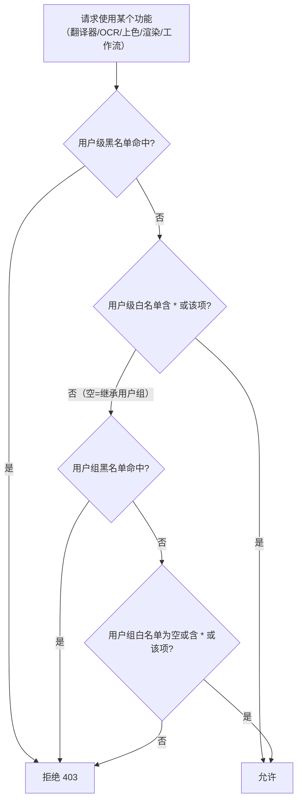
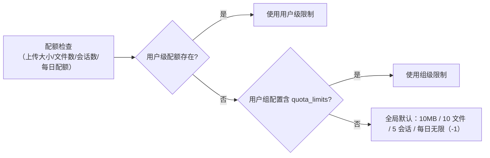

# 管理端点：用户、组、配额与审计

当第三方管理脚本或集成需要创建账号、划分用户组、设置配额或导出审计日志时使用本页。它记录四组管理员 HTTP 端点：`/api/admin/users`、`/api/admin/groups`、配额端点（`/api/quota/stats` 与 `/api/admin/quota/*`）和 `/audit/*`。Web 管理界面的操作入口见[管理界面](../../web/administrator-interface.md)，账号与权限的界面侧说明见[账号、权限与 API 密钥](../../web/accounts-permissions-and-api-keys.md)；会话建立、`X-Session-Token` 校验与通用状态码见[HTTP API 鉴权与错误](./authentication-and-errors.md)，服务器配置与预设端点见[配置、环境与资源](./config-env-and-resources.md)。

## 接口范围 {#feature-boundary}

- 内容包括用户、用户组、配额、审计四组管理端点及其后端服务：`account_service`、`group_management_service`、`quota_service`、`audit_service` 和 `permission_service`。
- 除 `GET /api/quota/stats` 只要求会话（`require_auth`）外，其余端点全部要求 `require_admin`：令牌缺失或无效返回 `401`，非管理员角色返回 `403`。
- 这里不记录真实账号、用户名、密码、令牌、API Key 或私有绝对路径；默认值来自源码常量，不代表运行中的实际配置。
- 旧 `/admin/*` 管理端点（设置、任务、日志、存储、清理）和旧文件管理端点（`/upload/font`、`/prompts`、`/fonts`）属于其他页面，不在本页展开。

## 管理端点总览 {#endpoint-overview}

未显式声明成功状态的端点默认返回 `200`；失败时的错误结构、`401`/`403` 与 `422` 信封见[HTTP API 鉴权与错误](./authentication-and-errors.md)。

## 用户管理端点 {#user-endpoints}

### 端点清单 {#user-endpoint-inventory}

| 方法与路径 | 请求 | 响应 | 说明 |
| --- | --- | --- | --- |
| `POST /api/admin/users` | `CreateUserRequest` | `UserResponse`（`201`） | 创建账号并写入审计 `create_user`；用户名重复或密码不足返回 `400` |
| `GET /api/admin/users` | 无 | 用户数组 | 每个用户附带 `quota`（`daily_used`、`daily_limit`、`monthly_used`、`monthly_limit`） |
| `GET /api/admin/users/{username}` | 路径参数 | `UserResponse` | 不存在返回 `404 USER_NOT_FOUND` |
| `PUT /api/admin/users/{username}` | `UpdateUserRequest` | `UserResponse` | 更新角色/组/激活/强制改密；停用会终止该用户全部会话；写入审计 `update_user` |
| `DELETE /api/admin/users/{username}` | 路径参数 | 空（`204`） | 不能删除自己（`400 CANNOT_DELETE_SELF`）；终止会话并删除；写入审计 `delete_user` |
| `PUT /api/admin/users/{username}/permissions` | `UpdatePermissionsRequest` | `UserResponse` | 未提供任何字段返回 `400 NO_UPDATES`；写入审计 `update_permissions` |

`CreateUserRequest` 字段：`username`（1–50 字符）、`password`（至少 6 字符）、`role`（`admin` 或 `user`）、`group`（默认 `default`）、`permissions`（可选）。`UpdateUserRequest` 字段：`role`、`group`、`is_active`、`must_change_password`，均可选。

### 用户权限字段 {#user-permission-fields}

`PUT /api/admin/users/{username}/permissions` 请求体里的权限字段与 `UserPermissions` 模型一一对应：

| 字段 | 语义 | 备注 |
| --- | --- | --- |
| `allowed_translators` / `denied_translators` | 翻译器白名单 / 黑名单 | `*` 表示全部 |
| `allowed_ocr` / `denied_ocr` | OCR 白名单 / 黑名单 | 空数组表示继承用户组 |
| `allowed_colorizers` / `denied_colorizers` | 上色器白名单 / 黑名单 | 同上 |
| `allowed_renderers` / `denied_renderers` | 渲染器白名单 / 黑名单 | 同上 |
| `allowed_workflows` / `denied_workflows` | 工作流白名单 / 黑名单 | 同上 |
| `allowed_parameters` / `denied_parameters` | 参数白名单 / 黑名单 | `*` 表示全部 |
| `max_concurrent_tasks` | 最大并发任务数 | `ge=0` |
| `daily_quota` | 每日翻译配额 | `ge=-1`，`-1` 表示无限制 |
| `can_upload_files` / `can_delete_files` | 上传 / 删除文件 | 布尔值 |

### 权限继承与校验 {#permission-inheritance}

翻译入口用 `permission_service.check_feature_permission()` 校验功能权限。用户级白名单为空表示“继承用户组”，用户级设置可覆盖用户组（黑名单优先）；解析顺序如下：

`allowed_parameters` 走独立的 `check_parameter_permission()`：用户级含 `*` 时全部放行，否则按名单判断；参数过滤还用于 `filter_config_for_user()` 遮蔽用户配置。管理员创建时默认获得全部白名单（`*`）与 `max_concurrent_tasks=10`、`daily_quota=-1`；普通用户默认继承用户组、`max_concurrent_tasks=2`、`daily_quota=100`。

## 用户组管理端点 {#group-endpoints}

### 端点清单 {#group-endpoint-inventory}

| 方法与路径 | 请求 | 响应 | 说明 |
| --- | --- | --- | --- |
| `POST /api/admin/groups` | `CreateGroupRequest` | `{success, message, group}`（`201`） | 组 ID 重复返回 `400 CREATE_FAILED` |
| `PUT /api/admin/groups/{group_id}/rename` | `RenameGroupRequest` | `{success, old_group_id, new_group_id, new_name}` | 系统组不可重命名；自动更新所有用户的组关联；写入审计 `rename_group` |
| `DELETE /api/admin/groups/{group_id}` | 路径参数 | `{success, message, group_id}` | 系统组不可删除；成员移动到 `default`；写入审计 `delete_group` |
| `GET /api/admin/groups` | 无 | `{success, groups}` | 返回组列表 |
| `GET /api/admin/groups/{group_id}` | 路径参数 | `{success, group}` | 不存在返回 `404 GROUP_NOT_FOUND` |
| `PUT /api/admin/groups/{group_id}/config` | `UpdateGroupConfigRequest` | `{success, message, group_id}` | 更新参数配置与功能白/黑名单；写入审计 `update_group_config` |

`CreateGroupRequest` 字段：`group_id`、`name`、`description`、`parameter_config`、`permissions`、`quota_limits`、`visible_presets`、`default_preset_id`。`UpdateGroupConfigRequest` 字段：`parameter_config`，以及翻译器/OCR/上色/渲染/工作流的白名单与黑名单、`default_preset_id`、`visible_presets`。

### 系统组与成员迁移 {#system-groups-and-migration}

`GroupRepository.SYSTEM_GROUPS = {'admin', 'default', 'guest'}` 是系统预定义组：`admin`（管理员组）、`default`（新用户默认组）、`guest`（访客组）。它们既不能重命名也不能删除。重命名组时 `group_management_service.rename_group()` 会扫描 `accounts.json`，把属于旧组的所有账号迁移到新组 ID；删除组时成员统一移动到 `default`。

## 配额端点 {#quota-endpoints}

### 端点清单 {#quota-endpoint-inventory}

| 方法与路径 | 请求 | 响应 | 说明 |
| --- | --- | --- | --- |
| `GET /api/quota/stats` | 无 | `QuotaStatsResponse` | 当前会话用户的配额统计；未找到返回 `404` |
| `GET /api/admin/quota/stats` | 无 | `AllQuotaStatsResponse`（`quotas` 字典 + `total_users`） | 全部用户统计 |
| `POST /api/admin/quota/reset` | `QuotaResetRequest` | `QuotaResetResponse` | `user_id` 为空表示重置所有用户；返回 `users_reset` 数量 |
| `POST /api/admin/quota/set-limits` | `SetQuotaLimitsRequest` | `{success, message}` | 设置单个用户限制 |
| `GET /api/admin/quota/user/{user_id}` | 路径参数 | `QuotaStatsResponse` | 指定用户统计；不存在返回 `404` |

`QuotaStatsResponse` 字段：`user_id`、`daily_limit`、`used_today`、`remaining`、`active_sessions`、`total_uploaded`。`SetQuotaLimitsRequest` 字段：`user_id`、`max_file_size`、`max_files_per_upload`、`max_sessions`、`daily_quota`。注意 `GET /api/admin/users` 列表里 `daily_limit` 在无限制时显示为 `999999`，而 `QuotaStatsResponse` 中无限制仍为 `-1`，两者口径不同。

### 配额来源与优先级 {#quota-resolution}

`QuotaManagementService._get_user_quota_limit()` 按“用户级 > 用户组级 > 全局默认”解析限制；解析出的用户级配额会写回 `quotas.json` 以便快速读取：

全局默认常量：`DEFAULT_MAX_FILE_SIZE = 10MB`、`DEFAULT_MAX_FILES_PER_UPLOAD = 10`、`DEFAULT_MAX_SESSIONS = 5`、`DEFAULT_DAILY_QUOTA = -1`（无限制）。`active_sessions` 来自 `QuotaManagementService` 内存字典（`_active_sessions`），不持久化。

### 每日重置 {#daily-reset}

`QuotaScheduler` 每小时检查一次 UTC 日期，发现跨天后调用 `reset_daily_quota(user_id=None)` 重置全部用户的每日计数；管理员也可用 `POST /api/admin/quota/reset` 手动重置单个或全部用户。翻译入口的每日配额另由 `permission_service.check_daily_quota()` 用内存计数执行，两者是独立机制（见[依赖与冲突](#dependencies-and-conflicts)）。

## 审计端点 {#audit-endpoints}

### 端点清单 {#audit-endpoint-inventory}

| 方法与路径 | 查询参数 | 响应 | 说明 |
| --- | --- | --- | --- |
| `GET /audit/events` | `username`、`event_type`、`result`（`success\|failure`）、`start_time`、`end_time`（ISO 格式）、`limit`（默认 100，最大 1000）、`offset` | `list[AuditEventResponse]` | 时间无效返回 `400 INVALID_TIME_FORMAT`；按时间倒序分页 |
| `GET /audit/export` | 同上加 `format`（`json` 或 `csv`，默认 `json`） | 文件下载（`Content-Disposition: attachment`） | 文件名为 `audit_log_YYYYMMDD_HHMMSS.{json,csv}`；操作本身写入审计 `export_audit_log` |

`AuditEventResponse` 字段：`event_id`、`timestamp`、`event_type`、`username`、`ip_address`、`details`、`result`。

### 事件类型 {#audit-event-types}

静态扫描全部 `log_event(...)` 调用得到的事件类型：`login`、`logout`、`initial_setup`、`register`、`password_change`、`create_user`、`update_user`、`delete_user`、`update_permissions`、`create_task`、`translation_start`、`translation_progress`、`translation_complete`、`translation_error`、`permission_denied`、`export_audit_log`、`system_init`、`session_cleanup`、`log_rotation_check`。`/audit/events` 的 `event_type` 筛选接受任意字符串，是否命中取决于日志里实际记录的类型。

### 存储、轮转与一致性 {#audit-storage-rotation}

`AuditService` 把事件以 JSON Lines 追加写入 `manga_translator/server/data/audit.log`，单文件超过 10MB 时轮转并保留 5 个备份。注意两个写入方写同一文件但格式不同：用户/翻译路由写入 `AuditEvent` 结构（含 `event_id`/`event_type`/`username`/`result`），而 `group_management_service._log_audit()` 写入的是 `{timestamp, admin_id, action, details}` 结构。后者缺少 `event_id` 等字段，`/audit/events` 解析时会跳过这些行，因此“组操作已写入 audit.log”并不等于“能通过审计 API 查到”。

## 在管理界面中的操作 {#admin-ui-operations}

管理员在 `GET /admin`（`admin-new.html`）操作账号与组。侧边栏的用户管理（`users`）、用户组管理（`groups`）、配额管理（`quota`）模块分别调用 `GET /api/admin/users`、`GET /api/admin/groups`、`GET /api/admin/groups/{id}` 与 `PUT /api/admin/groups/{id}/config`；用户/组编辑弹窗复用 `permission-editor.js` 组件，其标签来自桌面 locale 的 i18n key。配额模块的“默认配额设置”走旧的 `GET/PUT /admin/settings`（`default_quota` 字段），用户配额表格来自 `GET /api/admin/users` 返回的 `quota` 字段，并没有调用 `/api/admin/quota/*` 端点；审计端点没有对应管理界面页签。

## 接口约束 {#dependencies-and-conflicts}

- 用户组的 `parameter_config` 既是组内参数可见性/只读控制（`GroupService`），也承载组级配额（`quota` 下的 `daily_image_limit`、`max_concurrent_tasks`）；而 `quota_limits` 字段由 `GroupManagementService` 保存、由 `QuotaManagementService` 读取。两条组级配额路径并存，修改时需同时核对。
- 翻译请求的每日配额与并发限制由 `permission_service`（内存计数，组级 `daily_image_limit` 优先于用户 `daily_quota`）执行；`/api/quota/*` 的 `QuotaManagementService` 是文件持久化、用户级优先的独立实现。两者互不同步：管理员用 `/api/admin/quota/reset` 重置的计数器不直接影响翻译入口的 `daily_usage`。
- 停用用户会终止其全部会话；删除用户同样先终止会话再删除。删除自己被明确拒绝（`400 CANNOT_DELETE_SELF`）。
- 系统组 `admin`、`default`、`guest` 不可重命名或删除；重命名组会改写所有成员的 `group` 字段，删除组会把成员移动到 `default`。
- 审计 API 只能查询 `AuditEvent` 行格式；组管理写入的另一种行会被跳过，不能当作审计 API 的数据缺失证据。
- 所有管理端点返回体可能包含用户名、组名等标识符；共享日志、导出文件或调试目录前必须删除真实账号名、令牌、API Key 和私有路径。

## 开发指南 {#developer-guide}

### 选项中英对照 {#option-matrix}

#### 管理端点总览

| 路由组（前缀） | 方法与路径 | 数量 | 鉴权边界 / 来源 |
| --- | --- | ---: | --- |
| 用户（`/api/admin/users`） | `POST /`、`GET /`、`GET\|PUT\|DELETE /{username}`、`PUT /{username}/permissions` | 6 | 全部 `require_admin`；创建 `201`、删除 `204`；`routes/users.py` |
| 用户组（`/api/admin/groups`） | `POST /`、`GET /`、`GET /{group_id}`、`PUT /{group_id}/rename`、`/{group_id}/config`、`DELETE /{group_id}` | 6 | 全部 `require_admin`；创建 `201`；`routes/groups.py` |
| 配额（`/api`） | `GET /quota/stats`、`GET /admin/quota/stats`、`POST /admin/quota/reset`、`/admin/quota/set-limits`、`GET /admin/quota/user/{user_id}` | 5 | 第一个 `require_auth`，其余管理员；`routes/quota.py` |
| 审计（`/audit`） | `GET /events`、`GET /export` | 2 | 全部 `require_admin`；`routes/audit.py` |

#### 管理界面 i18n 文案

| UI 调用 key | English 实际值 | 简体中文实际值 |
| --- | --- | --- |
| `web_user_management` | User Management | 用户管理 |
| `web_group_management` | Group Management | 用户组管理 |
| `web_quota_management` | Quota Management | 配额管理 |
| `web_create_group` | Create Group | 创建用户组 |
| `web_group_name` | Group Name | 用户组名称 |
| `web_group_description` | Group Description | 用户组描述 |
| `web_group_config` | Group Configuration | 用户组配置 |
| `web_default_preset` | Default Configuration | 默认配置 |
| `web_daily_quota` | Daily Quota | 每日配额 |
| `web_daily_limit` | Daily Limit | 每日限制 |
| `web_upload_limit` | Upload Limit | 上传限制 |
| `web_max_file_size` | Max File Size | 单文件最大 |
| `web_max_files` | Max Files | 最多文件数 |
| `web_resource_management` | Resource Management | 资源管理 |
| `web_can_upload_font` | Can Upload Font | 可上传字体 |
| `web_can_upload_prompt` | Can Upload Prompt | 可上传提示词 |
| `web_can_view_history` | Can View History | 可查看历史 |
| `web_can_view_logs` | Can View Logs | 可查看日志 |
| `web_save` | Save | 保存 |
| `web_cancel` | Cancel | 取消 |
| `web_delete` | Delete | 删除 |
| `web_reset` | Reset | 重置 |

`admin-new.html` 还有一批没有 i18n key 的硬编码中文文案，例如“用户列表”“添加用户”“暂无用户”“活跃”“禁用”“编辑”“删除”“保存配额设置”“默认配额设置”“用户配额使用情况”，英文界面缺失；文档不补译这些缺失值。以上 key 的英文与简体中文值来自 `desktop_qt_ui/locales/en_US.json` 与 `zh_CN.json`，管理端通过 `/i18n/{locale}` 复用同一份 locale。

### 关联文件与格式 {#related-files-and-formats}

| 文件/格式 | 本页实际作用 | 手改与兼容注意 |
| --- | --- | --- |
| `manga_translator/server/data/accounts.json` | 账号持久化（bcrypt 哈希密码） | 原子写入并备份；不读取或展示真实账号 |
| `manga_translator/server/data/group_config.json` | 用户组持久化（`GroupRepository` / `GroupService`） | 系统组 `admin`/`default`/`guest` 不可删改 |
| `manga_translator/server/data/quotas.json` | 用户级配额持久化（`QuotaRepository`） | 用户级配额优先于组级与全局默认 |
| `manga_translator/server/data/audit.log` | 审计事件 JSON Lines 日志 | 10MB 轮转、5 备份；含两种行格式 |
| `manga_translator/server/data/sessions.json` | 会话持久化 | 停用/删除用户时终止会话；不展示真实令牌 |

### 代码位置 {#source-evidence}
| 层级 | 文件 | 本页核对内容 |
| --- | --- | --- |
| 路由 | `manga_translator/server/routes/users.py`、`groups.py`、`quota.py`、`audit.py` | 端点路径、方法、请求/响应模型、状态码与审计事件 |
| 鉴权 | `manga_translator/server/core/middleware.py` | `require_auth` / `require_admin`、`401` / `403` 信封 |
| 服务 | `manga_translator/server/core/account_service.py`、`group_management_service.py`、`group_service.py`、`quota_service.py`、`permission_service.py`、`audit_service.py` | 创建/更新/删除、成员迁移、配额解析、权限继承、审计轮转 |
| 模型与仓库 | `manga_translator/server/models/group_models.py`、`quota_models.py`、`repositories/group_repository.py`、`repositories/quota_repository.py`、`core/models.py` | `UserGroup`、`QuotaLimit`/`QuotaStats`、系统组、`UserPermissions`/`AuditEvent` |
| 调度与启动 | `manga_translator/server/core/quota_scheduler.py`、`system_init.py` | 每日配额重置、默认管理员、会话清理与日志轮转 |
| Web UI | `manga_translator/server/static/admin-new.html`、`static/js/admin/modules/{users,groups,quota}.js`、`static/js/admin/components/permission-editor.js`、`desktop_qt_ui/locales/en_US.json`、`zh_CN.json` | 管理界面入口、调用端点与 i18n 三列 |
