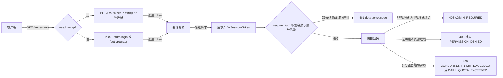
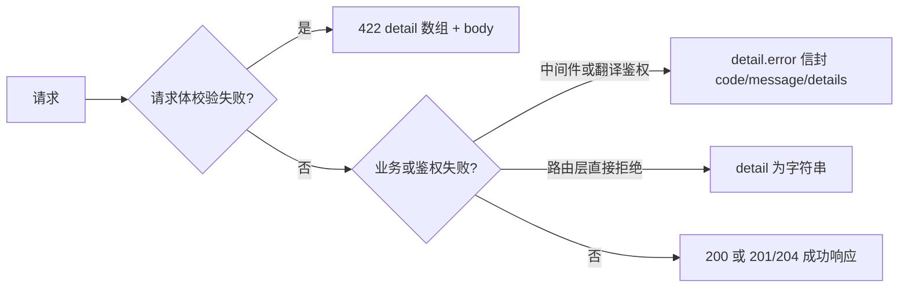

# HTTP API 鉴权与错误

当第三方客户端或 Web 前端要调用翻译、历史、资源、配额和管理等 HTTP 接口时，这里说明会话如何建立、令牌如何携带与校验、权限如何分级，以及失败时返回哪些状态码和错误结构。这里仅列出开发者 HTTP API 的鉴权与错误契约；Web 用户端的登录与会话界面见[登录、语言与会话](../../web/login-language-and-session.md)，工作区与翻译操作见[上传、配置与翻译](../../web/upload-config-and-translate.md)；翻译、流式、批量、历史等端点的具体请求/响应模型见[翻译端点](./translation-endpoints.md)等其他页面。

## 接口范围 {#feature-boundary}

- 这里记录开发者视角的会话建立与校验：`/auth/*` 会话端点、`X-Session-Token` 请求头、`require_auth` / `require_admin` 等 FastAPI 依赖，以及翻译入口的 `verify_translation_auth`。
- 状态码矩阵覆盖全部路由组的静态行为；错误响应结构区分中间件信封、路由层字符串和 `422` 校验错误三种形状。
- 会话令牌是服务端内存加 `sessions.json` 持久化的不透明随机串，不是 JWT，不携带可解码的用户信息。
- 这里不记录真实账号、令牌、密码、nonce、API Key 或私有绝对路径；限速次数、超时分钟数等数值来自源码常量，不代表运行中的实际配置。

## 会话鉴权流程 {#session-auth-flow}

### 首次设置与登录 {#setup-and-login}

1. 无任何账号时，`GET /auth/status` 返回 `{"need_setup": true, "registration_enabled": ...}`；客户端调用 `POST /auth/setup` 创建首个管理员，成功后返回 `token`。
2. 已有账号时，`POST /auth/login` 提交 JSON `{"username": "…", "password": "…"}`；成功返回 `success`、`token`、`user` 和 `must_change_password`。凭据错误时仍返回 HTTP `200`，只是 `success` 为 `false`。
3. 管理员开启注册后，`POST /auth/register` 创建普通用户并返回 `token`；未开启时返回 `403`。
4. 登录/注册成功后，前端把 `token` 写入浏览器 `localStorage.session_token`，之后每个受保护请求都携带 `X-Session-Token` 请求头。
5. `POST /auth/logout` 终止当前会话；`POST /auth/change-password` 要求令牌并校验旧密码。`GET /auth/check` 返回 `{"valid": true, "user": {...}}` 或 `{"valid": false}`，Web 前端据此清理本地令牌并跳回登录页。



### 令牌生命周期 {#token-lifecycle}

- 生成：`SessionService.create_session()` 使用 `secrets.token_urlsafe(32)` 生成 32 字节 URL-safe 随机令牌；令牌不透明，不含用户名或角色。
- 过期：`SessionService` 默认 `session_timeout_minutes=60`，以 `last_activity` 为准做滑动过期；每次 `verify_token` / `update_activity` 都会续期，连续 60 分钟无活动即失效。
- 持久化：服务启动时创建 `SessionService(..., enable_persistence=True)`，活动会话原子写入 `manga_translator/server/data/sessions.json`，重启后只加载活动且未过期的会话。
- 失效路径：`/auth/logout` 终止会话；账号被停用后，`require_auth` 以 `USER_INACTIVE` 拒绝；清理服务会定期清除过期会话。

## 鉴权依赖与权限 {#auth-dependencies}

以下依赖在 `manga_translator/server/core/middleware.py` 与 `manga_translator/server/routes/translation_auth.py` 中定义。`require_auth` 从 `X-Session-Token` 头读取令牌并返回会话对象；`require_admin` 在其基础上要求 `role == 'admin'`。

| 依赖/函数 | 读取来源 | 失败状态码 | 错误码 |
| --- | --- | --- | --- |
| `require_auth` | `X-Session-Token` 请求头 | `401` | `NO_TOKEN` / `INVALID_TOKEN` / `USER_INACTIVE` |
| `require_admin` | 复用 `require_auth` | `403` | `ADMIN_REQUIRED` |
| `check_translator_permission` | 会话 + 翻译器参数 | `403` | `TRANSLATOR_PERMISSION_DENIED` |
| `check_parameter_permission` | 会话 + 参数字典 | 不报错 | 静默过滤无权参数 |
| `check_concurrent_limit` | 业务逻辑调用 | `429` | `CONCURRENT_LIMIT_EXCEEDED` |
| `check_daily_quota` | 业务逻辑调用 | `429` | `DAILY_QUOTA_EXCEEDED` |
| `verify_translation_auth` | 请求头直接读取 | `401` / `403` | 会话错误码 + `TRANSLATOR/OCR/COLORIZER/RENDERER_PERMISSION_DENIED` |

翻译入口的 `verify_translation_auth` 先校验令牌，再按用户/用户组配置覆盖被禁用参数的默认值，然后检查翻译器、OCR、上色器、渲染器权限；并发与每日配额检查由路由层在 `track_task_start` / `track_task_end` 中执行，失败会回滚并发计数。

## 免鉴权端点与例外 {#public-endpoints}

以下端点不要求 `X-Session-Token`；页面内的业务数据请求仍需单独鉴权。

| 端点类别 | 静态行为与边界 |
| --- | --- |
| 页面、静态、locale、API 信息 | `GET /`、`GET /admin`、`GET /api`、`GET /favicon.ico`、`/static/*`，以及桌面 locale 目录存在时条件挂载的 `/locales/*` |
| 建立会话之前 | `/auth/login`、`/auth/status`、`/auth/setup`、`/auth/register`（注册仍受管理员开关和限速） |
| 旧密码门 | `GET /user/access`、`POST /user/login`；见下方小节 |
| 下载票据 | `GET|HEAD /api/history/downloads/t/{ticket}`；见下方小节 |
| 公开/兼容元数据 | `/config`、`/config/defaults`、`/config/options`、`/fonts`、`/translators`、`/languages`、`/workflows`、`/translator-config/{translator}`、`/user/access`、`/i18n/*`、`/announcement`；带令牌时返回按用户过滤的结果 |
| 内部实例注册 | `POST /register` 使用 `X-Nonce` 头校验（见“依赖与冲突”），不使用 `X-Session-Token` |

### 旧密码门 {#legacy-password-gate}

`GET /user/access` 返回 `require_password`；`POST /user/login` 以表单字段 `password` 校验单密码。未要求密码时直接成功；否则按 IP 限速（10 分钟 10 次），超限返回 `429` 与 `Retry-After`。它不签发 `X-Session-Token`，前端用 `sessionStorage.user_logged_in` 记录成功；这不是当前启动路径的主登录流程。

### 下载票据 {#download-tickets}

历史下载先经受鉴权端点申请短时票据，再以 `GET|HEAD /api/history/downloads/t/{ticket}` 下载。票据默认 TTL 为 5 分钟，`secrets.token_urlsafe(32)` 生成；无效、过期或文件已删除时返回 `404`。票据端点不取会话头，因此票据本身是敏感值，不得写入日志或文档。

## 错误响应结构 {#error-response-structure}

实际响应存在三种形状，客户端应先读 `detail` 再判断类型：

1. 中间件与翻译鉴权：抛出 `HTTPException(status_code=..., detail={"error": {...}})`，FastAPI 默认 handler 原样包装，得到 `detail.error` 信封。
2. 路由层：多数 `400/403/404/409/500` 直接使用字符串 `detail`。
3. 全局校验：`422` 返回 `detail` 数组和原始 `body` 字符串。

`core/middleware.py` 还定义了 `create_error_response(code, message, details, status_code)` 帮助函数，可直接生成 `{"error": {...}}` 形状；当前路由未调用它，实际错误按上述 HTTPException 形状返回。

```json
{
  "detail": {
    "error": {
      "code": "TRANSLATOR_PERMISSION_DENIED",
      "message": "您没有权限使用翻译器 '<translator>'",
      "details": {
        "translator": "<translator>",
        "allowed_translators": ["*"]
      }
    }
  }
}
```

```json
{
  "detail": [
    { "loc": ["body", "password"], "msg": "String should have at least 6 characters", "type": "string_too_short" }
  ],
  "body": "<原始请求体字符串>"
}
```

```json
{ "detail": "会话不存在" }
```



错误码是稳定的程序标识（如 `NO_TOKEN`、`ADMIN_REQUIRED`、`DAILY_QUOTA_EXCEEDED`），`message` 面向用户、可能随版本变化；客户端应依赖 `code` 而不是 `message` 做分支。

## 限速与配额 {#rate-limits-and-quotas}

| 端点/检查 | 窗口与上限（源码常量） | 返回 |
| --- | --- | --- |
| `POST /auth/login` | IP 15 次 / 10 分钟；用户名 8 次 / 10 分钟 | `429` + `Retry-After` |
| `POST /auth/register` | IP 5 次 / 10 分钟 | `429` + `Retry-After` |
| `POST /user/login`（旧门） | IP 10 次 / 10 分钟 | `429` + `Retry-After` |
| 并发任务 | 用户/用户组的有效并发上限 | `429` `CONCURRENT_LIMIT_EXCEEDED` |
| 每日配额 | 用户/用户组的有效日配额 | `429` `DAILY_QUOTA_EXCEEDED` |

`SlidingWindowRateLimiter` 以滑动窗口实现；`Retry-After` 为秒数。并发与配额检查失败时，路由层会回滚已增加的并发计数。`429` 不代表凭据错误，客户端不应清空会话令牌。

## 接口约束 {#dependencies-and-conflicts}

- 翻译入口先执行 `verify_translation_auth`（权限过滤、禁用参数默认值），路由层再执行并发/配额计数；`401/403` 在计数前返回，`429` 在计数时返回。
- 参数权限是“静默过滤”而不是报错：`check_parameter_permission` 只保留用户有权修改的参数，前端隐藏参数不能替代服务端检查。
- CORS 配置为 `allow_origins=["*"]`、`allow_credentials=True`、全部方法与头；这是源码配置，不代表浏览器在所有 origin/credential 组合下都会放行。
- FastAPI 默认文档未禁用：运行实例还提供 `/openapi.json`、`/docs`、`/docs/oauth2-redirect` 和 `/redoc`。
- 内部 `POST /register`（实例注册）使用 `X-Nonce`（`secrets.token_hex(16)`，服务启动时生成），与 `X-Session-Token` 是两套机制，不能混用；文档与日志不得包含真实 nonce。
- 下载票据是 5 分钟短时凭证；它不要求会话头，泄露窗口有限但仍属敏感值。

## 开发指南 {#developer-guide}

### 选项中英对照 {#option-matrix}

#### Web 会话 UI 文案 {#web-ui-strings}

下表是 Web 主脚本实际调用且已在两份桌面 locale 中核对的与登录/会话/错误相关的文案。`login.html` 的表单文案（“用户名”“密码”“登录”“注册”“首次使用，请创建管理员账户”等）为硬编码中文，没有 i18n key，不能记为已本地化文案。

| UI 调用 key | English 实际值 | 简体中文实际值 |
| --- | --- | --- |
| `Manga Translator` | Manga Translator | 漫画翻译器 |
| `admin` | 缺失，使用调用处 fallback | 缺失，使用调用处 fallback |
| `web_session_token` | Session Token | 会话令牌 |
| `web_active_sessions` | Active Sessions | 活跃会话 |
| `web_permission_denied` | Permission Denied | 权限不足 |
| `web_quota_exceeded` | Quota Exceeded | 配额已用完 |
| `web_error` | Error | 错误 |
| `web_daily_quota` | Daily Quota | 每日配额 |
| `web_used_today` | Used today | 今日已使用 |
| `API Keys (.env)` | API Keys (.env) | API密钥 (.env) |
| `Start Translation` | Start Translation | 开始翻译 |

`static/script.js` 的 `t(key, defaultText)` 在 locale 未加载或 key 缺失时返回默认值或 key 本身，因此部分 UI 在英文 locale 下仍显示硬编码中文。

#### 状态码矩阵 {#status-code-matrix}

下表为当前代码的全部状态码触发范围；除显式覆盖外，成功状态默认是 `200`。

| 状态码 | 触发范围（当前代码） | 来源 |
| --- | --- | --- |
| `200` | 普通成功 JSON/HTML/流/文件/删除响应；`/auth/login`、`/auth/register`、`/auth/logout`、`/auth/change-password` 业务失败（密码错误、旧密码错误等）也返回 `200` 并带 `success: false` | FastAPI 默认；`routes/auth.py` |
| `201` | `POST /sessions/`、`POST /api/admin/users/`、`POST /api/admin/groups/` 成功创建 | `sessions.py:61`、`users.py:79`、`groups.py:87` |
| `204` | `DELETE /api/admin/users/{username}` 成功 | `users.py:378` |
| `400` | 请求字段、初始设置/注册校验、无批量图片、无效导入或资源/管理输入；部分历史/票据请求亦使用 | `auth.py:362`、`translation.py:449`、`history.py:582`、`config_management.py:227` |
| `401` | 会话头缺失、令牌无效/过期、活动刷新失败、账号停用，或内部 `/register` 的 nonce 无效 | `core/middleware.py:119`、`translation_auth.py:253`、`main.py:317` |
| `403` | 非管理员、未获功能/资源/历史权限，或注册被管理员关闭 | `core/middleware.py:198`、`:246`、`translation_auth.py:345`、`auth.py:460` |
| `404` | favicon/文件/用户/组/会话/历史/下载票据/预设等对象不存在 | `main.py:288`、`history.py:136`、`users.py:236`、`config_management.py:182` |
| `409` | 创建名称重复的管理员预设 | `config_management.py:227` |
| `422` | 全局 `RequestValidationError` handler 返回 `detail` 和请求 body 字符串 | `main.py:255`–`:273` |
| `429` | 登录或注册限速（附 `Retry-After`）、旧密码 gate 限速、并发任务数或每日配额超限 | `auth.py:52`、`web.py:89`、`core/middleware.py:326`、`:365` |
| `499` | 批量翻译任务被强制取消或检测为取消 | `translation.py:421`、`:518` |
| `500` | 服务未初始化、翻译/导入/导出、持久化、资源和管理服务的未处理或明确捕获失败 | `auth.py:135`、`translation.py:527`、`resources.py:111`、`logs.py:249` |

### 关联文件与格式 {#related-files-and-formats}

| 文件/路径 | 本页实际作用 | 手改与兼容注意 |
| --- | --- | --- |
| `manga_translator/server/data/sessions.json` | 活动会话持久化（原子写入） | 不读取或展示真实令牌；格式为 `version` + `sessions` 列表 |
| `manga_translator/server/data/accounts.json` | 账号、角色、权限与密码校验 | 不展示真实账号或密码 |
| `manga_translator/server/data/audit.log` | 登录/注销/改密/注册/任务审计 | 分享前必须脱敏 |
| `manga_translator/server/data/server_config.json` | 管理员设置：注册开关、`user_access`、API Key 策略 | 不展示真实配置内容 |
| `.env` | 服务器 API Key 加载 | `/env` 与 `/env/effective` 不返回服务器密钥明文 |
| `manga_translator/server/static/login.html` | 会话入口页 | 表单文案为硬编码中文，无 i18n key |

### Mermaid 数据流限制 {#mermaid-limits}

上图描述的是会话建立、令牌校验和错误分类路径；它们不代表所有运行都有网络请求，也不代表 `/auth/check`、限速或配额在每个部署中都触发。具体表现还会受部署配置影响。

### 代码位置 {#source-evidence}
| 层级 | 文件 | 本页核对内容 |
| --- | --- | --- |
| 服务初始化 | `manga_translator/server/main.py` | `SessionService` 60 分钟、持久化、CORS、`422` handler、路由注册、内部 `/register` nonce |
| 中间件 | `manga_translator/server/core/middleware.py` | `require_auth`/`require_admin`、功能权限、并发/配额、错误信封、`create_error_response` |
| 会话服务 | `manga_translator/server/core/session_service.py`、`session_security_service.py` | `token_urlsafe(32)`、滑动过期、持久化、会话所有权与访问审计 |
| 鉴权路由 | `manga_translator/server/routes/auth.py` | login/setup/register/logout/change-password/check/status 与限速 |
| 翻译鉴权 | `manga_translator/server/routes/translation_auth.py` | `verify_translation_auth`、禁用参数默认值、功能权限、任务计数 |
| 路由状态码 | `manga_translator/server/routes/translation.py`、`history.py`、`web.py`、`users.py`、`groups.py`、`config_management.py`、`sessions.py` | 200/201/204/400/404/409/429/499/500、下载票据 |
| UI/i18n | `manga_translator/server/static/script.js`、`login.html`、`static/js/i18n.js`、`desktop_qt_ui/locales/en_US.json`、`zh_CN.json` | key 映射、硬编码文案、`localStorage.session_token` |
