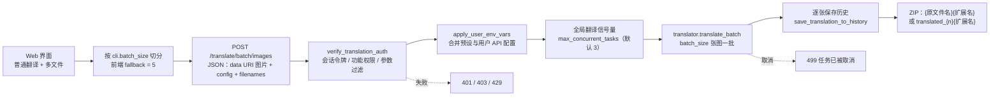
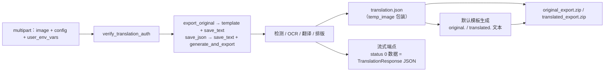
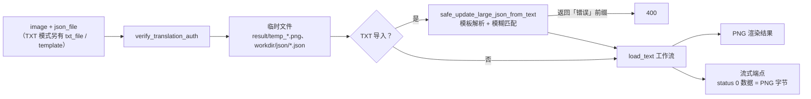

# 批量、导出与导入处理

当脚本或第三方客户端需要一次翻译多张图片、把检测与翻译结果导出为可编辑的 JSON/文本，或把改好的翻译文本重新渲染回图片时，使用本页的端点。本页是开发者 HTTP API 契约页：记录 `/translate` 下批量、导出与导入端点的方法、请求体、响应、鉴权、状态码和运行流程。Web 界面的完整用户操作见 [Web 上传、配置与翻译](../../web/upload-config-and-translate.md)；单图翻译端点与自定义二进制流协议分别见[翻译端点](./translation-endpoints.md)与[流式协议](./streaming-protocol.md)；历史与下载票据见[历史、文件与下载票据](./history-files-and-download-tickets.md)。

## 接口范围 {#feature-boundary}

- 批量端点负责“多张图片一次请求”：`POST /translate/batch/json` 返回 `list[TranslationResponse]`，`POST /translate/batch/images` 返回图片 ZIP；`POST /translate/queue-size` 查询分布式执行器队列长度。
- 导出端点负责“把图片的处理结果打包带走”：`POST /translate/export/original` 与 `POST /translate/export/translated` 返回 ZIP（`translation.json` + 模板文本），对应的 `/stream` 变体用自定义二进制流返回同一份 JSON。
- 导入端点负责“把翻译文本写回图片并渲染”：`POST /translate/import/json` 与 `POST /translate/import/txt` 返回 PNG，对应的 `/stream` 变体流式返回 PNG 字节。
- 以上端点全部要求 `X-Session-Token`，并执行 `verify_translation_auth` 的会话、功能权限、参数过滤、并发与每日配额检查；详见[请求与响应契约](#request-response-contract)。
- Web 界面的“翻译流程模式：”下拉框只是入口，最终请求落在上述端点；界面本身的文件选择、结果列表与打包下载属于 Web 用户功能，不在本页重复。
- “导出配置 / 导入配置”按钮在浏览器本地读写 `config.json`，与服务端翻译导出/导入端点不是同一个功能，详见[Web 界面中的工作流入口](#web-ui-workflow-entry)。
- 单图翻译端点（`/translate/json`、`/translate/with-form/*` 等）与 `POST /translate/complete` 的 multipart 响应属于[翻译端点](./translation-endpoints.md)，这里不展开。

## Web 界面中的工作流入口 {#web-ui-workflow-entry}

打开 Web 工作区后，“翻译流程模式：”下拉框列出七种工作流。前端按模式选择端点：普通翻译且多于一个文件时按 `cli.batch_size` 切分批次并调用批量图片端点；导出译文、导出原文分别调用导出端点；导入翻译并渲染调用 JSON 导入端点（Web 界面只支持 JSON，不支持 TXT）。

“导出配置”把当前界面配置序列化为 `config.json` 并触发浏览器下载；“导入配置”读取本机 JSON 文件后用 `generateConfigUI()` 重建设置面板。两者都不经过服务器，也不上传密钥。

## 批量翻译端点 {#batch-endpoints}

### 批量 JSON 与批量图片 {#batch-json-and-images}

两个批量端点都接收 `BatchTranslateRequest` JSON，区别只在响应：`/batch/json` 返回 `list[TranslationResponse]`，`/batch/images` 返回打包好的图片 ZIP。

| 方法 | 路径 | 请求体 | 响应 | 源码位置 |
| --- | --- | --- | --- | --- |
| `POST` | `/translate/batch/json` | `BatchTranslateRequest` JSON | `200` `list[TranslationResponse]` | `routes/translation.py:353` |
| `POST` | `/translate/batch/images` | `BatchTranslateRequest` JSON | `200` ZIP（`application/octet-stream` + `X-Content-Type: application/zip`） | `routes/translation.py:436` |
| `POST` | `/translate/queue-size` | 无 | `200` 整数 | `routes/translation.py:642` |

`BatchTranslateRequest` 字段（`server/request_extraction.py:106`）：

| 字段 | 类型 | 默认值 | 说明 |
| --- | --- | --- | --- |
| `images` | `list[bytes\|str]` | 必填 | 图片字节或带前缀的 base64 data URI（如 `data:image/png;base64,...`） |
| `config` | `dict` / `Config` | `{}` | 完整配置；`dict` 会先经 `parse_config` 转换 |
| `batch_size` | `int` | `4` | 翻译器每次处理多少张图（与前端切分 HTTP 批次是两个层面） |
| `filenames` | `list[str]` | `[]` | 可选原始文件名，用于输出命名与历史记录 |

`/batch/images` 的 ZIP 条目按 `filenames` 中的原文件名生成（`{basename}{扩展名}`，扩展名由 `config.cli.format` 经 `resolve_output_image_format` 决定）；没有文件名时使用 `translated_{i+1}{ext}`。响应不使用 `Content-Disposition: attachment`，而是 `application/octet-stream` 加自定义 `X-Content-Type: application/zip`，源码注释说明这是为了避免下载器（如 IDM）拦截。图片列表为空时返回 `400`（detail 为“没有提供图片”）。

### 批次处理流程 {#batch-flow}

图注：`batch_size` 控制翻译器一次处理多少张图，前端切分控制一次 HTTP 请求携带多少张图，两者数值可以不同；开启批量也不表示所有图片同时请求 API，请求仍受全局信号量与用户并发限制约束。

### 队列大小与取消 {#queue-size-and-cancellation}

`POST /translate/queue-size` 返回 `len(task_queue.queue)`，其中 `task_queue` 是分布式执行器（`--start-instance` 模式）使用的 `TaskQueue`（`server/myqueue.py:99`）。单进程模式下该队列通常为空，与翻译信号量的等待队列是两套机制；Web 界面不调用它做进度展示。

两个批量端点都调用 `generate_task_id()` 注册活动任务（`register_active_task`），使管理员界面可见，并在 `get_batch_ctx` 的检查点查询 `is_task_cancelled(task_id)`。管理员通过 `POST /admin/tasks/{task_id}/cancel` 取消：普通取消设置 `cancel_requested` 标记等待协作式响应，`force=true` 直接调用 `asyncio.Task.cancel()`。批量端点在 `CancelledError` 或检测到取消标记时返回 `499`（detail 为“任务已被取消”或“任务已被强制取消”）。

`/batch/images` 还会检查离线翻译权限（`check_offline_translation_permission`）：有权限时用 `is_disconnected()` 恒为 `False` 的包装请求替换原请求，客户端断开后任务仍继续执行并写历史。

## 导出端点 {#export-endpoints}

### 导出原文与导出译文 {#export-zip}

两个导出端点使用 multipart/form-data 字段：`image`（文件）、`config`（JSON 字符串，默认 `{}`）、`user_env_vars`（JSON 字符串，默认 `{}`）。服务端先做 `verify_translation_auth` 与 `apply_user_env_vars`，再用 `get_ctx` 跑对应工作流：

| 方法 | 路径 | 工作流 | ZIP 内容 | 下载文件名 |
| --- | --- | --- | --- | --- |
| `POST` | `/translate/export/original` | `export_original`（`template` + `save_text`） | `translation.json` + `original.{格式}` | `original_export.zip` |
| `POST` | `/translate/export/translated` | `save_json`（`save_text` + `generate_and_export`） | `translation.json` + `translated.{格式}` | `translated_export.zip` |
| `POST` | `/translate/export/original/stream` | `export_original` | 二进制流，status 0 数据为 JSON | — |
| `POST` | `/translate/export/translated/stream` | `save_json` | 二进制流，status 0 数据为 JSON | — |

`translation.json` 的结构与主翻译程序一致：`{"temp_image": <TranslationResponse 的 model_dump()>}`，包含 `regions`、`original_width`、`original_height`，以及超分/上色信息、`mask_raw`（base64 PNG，保存的是已优化蒙版并标记 `mask_is_refined: true`）。文本文件由桌面层 `workflow_service` 的默认模板生成：原文用 `generate_original_text`，译文用 `generate_translated_text`；扩展名来自模板的 `get_translation_output_format`。ZIP 以 `application/zip` 返回并带 `Content-Disposition: attachment`。模板缺失或生成失败时返回 `500`。

### 流式导出 {#export-stream}

`/export/original/stream` 与 `/export/translated/stream` 复用 `while_streaming(req, transform_to_json, ...)`，把进度帧和结果帧按自定义二进制协议（1 字节状态 + 4 字节长度 + 数据）发送：状态 `1` 是带 `stage`/`message` 的进度 JSON，状态 `0` 是最终 `TranslationResponse` JSON，状态 `2` 是错误 JSON。流式导出不返回 ZIP，客户端需要按[流式协议](./streaming-protocol.md)解析。与 ZIP 端点不同，流式路径内部会调用 `save_translation_to_history` 保存历史。

### 导出数据流 {#export-flow}

图注：ZIP 与流式导出走同一条翻译流水线，只是响应封装不同；`export_original` 需要默认模板存在，否则返回 `500`。

## 导入端点 {#import-endpoints}

### JSON 导入 {#import-json}

`POST /translate/import/json` 接收 multipart 字段 `image`、`json_file`、`config`、`user_env_vars`。服务端把 JSON 写入工作目录 `json/temp_{随机}_translations.json`，把图片保存为 `result/temp_{随机}.png`，然后用 `load_text` 工作流调用 `get_ctx` 渲染，成功后返回 `image/png`；失败返回 `500`。临时文件在成功与异常路径都会清理（流式变体除外，见下）。

### TXT 导入 {#import-txt}

`POST /translate/import/txt` 在 JSON 导入基础上增加 `txt_file`（必填）与 `template`（可选，模板文件）。服务端把 TXT 与 JSON 落到临时文件后，调用桌面层 `workflow_service.safe_update_large_json_from_text(temp_txt_path, json_path, template_path)`：该函数支持模板解析与模糊匹配，把 TXT 中的翻译写回 JSON；返回以“错误”开头的字符串时以 `400` 拒绝。之后同样走 `load_text` 渲染返回 PNG。Web 界面不调用此端点（界面只支持 JSON 导入），它主要供脚本与桌面工作流使用。

### 流式导入 {#import-stream}

`/import/json/stream` 与 `/import/txt/stream` 使用 `while_streaming(req, transform_to_image, ..., "load_text")`，status 0 数据为最终 PNG 字节，并在处理前发送 `queued` / `slot_acquired` 等进度帧。源码注释明确：流式响应期间不能在 `finally` 中删除临时文件，`result/` 与工作目录中的临时文件会累积，需要周期性清理。

### 导入数据流 {#import-flow}

图注：JSON 导入与 TXT 导入最终都进入 `load_text`；TXT 只是多了一步“文本写回 JSON”的合并，合并失败时不会进入渲染。

## 请求与响应契约 {#request-response-contract}

- 鉴权头：`X-Session-Token`。`verify_translation_auth` 缺失令牌返回 `401`（`NO_TOKEN`），无效或过期返回 `401`（`INVALID_TOKEN`）；会话有效后先执行 `filter_disabled_parameters` 把被禁参数替换为管理员默认值，再检查翻译器、OCR、上色器、渲染器权限，未获权返回 `403`。
- 环境变量：`user_env_vars` 表单字段与预设解析在 `apply_user_env_vars` 中合并（优先级：用户直接提供 > 用户预设 > 用户组默认预设），合并结果写入 `config._user_env_vars` 并调用 `runtime_api.apply_runtime_api_overrides`。文档与示例不展示任何真实密钥。
- 并发与配额：`track_task_start` 增加并发计数并检查用户并发上限与每日配额，超限返回 `429`；`track_task_end` 在 `finally` 中回退计数。
- 输入校验：图片必须是字节或带前缀的 base64 data URI，否则 `422`；`/batch/images` 空列表返回 `400`。
- 批量取消返回 `499`；导出、导入与渲染的内部异常返回 `500`。

## 请求处理方式 {#runtime-behavior}

- 批次层级：`cli.batch_size`（发行默认 `3`，见 `config/config-example.json`）控制翻译器内部一次处理多少张图；`BatchTranslateRequest.batch_size` 默认 `4`；Web 前端在缺失配置时用 `5` 切分 HTTP 批次。三者是不同层的默认值，不能合并。
- 并发控制：`get_batch_ctx` 与 `while_streaming` 都先获取全局 `translation_semaphore`（`server_config.max_concurrent_tasks`，默认 `3`）再进入翻译线程池；用户级并发与每日配额由路由层 `track_task_start` / `track_task_end` 维护。
- 历史写入：批量端点逐张调用 `save_translation_to_history`（历史 session 形如 `{task_id}_{i}`）；流式导出与导入由 `while_streaming` 内部调用。历史保存失败只记 WARNING，不中断响应。
- 临时文件：ZIP 与非流式导出/导入在成功与异常路径清理临时 JSON/TXT/图片；流式导入在响应期间保留临时文件（源码注释要求周期性清理）。
- 响应传输：ZIP 导出与图片导入直接返回完整字节；`/stream` 变体返回自定义二进制帧。完整帧协议见[流式协议](./streaming-protocol.md)。

## 接口约束 {#dependencies-and-conflicts}

- 批量、导出、导入都依赖会话与权限体系：未登录、无功能权限或超配额时无法调用，即使 Web 界面隐藏了入口也一样。
- 导出原文/译文依赖默认模板存在（`ensure_default_template_exists`）；模板缺失时返回 `500`。
- 导入依赖 `json_file` 与图片一一对应；TXT 导入还依赖 `desktop_qt_ui/services/workflow_service.py` 的模板解析逻辑，是该端点对桌面层代码的复用。
- `batch_size`、`batch_concurrent` 与前端切分是三层概念：`batch_size` 是翻译器批次，`batch_concurrent` 控制图片编排并发（桌面设置页），前端切分控制 HTTP 请求大小。Web 前端不使用 `batch_concurrent` 决定切分，只按 `batch_size` 分批。
- 批量 ZIP 使用 `application/octet-stream` 而非 `application/zip`，客户端应读取 `X-Content-Type` 头判断 ZIP，而不是依赖标准 MIME。
- 不要在日志、请求示例或调试产物中写入真实密钥、用户图片或私有提示词。

## 开发指南 {#developer-guide}

### 选项中英对照 {#option-matrix}

#### 工作流选项文案

| UI 调用 key | English 实际值 | 简体中文实际值 |
| --- | --- | --- |
| `Translation Workflow Mode:` | Translation Workflow Mode: | 翻译流程模式： |
| `Normal Translation` | Normal Translation | 正常翻译流程 |
| `Export Translation` | Export Translation | 导出翻译 |
| `Export Original Text` | Export Original Text | 导出原文 |
| `Import Translation and Render` | Import Translation and Render | 导入翻译并渲染 |
| `Colorize Only` | Colorize Only | 仅上色 |
| `Upscale Only` | Upscale Only | 仅超分 |
| `Inpaint Only` | Inpaint Only | 仅修复 |
| `Start Translation` | Start Translation | 开始翻译 |
| `Add Files` | Add Files | 添加文件 |
| `Clear List` | Clear List | 清空列表 |
| `Export Config` | Export Config | 导出配置 |
| `Import Config` | Import Config | 导入配置 |
| `label_batch_size` | Batch Size | 批量大小 |

#### 导入模式提示文案

导入模式下前端按基础文件名把图片与同名的 `.json` 文件配对；缺失或类型不对时在日志输出中显示以下提示（这些是日志文案，不是控件标签）：

| UI 调用 key | English 实际值 | 简体中文实际值 |
| --- | --- | --- |
| `import_mode_no_json` | Import mode: JSON file not found | 导入翻译模式：未找到JSON文件 |
| `import_mode_hint` | Hint: Please upload both image and corresponding JSON file (e.g., image.png and image.json) | 提示：请同时上传图片和对应的JSON文件（例如：image.png 和 image.json） |
| `import_mode_json_only` | Import mode: Only JSON files are supported, TXT files are not supported | 导入翻译模式：只支持JSON文件，不支持TXT文件 |
| `import_mode_json_hint` | Hint: Please use 'Export Original' or 'Export Translation' to generate JSON files | 提示：请使用「导出原文」或「导出翻译」功能生成JSON文件 |

#### 状态码

| 状态码 | 触发场景 |
| --- | --- |
| `200` | JSON 数组、ZIP、PNG、流、队列大小 |
| `400` | 批量图片为空；TXT 导入合并返回“错误”前缀 |
| `401` | 缺少或无效/过期的 `X-Session-Token` |
| `403` | 无翻译器、OCR、上色器或渲染器权限 |
| `422` | 图片不是 bytes/base64 data URI、JSON 校验失败 |
| `429` | 用户并发上限或每日配额超限 |
| `499` | 批量任务被取消或检测到取消 |
| `500` | 服务未初始化、模板缺失、导出/导入/渲染失败 |

### 关联文件与格式 {#related-files-and-formats}

| 文件/格式 | 本页实际作用 | 说明 |
| --- | --- | --- |
| `translation.json`（ZIP 内） | `{"temp_image": <TranslationResponse>}` | 与主翻译程序 JSON 格式一致；`mask_raw` 为 base64 PNG |
| `original.{ext}` / `translated.{ext}` | 导出 ZIP 中的模板文本 | 扩展名由模板 `get_translation_output_format` 决定 |
| `result/temp_*.png` | 导入/导出临时图片 | 流式导入期间累积，需周期性清理 |
| `{workdir}/json/temp_*_translations.json` | 导入写入的临时翻译 JSON | 工作目录由 `get_work_dir` 决定 |
| `desktop_qt_ui/services/workflow_service.py` | TXT 导入与 ZIP 文本生成 | `safe_update_large_json_from_text`、`generate_original_text`、`generate_translated_text` |
| `config/config-example.json` | 发行默认 `batch_size: 3` | 只记录脱敏默认值 |

### 代码位置 {#source-evidence}
| 层级 | 文件 | 本页核对内容 |
| --- | --- | --- |
| 路由 | `manga_translator/server/routes/translation.py` | 批量、导出、导入与队列端点及响应封装（`353`–`1333`） |
| 请求提取 | `manga_translator/server/request_extraction.py` | `BatchTranslateRequest`、`get_batch_ctx`、`while_streaming`、`prepare_translator_params`、`pack_message`、`save_translation_to_history` |
| 鉴权 | `manga_translator/server/routes/translation_auth.py` | `verify_translation_auth`、`filter_disabled_parameters`、`track_task_start/end` |
| 环境变量 | `manga_translator/server/core/response_utils.py`、`server/runtime_api.py` | `apply_user_env_vars`、`apply_runtime_api_overrides` |
| 并发与任务 | `manga_translator/server/core/task_manager.py`、`server/myqueue.py` | 信号量、线程池、活动任务、取消检查、`task_queue` |
| 序列化 | `manga_translator/server/to_json.py`、`core/response_utils.py` | `TranslationResponse`、`to_translation`、`transform_to_json`、`transform_to_image` |
| Web 前端 | `manga_translator/server/static/script.js`、`index.html` | 工作流下拉、批次切分、`/batch/images` 调用、导入 JSON 配对、导出/导入配置 |
| i18n | `desktop_qt_ui/locales/en_US.json`、`zh_CN.json`（经 `doc/wiki/data/i18n.generated.json`） | 工作流选项与导入提示的实际显示值 |