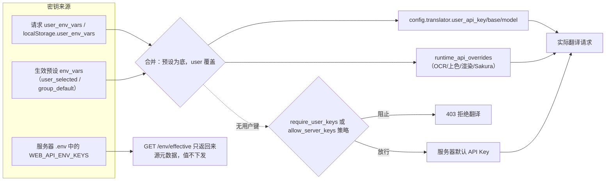

# HTTP 配置、环境与资源端点

当第三方客户端或 Web 前端需要读取参数结构与可选值、保存 API 密钥、上传字体和提示词，或应用管理员预设时，这里说明这些 HTTP 端点的路径、鉴权边界、请求/响应契约和底层行为。这里仅记录开发者 HTTP API；Web 用户端的配置页签与上传操作见[上传、配置与翻译](../../web/upload-config-and-translate.md)和[资源、字体与提示词](../../web/resources-fonts-and-prompts.md)，管理员界面操作见[管理员界面](../../web/administrator-interface.md)，会话与状态码契约见[HTTP API 鉴权与错误](./authentication-and-errors.md)。

## 接口范围 {#feature-boundary}

- 内容包括四组端点：配置元数据（`/config*`、`/fonts`、`/translators`、`/languages`、`/workflows`、`/translator-config/{translator}`、`/user/settings`、`/user/access`、`/api-key-policy`、`/i18n/*`、`/announcement`、`/api`）、环境变量（`GET|POST /env`、`GET /env/effective`）、用户资源（`/api/resources/*`）和配置管理（`/api/admin/config/*`、`/api/admin/presets*`、`/api/presets*`、`/api/config/user*`）。
- 这里不覆盖翻译、流式、批量、历史、日志、用户/用户组/配额/审计端点；它们分别见[翻译端点](./translation-endpoints.md)、[流协议](./streaming-protocol.md)、[历史文件与下载票据](./history-files-and-download-tickets.md)和[管理端点](./admin-users-groups-quota-audit.md)。
- `GET /env` 与 `GET /env/effective` 永不返回服务器 API Key 明文；管理员也只能在 `GET /api/admin/config/server?show_values=true` 下看到明文，且该端点要求管理员会话。
- 这里不记录真实 API Key、Token、用户名、私有绝对路径、用户提示词正文或字体文件；默认值与白名单来自源码常量，不代表运行部署的实际配置。

## 配置元数据端点 {#config-metadata-endpoints}

### 配置结构 {#config-structure}

| 端点 | 鉴权边界 | 静态行为 |
| --- | --- | --- |
| `GET /config/defaults` | 无 token 依赖 | 返回服务器默认配置模板：过滤 `SERVER_HIDDEN_CONFIG_KEYS`、剔除 Qt UI 专属 `app` 段，并追加 `quota` 与 `permissions` 默认值 |
| `GET /config` | `mode=user` 无 token；`mode=authenticated` 需 `X-Session-Token`；`mode=admin` 返回过滤隐藏键后的全量 | 按模式返回用户可见配置；authenticated 模式还叠加用户/用户组参数权限并附加 `user_permissions` |
| `GET /config/options` | 可选 `X-Session-Token` | 返回参数下拉选项；带 token 时追加用户上传的字体与提示词，并按权限过滤翻译器/OCR/上色/渲染选项 |

- `GET /config` 的 `mode=user`（legacy）按 `admin_settings` 的 `visible_sections`、`hidden_keys`、`default_values` 过滤；`mode=authenticated` 校验令牌后按用户权限与用户组隐藏参数/默认值过滤，并在响应中加入 `user_permissions`；`mode=authenticated` 缺少或令牌无效时返回 `{"error": {"code": "NO_TOKEN" | "INVALID_TOKEN", ...}}`。
- `GET /config/defaults` 追加的 `quota` 默认值为 `daily_image_limit: 100`、`daily_char_limit: 100000`、`max_concurrent_tasks: 3`、`max_batch_size: 20`、`max_image_size_mb: 10`、`max_images_per_batch: 50`；`permissions` 默认除 `can_view_logs`、`show_env_editor`、`require_user_keys`、`save_user_keys_to_server` 为 `false` 外其余为 `true`。

### 选项与元数据 {#options-and-metadata}

| 端点 | 鉴权边界 | 返回内容 |
| --- | --- | --- |
| `GET /fonts` | 无 | 共享字体目录下 `.ttf`/`.otf`/`.ttc` 文件名（服务器字体） |
| `GET /translators` | `mode` 参数 | 翻译器列表（排除隐藏项）；authenticated 模式按用户权限过滤 |
| `GET /languages` | `mode` 参数 | `VALID_LANGUAGES`；authenticated 模式当前返回全部（语言级权限预留） |
| `GET /workflows` | `mode` 参数 | 七种工作流；authenticated 模式按用户与用户组的允许/拒绝列表过滤 |
| `GET /translator-config/{translator}` | 无 | 若 `config/translators.json` 存在，仅返回 `name`、`display_name`、`required_env_vars`、`optional_env_vars` 公开信息 |

- `GET /config/options` 返回的键包括 `renderer`、`alignment`、`direction`、`upscaler`、`detector`、`colorizer`、`inpainter`、`inpainting_precision`、`ocr`、`secondary_ocr`、`translator`、`target_lang`、`keep_lang`、`upscale_ratio`、`realcugan_model`、`font_family`、`high_quality_prompt_path`、`layout_mode`、`ocr_vl_language_hint`、`format`、`image_extensions`。`font_family` 合并服务器字体与当前会话用户的字体，`high_quality_prompt_path` 合并 `dict/` 下的提示词文件与用户上传的提示词。

### 用户设置与访问 {#user-settings-and-access}

| 端点 | 鉴权边界 | 返回内容 |
| --- | --- | --- |
| `GET /user/settings` | 可选 `X-Session-Token` | `show_env_editor`、`can_upload_fonts`、`can_upload_prompts`、`allow_server_keys`、`max_image_size_mb`、`max_images_per_batch`；登录用户叠加用户组配额与权限 |
| `GET /user/access` | 无 | `{"require_password": bool}`，旧式单密码门 |
| `GET /api-key-policy` | 可选 `X-Session-Token` | 全局策略叠加用户组覆盖后的有效 API Key 策略，并附 `merge_order` 与 `fallback_rule` |

- Web 前端用 `/user/settings` 决定是否显示“API密钥”页签与字体/提示词上传区域；区域隐藏只是前端行为，最终权限由服务端校验。

### i18n、公告与服务器信息 {#i18n-and-announcement}

| 端点 | 鉴权边界 | 返回内容 |
| --- | --- | --- |
| `GET /i18n/languages` | 无 | 桌面 locales 目录中的 `{locale_code: locale_code}` 映射 |
| `GET /i18n/{locale}` | 无 | 对应 locale 的桌面翻译 JSON；realpath 校验防路径穿越，缺失返回 `{}` |
| `GET /announcement` | 无 | 管理员公告；未启用返回 `{"enabled": false}`，启用时含 `message` 与 `type` |
| `GET /api` | 无 | 服务器信息：`message`、`version: "2.0"`、`endpoints` |

## 环境变量端点 {#env-endpoints}

### 读取 {#env-read}

- `GET /env`（`require_auth`）：无论 `show_env_editor` 是否为真都返回 `{}`，不暴露服务器 API Key 明文。
- `GET /env/effective`（`require_auth`）：返回 API Key 来源元数据而非值。响应包含 `policy`、`selected_preset_id`、`selected_preset_name`、`selected_preset_source`、`effective_keys`、`sources`；`server_env_vars`、`preset_env_vars`、`merged_env_vars` 恒为空对象。`sources` 用 `server` / `preset` 标记每个键的来源，preset 覆盖 server。
- `show_env_editor` 为假时 `GET /env/effective` 仍返回同形状的元数据，只是 `sources` 为空。

### 保存 {#env-save}

- `POST /env`（`require_auth`）：请求体为 `{"OPENAI_API_KEY": "...", ...}` 这类键值对象。服务端只保留 `WEB_API_ENV_KEYS` 白名单中的键（OpenAI/Gemini/Sakura 的翻译、OCR、上色、渲染分组）；`show_env_editor` 为假时返回 `403`。
- `save_user_keys_to_server` 为 `false`（默认）时不写服务器，返回 `{"success": true, "saved_to_server": false}`；前端把键保存在浏览器 `localStorage.user_env_vars` 并随翻译请求发送，只对本次使用有效。
- `save_user_keys_to_server` 为 `true` 时，`EnvService.update_env_var` 逐项写入应用目录 `.env`，随后 `load_app_dotenv(..., override=True)` 重载；失败返回 `500`。
- 空值（`null` 统一转为 `""`）用于清除已保存的键；非白名单键会被丢弃。

## 用户资源端点 {#user-resource-endpoints}

### 提示词 {#prompt-resources}

| 端点 | 鉴权边界 | 行为 |
| --- | --- | --- |
| `POST /api/resources/prompts` | `require_auth` + 上传提示词权限 | multipart 上传；支持 `.txt`/`.json`；权限不足 `403`，格式错误 `400` |
| `GET /api/resources/prompts` | `require_auth` | 当前用户提示词列表与 `count` |
| `DELETE /api/resources/prompts/{resource_id}` | `require_auth` + 删除权限 | 删除单个提示词 |
| `DELETE /api/resources/prompts/by-name/{filename}` | `require_auth` + 删除权限 | 按文件名删除 |

### 字体 {#font-resources}

| 端点 | 鉴权边界 | 行为 |
| --- | --- | --- |
| `POST /api/resources/fonts` | `require_auth` + 上传字体权限 | multipart 上传；支持 `.ttf`/`.otf`/`.ttc`，尝试提取字体族名 |
| `GET /api/resources/fonts` | `require_auth` | 当前用户字体列表 |
| `DELETE /api/resources/fonts/{resource_id}` | `require_auth` + 删除权限 | 删除单个字体 |
| `DELETE /api/resources/fonts/by-name/{filename}` | `require_auth` + 删除权限 | 按文件名删除 |

### 统计 {#resource-stats}

- `GET /api/resources/stats`（`require_auth`）：返回 `stats`，即当前用户的资源统计。
- 文件存储于 `manga_translator/server/data/user_resources/prompts/{用户名}/{文件名}` 与 `.../fonts/{用户名}/{文件名}`；文件名经过消毒（防路径遍历），重名自动追加数字后缀。

## 配置管理端点 {#config-management-endpoints}

### 服务器 .env 与备份 {#server-env-and-backups}

| 端点 | 鉴权边界 | 行为 |
| --- | --- | --- |
| `GET /api/admin/config/server?show_values=false` | `require_admin` | 服务器 `.env` 配置；默认掩码敏感值（长度 ≤4 全 `*`，否则保留前后 2 字符）；`show_values=true` 返回明文 |
| `PUT /api/admin/config/server` | `require_admin` | body `{"config": {"KEY": "value"}}` 更新 `.env`；`create_backup=true`（默认）先备份 |
| `GET /api/admin/config/backups` | `require_admin` | 列出 `.env.backup.*` 备份（`path`、`filename`、`created_at`、`size`） |
| `POST /api/admin/config/restore` | `require_admin` | body `{"backup_path": "..."}` 从备份恢复；路径必须位于备份目录且以 `.env.backup.` 开头，否则失败 |

- 每次更新前自动备份并保留最近 10 份；恢复前也会先备份当前状态。
- 预设与用户配置中的敏感值（键含 `API_KEY`、`SECRET`、`PASSWORD`、`TOKEN`）使用 Fernet 加密（密钥由机器信息派生），分别持久化在 `env_presets.json` 与 `user_configs.json`。

### 预设 {#presets}

| 端点 | 鉴权边界 | 行为 |
| --- | --- | --- |
| `POST /api/admin/presets` | `require_admin` | 创建预设；同名返回 `409`；config 中敏感值加密存储 |
| `GET /api/presets` | `require_auth` | 当前用户组可见的预设（不含 config 细节） |
| `GET /api/admin/presets?include_config=false` | `require_admin` | 全部预设 |
| `GET /api/admin/presets/{preset_id}` | `require_admin` | 单个预设；`decrypt=true` 时解密 |
| `PUT /api/admin/presets/{preset_id}` | `require_admin` | 更新预设 |
| `DELETE /api/admin/presets/{preset_id}` | `require_admin` | 删除预设 |
| `POST /api/presets/{preset_id}/apply` | `require_auth` | 把预设应用到当前用户：写入 `selected_preset_id` 与 `config_mode='server'`；返回非大写键的 config 供 UI 应用 |
| `DELETE /api/config/user/preset` | `require_auth` | 清除当前用户选中的预设 |

- 预设可见性由 `visible_to_groups` 控制，空列表表示所有用户组可见。

### 用户配置 {#user-config}

- `GET /api/config/user`（`require_auth`）：返回当前用户配置，API Keys 掩码；无记录时返回默认结构（`api_keys: {}`、`selected_preset_id: null`、`custom_settings: {}`、`config_mode: "server"`）。
- `PUT /api/config/user`（`require_auth`）：body 为 `api_keys`、`selected_preset_id`、`custom_settings`、`config_mode` 的任意组合；`api_keys` 敏感值加密后存储。
- `config_mode` 取 `server` 或 `custom`；应用预设只写入 `selected_preset_id` 与 `config_mode`，不会把预设密钥明文复制进用户配置。

## API Key 策略与合并 {#api-key-policy-and-merge}

策略键来自 `admin_settings.api_key_policy`（含 `show_env_to_users`）与用户组 `parameter_config.permissions` 覆盖：`require_user_keys`、`allow_server_keys`、`save_user_keys_to_server`、`show_env_editor`。默认值中除 `allow_server_keys` 为 `true` 外其余为 `false`。`/api-key-policy` 返回的 `merge_order` 固定为 `["user_input", "selected_preset", "server_default"]`，`fallback_rule` 为 `feature_specific_then_provider_default`。

翻译请求构建时 `apply_user_env_vars` 按以下顺序合并：

1. 解析请求中的 `user_env_vars`（只保留非空且大写的键）。
2. 读取当前用户生效预设的 `env_vars`：来源为 `user_selected`（用户显式选择）或 `group_default`（用户组默认预设）。
3. 合并时以预设为底、用户直传覆盖；`_apply_env_vars_to_config` 把 `OPENAI_*`/`GEMINI_*` 映射到 `config.translator.user_api_key` / `user_api_base` / `user_api_model`，`apply_runtime_api_overrides` 处理 OCR、上色、渲染与 Sakura 地址。
4. 用户与预设都没有键时：`require_user_keys` 为真返回 `403`；`allow_server_keys` 为假返回 `403`；否则回退到服务器默认 API Key。

上图描述的是 API Key 来源与合并路径；`POST /env` 是否落盘由 `save_user_keys_to_server` 决定，不改变合并顺序本身。

## 接口约束 {#dependencies-and-conflicts}

- Web 前端先用 `/user/settings` 决定“API密钥”页签与上传区域的显示，但隐藏只是前端行为，最终由服务端权限校验。
- `/config/options` 的 `font_family` 与 `high_quality_prompt_path` 合并服务器与用户资源；删除用户字体/提示词后，前端需重新请求 `/config/options` 刷新选项。
- 环境变量默认不落盘（`save_user_keys_to_server=false`）；多用户部署建议关闭落盘，避免用户互相覆盖服务器密钥。
- `GET /env`、`GET /env/effective` 不返回服务器密钥明文；`GET /api/admin/config/server?show_values=true` 返回明文，只能用于可信管理会话。
- 预设与用户配置中的敏感键加密存储，应用预设不会把密钥明文复制到用户配置。
- 端点边界：翻译/流式/批量见[翻译端点](./translation-endpoints.md)与[流协议](./streaming-protocol.md)，历史与下载见[历史文件与下载票据](./history-files-and-download-tickets.md)，用户/用户组/配额/审计见[管理端点](./admin-users-groups-quota-audit.md)，会话与状态码见[鉴权与错误](./authentication-and-errors.md)。
- `429` 并发与每日配额由翻译路由层处理（见[鉴权与错误](./authentication-and-errors.md)），不属于本页端点。

## 开发指南 {#developer-guide}

### 选项中英对照 {#option-matrix}

#### UI 文案三列 {#ui-copy}

以下为 Web 前端调用本页端点时使用的界面文案。`index.html` 的部分静态文字是硬编码中文（如“导出配置”“导入配置”“API密钥”“上传字体文件”“上传提示词文件”“字体管理”“提示词管理”“日志输出”），`script.js` 启动后以 locale key 覆盖一部分。

| UI 调用 key | English 实际值 | 简体中文实际值 |
| --- | --- | --- |
| `API Keys (.env)` | API Keys (.env) | API密钥 (.env) |
| `Basic Settings` | Basic Settings | 基础设置 |
| `Advanced Settings` | Advanced Settings | 高级设置 |
| `Options` | Options | 选项 |
| `Export Config` / `Import Config` | Export Config / Import Config | 导出配置 / 导入配置 |
| `env_hint` | API key input fields will appear below based on the selected translator | 根据选择的翻译器，下方会显示所需的 API 密钥输入框 |
| `error_loading_translator_config` | Failed to load translator configuration | 加载翻译器配置失败 |
| `label_OPENAI_API_KEY` | OpenAI API Key | OpenAI API 密钥 |
| `label_OPENAI_API_BASE` | OpenAI API Base | OpenAI API 地址 |
| `label_OPENAI_MODEL` | OpenAI Model | OpenAI 模型 |
| `label_GEMINI_API_KEY` | Gemini API Key | Gemini API 密钥 |
| `label_SAKURA_API_BASE` | SAKURA API Base | SAKURA API 地址 |
| `label_OCR_OPENAI_MODEL` | OCR OpenAI Model | 文字识别 OpenAI 模型 |
| `label_COLOR_GEMINI_MODEL` | Colorization Gemini Model | 上色 Gemini 模型 |
| `label_RENDER_OPENAI_MODEL` | Rendering OpenAI Model | 渲染 OpenAI 模型 |
| `font_uploaded` | Font uploaded successfully | 字体上传成功 |
| `prompt_uploaded` | Prompt uploaded successfully | 提示词上传成功 |
| `web_server_config` | Server Configuration | 服务器配置 |
| `web_use_server_config` | Use Server Config | 使用服务器配置 |
| `web_user_config` | User Configuration | 用户配置 |
| `web_visible_to` | Visible To | 可见范围 |
| `web_presets` | Presets | 配置预设 |

以下 key 在 `en_US.json` 与 `zh_CN.json` 中均缺失，`script.js` 以调用处 fallback 显示：`preset_select`、`preset_hint`、`preset_empty`、`preset_none`、`preset_applying`、`preset_applied`、`preset_apply_failed`、`login_required_for_api_keys`、`api_keys_saved_to_server`、`api_keys_saved_session`、`api_keys_save_failed`、`font_deleted`、`prompt_deleted`。英文界面在缺失时会显示调用处的中文 fallback 文案。

### 关联文件与格式 {#related-files-and-formats}

| 文件/路径 | 本页实际作用 | 手改与兼容注意 |
| --- | --- | --- |
| `manga_translator/server/data/user_resources/prompts/`、`fonts/` | 用户提示词与字体的存储与索引 | 文件名消毒、重名去重；不展示真实用户文件 |
| `manga_translator/server/data/env_presets.json` | 预设持久化，敏感值加密 | 不展示真实预设内容 |
| `manga_translator/server/data/user_configs.json` | 用户配置持久化，API Keys 加密 | 不展示真实密钥 |
| `manga_translator/server/data/backups/` | `.env.backup.*` 备份（保留 10 份） | 恢复端点校验路径边界 |
| `manga_translator/server/data/admin_config.json` | 管理员设置：`api_key_policy`、`show_env_to_users`、`upload_limits`、`announcement` | 不展示真实配置 |
| 应用目录 `.env` | 服务器 API Key 持久化 | `POST /env`（落盘模式）与管理员更新写入；`GET /env` 不回显明文 |
| `config/config.json`（缺失时由 `config-example.json` 复制） | `/config/defaults` 与 `/config` 的默认来源 | 只记录脱敏示例 |
| `config/translators.json`（若存在） | `/translator-config/{translator}` 的公开元数据 | 仓库未跟踪该文件时端点返回 `{}` |
| `desktop_qt_ui/locales/*.json` | `/i18n/{locale}` 与条件挂载的 `/locales/*` | realpath 防路径穿越；缺失 locale 返回 `{}` |
| `manga_translator/server/static/index.html`、`script.js`、`js/shared/api-key-schema.js` | 前端驱动配置/环境/资源端点 | 部分静态文字为硬编码中文 |

### Mermaid 数据流限制 {#mermaid-limits}

上图描述的是 API Key 来源、合并与运行时覆盖路径；它不代表每次翻译都经过预设或用户密钥，也不代表 `/env/effective` 在每次运行都会返回同样的来源组合。`require_user_keys`、`allow_server_keys`、`save_user_keys_to_server` 等策略值来自配置而非代码常量。具体表现还会受部署配置影响。

### 代码位置 {#source-evidence}
| 层级 | 文件 | 本页核对内容 |
| --- | --- | --- |
| 配置路由 | `manga_translator/server/routes/config.py` | `/config/defaults`、`/config`、`/config/options`、`/fonts`、`/translators`、`/languages`、`/workflows`、`/translator-config/{translator}`、`/user/settings`、`/user/access`、`/api-key-policy`、`/env`、`/env/effective`、`/i18n/*`、`/announcement` 与 `WEB_API_ENV_KEYS` 白名单 |
| 环境服务 | `manga_translator/server/core/env_service.py`、`manga_translator/utils/dotenv_utils.py` | `.env` 加载、掩码、写入、热重载与键值规范化 |
| 配置管理服务 | `manga_translator/server/core/config_management_service.py` | 服务器配置备份/恢复、预设 CRUD 与加密、用户配置保存 |
| 配置管理路由 | `manga_translator/server/routes/config_management.py` | `/api/admin/config/*`、`/api/presets*`、`/api/admin/presets*`、`/api/config/user*` |
| 资源服务与路由 | `manga_translator/server/core/resource_service.py`、`routes/resources.py`、`server_paths.py` | 提示词/字体上传、列表、删除、统计与存储布局 |
| 配置管理核心 | `manga_translator/server/core/config_manager.py`、`api_key_policy.py`、`response_utils.py`、`runtime_api.py` | 默认配置、管理员设置、策略合并、`apply_user_env_vars` 与运行时覆盖 |
| 服务装配 | `manga_translator/server/main.py` | 路由注册、静态 mount、`init_server_config_file` |
| UI/i18n | `manga_translator/server/static/script.js`、`index.html`、`js/shared/api-key-schema.js`、`desktop_qt_ui/locales/en_US.json`、`zh_CN.json` | key 映射、硬编码文案、缺失 key 的 fallback |
