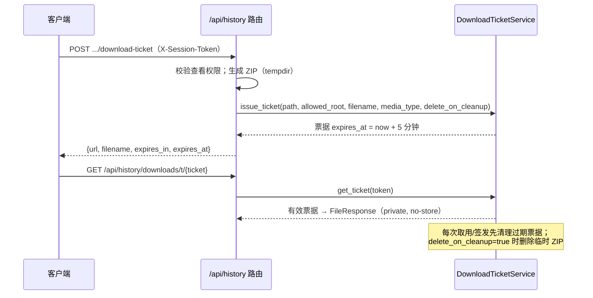

# 历史、文件与下载票据

当需要集成服务器端翻译历史、读取历史文件或把翻译结果交给用户下载时，这里说明对应的 HTTP API 契约与存储行为。历史由翻译管线在成功后自动写入并按用户隔离；文件不暴露磁盘路径，而是通过会话令牌加文件名定位；下载走短时票据，票据 URL 在默认 5 分钟内有效。

这里仅写开发者 HTTP API 与存储机理。Web 界面对应的用户操作见[进度、结果与历史](../../web/progress-results-and-history.md)，会话鉴权与通用错误见[鉴权与错误](./authentication-and-errors.md)，流式翻译端点见[流式协议](./streaming-protocol.md)，批量导出/导入流程见[批量导出导入流程](./batch-export-import-process.md)。

## 接口范围 {#feature-boundary}

- 历史只在 `save_translation_to_history()` 被调用的翻译路径写入：Web 前端“普通翻译”单文件与批量翻译会写，导出原文/导出译文/导入译文渲染/仅上色/仅超分/仅修复的非流式路径不写。
- `session_token` 在写入路径使用任务 ID（单文件为 `task_id`，批量为 `{task_id}_{i}`）；`HistoryManagementService.generate_session_token()`（UUID v4）存在但写入路径未使用。
- 历史按用户隔离：普通用户只能访问自己的会话，管理员可访问全部；查看/删除权限不足时对应接口返回 403。
- 文件访问必须同时满足“会话归属校验”与“文件名清洗 + `resolve_path_within` 根目录约束”，防止路径穿越。
- 下载票据是能力凭证：`GET /api/history/downloads/t/{ticket}` 不要求会话头，拿到 URL 的人就能在有效期内下载，因此票据短时有效且响应带 `Cache-Control: private, no-store`。
- 这里不覆盖 Web 用户操作、日志端点与翻译端点本身；那些分别属于 Web 页面、日志页与[流式协议](./streaming-protocol.md)。

## 历史存储与写入 {#history-storage-and-write}

### 目录与索引结构 {#storage-layout}

服务启动时（`main.py`）用 `HistoryManagementService(result_directory="manga_translator/server/data/results", translation_repo=TranslationRepository("manga_translator/server/data/translation_history.json"))` 初始化：

| 路径 | 内容 | 说明 |
| --- | --- | --- |
| `manga_translator/server/data/results/{session_token}/` | 会话结果目录 | 保存结果图片（文件名与输出格式有关）与 `metadata.json` |
| `…/results/{session_token}/metadata.json` | 会话元数据 | `user_id`、`session_token`、`timestamp`、`file_count`、`files`（文件名列表） |
| `manga_translator/server/data/history/_index.json` | `session_token → user_id` 索引 | 快速定位分片；未命中时回退扫描全部分片并补索引 |
| `manga_translator/server/data/history/{user_id}.json` | 按用户分片 | `{sessions: [...], last_updated}`；写入用临时文件加 `os.replace` 原子替换 |
| `manga_translator/server/data/translation_history.json` | 旧单文件格式 | 仓库初始化时自动迁移，原文件改名为 `.json.migrated` |

`TranslationResult` 序列化字段：`id`、`user_id`、`session_token`、`timestamp`、`file_count`、`total_size`、`result_path`、`metadata`、`status`（默认 `completed`）。

### 写入流程 {#write-flow}

`request_extraction.py#save_translation_to_history()` 把 `ctx.result` 按输出格式保存到临时目录（文件名来自原文件名加输出格式，或 `translated_{时间戳}{ext}`），再调用 `history_service.save_translation_result()`：

- 文件只接受 `tempfile.gettempdir()` 内的路径（`resolve_path_within`），复制到会话目录时只取文件名。
- `metadata` 由调用方传入，写入时合并 `user_id`、`session_token`、`timestamp`、`file_count`、`files`；Web 写入路径还会带 `workflow`、`task_id`，有文本区域时带 `text_regions`。
- 保存失败只写警告日志，不中断翻译主流程（尽力而为）。

## 历史查询与删除 {#history-query-and-delete}

所有历史端点都要求登录（请求头 `X-Session-Token`）；`view_permission` 为 `none` 时返回 403。权限级别来自 `get_view_history_permission()`，取权限模型的 `view_permission` 字段，默认 `own`，可选 `own` / `none` / `all`。

### 查询端点 {#query-endpoints}

| 方法 | 路径 | 参数 | 返回 |
| --- | --- | --- | --- |
| `GET` | `/api/history` | `start_date`、`end_date`、`status`（可选） | `{success, history: [...], count}`，按时间倒序 |
| `GET` | `/api/history/{session_token}` | 路径参数 | `{success, session: {...result, files: [文件名...]}}` |
| `GET` | `/api/history/admin/all` | `user_id`、`start_date`、`end_date`、`status`、`limit`（默认 20）、`offset`（默认 0） | `{success, records: [...], total, history: [...], count}`；需要 `require_admin` |

- 普通用户查询自动限定 `user_id = session.username`；管理员传 `user_id=None`，可见全部会话。
- `get_session_details` 的 `files` 是会话目录内除 `metadata.json` 外的文件名（排序后）。
- `/admin/all` 的 `records` 是前端映射格式：`id`（取 `session_token`）、`username`、`filename`（metadata 中第一个文件）、`translator`、`status`、`created_at`、`file_count`、`total_size`；同时保留旧格式 `history` 字段以兼容。

### 搜索端点 {#search-endpoint}

`GET /api/history/search?q=...`（另支持 `start_date`、`end_date`、`status`）按会话令牌、文件名、用户 ID 做不区分大小写的模糊匹配，返回 `{success, query, results, count, stats}`。

代码检查发现：`GET /{session_token}` 在 `GET /search` 之前注册，FastAPI 按注册顺序匹配路径，因此 `GET /api/history/search` 会先被 `/{session_token}` 捕获（`session_token="search"`）。最小 FastAPI 复现确认注册顺序决定匹配；真实服务中带有效会话时该请求会走会话查找并通常返回 404「会话不存在」，搜索逻辑实际不可达。当前静态前端没有调用该端点。该行为需在所用版本中确认。

### 删除端点 {#delete-endpoint}

`DELETE /api/history/{session_token}`：管理员始终可删；普通用户需要 `check_delete_own_files_permission()` 为真，否则 403。删除成功会 `shutil.rmtree` 会话目录，并从仓库删除分片记录与索引，返回 `{success: true, message}`；会话不存在返回 404。

## 文件访问 {#file-access}

`GET /api/history/{session_token}/file/{filename}` 返回单个历史文件（`FileResponse`），`media_type` 由 `mimetypes.guess_type` 推导，失败时回退 `application/octet-stream`。约束：

1. 先校验查看权限，再按 `_get_history_user_id()` 确定可见范围（管理员看全部）。
2. `_sanitize_history_filename()` 拒绝空值、含 `/` 或 `\`、为 `.` 或 `..` 的文件名（400）。
3. `_resolve_history_file_path()` 把 `result_path` 约束在 `result_directory` 内、把文件名约束在会话目录内（`resolve_path_within`）；目录不存在或越界返回 404，文件名非法返回 400，文件不存在返回 404。

## 下载票据 {#download-tickets}

### 票据生命周期 {#ticket-lifecycle}

`DownloadTicketService` 用内存字典保存票据，默认 TTL 5 分钟（`DEFAULT_TTL = timedelta(minutes=5)`），token 用 `secrets.token_urlsafe(32)` 生成：

- `issue_ticket()` 先做 `resolve_path_within(allowed_root, path)`，文件不存在或不是文件时抛 `FileNotFoundError`（路由转 404）。
- `get_ticket()` 会清理已过期票据，并检查底层文件仍存在；文件丢失时清除票据并返回 None（路由转 404）。
- 过期清理与 `revoke_ticket()` 只在票据 `delete_on_cleanup=true` 时删除临时文件：会话/批量 ZIP 票据为 `true`，单文件票据为 `false`（不删除结果目录里的源文件）。

### 票据端点 {#ticket-endpoints}

| 方法 | 路径 | 请求 | 说明 |
| --- | --- | --- | --- |
| `POST` | `/api/history/{session_token}/download-ticket` | `filename` 可选查询参数 | 打包整个会话为 ZIP（ZIP 内只含文件名），票据 `media_type=application/zip`、`delete_on_cleanup=true`；默认下载名 `history_{token前8位}.zip` |
| `POST` | `/api/history/{session_token}/file/{filename}/download-ticket` | — | 单个文件票据，`delete_on_cleanup=false` |
| `POST` | `/api/history/batch-download-ticket` | JSON `{session_tokens: [...], filename?: str}` | 最多 50 个会话，超过返回 400；ZIP 内按 `session_{序号}/文件名` 组织 |
| `GET` / `HEAD` | `/api/history/downloads/t/{ticket}` | — | 凭票据下载；无会话要求；无效或过期返回 404 |

票据响应统一为 `{url, filename, expires_in, expires_at}`：`url` 形如 `/api/history/downloads/t/{token}`，`expires_in` 为剩余秒数（最小 1）。

### 直接下载端点 {#direct-download-endpoints}

| 方法 | 路径 | 说明 |
| --- | --- | --- |
| `GET` | `/api/history/{session_token}/download` | 不申请票据，直接返回 ZIP；后台任务 `cleanup_temp_file()` 延迟 1 秒删除临时文件 |
| `POST` | `/api/history/batch-download` | 直接返回批量 ZIP，同样由后台任务清理 |

`_sanitize_download_filename()` 只取 basename、去掉 CR/LF、过滤 `.` / `..`、确保以 `.zip` 结尾。

## 依赖与限制 {#dependencies-and-limits}

- 批量下载（票据与直接下载）上限 50 个会话，超过返回 400。
- 票据是能力凭证：5 分钟 TTL 内任何人拿到 URL 都可下载；不要把票据 URL 或 `session_token` 写进日志、报告或公开文档。
- 自动清理服务（`cleanup_service.py`，默认关闭：`auto_cleanup=false`、`max_age_days=7`、`max_size_gb=10`）只按 mtime/总大小删除 `results/`、`user_fonts/`、`user_prompts/` 下的文件，不清理 `data/history/` 分片与索引；文件被清理后，对应会话记录仍可能出现在历史列表，取文件或下载会 404。
- 历史保存是尽力而为：`save_translation_to_history()` 失败只写警告，不影响翻译结果返回。
- 会话令牌取自任务 ID，不是 `generate_session_token()` 的 UUID v4；令牌可预测性与唯一性依赖任务 ID 生成方式，需在实际环境中确认。
- 普通用户只能访问自己的历史；`view_permission` 默认 `own`，管理员的 `/admin/all` 与删除不受“own”限制。
- 搜索端点被 `/{session_token}` 遮蔽（见[搜索端点](#search-endpoint)），静态前端未使用。
- 这里不展示真实历史记录、图片、会话令牌、用户名或私有路径，只写契约与脱敏结构。

## 开发指南 {#developer-guide}

### 选项中英对照 {#option-matrix}

#### 状态码与错误 {#status-codes-and-errors}

| 状态码 | 触发范围（本页端点） |
| --- | --- |
| `200` | 查询、搜索、删除成功，以及文件/ZIP 下载（`FileResponse`） |
| `400` | 文件名非法、批量下载超过 50 个会话 |
| `401` | `X-Session-Token` 缺失、无效或过期（`require_auth`） |
| `403` | `view_permission == "none"`，或删除权限不足 |
| `404` | 会话不存在或无访问权限、文件不存在、票据无效或已过期、会话目录缺失 |
| `500` | 历史服务未初始化或查询/删除/打包等未捕获异常 |

#### 界面文案对照 {#ui-copy}

用户端 `script.js` 通过 `t()` 读取 `/i18n/{locale}`（数据源是 `desktop_qt_ui/locales/*.json`），结果列表相关 key：

| UI 调用 key | English 实际值 | 简体中文实际值 |
| --- | --- | --- |
| `view` | View | 查看 |
| `download` | Download | 下载 |
| `delete` | Delete | 删除 |
| `packing_results` | Packing all results... | 正在打包所有结果... |
| `download_complete` | Download complete | 下载完成 |
| `download_failed` | Download failed | 下载失败 |

管理员权限编辑器使用 `web_can_view_history`（可查看历史）。历史相册与管理员历史模块的其余文案是 HTML/JS 硬编码中文，不使用 i18n key：

| 位置/元素 | English | 简体中文实际值 |
| --- | --- | --- |
| `#history-empty` | 无（硬编码中文） | 暂无翻译历史 |
| `#open-gallery-btn` / `#refresh-history-btn` 提示 | 无（硬编码中文） | 打开相册 / 刷新 |
| 相册弹窗标题 | 无（硬编码中文） | 📷 翻译历史相册 |
| 相册按钮 | 无（硬编码中文） | 查看 / 下载 / 删除 / 下载选中 / 下载全部 |
| 管理员历史模块 | 无（硬编码中文） | 用户 / 翻译次数 / 查看相册 / 删除全部 / 暂无历史记录 |

另外，locale 文件中存在一批 `web_*` key（如 `web_history_management`、`web_translation_history`、`web_session_token`、`web_file_count`、`web_total_size`、`web_download_all`、`web_batch_download`、`web_no_history`、`web_search_placeholder`、`web_download_started`、`web_download_failed`、`web_history_load_failed`），当前静态前端代码未引用，判定为遗留/备用 key；文档按 i18n 目录记录其值，不作为当前界面可见文案。

### 关联文件与格式 {#related-files}

| 文件/格式 | 本页实际作用 | 注意 |
| --- | --- | --- |
| `manga_translator/server/data/results/{session_token}/` | 会话结果目录（图片与 `metadata.json`） | 不展示真实图片或路径 |
| `manga_translator/server/data/history/_index.json`、`{user}.json` | 索引与按用户分片 | 不展示真实令牌/用户名 |
| `manga_translator/server/data/translation_history.json` | 旧单文件格式 | 启动迁移后改名为 `.migrated` |
| 临时 ZIP（`history_*.zip` / `batch_download_*.zip`） | 票据下载内容 | 票据到期或撤销时清理 |
| `metadata.json` | 会话元数据 | 含 `workflow`、`task_id`、`text_regions` 等由写入方传入的字段 |

### 代码位置 {#source-evidence}
| 层级 | 文件 | 本页核对内容 |
| --- | --- | --- |
| 路由 | `manga_translator/server/routes/history.py` | 12 个路由声明 / 13 个方法—路径映射；权限、文件名清洗、票据响应、搜索遮蔽 |
| 历史服务 | `manga_translator/server/core/history_service.py` | 会话目录、`metadata.json`、ZIP 打包、删除、临时文件清理 |
| 下载票据 | `manga_translator/server/core/download_ticket_service.py` | TTL、token、`resolve_path_within`、`delete_on_cleanup`、过期清理 |
| 仓库 | `manga_translator/server/repositories/translation_repository.py` | 分片 JSON、`_index.json`、原子写入、旧数据迁移 |
| 写入调用 | `manga_translator/server/request_extraction.py` | `save_translation_to_history`、`session_token = task_id` |
| 初始化 | `manga_translator/server/main.py` | `result_directory`、`TranslationRepository` 初始化 |
| 清理 | `manga_translator/server/core/cleanup_service.py` | `results/` 按 mtime/大小清理，不清理索引 |
| 权限 | `manga_translator/server/core/permission_integration.py`、`permission_service_v2.py` | `view_permission` 级别、删除权限 |
| 前端 | `manga_translator/server/static/js/history-gallery.js`、`static/js/admin/modules/history.js` | 票据申请与触发下载、硬编码文案 |
| i18n | `desktop_qt_ui/locales/en_US.json`、`zh_CN.json`、`doc/wiki/data/i18n.generated.json` | 三列实际值 |
