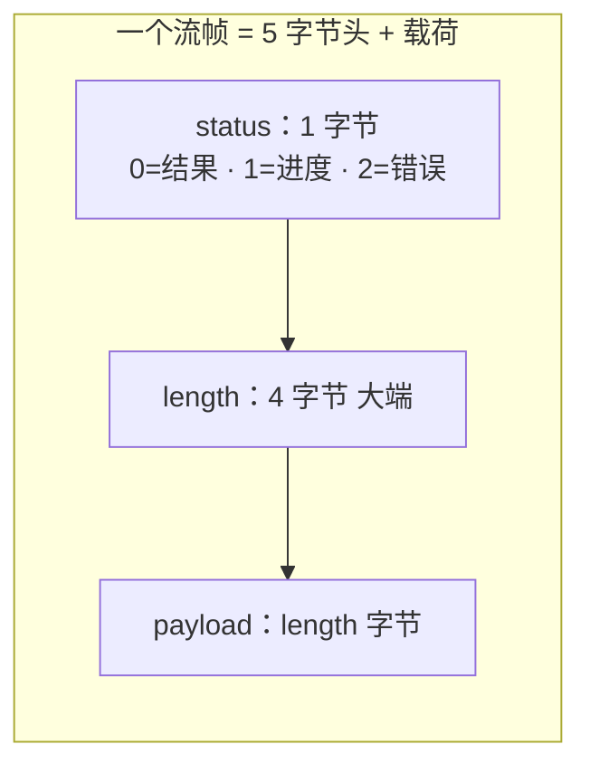
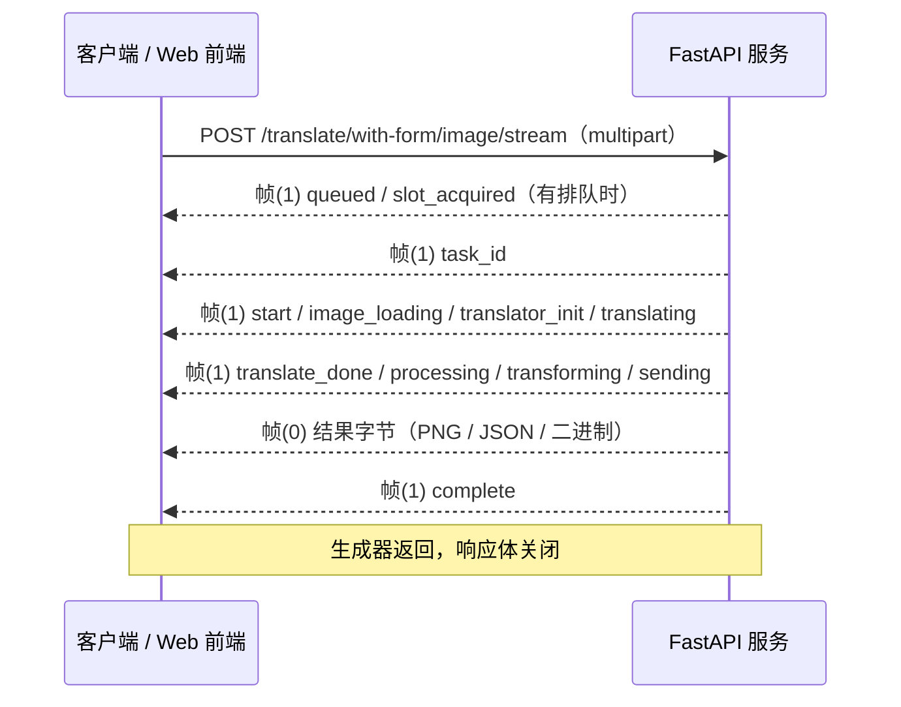
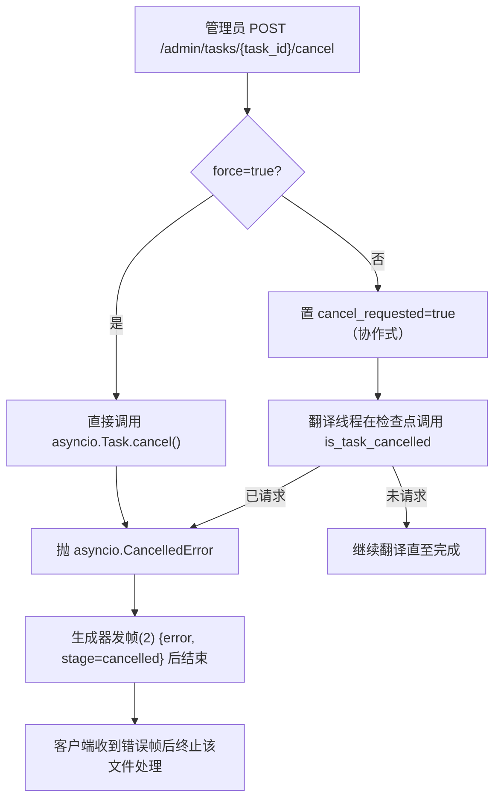

# HTTP 流式传输协议

翻译端点除了返回完整结果的普通响应外，还提供 `*_stream` 变体：服务端把“排队 → 处理 → 转换 → 发送”的过程拆成一系列二进制帧实时写给客户端，客户端可以一边显示进度、一边等待最终结果。这里主要说明这一层传输协议（帧格式、进度事件、结果载荷、取消与客户端解析）；请求/响应模型与鉴权见[翻译端点](./translation-endpoints.md)与[认证与错误](./authentication-and-errors.md)，Web 用户界面的操作见[上传、配置与翻译](../../web/upload-config-and-translate.md)。

## 接口范围 {#feature-boundary}

- 内容包括 `POST /translate/*/stream` 系列端点产生的二进制流，以及 Web 前端 `static/script.js` 中 `processStream()` 的解析方式。
- 批量翻译 `/translate/batch/images` 返回的是 ZIP 二进制流而不是逐帧协议，只在[批量与导出流程](./batch-export-import-process.md)中说明；这里仅在“分界”处提及其差异。
- 内部 shared/ws 执行器（`mode/share.py`、`streaming.py`、`sent_data_internal.py`、`myqueue.py`）虽然使用相同的“1 字节状态 + 4 字节长度”帧头，但属于内部协议，见[内部 shared 与 websocket](../internal-shared-and-websocket.md)，不属于开发者 HTTP API。
- 进度帧的 `message` 文案由服务端硬编码（中文），浏览器原样显示，不经前端 i18n 翻译；这是运行契约的一部分，不是文档缺译。
- 这里不写入任何真实密钥、令牌、用户图片或私有提示词；示例只使用脱敏字段名与端点路径。

## 流式端点 {#stream-endpoints}

以下端点都返回 `application/octet-stream` 的 `StreamingResponse`，内容为流帧序列（见[帧格式](#frame-format)）。`translate` 下的 JSON 变体接收 `TranslateRequest`（JSON body），`with-form` 变体接收 `multipart/form-data`（`image` + `config` JSON 字符串，部分还接收 `user_env_vars`）。

| 端点 | 请求体 | 结果帧（状态 0）载荷 | 工作流 |
| --- | --- | --- | --- |
| `POST /translate/json/stream` | JSON `TranslateRequest` | `TranslationResponse` JSON | `save_json` |
| `POST /translate/bytes/stream` | JSON `TranslateRequest` | `TranslationResponse.to_bytes()` 二进制 | `save_json` |
| `POST /translate/image/stream` | JSON `TranslateRequest` | PNG 字节 | `normal` |
| `POST /translate/with-form/json/stream` | multipart | `TranslationResponse` JSON | `save_json` |
| `POST /translate/with-form/bytes/stream` | multipart | `TranslationResponse.to_bytes()` 二进制 | `save_json` |
| `POST /translate/with-form/image/stream` | multipart + `user_env_vars` | PNG 字节（通用模式） | `normal` |
| `POST /translate/with-form/image/stream/web` | multipart + `user_env_vars` | PNG 字节（Web 优化标记） | `normal` |
| `POST /translate/export/original/stream` | multipart + `user_env_vars` | `TranslationResponse` JSON | `export_original` |
| `POST /translate/export/translated/stream` | multipart + `user_env_vars` | `TranslationResponse` JSON | `save_json` |
| `POST /translate/upscale/stream` | multipart + `user_env_vars` | PNG 字节 | `upscale_only` |
| `POST /translate/colorize/stream` | multipart + `user_env_vars` | PNG 字节 | `colorize_only` |
| `POST /translate/inpaint/stream` | multipart + `user_env_vars` | PNG 字节 | `inpaint_only` |
| `POST /translate/import/json/stream` | multipart（`image` + `json_file`） | PNG 字节 | `load_text` |
| `POST /translate/import/txt/stream` | multipart（`image` + `txt_file` + `json_file` + 可选 `template`） | PNG 字节 | `load_text` |

所有流式端点都先做会话与权限校验（`X-Session-Token`），并受并发槽位和每日配额约束；校验失败时在流开始前直接返回 `401`/`403`/`429` 等普通 HTTP 错误，而不是进度帧。

## 帧格式 {#frame-format}

每个帧由 5 字节头 + 载荷组成，多帧在同一个响应体里顺序排列：

- 第 1 字节：状态码（`0`=结果、`1`=进度、`2`=错误）。
- 第 2–5 字节：载荷长度，**大端（big-endian）32 位无符号整数**。
- 之后：`length` 字节的载荷。

服务端用 `pack_message(status, data)` 编码：`status.to_bytes(1, 'big') + len(data).to_bytes(4, 'big') + data`。响应 `media_type` 固定为 `application/octet-stream`。流在生成器返回时结束：正常路径发送完结果帧和 `complete` 进度帧后关闭；错误路径发送错误帧（状态 2）后立即关闭。

客户端不能假设每次 `read()` 恰好返回完整帧：帧可能跨多个网络块，一次读取也可能包含多帧，必须用待处理缓冲区分帧（见[客户端解析](#client-parsing)）。

## 状态字节与载荷 {#status-and-payload}

| 状态 | 含义 | 载荷 |
| --- | --- | --- |
| `0` | 结果数据 | 该端点对应的最终结果字节：PNG、`TranslationResponse` JSON 或 `TranslationResponse.to_bytes()` 二进制 |
| `1` | 进度事件 | UTF-8 JSON，字段见[进度事件](#progress-events) |
| `2` | 错误 | UTF-8 JSON，含 `error` 与 `stage` 字段，见[取消与异常结束](#cancellation) |

状态 `0` 的载荷不是 pickle。`pickle` 只出现在旧版内部执行器路径（`streaming.py` 的 `notify()` 对状态 `0` 做 `pickle.loads` 再转换），当前 HTTP 流端点直接发送转换后的结果字节。

## 进度事件 {#progress-events}

状态 `1` 的载荷是 UTF-8 JSON，常用字段：

- `stage`：事件阶段名。
- `message`：服务端硬编码的展示文案（中文），浏览器原样显示在“日志输出”。
- `task_id`：仅在 `stage = task_id` 帧出现，是该任务在任务监控与日志接口中的 ID。
- `queue_position`：仅在 `stage = queued` 帧出现，表示该任务在等待队列中的位置。

| stage | 触发时机 | message（服务端硬编码） |
| --- | --- | --- |
| `queued` | 有任务在等待并发槽位时 | `排队中... (前面还有 {n} 个任务)` |
| `slot_acquired` | 获得并发槽位 | `获得翻译槽位，开始处理...` |
| `task_id` | 任务开始，携带 `task_id` | 无 |
| `start` | 开始处理 | `开始处理...` |
| `image_loading` | 加载图片 | `加载图片中...` |
| `translator_init` | 初始化翻译器 | `初始化翻译器...` |
| `translating` | 执行翻译 | `翻译中...` |
| `translate_done` | 翻译完成 | `Processing result...` |
| `processing` | 检测到文本区域时 | `Found {n} text regions` |
| `transforming` | 转换结果 | `Converting...` |
| `sending` | 发送结果帧前 | `Sending...` |
| `complete` | 结果帧之后 | `Done!` |

`queued` 只在进入生成器时发现已有等待者才发送；单个任务无竞争时直接从 `task_id` 开始。`processing` 只在存在文本区域时发送；不同工作流（仅上色/仅超分/仅修复/导入渲染）的阶段子集不同，但帧协议一致。

## 结果帧 {#result-frames}

状态 `0` 的载荷取决于端点使用的转换函数：

- 图片端点（`image/stream`、`with-form/image/stream`、`with-form/image/stream/web`、`upscale/colorize/inpaint/stream`、`import/*/stream`）：`transform_to_image(ctx)`，即 `ctx.result` 的 PNG 编码字节。
- JSON 端点（`json/stream`、`export/*/stream`）：`transform_to_json(ctx)`，即 `to_translation(ctx).model_dump_json().encode("utf-8")`，为 `TranslationResponse` 的 JSON 文本。
- 字节端点（`bytes/stream`）：`transform_to_bytes(ctx)`，即 `TranslationResponse.to_bytes()` 的紧凑二进制（区域数量 `int` + 每区域坐标/角度/概率/颜色/文本映射等 `struct` 字段），不是 JSON。

`TranslationResponse` JSON 顶层字段：`regions`（每个文本区域的排版与翻译字段）、`original_width`、`original_height`，以及可选 `upscale_ratio`、`upscaler`、`colorizer`、`mask_raw`（base64 PNG，保存的是优化后的蒙版）和 `mask_is_refined`。

注意：`/with-form/image/stream/web` 的端点注释声称启用“占位符优化”以加快响应，但当前源码中 `_web_frontend_optimized` 只被写入配置、没有任何消费者读取，`use_placeholder` 也只在旧版 `mode/share.py` 中出现；该端点在当前 Web 路径下应返回完整 PNG。此项需在实际环境中确认。

## 取消与异常结束 {#cancellation}

取消只能由管理员触发，入口是管理面板“任务监控”的取消按钮或 `POST /admin/tasks/{task_id}/cancel?force=false|true`（`require_admin`）：

- 协作式（`force=false`，默认）：把 `active_tasks[task_id].cancel_requested` 置位；翻译线程在检查点（图片加载前后、翻译前后）调用 `is_task_cancelled(task_id)`，命中时抛出 `asyncio.CancelledError`，生成器的 `except asyncio.CancelledError` 分支发送错误帧 `{"error": "Task cancelled by admin", "stage": "cancelled"}` 后结束。
- 强制（`force=true`）：除置位外直接调用已注册 `asyncio.Task.cancel()`，同样以 `CancelledError` 进入上述错误分支。
- 批量端点 `/translate/batch/json` 与 `/translate/batch/images` 不使用帧协议；取消或检测到“已被取消”时返回 HTTP `499`，`detail` 为 `任务已被强制取消` 或 `任务已被取消`。
- 翻译过程异常、无结果、转换异常分别发送 `stage` 为 `translate`、`no_result`、`transform` 的错误帧；未预期异常发送 `stage = unknown`。

错误帧（状态 2）的 JSON 总是包含 `error` 与 `stage`；浏览器解析到错误帧后写入日志并 `throw`，当前文件处理中断，不再期待后续帧。

## 客户端解析 {#client-parsing}

Web 前端 `static/script.js` 的 `processStream()` 是参考实现：

1. 以 `X-Session-Token` 请求头 POST multipart（`image`、`config`、可选 `user_env_vars`）。
2. 用 `res.body.getReader()` 逐块读取；把剩余字节并入 `pendingBuffer`。
3. 只要缓冲区长于 5 字节就尝试解帧：`status = buffer[0]`，`len = (buffer[1]<<24)|(buffer[2]<<16)|(buffer[3]<<8)|buffer[4]`；缓冲区不足 `5 + len` 时保留为待处理缓冲，等下一块。
4. 状态 `0`：把载荷追加到 `resultChunks`；状态 `1`：解析 JSON，`stage = task_id` 时记录 `currentTaskId` 并打印任务 ID 前 8 位，有 `message` 时写入日志；状态 `2`：解析 JSON，日志输出 `错误: {error}` 并抛出。
5. 流结束（`done`）后若 `resultChunks` 非空，合成 `image/png` Blob 加入“翻译结果”列表；否则日志提示未收到结果数据。
6. `finally` 中若记录了 `currentTaskId`，再请求 `/api/logs?limit=500&task_id={task_id}` 拉取该任务完整日志（`401` 时走登录失效处理）。

前端对帧边界不做假设：一次 `read()` 可能包含 0、1 或多个完整帧，也可能只有半个帧头；必须以缓冲区分帧。普通多文件翻译走 `/translate/batch/images` 的 ZIP 响应，不经过 `processStream`。

## 与 Web 用户操作的分界 {#web-ui-boundary}

- 单文件普通翻译、仅上色/超分/修复、导入渲染等模式由 Web 前端逐文件调用 `with-form` 流端点；多文件普通翻译调用 `/translate/batch/images`（ZIP）。完整操作步骤见[上传、配置与翻译](../../web/upload-config-and-translate.md)。
- 进度与错误帧被渲染到左侧“日志输出”区域，任务完成后还会拉取该任务日志；结果预览、下载与历史见[进度、结果与历史](../../web/progress-results-and-history.md)。
- 管理员的取消操作界面见[管理界面](../../web/administrator-interface.md)。
- 这里不描述 Web 用户操作，只描述浏览器实际调用的流协议；不要把端点路径写成用户界面步骤。

## 开发指南 {#developer-guide}

### 选项中英对照 {#option-matrix}

#### UI 文案对照 {#ui-texts}

下表是流式流程涉及的共享 locale 文案（`/i18n/{locale}` 返回 `desktop_qt_ui/locales` 的 JSON）。Web 页面 `index.html` 对部分控件使用自己的硬编码中文（如“翻译工作流模式”、“开始任务”、“普通翻译”），与下表 locale 值并不完全一致；`script.js` 的日志 fallback 也是硬编码双语。

| UI 调用 key | English 实际值 | 简体中文实际值 |
| --- | --- | --- |
| `Translation Workflow Mode:` | Translation Workflow Mode: | 翻译流程模式： |
| `Normal Translation` | Normal Translation | 正常翻译流程 |
| `Export Translation` | Export Translation | 导出翻译 |
| `Export Original Text` | Export Original Text | 导出原文 |
| `Import Translation and Render` | Import Translation and Render | 导入翻译并渲染 |
| `Colorize Only` | Colorize Only | 仅上色 |
| `Upscale Only` | Upscale Only | 仅超分 |
| `Inpaint Only` | Inpaint Only | 仅修复 |
| `Start Translation` | Start Translation | 开始翻译 |

进度帧的 `message` 字段由服务端 `request_extraction.py` 硬编码（`开始处理...`、`翻译中...` 等），浏览器直接显示，不经过上表 locale。

### 代码位置 {#source-evidence}
| 层级 | 文件 | 本页核对内容 |
| --- | --- | --- |
| 流帧编码 | `manga_translator/server/request_extraction.py` | `while_streaming()`、`pack_message()`、进度/错误帧与 stage 列表 |
| 流端点 | `manga_translator/server/routes/translation.py` | 14 个流端点、multipart/JSON 请求、`transform_to_*` 与工作流 |
| 结果载荷 | `manga_translator/server/server_utils.py`、`to_json.py` | PNG / JSON / 二进制转换与 `TranslationResponse` 字段 |
| 取消 | `manga_translator/server/core/task_manager.py`、`routes/admin.py` | `is_task_cancelled`、`cancel_task`、`/admin/tasks/{task_id}/cancel` |
| 批量非帧流 | `manga_translator/server/routes/translation.py` | `/batch/images` ZIP、`X-Content-Type: application/zip`、`499` |
| 客户端解析 | `manga_translator/server/static/script.js` | `processStream()` 分帧、错误中断、`task_id` 日志拉取 |
| 前端 i18n | `manga_translator/server/static/js/i18n.js`、`routes/config.py` | `/i18n/{locale}` 与共享 locale JSON |
| 旧版内部流 | `manga_translator/server/streaming.py`、`sent_data_internal.py`、`myqueue.py`、`mode/share.py` | pickle/状态码差异与内部执行器路径 |