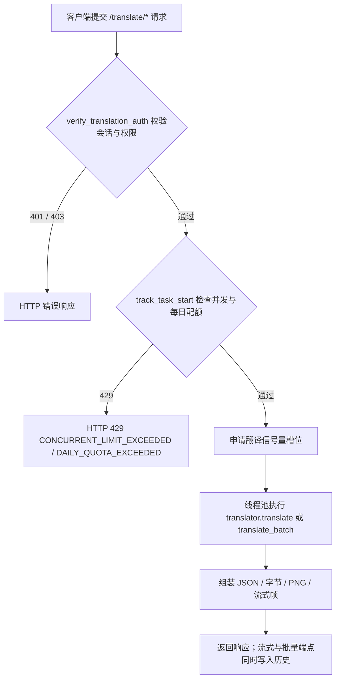

# HTTP 翻译端点

当脚本、扩展或第三方应用需要把漫画图片提交给 Manga Translator 服务端翻译时使用本页。它记录 `/translate` 前缀下提交翻译任务的端点、请求与响应格式，以及任务在排队与执行过程中的状态。这里不重复流式帧协议的完整规范（见[流式协议](./streaming-protocol.md)）、会话与权限错误约定（见[认证与错误](./authentication-and-errors.md)），也不描述导出原文/译文、导入渲染、仅上色/超分/修复等辅助端点（见[批量、导出与导入流程](./batch-export-import-process.md)）。Web 用户界面的操作入口见[上传、配置与翻译](../../web/upload-config-and-translate.md)。

## 接口范围 {#feature-boundary}

- 内容包括“提交翻译任务并取回结果”的端点：`POST /translate/json`、`/bytes`、`/image` 及其 `/stream` 变体，`/with-form/*` 表单变体，`/batch/json`、`/batch/images` 和 `POST /translate/queue-size`。
- `manga_translator/server/routes/translation.py` 一共注册 31 个 `/translate` 路由声明；其中导出（`/export/*`）、导入（`/import/*`）、处理（`/upscale`、`/colorize`、`/inpaint`）和 `/complete` 属于其他页面。
- 除 `queue-size` 外，所有翻译端点都在路由内调用 `verify_translation_auth()`：缺少或无效的 `X-Session-Token` 返回 `401`，无翻译器/OCR/上色/渲染权限返回 `403`，用户或用户组禁用的参数会被管理员默认值覆盖后再执行。
- 单张与批量请求共用同一个全局翻译器实例与线程池，模型在请求之间复用；服务端翻译请求统一强制 `cli.use_gpu=False`，并禁用替换翻译、模板对齐等桌面专有模式。

## 端点清单 {#endpoint-inventory}

### 单张翻译端点 {#single-endpoints}

| 方法与路径 | 请求 | 响应 | 工作流 |
| --- | --- | --- | --- |
| `POST /translate/json` | JSON：`TranslateRequest` | JSON `TranslationResponse` | `save_json` |
| `POST /translate/bytes` | JSON：`TranslateRequest` | 自定义字节流（见[自定义字节格式](#custom-bytes-format)） | `save_json` |
| `POST /translate/image` | JSON：`TranslateRequest` | PNG `StreamingResponse` | `normal` |
| `POST /translate/with-form/json` | `multipart/form-data`：`image` 文件 + `config` JSON 字符串 | JSON `TranslationResponse` | `save_json` |
| `POST /translate/with-form/bytes` | 同上 | 自定义字节流 | `save_json` |
| `POST /translate/with-form/image` | 同上 | PNG `StreamingResponse` | `normal` |

JSON 变体把整张图片编码为带 `data:image/...;base64,` 前缀的 data URI 放进 `image` 字段；表单变体以文件上传。两种入口都接收同一个 `config`：JSON 变体里是 Pydantic `Config` 对象，表单变体里是 JSON 字符串，由 `parse_config()` 校验。

### 流式翻译端点 {#streaming-endpoints}

| 方法与路径 | 请求 | 响应 |
| --- | --- | --- |
| `POST /translate/json/stream` | JSON：`TranslateRequest` | 流式帧，结果载荷为 JSON |
| `POST /translate/bytes/stream` | JSON：`TranslateRequest` | 流式帧，结果载荷为自定义字节 |
| `POST /translate/image/stream` | JSON：`TranslateRequest` | 流式帧，结果载荷为 PNG |
| `POST /translate/with-form/json/stream` | 表单：`image` + `config` | 流式帧，结果载荷为 JSON |
| `POST /translate/with-form/bytes/stream` | 表单：`image` + `config` | 流式帧，结果载荷为自定义字节 |
| `POST /translate/with-form/image/stream` | 表单：`image` + `config` + `user_env_vars` | 流式帧，结果载荷为 PNG（通用模式，适合 API 调用与脚本） |
| `POST /translate/with-form/image/stream/web` | 表单：`image` + `config` + `user_env_vars` | 流式帧，结果载荷为 PNG（Web 前端优化模式） |

流式端点通过 `while_streaming()` 注册活动任务、发送排队与阶段进度、执行翻译，最后用 `transform_to_json` / `transform_to_bytes` / `transform_to_image` 生成结果帧。`/image/stream/web` 把配置标记 `_web_frontend_optimized` 设为 `true`；`transform_to_image()` 在 `ctx.use_placeholder` 为真时返回 1×1 占位 PNG 以加快响应，最终图片仍写入历史。

### 批量与队列端点 {#batch-and-queue-endpoints}

| 方法与路径 | 请求 | 响应 |
| --- | --- | --- |
| `POST /translate/batch/json` | JSON：`BatchTranslateRequest` | `list[TranslationResponse]` |
| `POST /translate/batch/images` | JSON：`BatchTranslateRequest` | ZIP 字节流，响应头 `X-Content-Type: application/zip` |
| `POST /translate/queue-size` | 无请求体 | JSON 整数 |

`POST /translate/batch/images` 在没有图片时返回 `400`；每个结果按 `config.cli.format` 或原始文件名决定输出格式与扩展名。`POST /translate/queue-size` 返回模块级 `task_queue.queue` 的长度；当前活跃的翻译路径用翻译信号量（`task_manager.translation_semaphore`）控制并发，该端点是遗留队列结构的只读快照，不代表信号量等待人数。

## 在 Web 界面中提交任务 {#web-ui-submission}

Web 前端（`static/index.html` + `static/script.js`）是这些端点的主要消费者。页面顶部的工作流下拉框决定请求走哪个端点；多张图片的“普通翻译”走 `/translate/batch/images`（图片转 data URI，JSON 请求体），单张或特殊工作流走对应的 `/translate/*` 表单端点。

## 请求与响应契约 {#request-response-contract}

### 单张请求 `TranslateRequest` {#translate-request}

| 字段 | 类型 | 说明 |
| --- | --- | --- |
| `image` | `bytes` 或 `str` | 表单上传的图片字节，或带 `data:image/...;base64,` 前缀的 data URI |
| `config` | `Config` | 完整翻译配置（Pydantic），缺省为 `Config()` |

`to_pil_image()` 只接受这两类输入；其他输入（如裸 base64 或文件路径字符串）返回 `422` 及 “Invalid image data” 或 data URI 提示。

### 批量请求 `BatchTranslateRequest` {#batch-request}

| 字段 | 类型 | 默认 | 说明 |
| --- | --- | --- | --- |
| `images` | `list[bytes \| str]` | 必填 | 每张图片为字节或 data URI |
| `config` | `dict` 或 `Config` | `{}` | 配置；为 `dict` 时用 `parse_config()` 转换 |
| `batch_size` | `int` | `4` | 每批处理的图片数 |
| `filenames` | `list[str]` | `[]` | 原始文件名，用于输出命名与历史记录 |

### 响应 `TranslationResponse` {#translation-response}

| 字段 | 类型 | 说明 |
| --- | --- | --- |
| `regions` | `list[Translation]` | 按阅读顺序排列的文本区域 |
| `original_width` / `original_height` | `int` | 输入图片尺寸 |
| `upscale_ratio` / `upscaler` | 可选 | 开启超分时才出现 |
| `colorizer` | 可选 | 使用非 `none` 上色器时才出现 |
| `mask_raw` | 可选 | 精炼蒙版的 PNG base64（保存优化后的 `ctx.mask`） |
| `mask_is_refined` | `bool` | 保存蒙版时恒为 `true` |

每个 `Translation` 区域包含 `text`、`translation`、`translation_raw`、`translation_rich`、`angle`、`font_size`、`fg_colors`、`bg_colors`、`direction`、`alignment`、`target_lang`、`source_lang`、`line_spacing`、`letter_spacing`、`stroke_width`、`font_family`、`prob` 等字段。不要在文档或共享日志中粘贴响应里的 `mask_raw` 等用户图片数据。

### 自定义字节格式 {#custom-bytes-format}

`TranslationResponse.to_bytes()` 的结构：`int32` 区域数量 + 每个区域依次为 `minX/minY/maxX/maxY`（4 个 `int32`）、`is_bulleted_list`（1 字节）、`angle`（`float32`）、`prob`（`float32`）、前景色（3 字节 RGB）、背景色（3 字节 RGB）、文本映射（`int32` 条目数；每条为 `uint32` 键长度 + UTF-8 键 + `uint32` 值长度 + UTF-8 值）。解码示例见 `examples/response.*`。

### 流式帧格式 {#stream-frame-format}

每个流式帧为“1 字节状态 + 4 字节大端长度 + 载荷”：状态 `0` 为结果字节，`1` 为进度 JSON，`2` 为错误 JSON。进度 JSON 的 `stage` 覆盖 `queued`、`slot_acquired`、`task_id`、`start`、`image_loading`、`translator_init`、`translating`、`translate_done`、`processing`、`transforming`。完整协议与客户端解析见[流式协议](./streaming-protocol.md)。

## 任务状态、队列与并发 {#task-status-queue-and-concurrency}

- 并发槽位来自 `task_manager.translation_semaphore`，默认 `max_concurrent_tasks=3`（从 `server_config` 读取）；`while_streaming()` 等待槽位时先发送 `stage: queued`（含 `queue_position`），拿到槽位后发送 `stage: slot_acquired`。
- 活动任务注册在 `task_manager.active_tasks`，初始状态 `queued`，拿到槽位后更新为 `running`；管理员取消任务后，流式任务收到 `CancelledError` 并发送状态 `2` 的错误帧。
- 批量端点把 `task_id` 传给 `get_batch_ctx()`，每张图片转换与翻译前都检查 `is_task_cancelled()`；取消或检测到取消时返回 `499`。
- 拥有离线翻译权限（`allow_offline_translation`）的用户在 `/batch/images` 中会使用永不断开的请求包装器，客户端断线后任务仍继续执行并写入历史。

## 接口约束 {#dependencies-and-conflicts}

- 会话与权限：所有翻译端点依赖 `X-Session-Token`；账号停用、令牌过期或活动刷新失败都会返回 `401`。权限过滤先覆盖禁用参数，再检查翻译器/OCR/上色/渲染权限。
- 配置来源：请求中的 `config` 是完整配置快照；服务端启动用 `config/config.json`（不存在时复制 `config-example.json`）。用户提交的值会被用户组/用户白名单黑名单覆盖，不能当作最终生效值。
- `user_env_vars`：表单端点可携带大写环境变量键值，与用户预设合并后经 API Key 策略校验；键与当前翻译器不匹配时返回 `403`。文档与日志不得展示真实 Key。
- 与相邻页面：流式帧解码与任务取消时序见[流式协议](./streaming-protocol.md)；导出/导入/上色/超分/修复端点见[批量、导出与导入流程](./batch-export-import-process.md)；会话、权限与全局错误格式见[认证与错误](./authentication-and-errors.md)。
- 并发与历史：翻译同时受信号量与用户并发/每日配额限制；流式与批量成功后写入历史，历史读取与下载见[历史、文件与下载票据](./history-files-and-download-tickets.md)。

## 开发指南 {#developer-guide}

### 选项中英对照 {#option-matrix}

#### 工作流选项与端点映射

| UI 调用 key | English 实际值 | 简体中文实际值 |
| --- | --- | --- |
| `Translation Workflow Mode:` | Translation Workflow Mode: | 翻译流程模式： |
| `Normal Translation` | Normal Translation | 正常翻译流程 |
| `Export Translation` | Export Translation | 导出翻译 |
| `Export Original Text` | Export Original Text | 导出原文 |
| `Import Translation and Render` | Import Translation and Render | 导入翻译并渲染 |
| `Colorize Only` | Colorize Only | 仅上色 |
| `Upscale Only` | Upscale Only | 仅超分 |
| `Inpaint Only` | Inpaint Only | 仅修复 |
| `Start Translation` | Start Translation | 开始翻译 |
| `Log output...` | Log output... | 日志输出... |

工作流存储值到端点的映射：`normal` → `/translate/with-form/image/stream`；`export_trans` → `/translate/export/translated`；`export_raw` → `/translate/export/original`；`import_trans` → `/translate/import/json`；`colorize` → `/translate/colorize`；`upscale` → `/translate/upscale`；`inpaint` → `/translate/inpaint`。前端在 `localStorage.session_token` 存在时把令牌放进 `X-Session-Token` 请求头，批量请求另设 30 分钟 `AbortController` 超时。

#### 错误、取消与状态码 {#errors-cancellation-and-status-codes}

| 状态码 | 触发条件（当前代码） | 来源 |
| --- | --- | --- |
| `200` | 成功：JSON、图片、流、字节或 `queue-size` 整数 | FastAPI 默认 |
| `400` | `/batch/images` 未提供图片；导入/导出校验失败 | `translation.py:449` |
| `401` | `X-Session-Token` 缺失（`NO_TOKEN`）或无效/过期（`INVALID_TOKEN`） | `translation_auth.py:253` |
| `403` | 翻译器/OCR/上色/渲染权限不足；用户 API Key 与翻译器不匹配 | `translation_auth.py:345`；`core/response_utils.py` |
| `422` | 请求体校验失败或图片数据非法；全局 handler 返回 `detail` 与请求体 | `main.py:255` |
| `429` | 超过用户并发任务数（`CONCURRENT_LIMIT_EXCEEDED`）或每日配额（`DAILY_QUOTA_EXCEEDED`） | `core/middleware.py:326`、`:365` |
| `499` | 批量任务被强制取消或检测为取消 | `translation.py:421`、`:518` |
| `500` | 无结果图片、翻译异常或服务未初始化 | `translation.py:527`；`request_extraction.py` |

流式端点不会在翻译中途失败时抛出 HTTP 错误，而是发送状态 `2` 的错误帧，载荷为 `{"error": ..., "stage": ...}`；只有认证、权限、并发、配额和请求校验阶段才返回 HTTP 状态码。

### 关联文件与格式 {#related-files-and-formats}

| 文件/格式 | 本页实际作用 | 注意事项 |
| --- | --- | --- |
| `manga_translator/server/routes/translation.py` | 31 个 `/translate` 路由声明与参数绑定 | 端点清单、工作流与错误码以本文件为准 |
| `manga_translator/server/request_extraction.py` | `TranslateRequest`、`BatchTranslateRequest`、`get_ctx`、`while_streaming`、`get_batch_ctx` | 图片解码、槽位、任务注册与历史保存 |
| `manga_translator/server/to_json.py` | `TranslationResponse`、`Translation` 与自定义字节格式 | 响应字段与 `to_bytes()` 布局 |
| `manga_translator/server/core/response_utils.py` | `transform_to_json/bytes/image`、`apply_user_env_vars` | 占位图、字节/JSON 转换与 API Key 策略 |
| `manga_translator/server/routes/translation_auth.py` | `verify_translation_auth`、任务计数与配额 | 401/403/429 与禁用参数过滤 |
| `manga_translator/server/core/task_manager.py` | 信号量、线程池、活动任务与取消 | 并发默认值与任务状态 |
| `manga_translator/server/myqueue.py` | 遗留 `TaskQueue`，`queue-size` 的数据源 | 只读快照，不代表信号量等待数 |
| `manga_translator/server/runtime_api.py` | 运行时 API 覆盖（Sakura/OCR/上色/渲染） | 环境变量优先级，不写真实密钥 |
| `manga_translator/server/static/index.html`、`static/script.js` | Web 前端提交入口与流解析 | UI 文案 key 与请求头 |

### 代码位置 {#source-evidence}
| 层级 | 文件 | 本页核对内容 |
| --- | --- | --- |
| 路由 | `manga_translator/server/routes/translation.py` | 端点路径、方法、请求/响应模型、工作流与状态码 |
| 请求/响应 | `manga_translator/server/request_extraction.py`、`to_json.py`、`core/response_utils.py` | `TranslateRequest`/`BatchTranslateRequest`/`TranslationResponse`、字节与流式帧格式 |
| 鉴权与限制 | `manga_translator/server/routes/translation_auth.py`、`core/middleware.py` | 401/403/429、禁用参数过滤、并发与配额 |
| 队列与任务 | `manga_translator/server/core/task_manager.py`、`myqueue.py` | 信号量、线程池、活动任务、取消与 `queue-size` |
| 运行覆盖 | `manga_translator/server/runtime_api.py` | API Key/Base/Model 环境变量优先级 |
| Web UI | `manga_translator/server/static/index.html`、`static/script.js`、`desktop_qt_ui/locales/en_US.json`、`zh_CN.json` | 工作流下拉、提交端点与 UI 三列文案 |
