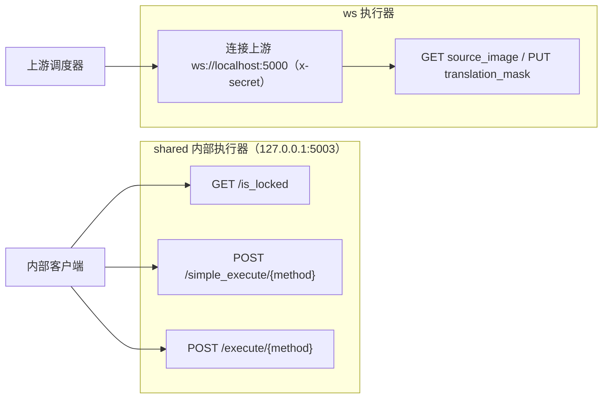
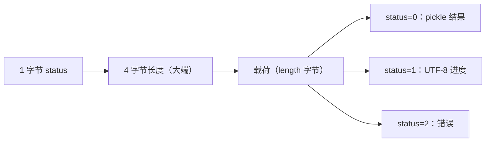
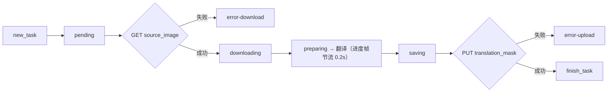

# 内部 shared 与 WebSocket 协议

当你要调试内部执行器、排查 `shared`/`ws` 模式的连接或序列化问题，或者评估把内部协议暴露到网络的后果时，这里说明两条内部链路的线上契约：`shared` 的 HTTP + pickle 帧协议，以及 `ws` 的 WebSocket + protobuf 任务协议。这里不重复三个服务模式的启动方式和模式级差异（见[Web、WS 与 Shared 模式](../cli/web-ws-and-shared-modes.md)），也不重复 web 模式的端口与部署（见[Web 服务器端口与部署](./web-server-ports-and-deployment.md)）；对外 HTTP API 的鉴权与错误见[HTTP API 鉴权与错误](./http-api/authentication-and-errors.md)。

## 涉及的代码 {#feature-boundary}

- `shared` 是内部 HTTP 执行器：`MangaShare` 把 `MangaTranslator` 包装成 FastAPI 服务，默认监听 `127.0.0.1:5003`，只暴露三个受控端点，结果用 pickle 字节返回。它不是给浏览器访问的对外服务。
- `ws` 是内部 WebSocket 执行器客户端：`MangaTranslatorWS` 继承翻译器，主动连接上游 `ws://localhost:5000`，用 `x-secret` 头认证，收发 protobuf `WebSocketMessage` 帧。解析器为它声明的本地 `--host 127.0.0.1 --port 5003 --nonce` 不被当前实现消费。
- 两条链路都是内部协议：shared 默认只绑定回环地址，ws 默认只连接本地上游；nonce/secret 是仅有的鉴权手段，且以明文 HTTP/WebSocket 头传输；pickle 反序列化与 protobuf 解析都面对不可信输入风险。
- 端口边界：web 对外 `0.0.0.0:8000`，shared 监听 `127.0.0.1:5003`，ws 连接上游 `ws://localhost:5000`；`5000`、`5003`、`8000` 三者不能混写。

## 端口与端点契约 {#ports-and-endpoints}

## shared 内部协议 {#shared-protocol}

`MangaShare` 是内部执行器：接收 JSON 请求、以线程锁串行执行翻译、用 pickle 返回结果或流式帧。所有执行端点按固定顺序做四道检查：nonce 校验（设置 nonce 后 `X-Nonce` 必须匹配，否则 `401`）、方法白名单（只允许 `translate` 和 `translate_batch`，否则 `403`）、方法存在性（不存在 `404`）、非阻塞锁（忙时 `429`）。

### 请求编码 {#shared-request-encoding}

- 单图：`{"image": "<PNG base64>", "config": {...}}`；批量：`{"images": ["<PNG base64>", ...], "config": {...}, "batch_size": n}`。
- `config` 由 `Config.model_dump(mode="json")` 生成；图片由服务端 `_decode_image` 校验，非法图片、非法配置、非法批量请求分别返回 `422`（`Invalid image data` / `Invalid translation config` / `Invalid batch request`）。
- 客户端编码在 `sent_data_internal.py` 的 `_encode_image` / `_encode_config` / `_encode_attributes`。

### 流式帧格式 {#shared-frame-format}

每个流帧是 `状态(1 字节) + 长度(4 字节大端) + 载荷`，客户端 `extract_header` / `handle_buffer` 按 5 字节头切帧：

结果对象带 `use_placeholder` 时，服务端只回传 1×1 白色占位图的最小 `Context`，避免传输大图。

### nonce 与访问控制 {#shared-nonce}

- nonce 来源：`shared --nonce`（`args.py`），或 web 模式的 `MT_WEB_NONCE` 环境变量与启动时 `secrets.token_hex(16)` 生成（`server/main.py`、`server_utils.generate_nonce()`）。
- `MangaShare.check_nonce()` 只比较请求头 `X-Nonce` 与自身 `self.nonce`；`--nonce` 未设置时服务完全不校验。
- nonce 是共享密钥，在启动日志中打印（`Nonce: ...`），并经明文 HTTP 头传输；泄露后等于没有鉴权。不得把日志中的 nonce 复制进公开报告。
- `/is_locked` 不校验 nonce，其余两个执行端点都校验。

### pickle 序列化风险 {#pickle-risk}

- 结果序列化用 `pickle.dumps`，客户端用 `pickle.loads` 反序列化（`sent_data_internal.py#fetch_data`、`mode/share.py#run_method`）。
- pickle 不是安全格式：反序列化不可信数据可以执行任意代码（RCE）。只有两端都可信、数据未被篡改时才可用。
- 后果：shared 只能作为内部执行器使用，不能暴露公网，也不应接受不可信调用方发送的请求。

## WebSocket 内部协议 {#websocket-protocol}

`MangaTranslatorWS` 以客户端身份工作：不监听端口，而是连接 `--ws-url` 上游，接收 `new_task`，翻译后把结果上传回上游给定的 `translation_mask` URL。

### 连接与鉴权 {#ws-connection-and-auth}

- 连接：`websockets.connect(url, extra_headers={'x-secret': secret}, max_size=1_000_000)`；消息上限 1 MB。
- secret 来源：`ws_secret` 参数或 `WS_SECRET` 环境变量（`mode/ws.py`），默认空串；CLI `ws` 子命令没有 `--ws-secret` 选项。
- `x-secret` 是明文 WebSocket 头；secret 为空时上游若放行则等同无鉴权。
- Windows 上先调用 `WSAStartup` 并设置 `ProactorEventLoopPolicy`，连接循环运行在独立线程的 `_server_loop` 中。

### 任务生命周期 {#ws-task-lifecycle}

收到 `new_task` 后：发送 `pending` → 发送 `downloading` → HTTP GET `source_image`（失败发 `error-download`）→ 打开图片（长宽超过 1200 像素时强制 `upscale_ratio=1`）→ 发送 `preparing` → 在主循环执行翻译（进度 hook 经 0.2 秒节流器合并发送，状态为翻译器流水线阶段名）→ 结果非空时发送 `saving`，缩回原尺寸并转 PNG（verbose 另存 `ws_final.png`）→ 发送 `uploading` → HTTP PUT `translation_mask`（失败发 `error-upload`）→ 最终发送 `finish_task`。

- 所有任务经 `PriorityLock` 串行调度（`task_lock((1 << 31) - ws_count)`）；`_run_text_translation` 需要把翻译协程搬回 `ctx.ws_event_loop` 时，会先释放锁再按 `(1 << 30) - ws_count` 重新获取。
- `_run_text_rendering` 计算渲染蒙版（输入蒙版 ∪ 输出变化像素），verbose 时写出 `ws_render_in.png`、`ws_render_out.png`、`ws_mask.png`、`ws_inmask.png`、`ws_output.png`；最终输出按蒙版裁剪为 RGBA。
- `translation_params`（即 CLI 参数）只填充 params 中为 `None` 的默认值。

### protobuf 风险与缺失模块 {#protobuf-risk}

- 客户端直接 `ParseFromString(raw)` 解析上游消息；`max_size=1_000_000` 是唯一的大小限制，字段合法性由生成代码决定。
- 当前仓库未跟踪 `manga_translator/server/ws_pb2.py` 或对应 `.proto` 文件；`listen()` 中 `from ..server import ws_pb2` 会 `ImportError`，因此 `ws` 模式当前无法启动。这是源码差异，不是已验证的运行行为。
- 恢复该模式需要重新生成 `ws_pb2.py` 并验证消息字段与上游调度器一致；在恢复前不要把 `ws` 当作可运行服务。

## 约束与注意事项 {#dependencies-and-conflicts}

- 端口边界：web `0.0.0.0:8000`、shared `127.0.0.1:5003`、ws 上游 `ws://localhost:5000`；三者用途不同，不互相覆盖。
- `ws --host/--port/--nonce` 在解析器中存在，但 `MangaTranslatorWS` 不消费；不要根据帮助文本推断 ws 会监听 `5003`。
- shared/ws 是内部协议：不要用浏览器直接访问，不要暴露公网；nonce/secret 明文传输、pickle 反序列化与 protobuf 解析都携带安全风险。
- web 模式强制 `start_instance=False`，不会自动拉起 shared 实例；`server/main.py` 的 `start_translator_client_proc` 属于旧路径，且访问/追加了 `shared` 子解析器未声明的 `--ignore-errors`、`--pre-dict`、`--post-dict` 选项，不能当作正式行为。
- 当前仓库缺 `ws_pb2.py`，`ws` 模式无法启动；这是源码差异。
- 这里不读取或展示真实 `.env`、`WS_SECRET`、nonce、API key、令牌、用户名或私有路径。

## 开发指南 {#developer-guide}

### 选项中英对照 {#option-matrix}

#### 端口与端点契约

| 入口 | 源码固定值 | 说明与来源 |
| --- | --- | --- |
| `shared` 监听 | `--host` / `--port` 默认 `127.0.0.1:5003` | `manga_translator/args.py`；`mode/share.py#MangaShare.listen()` 用它启动内部 FastAPI |
| shared 端点 | `GET /is_locked`、`POST /simple_execute/{method_name}`、`POST /execute/{method_name}` | `mode/share.py#listen()` 内联定义；方法白名单只放行 `translate`、`translate_batch` |
| shared 长连接 | Uvicorn `timeout_keep_alive=1800` | 保持连接 30 分钟以支持批量翻译 |
| `ws` 上游 | `--ws-url` 默认 `ws://localhost:5000` | `manga_translator/args.py`；`mode/ws.py` 读取 `ws_url` |
| `ws` 本地字段 | `--host 127.0.0.1`、`--port 5003`、`--nonce` | 解析器存在，`MangaTranslatorWS` 当前不消费 |
| ws 边信道 | 任务里的 `source_image`（HTTP GET）与 `translation_mask`（HTTP PUT） | `mode/ws.py` 用 `aiohttp` 会话，30 秒超时 |
| web 遗留注册 | `POST /register`（`X-Nonce` 头） | `server/main.py#register_instance`；web 模式强制 `start_instance=False`，不自动拉起 shared |

#### shared 内部协议

| 端点 | 行为 |
| --- | --- |
| `GET /is_locked` | 返回 `{"locked": true/false}`；不做 nonce 校验 |
| `POST /simple_execute/{method_name}` | 同步执行，成功返回 `application/octet-stream` 的 pickle 字节；失败返回 4xx/5xx |
| `POST /execute/{method_name}` | 流式执行，立即返回 `application/octet-stream` 的 `StreamingResponse`，后台任务逐帧写入进度/结果 |

#### 流式帧格式

| status | 载荷 |
| --- | --- |
| `0` | 结果：pickle 序列化的翻译结果 |
| `1` | 进度：UTF-8 状态串（翻译器进度 hook 写入） |
| `2` | 错误：错误信息（当前为 `Shared worker failed`） |

#### 消息结构 {#ws-message-schema}

消息是 protobuf `WebSocketMessage`（`ws_pb2`），用 `SerializeToString()` / `ParseFromString(raw)` 编解码，`WhichOneof('message')` 区分三类：

| 消息 | 字段 | 用途 |
| --- | --- | --- |
| `new_task` | `id`、`target_language`、`skip_language`、`detector`、`direction`、`translator`、`size`、`source_image`、`translation_mask` | 上游下发任务 |
| `status` | `id`、`status` | 执行器回报状态 |
| `finish_task` | `id`、`success`、`has_translation_mask` | 任务结束 |

#### UI 文案对照 {#ui-copy}

`shared`/`ws` 是服务器内部协议，桌面 UI 的 locale 文件中没有 “shared”“websocket”“5003” 等界面文案。与 CLI 开关共享的桌面设置标签如下：

| UI 调用 key | English 实际值 | 简体中文实际值 |
| --- | --- | --- |
| `label_use_gpu` | Use GPU | 使用 GPU |
| `label_disable_onnx_gpu` | Disable ONNX GPU Acceleration | 禁用 ONNX GPU 加速 |
| `label_verbose` | Verbose Logging | 详细日志 |
| `label_attempts` | Retry Attempts | 重试次数 |
| `label_ignore_errors` | Ignore Errors | 忽略错误 |

### 关联文件与格式 {#related-files-and-formats}

| 文件/格式 | 本页实际作用 | 注意 |
| --- | --- | --- |
| `manga_translator/mode/share.py` | shared 执行器：端点、nonce、锁、pickle 与流帧 | `X-Nonce` 头、方法白名单、`use_placeholder` 优化 |
| `manga_translator/mode/ws.py` | ws 执行器：上游连接、`x-secret`、protobuf 消息、下载/上传 | `ws_pb2` 模块缺失 |
| `manga_translator/server/sent_data_internal.py` | shared 客户端：base64 图片、config JSON、pickle 往返、流帧解析 | `extract_header`/`handle_buffer` |
| `manga_translator/server/instance.py` | `ExecutorInstance` 的 `sent*` 调用与 `Executors` 注册 | 遗留路径 |
| `manga_translator/server/server_utils.py` | `generate_nonce()`、图片/JSON/字节转换 | `secrets.token_hex(16)` |
| `manga_translator/server/main.py` | web 启动、nonce 生成、`POST /register`、`start_instance` | 强制 `start_instance=False` |
| `manga_translator/args.py`、`__main__.py` | `ws`/`shared` 子解析器与模式分发 | 帮助文案固定中文，不走 i18n |
| `manga_translator/utils/threading.py` | `PriorityLock` 与 `Throttler` | ws 任务调度与 0.2 秒节流 |
| `desktop_qt_ui/locales/en_US.json`、`zh_CN.json`、`doc/wiki/data/i18n.generated.json` | `label_*` 实际中英文 | 无 shared/ws 专用 UI 文案 |

### Mermaid 边界 {#mermaid-boundary}

上图描述代码中的端点、帧格式和任务状态流转，不代表 `ws://localhost:5000` 在本仓库内一定存在监听服务，也不代表 `ws` 模式当前能启动（`ws_pb2.py` 缺失）。shared 执行器分发是源码保留的旧路径，正式 `web` 模式不会自动拉起它。。

### 代码位置 {#source-evidence}
| 层级 | 文件 | 本页核对内容 |
| --- | --- | --- |
| shared 服务 | `manga_translator/mode/share.py` | 三个端点、nonce、方法白名单、锁、pickle、帧状态码、`use_placeholder`、`timeout_keep_alive` |
| shared 客户端 | `manga_translator/server/sent_data_internal.py`、`instance.py` | JSON 编码、pickle 往返、流帧切分、执行器注册 |
| ws 执行器 | `manga_translator/mode/ws.py` | `ws_url`、`WS_SECRET`/`x-secret`、protobuf 消息、任务状态机、节流与 PriorityLock、Windows 初始化 |
| web 服务 | `manga_translator/server/main.py`、`server_utils.py` | nonce 生成与打印、`/register`、`start_instance=False`、遗留启动命令 |
| 参数与分发 | `manga_translator/args.py`、`__main__.py` | `ws`/`shared` 选项与默认值、模式分发 |
| 工具 | `manga_translator/utils/threading.py` | `PriorityLock`、`Throttler` |
| 调查基线 | `doc/wiki/research/cli-command-inventory.md`、`phase0-web-user-http.md`、`phase0-page-coverage-matrix.md` | `--help` 清单、端口/协议边界、`ws_pb2.py` 缺失记录 |
