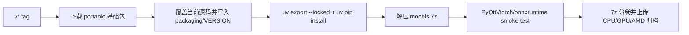
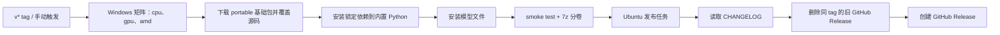

# 打包与发布

本页面向维护者，说明项目如何从源码生成可分发的桌面端与 Docker 产物、如何确定版本号、如何通过 CI 发布到 GitHub Releases 与镜像仓库，以及版本检查与更新维护的边界。它不覆盖用户安装与更新步骤（见[更新与版本切换](../install/update-and-version-switching.md)）、Web 服务端口与部署（见[Web 服务端口与部署](./web-server-ports-and-deployment.md)）、仓库模块边界（见[架构与代码边界](./architecture-and-code-boundaries.md)）或测试与代码质量（见[测试与代码质量](./tests-and-code-quality.md)）。

## 涉及的代码 {#feature-boundary}

- 版本号：`v*` Git tag（例如 `v2.2.10`）是发布权威。`packaging/VERSION` 是包内版本文件；`pyproject.toml` 的 `[project] version` 与 `packaging/launch.py` 中的硬编码 `VERSION` 只是开发标记。
- 发布包：`.github/workflows/build-and-release.yml` 以 `scripts/manga-translator-ui-portable` 的目录布局为参考，从 `portable` Release 下载基础包，覆盖所选源码引用，在内置 Python 中安装锁定的 CPU、NVIDIA CUDA 13.0 GPU、NVIDIA CUDA 12.6 GPU 或 Windows AMD 依赖，再解压模型文件并生成分卷归档。
- Docker：`.github/workflows/docker-build-push.yml` 继续构建并推送 CPU/GPU Docker 镜像。
- 这里仅写打包与发布；模块代码边界、测试流程、Web 端口与部署细节分别属于[架构与代码边界](./architecture-and-code-boundaries.md)、[测试与代码质量](./tests-and-code-quality.md)和[Web 服务端口与部署](./web-server-ports-and-deployment.md)。

## 操作方法 {#ui-operations}

与打包发布相关的可见文案只有两类：桌面窗口标题/侧边栏的版本显示，以及源码安装版维护菜单的版本检查入口。它们都不是设置页参数；维护菜单完整操作见[更新与版本切换](../install/update-and-version-switching.md)。

## 版本号 {#version-number}

### 版本号来源 {#version-sources}

| 文件/位置 | 当前值 | 作用 |
| --- | --- | --- |
| `packaging/VERSION` | `v2.2.10`（带 `v`） | 包内版本检查文件；CI 写入不带 `v` 的发布版本 |
| Git tag `v*` | 如 `v2.2.10` | CI 发布版本来源；`github.ref_name` 直接写入便携包 |
| `pyproject.toml [project] version` | `1.7.6` | 项目元数据标记；不参与 CI 发布 |
| `packaging/launch.py` 常量 `VERSION` | `1.7.6` | 开发环境横幅标记；不参与 CI 发布 |

CI 从 tag 去掉 `v` 后将发布版本写入 `packaging/VERSION`。便携包自身保留 `Win-Start.bat`、`Win-Install-or-Update.bat`、内置 Python、uv 和 PortableGit。

### 版本检查 {#version-check}

`packaging/check_version.py` 与 `launch.py#check_version_info()` 都读取本地 `packaging/VERSION`，在 `git fetch` 成功后读取 `origin/<分支>:packaging/VERSION` 与远程对比；`launch.py` 还会统计 `HEAD..origin/<分支>` 的落后提交数。fetch 失败或无法联网时如实显示“无法获取远程版本信息”，不会用旧的 `origin/*` 引用误报“已是最新”。

## 便携发布包构建 {#desktop-packaging}

### 构建入口 {#packaging-script}

CI 不再把 PyInstaller `dist/` 作为发布包。`.github/workflows/build-and-release.yml` 使用 `portable` Release 中的便携基础包（目录布局与 `scripts/manga-translator-ui-portable` 相同），再覆盖当前源码。

每个 CPU/GPU/AMD 矩阵任务按以下顺序执行：

1. 解压便携基础包，保留内置 `packaging/python`、`packaging/uv.exe` 和 `PortableGit`。
2. 覆盖当前源码并写入版本文件。
3. 用 `uv export --locked` 导出对应 dependency group，再用 `uv pip install --python packaging/python/python.exe --requirement requirements.txt` 安装到包内 Python。
4. AMD 变体额外卸载普通 PyTorch，按 `packaging/launch.py` 相同顺序安装 Radeon ROCm SDK 7.2.1 和配套 PyTorch wheels。
5. 下载并解压 `v1.7.9` Release 的 `models.7z` 到包内 `models/`。
6. 导入 CPU/GPU 运行时，校验 AMD 的 ROCm wheel 元数据，然后分别为 CPU、默认 CUDA 13.0 GPU、CUDA 12.6 GPU 和 AMD 创建分卷归档；RTX 50 系列用户必须选择 NVIDIA GPU 分卷包。

`packaging/build_packages.py` 和 spec 文件仍可用于本地 PyInstaller 调试，但不再是该 CI 发布流程的入口。

### 构建步骤 {#build-steps}

依赖安装和模型安装都发生在打包任务中，发布阶段只负责下载三个归档、读取 CHANGELOG 并创建 GitHub Release。

## 发布产物 {#release-artifacts}

### 产物布局 {#artifact-layout}

发布归档是完整的 Windows 便携目录，不包含 `app.exe`。它包含便携基础包的运行时和当前源码：

| 目录/文件 | 内容 | 说明 |
| --- | --- | --- |
| `Win-Start.bat` | 启动入口 | 使用包内 Python 运行桌面端 |
| `Win-Install-or-Update.bat` | 维护入口 | 可重新安装依赖或更新代码 |
| `packaging/python/` | Python 3.12 运行时和已安装依赖 | CPU/GPU/AMD 包各自独立 |
| `packaging/uv.exe`、`PortableGit/` | 便携工具 | 不依赖系统 Python/Git |
| `config/`、`fonts/`、`dict/`、`doc/` | 应用资源 | 与源码一起发布 |
| `models/` | AI 模型权重 | 构建阶段从 `models.7z` 解压 |
| `packaging/VERSION` | 发布版本号 | 去掉 `v` 前缀 |

### 分卷压缩 {#split-archives}

四个资产命名为 `manga-translator-cpu-<tag>.7z.*`、`manga-translator-cuda13.0-<tag>.7z.*`、`manga-translator-cuda12.6-<tag>.7z.*` 和 `manga-translator-rocm7.2.1-<tag>.7z.*`。命令使用 `7z a -v1990m -m0=lzma2 -ms=on`；解压第一个分卷即可恢复完整便携目录。

## CI 发布流水线 {#ci-release-pipeline}

### 触发方式 {#release-triggers}

`build-and-release.yml` 在推送 `v*` tag 或手动触发时运行。为避免删除并重建 Release 造成事件循环，不再监听 `release: published`。Docker 工作流仍独立构建 CPU/GPU 镜像。

### 流水线步骤 {#pipeline-steps}

发布任务依赖矩阵任务全部成功；发布前会删除同 tag 的旧 GitHub Release，再上传新归档。任一依赖安装、模型下载、运行时导入或压缩失败都会阻止发布。

## Docker 镜像 {#docker-images}

### 镜像构建 {#docker-build}

`packaging/Dockerfile` 是多阶段构建：`base-cpu` 基于 `python:3.12-slim`，`base-gpu` 基于 `nvidia/cuda:12.1.0-cudnn8-runtime-ubuntu22.04`，由 `BUILD_TYPE` 参数选择。两者都安装系统依赖后执行 `uv sync --locked --no-default-groups --group cpu|gpu`，调用 `ensure_runtime_files()` 生成运行时配置与提示词表，并把 `config`、`fonts`、`dict`、`server data` 备份到 `default_*` 目录，供入口脚本在挂载空卷时恢复。镜像以 Web 服务方式启动（`MANGA_TRANSLATOR_WEB_SERVER=true`、`QT_QPA_PLATFORM=offscreen`、`EXPOSE 8000`），健康检查请求 `http://localhost:8000/`，默认命令为 `python -m manga_translator web --host 0.0.0.0 --port 8000`。

`docker-build-push.yml` 用矩阵 `[cpu, gpu]` 构建 `linux/amd64`，登录 Docker Hub 与 ghcr.io 后，先删除当前 semver 版本对应的 Docker Hub/ GHCR tag，再推送新镜像。tag 均带 `-cpu`/`-gpu` 后缀：分支/PR 引用、semver `<版本>` 与 `<主>.<次>`、`latest`。

### Compose 部署 {#compose-deployment}

`packaging/docker-compose.yml` 提供两个服务：`manga-translator-cpu` 映射宿主 `8000:8000`，`manga-translator-gpu` 映射 `8001:8000`。两者把 `./data/{fonts,dict,result,models,logs,server,config}` 挂载到容器内，通过 `MT_*` 环境变量控制 Web 主机、端口、GPU、模型 TTL、重试与 verbose，并通过 `MANGA_TRANSLATOR_ADMIN_PASSWORD` 设置管理员密码（模板带默认占位值，首次启动必须替换）。取消注释 `./data/app.env:/app/.env` 挂载，可让 Web 管理界面保存的 API 密钥在重建容器后保留。

## 约束与注意事项 {#dependencies-and-conflicts}

- `cpu`、`cuda13.0`、`cuda12.6`、`rocm7.2.1`、`metal` 五个硬件后端依赖组互斥；CI 便携发布构建 Windows `cpu`、`cuda13.0`、`cuda12.6` 和 `rocm7.2.1` 四个包。
- ROCm 7.2.1 包在锁定公共依赖后，按启动器相同顺序安装 Radeon ROCm SDK 7.2.1 与配套 PyTorch wheels；需要 AMD 26.2.2 驱动和受支持显卡。
- 发布包已经包含锁定依赖和 `models/`；归档体积会显著增大，必须保留 1990 MiB 分卷。
- `packaging/VERSION`、`pyproject.toml` 的 `[project] version` 与 `launch.py` 的硬编码版本可能不同步；发布包中的 tag 派生 `packaging/VERSION` 是权威版本。
- 流水线依赖 `portable` 基础包和 `v1.7.9/models.7z` 两个既有 Release 资产；任一资产缺失或下载失败都会阻止发布。
- Docker 构建通过 `.dockerignore` 排除 `doc/`、`*.md`、测试与构建产物，镜像内只含运行所需资源。
- 这里不写真实 API 密钥、令牌、用户名或私有绝对路径；compose 中的管理员密码与环境变量值属于发行模板，不在文档中复制。

## 开发指南 {#developer-guide}

### 选项中英对照 {#option-matrix}

#### 窗口标题与版本显示 {#window-title-and-version-display}

打包版启动时只通过 `desktop_qt_ui/utils/app_version.py#get_app_version()` 读取 `packaging/VERSION`（去掉 `v` 前缀；失败回退为 `unknown`），再拼进窗口标题与 Qt 应用版本：

| UI 调用 key | English 实际值 | 简体中文实际值 |
| --- | --- | --- |
| `Manga Translator` | Manga Translator | 漫画翻译器 |
| `format_app_title` 拼接结果 | Manga Translator v2.2.10 | 漫画翻译器 v2.2.10 |
| `format_version_label` 结果 | v2.2.10 | v2.2.10 |

#### 维护菜单 {#maintenance-menu}

`Win-Install-or-Update.bat` / `Unix-Install-or-Update.sh` 最终调用 `packaging/launch.py --maintenance`。菜单文案由 `launch.py` 的 `L(简体中文, English)` 硬编码提供，不经过 `en_US.json`/`zh_CN.json`；下表用代码字面量作为 key：

| UI 调用 key | English 实际值 | 简体中文实际值 |
| --- | --- | --- |
| `[1] Install (...)` | Install (detect GPU, choose CPU/GPU build, install dependencies) | 安装 (检测显卡, 选择 CPU/GPU 版本并安装依赖) |
| `[2] Update (code + dependencies)` | Update (code + dependencies) | 更新 (代码+依赖) |
| `[3] Switch branch (main/beta)` | Switch branch (main/beta) | 切换分支 (main/beta) |
| `[4] Switch version (by tag)` | Switch version (by tag) | 切换版本 (按 tag) |
| `[5] Switch mirror` | Switch mirror | 切换镜像源 |
| `[6] Re-check version` | Re-check version | 重新检查版本 |
| `[7] Language (中文/English)` | Language (中文/English) | 切换语言 (中文/English) |
| `[8] Exit` | Exit | 退出 |

### 关联文件与格式 {#related-files-and-formats}

| 文件/目录 | 本页作用 | 注意 |
| --- | --- | --- |
| `packaging/VERSION` | 版本权威文件 | 带 `v` 前缀；构建与检查脚本读取 |
| `packaging/build_packages.py` | 桌面端打包入口 | 版本必填；写入 `packaging/VERSION` 和 `build_info.json` |
| `packaging/manga-translator-{cpu,gpu}.spec` | PyInstaller spec | 入口 `desktop_qt_ui/main.py`，收集运行时数据 |
| `packaging/Dockerfile`、`docker-compose.yml`、`docker-entrypoint.sh` | Docker 镜像与部署 | 多阶段构建、空卷恢复、健康检查 |
| `packaging/check_version.py` | 版本检查脚本 | 对比 `origin/main:packaging/VERSION` |
| `packaging/launch.py` | 启动与维护菜单 | `--maintenance`、`--update`、`--frozen` 等参数 |
| `Win-Start.bat`、`Win-Install-or-Update.bat`、`Unix-*.sh` | 源码安装版入口 | 调用 `launch.py`；这里不复制其内容 |
| `.github/workflows/build-and-release.yml` | 桌面发布 CI | tag/release 触发；捆绑资源、分卷、建 Release |
| `.github/workflows/docker-build-push.yml` | Docker 发布 CI | 推送 Docker Hub 与 ghcr.io |
| `.github/workflows/docs-pages.yml` | Wiki 站点发布 | 与桌面发布独立，仅部署 `doc/wiki` |
| `.github/workflows/sync-to-gitee.yml` | 仓库镜像同步 | 每次 push 同步分支与 tag 到 Gitee/GitCode |
| `doc/CHANGELOG_v<版本>.md` | 发布说明正文 | 缺失时发布正文显示占位文案 |

### 代码位置 {#source-evidence}
| 层级 | 文件 | 本页核对内容 |
| --- | --- | --- |
| 版本 | `packaging/VERSION`、`packaging/build_packages.py`、`packaging/check_version.py`、`desktop_qt_ui/utils/app_version.py` | 版本来源、去 `v`、回写、运行时读取与显示 |
| 桌面打包 | `packaging/manga-translator-{cpu,gpu}.spec`、`pyproject.toml` | 入口、数据收集、依赖组与 packaging 组 |
| CI 发布 | `.github/workflows/build-and-release.yml`、`.github/workflows/docker-build-push.yml` | 触发条件、构建矩阵、资源捆绑、分卷、Release/镜像推送 |
| Docker | `packaging/Dockerfile`、`packaging/docker-compose.yml`、`packaging/docker-entrypoint.sh`、`packaging/.dockerignore` | 多阶段构建、空卷恢复、端口、健康检查 |
| 维护/更新 | `packaging/launch.py`、`Win-*.bat`、`Unix-*.sh` | 维护菜单、版本检查、更新与切换 |
| UI/i18n | `desktop_qt_ui/main.py`、`desktop_qt_ui/ui/main_window.py`、`desktop_qt_ui/locales/en_US.json`、`zh_CN.json` | 窗口标题版本拼接与可见文案 |
