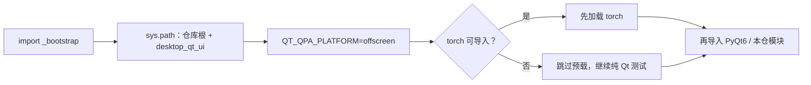
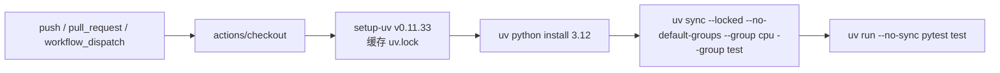

# 测试与代码质量

本页面向仓库贡献者：当你要修改源码、新增回归测试、在本地复现 CI 结果，或想确认代码风格要求时使用。它说明 `test/` 目录与测试约定、本地运行测试的命令、`ruff` 代码风格配置，以及 `.github/workflows/tests.yml` 代表的 CI 质量门禁。

这里不负责打包与发布流程（见[打包与发布](./packaging-and-release.md)），不介绍代码分层与模块边界（见[架构与代码边界](./architecture-and-code-boundaries.md)），也不讲解新增功能的完整实施步骤（见[新增或修改功能](./adding-or-changing-a-feature.md)）。

## 涉及的代码

- 测试目录与约定：`test/` 的目录规则、`test/README.md` 和 `test/_bootstrap.py` 的作用。
- 本地运行测试：`uv` 同步依赖、`pytest` 运行参数、pytest 的 `testpaths`/`pythonpath` 配置。
- 代码风格：`desktop_qt_ui/ruff.toml` 的规则、本地自检命令及其与 CI 的关系。
- CI 质量门禁：`tests.yml` 的触发条件、步骤、环境变量，以及与文档、打包、Docker、镜像同步工作流的边界。
- 桌面端“测试当前页”（`Test Current Tab`）连接测试属于 API 管理功能，这里仅引用其 i18n 文案，完整操作见 API 管理页面。

## 测试目录与约定

`test/` 存放本机测试和临时回归脚本。`.gitignore` 的规则是 `/test/**` 配 `!/test/*.py`：只有 `test/` 下一层的 `.py` 文件进入版本库，输出图片、临时 JSON 和子目录文件一律忽略。生产代码不得依赖 `test/` 里的任何文件。

- 测试函数优先写成 pytest 风格 `test_*`；每个脚本也要能直接运行：`python test/<script>.py`。
- 会用 Qt 或本仓代码的脚本，第一句 import 必须是 `import _bootstrap  # noqa: F401`。
- Qt 控件测试优先使用 `pytest-qt` 和 `qtbot`（`test/README.md` 的推荐；`pyproject.toml` 目前未声明 `pytest-qt`，未安装时用脚本直接运行路径兜底）。
- 当前跟踪的 `test/*.py` 共 52 个，其中 pytest 风格 `test_*.py` 39 个（2026-08-07 经 `git ls-files` 核对）。

`test/_bootstrap.py` 把每个测试作者都要自己记的三件事收在一处：

1. `sys.path` 加入仓库根和 `desktop_qt_ui`（否则 `No module named 'editor' / 'services'`）。
2. `QT_QPA_PLATFORM=offscreen` 必须在任何 PyQt6 导入之前设置。
3. torch 必须在 PyQt6 之前加载：Windows 上 PyQt6 的 Qt DLL 搜索路径会顶掉 `c10.dll` 的依赖解析，反过来导入会报 `OSError: [WinError 1114] 动态链接库(DLL)初始化例程失败`。桌面端正式入口 `desktop_qt_ui/main.py` 做的也是这件事（见 pytorch#166628）。



## 本地运行测试

仓库以 Python 3.12 为基线（`pyproject.toml` 的 `requires-python = ">=3.12,<3.13"`），依赖统一用 `uv` 管理。CI 使用 CPU 依赖组，本地复现时优先与 CI 保持一致：

```powershell
uv sync --no-default-groups --group cpu --group test
uv run --no-sync pytest test
```

- 默认 `uv sync` 安装 `cuda13.0` + `packaging` + `test`（NVIDIA CUDA 13.0、PyInstaller 与测试工具）；`cuda12.6` 组提供同一源码分支内的 CUDA 12.6 环境。安装器禁用默认组，因此不会检测测试依赖。`cpu`、`cuda13.0`、`cuda12.6`、`rocm7.2.1`、`metal` 五组互斥，见 `pyproject.toml` 的 `[tool.uv] conflicts`。
- `pyproject.toml` 的 `[tool.pytest.ini_options]` 固定 `testpaths = ["test"]`、`pythonpath = [".", "desktop_qt_ui"]`，避免 pytest 向上继承相邻旧仓库的配置和源码路径。
- 运行完整测试时，pytest 输出的 `rootdir` 必须是当前 Git 仓库根目录。如果本机上级目录还保留另一份旧仓库，旧配置可能误导入旧版 `manga_translator`（例如 `ModuleNotFoundError: No module named 'rusty_manga_image_translator'`）；此时先用 `PYTHONPATH=.` 直接运行测试验证实际导入路径，不能把相邻仓库的结果当作本仓测试结果。
- 2026-08-07 本工作区核对：`uv run --no-sync pytest test --collect-only -q` 成功收集 379 个测试（耗时约 26 秒）；本任务没有执行完整运行，完整运行由 CI 承担。

## 编写测试的约定

- 第一句写 `import _bootstrap  # noqa: F401`；所有测试文件路径从 `_bootstrap.ROOT` 拼接，不写相对当前目录的路径（脚本从 IDE、PowerShell、pytest 启动时 cwd 可能不同）。
- 依赖替换必须放在测试函数或 fixture 作用域内，使用 `monkeypatch`、`unittest.mock.patch` 等可自动恢复的机制。
- 测试模块不得在模块级写入、删除或批量修改 `sys.modules`；`test_test_collection_isolation.py` 会扫描并强制执行。
- Qt 测试用 `qtbot.addWidget(widget)` 管理控件生命周期，等事件优先用 `qtbot.waitUntil(...)` / `qtbot.wait(...)`，不用 `time.sleep()` 裸等；`QApplication` 要留模块级引用，被回收后再建控件会直接崩进程。
- 生产代码里 `except Exception: logger.error(...)` 会吞掉假对象缺方法的 `AttributeError`，表现为“什么都没发生”；断言对不上时先把假 logger 换成打 traceback。
- 涉及 `ServiceManager`、缓存、临时目录时，在脚本内明确初始化和清理边界，不复用真实全局服务状态。
- 脚本既支持 pytest 又支持直接运行时，文件底部保留 `if __name__ == "__main__": raise SystemExit(main())`。
- 优先测行为、不测实现细节；回归测试名要具体，例如 `test_region_list_preserves_dirty_translation_by_region_id`。

## Lint 与代码风格

仓库唯一已跟踪的静态检查配置是 `desktop_qt_ui/ruff.toml`（经 `git ls-files` 核对：没有 `setup.cfg`、`tox.ini`、`.flake8` 或第二份 `ruff.toml`，`pyproject.toml` 也不含 lint 配置）。内容如下：

```toml
[lint]
select = ["E", "F", "I"]
ignore = ["E501", "E701", "E402"]
[format]
quote-style = "double"
```

本地自检命令（ruff 未在 `pyproject.toml` 声明，需要自行安装）：

```powershell
ruff check desktop_qt_ui manga_translator --config desktop_qt_ui/ruff.toml
```

边界说明：当前 `.github/workflows/tests.yml` 没有显式 lint 步骤，因此上述命令是本地自检入口，不代表 CI 当前把它当作必过门槛。

## CI 与质量门禁

`.github/workflows/tests.yml`（workflow 名 `Tests`）是全量测试门禁：任何 `push`、`pull_request` 和手动 `workflow_dispatch` 都会触发，同一 ref 的新运行会取消进行中的旧运行（`concurrency.cancel-in-progress: true`）。作业 `pytest` 在 `windows-latest` 上运行，超时 30 分钟，环境变量 `QT_QPA_PLATFORM=offscreen`、`PYTHONUTF8=1`。



仓库其他工作流与质量门禁的关系：

| 工作流 | 触发 | 作用 |
| --- | --- | --- |
| `.github/workflows/tests.yml` | push / pull_request / workflow_dispatch | 全量 pytest（Windows, Python 3.12, CPU） |
| `.github/workflows/docs-pages.yml` | main 分支 `doc/wiki/**` 变更 / workflow_dispatch | 构建 VitePress 并部署到 GitHub Pages |
| `.github/workflows/build-and-release.yml` | `v*` 标签 / release published / workflow_dispatch | PyInstaller CPU/GPU 打包与发布（见[打包与发布](./packaging-and-release.md)） |
| `.github/workflows/docker-build-push.yml` | `v*` 标签 / workflow_dispatch | 构建并推送 CPU/GPU Docker 镜像 |
| `.github/workflows/sync-to-gitee.yml` | push / workflow_dispatch | 同步镜像仓库到 Gitee 与 GitCode |

## 测试覆盖概览

下表按区域归纳当前跟踪的测试文件，不构成覆盖率数字（仓库未把覆盖率工具接入测试命令或 CI）。

| 区域 | 代表文件 | 覆盖内容 |
| --- | --- | --- |
| 基础与收集隔离 | `test/_bootstrap.py`、`test/test_test_collection_isolation.py` | sys.path / offscreen / torch 加载顺序；禁止模块级 `sys.modules` 修改 |
| 安全回归 | `test/test_code_scanning_security.py` | 拒绝远程图片 URL、路径穿越、API 状态指纹脱敏、HQ 响应回退 |
| 编辑器模型与文档 | `test_editor_dirty_detection.py`、`test_editor_image_lifetime.py`、`test_editor_inpaint_cache_reset.py`、`test_editor_inpainted_fallback.py`、`test_editor_inpainted_layer_switch.py`、`test_editor_performance_refactor.py`、`test_editor_export_executor.py`、`test_translation_edit_ops_capture.py`、`test_textblock_rich_safety.py` | 脏标记、图片生命周期、修复缓存/回退/图层切换、导出执行器、翻译编辑操作、富文本安全 |
| 编辑器 UI 控件 | `test_editor_center_scale.py`、`test_editor_toolbar_menu.py`、`test_font_combo_box.py`、`test_font_combo_search_menu.py`、`test_font_family_sanitization.py` | 画布缩放、工具栏菜单、字体下拉与搜索、字体族清洗 |
| 富文本 | `test_rich_text_editing.py`、`test_rich_text_floating_editor.py`、`test_rich_text_rendering.py`、`test_rich_text_rules.py`、`test_rich_text_rules_editor_live.py`、`test_rich_text_sync.py`、`test_rich_text_underline.py` | 编辑、浮动编辑器、渲染、规则、同步、下划线 |
| 批量编辑 | `test_batch_edit_engine.py`、`test_batch_edit_panel.py` | 批量编辑引擎与面板 |
| 应用逻辑与文件流水线 | `test_app_logic_file_sources.py`、`test_file_list_snapshot_view.py`、`test_ui_io_pipeline.py`、`test_export_inmemory_payload.py`、`test_update_fetch_failure.py` | 文件来源、快照视图、UI/IO 管线、内存导出、更新检查失败 |
| 引擎与模型适配 | `test_chinese_linebreak_spaces.py`、`test_layout_mode_common_flow.py`、`test_paddleocr_vl_native_loader.py`、`test_per_block_inpainting.py`、`test_yolo_obb_rearrange_edge_merge.py`、`test_yolo_obb_sfx_filter.py` | 中文断行、排版、PaddleOCR-VL、分块修复、YOLO OBB 重排合并/音效过滤 |
| 提示词与翻译 | `test_gemini_hq_image_preparation.py`、`test_prompt_preview_fluent_icons.py` | Gemini HQ 图片准备、提示词预览图标 |
| 可直接运行脚本 | `check_char_tables.py`、`render_golden.py`、`repro_seam_dilution.py`、`ps_italic_angle.py` 等 | 非 pytest 收集的调试/回归脚本，用 `python test/<script>.py` 直接运行 |

## 约束与注意事项

- `cpu` / `cuda13.0` / `cuda12.6` / `rocm7.2.1` / `metal` 五组互斥，不能同时安装；CI 和本页命令固定使用 `cpu` + `test`。默认 `uv sync` 是 `cuda13.0` + `packaging` + `test`，在没有 NVIDIA 环境的机器上直接跑测试可能因 torch 后端不同出现行为差异。
- `uv.lock` 是锁定文件，已提交且不可手改；CI 使用 `uv sync --locked` 保证可复现。
- Windows 上 torch 必须先于 PyQt6 加载；`_bootstrap.py` 已处理，不要在测试里自行 `import torch` 绕开或假设“用不到 torch”。
- `test/` 只跟踪 `test/*.py`，输出图、临时 JSON、子目录文件都被忽略；不要把被忽略的临时产物当作正式测试结果，也不要修改 `.gitignore` 来解除屏蔽。
- 测试和文档都不读取真实 `.env`、用户 `config.json`、API Key、用户图片或私有提示词；安全回归测试专门验证路径穿越与远程图片 URL 会被拒绝。
- 本页测试覆盖概览只是文件归类，不代表“已覆盖全部功能”；页面不声称任何覆盖率百分比。

## 开发指南 {#developer-guide}

### 选项中英对照 {#option-matrix}

#### 连接测试的界面文案

桌面端没有“运行测试套件”的按钮；与测试最接近的界面是 API 管理页的“测试当前页”（`Test Current Tab`）连接测试。下列 i18n 文案在开发者自检凭据时会出现，key 与最终显示文字不同时以实际值为准；完整操作见 API 管理页面。

| UI 调用 key | English 实际值 | 简体中文实际值 |
| --- | --- | --- |
| `Test` | Test | 测试 |
| `Test Current Tab` | Test Current Tab | 测试当前页 |
| `Testing` | Testing | 测试中 |
| `API connection test successful!` | API connection test successful! | API连接测试成功！ |
| `API connection test failed` | API connection test failed | API连接测试失败 |
| `No API channels to test` | No API channels to test | 没有可测试的 API 通道 |
| `API test available` | available | 可用 |
| `API test unavailable` | unavailable | 不可用 |
| `Open log folder` | Open log folder | 打开日志文件夹 |
| `Log output...` | Log output... | 日志输出... |

### 关联文件

| 文件 | 本页实际作用 | 备注 |
| --- | --- | --- |
| `pyproject.toml` | 依赖、后端组、pytest `testpaths`/`pythonpath` | 不含 lint 配置 |
| `uv.lock` | 锁定依赖版本 | CI 用 `--locked` |
| `test/README.md` | 测试脚本约定 | 唯一测试约定文档 |
| `test/_bootstrap.py` | 测试公共前置 | sys.path / offscreen / torch 顺序 |
| `test/test_*.py` | pytest 用例 | 39 个（2026-08-07 核对） |
| `desktop_qt_ui/ruff.toml` | lint/format 配置 | 本地自检入口 |
| `.github/workflows/tests.yml` | 全量测试 CI | 无 lint 步骤 |
| `.github/workflows/docs-pages.yml` | Wiki 构建与部署 | `doc/wiki/**` 变更触发 |
| `desktop_qt_ui/locales/en_US.json` / `zh_CN.json` | 界面文案 | 三列对照的依据 |
| `.gitignore` | `test/**` 与 `!/test/*.py` 规则 | 控制测试文件的版本库边界 |

### 代码位置 {#source-evidence}
| 层级 | 文件 | 本页核对内容 |
| --- | --- | --- |
| 测试约定 | `test/README.md`、`test/_bootstrap.py` | 目录规则、导入顺序、Qt 测试约定 |
| 依赖与 pytest 配置 | `pyproject.toml`、`uv.lock` | Python 3.12、后端组、`testpaths`/`pythonpath` |
| CI | `.github/workflows/tests.yml` | 触发、步骤、环境变量、超时、无 lint 步骤 |
| lint | `desktop_qt_ui/ruff.toml` | `select`/`ignore`/`format` 规则 |
| i18n | `desktop_qt_ui/locales/en_US.json`、`zh_CN.json` | 连接测试与日志文案 key 的实际值 |
| 仓库规则 | `.gitignore` | `/test/**` 与 `!/test/*.py` |
