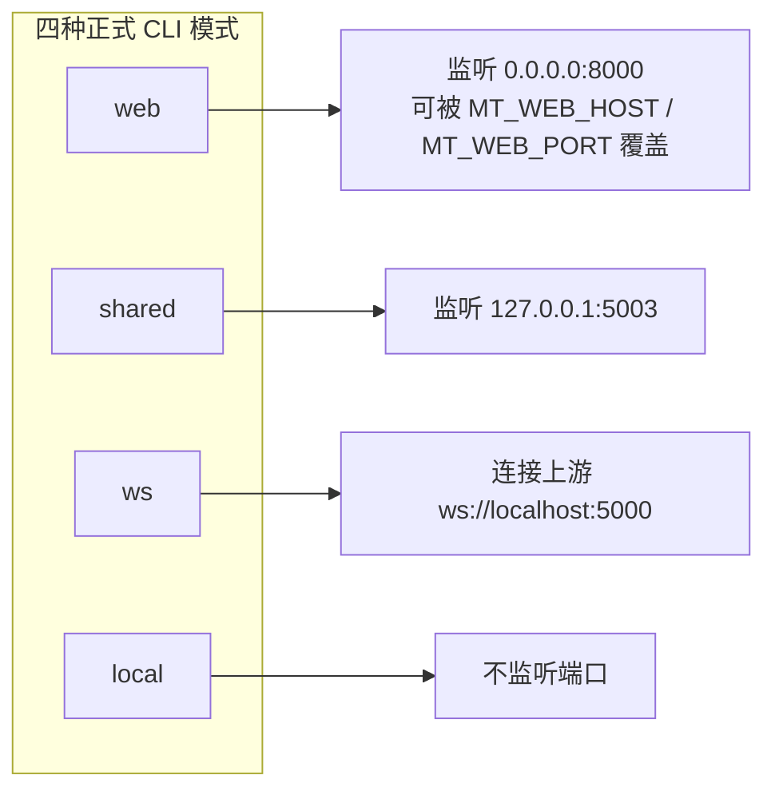

# Web 服务器端口与部署

当你要把 Web 服务跑起来给局域网或公网使用、排查端口冲突，或者为 CI/CD 编写启动脚本时，这里说明 `web` 模式的监听契约、正式部署方式、Docker 端口映射和 `MT_*` 环境变量。本页面向开发者，不重复终端用户的界面操作（见[启动与访问](../web/launch-and-access.md)）、用户向安全边界（见[部署安全与故障排查](../web/deployment-security-and-troubleshooting.md)）和镜像安装步骤（见[Docker 部署](../install/docker.md)）；HTTP 路由契约见[开发者 HTTP API](./http-api/translation-endpoints.md)等页面。

## 涉及的代码 {#feature-boundary}

- `web` 模式是唯一对外提供 HTTP API 与 Web 界面的正式 CLI 入口；默认监听 `0.0.0.0:8000`，可被 `MT_WEB_HOST` / `MT_WEB_PORT` 覆盖。
- `shared` 与 `ws` 是内部执行模式，分别默认监听 `127.0.0.1:5003` 和连接上游 `ws://localhost:5000`；它们不是给浏览器访问的对外端口。
- 这里仅记录端口、部署与环境变量；模型加载、GPU、超时与并发等运行参数只说明其入口，详细机理见对应参数页。

## 端口契约 {#ports-contract}

`0.0.0.0` 表示服务器监听所有 IPv4 接口，不是浏览器访问地址；本机通常用 `http://127.0.0.1:8000` 或 `http://localhost:8000`，局域网客户端必须使用服务器实际 LAN 地址。对外可达性取决于防火墙、端口映射和网络环境，当前代码无法断言。



## 部署方式 {#deployment-methods}

### 从源码运行 {#run-from-source}

```powershell
uv run --no-sync python -m manga_translator web
uv run --no-sync python -m manga_translator web --host 0.0.0.0 --port 8080
```

- 不带 `--host` / `--port` 时，解析器在启动时读取 `MT_WEB_HOST` / `MT_WEB_PORT`，都没有时才使用代码默认 `0.0.0.0:8000`。
- 显式命令行参数优先于环境变量：`args.py` 用 `os.getenv` 计算默认值，再被 argparse 的命令行值覆盖。
- 启动日志会打印 `[SERVER CONFIG]`（GPU、verbose、TTL、重试、并发）和 `Nonce:`，但不打印监听地址；Uvicorn 自己的启动日志会显示实际 host/port。
- 服务端在启动时把 `MANGA_TRANSLATOR_WEB_SERVER=true` 写入进程环境，翻译器据此跳过再次加载 `.env`，避免覆盖服务器已加载的密钥。

### Docker Compose {#docker-compose}

在仓库的 `packaging/` 目录下执行（build context 仍是项目根目录）：

```bash
docker compose up --build -d manga-translator-cpu   # 健康后访问 http://127.0.0.1:8000/
docker compose up --build -d manga-translator-gpu   # 健康后访问 http://127.0.0.1:8001/
```

- CPU 服务把宿主机 `8000` 映射到容器 `8000`；GPU 服务把宿主机 `8001` 映射到容器 `8000`。容器内部始终监听 `8000`。
- Compose 为两个服务都设置 `MT_WEB_HOST=0.0.0.0`、`MT_WEB_PORT=8000`，CPU 用 `MT_USE_GPU=false`、GPU 用 `MT_USE_GPU=true`。
- 镜像健康检查用 `curl -f http://localhost:8000/`：连续失败 3 次、60 秒启动宽限期后标记为不健康。
- 挂载卷持久化 `fonts`、`dict`、`result`、`models`、`logs`、`server` 数据目录和 `config`；需要持久化管理界面保存的 API Key 时，创建空文件 `./data/app.env` 并取消 `./data/app.env:/app/.env` 挂载注释。
- Compose 模板中的示例管理密码仅作占位，至少需要 6 个字符；公开部署必须用未提交的环境覆盖或管理界面设置随机密码，不能沿用示例值。

### 数据目录与启动入口 {#data-locations}

| 路径 | 作用 | Docker 中的位置 |
| --- | --- | --- |
| `config/config.json`（`get_config_path`） | Web 运行配置；不存在时由模板生成 | `/app/config`（空挂载时由 entrypoint 从镜像默认备份恢复） |
| `manga_translator/server/data/admin_config.json` | 管理员设置、密码、注册与配额策略 | `/app/manga_translator/server/data` |
| `<应用目录>/.env` | 服务器端 API Key 等环境变量；`main.py` 启动时以 `override=False` 加载 | `/app/.env`（需显式挂载才持久化） |
| `manga_translator/server/static/` | `index.html`、`login.html`、`admin-new.html` 等前端 | 镜像内只读 |

打包版本的应用目录是 `sys.executable` 所在目录（`runtime_paths.py#get_application_dir`）；从源码运行则是仓库根目录。因此发行版的 `config/` 与 `.env` 都位于可执行文件旁，不能从 PyInstaller 内部目录推断。

## 环境变量 {#environment-variables}

优先级：显式命令行参数 > 进程启动时已存在的环境变量 > `.env` 文件 > 代码默认值。`main.py` 以 `override=False` 加载 `.env`，因此已存在于进程环境中的同名变量不会被 `.env` 覆盖；管理界面 `POST /env` 通过 `EnvService` 写入应用目录 `.env` 后再以 `override=True` 重载。

这里不列出也不展示任何真实密钥。`OPENAI_API_KEY`、`GEMINI_API_KEY` 等凭据变量只由翻译器读取，服务端 `/env` 与 `/env/effective` 不返回明文。

## 约束与注意事项 {#dependencies-and-conflicts}

- `0.0.0.0` 监听所有接口不等于对外可用；Windows 防火墙、云安全组和 NAT 端口映射决定局域网/公网可达性，当前代码不能证明实际暴露范围。
- 端口占用：`web` 默认 `8000`、Docker GPU 主机入口 `8001` 与 `shared` / `ws` 的 `5003` 分属不同用途；若同一主机上多实例或旧版服务占用端口，Uvicorn 会启动失败。
- CORS 配置为 `allow_origins=["*"]` + `allow_credentials=True`，但这是源码配置，不代表浏览器对每种 origin/credential 组合都会放行；跨域部署需用浏览器预检实际验证。
- `MANGA_TRANSLATOR_WEB_SERVER=true` 会阻止翻译器（OpenAI/Gemini 等）重新加载 `.env`，避免覆盖服务器密钥；这与 CLI 本地模式的 `.env` 重载行为不同。
- `web` 模式强制 `start_instance=False`，不会自动拉起 `shared` 翻译进程；`server/args.py --start-instance` 的进程拉起路径属于未接线的独立入口，不能当作正式 `web` 模式行为。

## 开发指南 {#developer-guide}

### 选项中英对照 {#option-matrix}

#### 端口契约

| 入口 | 源码固定值 | 说明与来源 |
| --- | --- | --- |
| `web` 模式 | `--host` 默认 `MT_WEB_HOST` 或 `0.0.0.0`；`--port` 默认 `MT_WEB_PORT` 或 `8000` | `manga_translator/args.py`；`server/main.py#run_server()` 用同一值启动 Uvicorn |
| Uvicorn | `timeout_keep_alive=1800`、`timeout_graceful_shutdown=30` | 长连接保持 30 分钟以支持批量翻译；优雅关闭 30 秒 |
| `shared` 模式 | `--host` / `--port` 默认 `127.0.0.1:5003` | `manga_translator/args.py`；`mode/share.py` 用它启动内部 FastAPI |
| `ws` 模式 | 本地监听 `127.0.0.1:5003`；`--ws-url` 默认 `ws://localhost:5000` | `manga_translator/args.py`；`mode/ws.py` 读取 `ws_url` |
| Docker CPU | 容器监听 `8000`，Compose 映射 `8000:8000` | `packaging/Dockerfile`、`packaging/docker-compose.yml` |
| Docker GPU | 容器仍监听 `8000`，Compose 映射 `8001:8000` | 主机访问入口是 `8001`，不是容器内 `8000` |
| 未接线的解析器 | `manga_translator/server/args.py` 默认 `127.0.0.1:8000`（帮助文字写 `8080`） | 未被正式顶层 `manga_translator.args` 使用，不能据此改写正式默认值 |

#### 环境变量

| 环境变量 | 作用 | 读取位置 |
| --- | --- | --- |
| `MT_WEB_HOST` | `web` 模式监听地址默认值；缺省 `0.0.0.0` | `manga_translator/args.py` |
| `MT_WEB_PORT` | `web` 模式监听端口默认值；缺省 `8000` | `manga_translator/args.py` |
| `MT_USE_GPU` | `web --use-gpu` 默认值；`true` / `1` / `yes` / `on` 为真 | `manga_translator/args.py` |
| `MT_DISABLE_ONNX_GPU` | 禁用 ONNX Runtime GPU 加速；同一真值规则 | `manga_translator/args.py`、`utils/onnx_runtime.py` |
| `MT_MODELS_TTL` | 上次使用后模型保留秒数；`0` 表示永久 | `manga_translator/args.py` |
| `MT_RETRY_ATTEMPTS` | 失败重试次数；`-1` 无限重试；未设置时交给 API 传入配置 | `manga_translator/args.py` |
| `MT_VERBOSE` | 详细日志开关；`true` / `1` / `yes` 为真 | `manga_translator/args.py` |
| `MT_WEB_NONCE` | 内部 `/register` 与 shared 通信的 nonce；缺省由 `secrets.token_hex(16)` 生成 | `server/main.py`、`server/args.py`、`server/export_utils.py` |
| `MANGA_TRANSLATOR_ADMIN_PASSWORD` | 首次启动时初始化管理密码（至少 6 字符；不自动创建登录账号） | `server/core/config_manager.py` |
| `MANGA_TRANSLATOR_WEB_SERVER` | 服务器进程内置为 `true`，让翻译器跳过重复加载 `.env` | `server/main.py`、`translators/openai.py` 等 |
| `MANGA_TRANSLATOR_ENV_PATH` | 指向应用目录 `.env` 的提示路径（`APP_DOTENV_PATH_ENV`） | `utils/dotenv_utils.py` |
| `WS_SECRET` | `ws` 模式上游 WebSocket 密钥 | `mode/ws.py` |

#### UI 文案对照 {#ui-copy}

本页面向开发者，可核对的界面文案主要来自 Web 管理控制台与共享 locale：

| UI 调用 key | English 实际值 | 简体中文实际值 |
| --- | --- | --- |
| `web_server_config` | Server Configuration | 服务器配置 |
| `web_admin_panel` | Admin Panel | 管理面板 |
| `web_use_server_config` | Use Server Config | 使用服务器配置 |
| `web_use_custom_config` | Use Custom Config | 使用自定义配置 |
| `web_save_config` | Save Config | 保存配置 |

这些 `web_*` key 来自桌面共享 locale（`desktop_qt_ui/locales/en_US.json`、`zh_CN.json`）。`admin-new.html` 当前把“服务器配置”等导航与面板文字硬编码为中文，尚未逐项调用这些 key；英文界面显示需要未来 i18n 阶段核对，这里不擅自补译。

### 关联文件与格式 {#related-files}

| 文件 | 本页实际作用 | 注意 |
| --- | --- | --- |
| `manga_translator/args.py` | 四个子命令、`web` 选项与 `MT_*` 默认值 | 环境变量默认值在进程启动时求值 |
| `manga_translator/server/main.py` | Uvicorn 启动、CORS、静态挂载、`.env` 加载、`/register` nonce | `timeout_keep_alive=1800` |
| `manga_translator/server/args.py` | 独立解析器（`127.0.0.1:8000`） | 未接入正式顶层分发 |
| `packaging/Dockerfile`、`packaging/docker-compose.yml`、`packaging/docker-entrypoint.sh` | CPU/GPU 构建、端口映射、卷、健康检查、默认数据恢复 | 示例管理密码必须更换 |
| `manga_translator/server/core/env_service.py` | `.env` 读取、写入、热重载与脱敏 | 管理界面保存密钥的底层 |
| `manga_translator/utils/dotenv_utils.py` | `load_app_dotenv` 与 `MANGA_TRANSLATOR_ENV_PATH` | `override` 语义影响优先级 |
| `manga_translator/runtime_paths.py`、`manga_translator/server_paths.py` | 应用目录、`config/`、`server/data/` 路径 | 打包版目录在可执行文件旁 |
| `manga_translator/server/core/config_manager.py` | `admin_config.json` 与 `MANGA_TRANSLATOR_ADMIN_PASSWORD` | 不展示真实密码 |

### Mermaid 边界 {#mermaid-boundary}

上面的端口图只表示各正式 CLI 模式绑定的端点，不代表 `web` 模式会自动拉起 `shared` / `ws` 进程，也不代表 `ws://localhost:5000` 在本仓库内一定存在一个监听服务。Docker 映射只描述 Compose 模板中的端口映射；真实暴露范围、防火墙和反向代理配置需在目标环境验证。。

### 代码位置 {#source-evidence}
| 层级 | 文件 | 本页核对内容 |
| --- | --- | --- |
| CLI 契约 | `manga_translator/args.py`、`manga_translator/__main__.py` | 四个模式、`web --host/--port`、`MT_*` 默认值与分发 |
| 服务器启动 | `manga_translator/server/main.py` | Uvicorn host/port/超时、CORS、静态挂载、`.env`、nonce |
| 内部端口 | `manga_translator/mode/share.py`、`mode/ws.py` | `127.0.0.1:5003`、`ws://localhost:5000`、`WS_SECRET` |
| 独立解析器 | `manga_translator/server/args.py`、`server/export_utils.py` | `127.0.0.1:8000` 默认与 `--start-instance` 差异 |
| Docker | `packaging/Dockerfile`、`packaging/docker-compose.yml`、`packaging/docker-entrypoint.sh` | 端口映射、卷、健康检查、默认数据恢复、示例密码 |
| 环境变量服务 | `manga_translator/server/core/env_service.py`、`utils/dotenv_utils.py` | `.env` 读写、热重载、脱敏与 `override` 语义 |
| 路径 | `manga_translator/runtime_paths.py`、`manga_translator/server_paths.py` | 应用目录、`config/`、`server/data/` |
| 管理配置 | `manga_translator/server/core/config_manager.py` | `MANGA_TRANSLATOR_ADMIN_PASSWORD` 初始化规则 |
| UI/i18n | `desktop_qt_ui/locales/en_US.json`、`desktop_qt_ui/locales/zh_CN.json`、`server/static/admin-new.html` | `web_*` key 实际值与管理控制台硬编码差异 |
