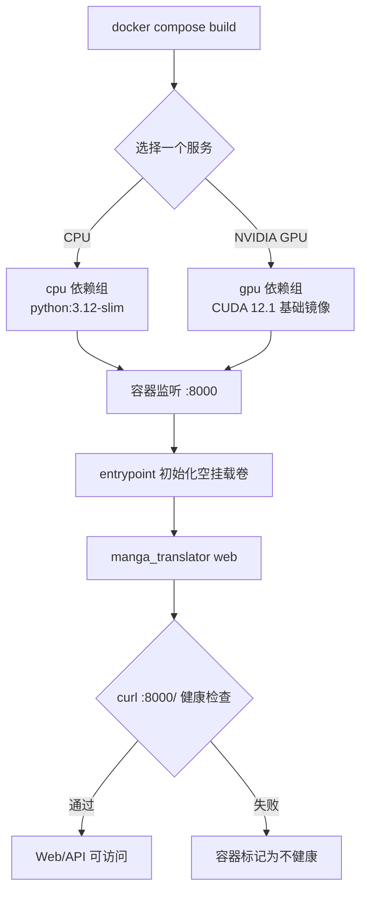

# Docker 部署

这里说明如何从当前源码构建 Web 服务的 CPU 或 NVIDIA GPU 容器，以及如何映射端口、保存配置和检查服务状态。Docker 镜像提供 Web 界面与 HTTP API，不包含桌面 Qt 工作区；Web 用户操作和 HTTP 契约分别见对应页面。这里不覆盖 Docker 发布镜像的来源、反向代理的具体配置或宿主机级备份策略。

## 使用 Compose 启动

`packaging/docker-compose.yml` 同时定义 CPU 和 GPU 服务，但通常只启动其中一个，避免占用两个 Web 端口和两份模型资源。

### 快速启动

临时体验可以直接使用发布镜像，无需本地构建：

```bash
docker run -d --name manga-translator -p 8000:8000 hgmzhn/manga-translator:latest-cpu
```

NVIDIA GPU 机器把镜像换成 `hgmzhn/manga-translator:latest-gpu`。镜像同时发布在 Docker Hub（`hgmzhn/manga-translator`）和 GitHub Container Registry（`ghcr.io/hgmzhn/manga-translator`，国内可能更快）两个仓库，任选其一。启动后访问 `http://localhost:8000`（用户界面）与 `http://localhost:8000/admin`（管理界面）。

### Compose 持久化示例

长期使用建议按 `packaging/docker-compose.yml` 挂载数据目录（路径均相对 `packaging/`）：

```yaml
services:
  manga-translator:
    image: hgmzhn/manga-translator:latest-cpu
    container_name: manga-translator
    restart: unless-stopped
    ports:
      - "8000:8000"
    environment:
      MT_WEB_HOST: 0.0.0.0
      MT_WEB_PORT: 8000
      MANGA_TRANSLATOR_ADMIN_PASSWORD: change_me_123456
    volumes:
      - ./data/models:/app/models
      - ./data/fonts:/app/fonts
      - ./data/dict:/app/dict
      - ./data/config:/app/config
      - ./data/server:/app/manga_translator/server/data
      - ./data/logs:/app/logs
      - ./data/result:/app/result
      # 要让 Web 管理界面保存的服务器 API Key 在重建后保留，先创建空文件 ./data/app.env，再取消下行注释：
      # - ./data/app.env:/app/.env
```

示例中的管理员密码只是占位，公开部署前必须替换为随机密码。

### 端口与环境变量

| 项目 | 说明 |
| --- | --- |
| 容器端口 | `8000` |
| 宿主端口 | CPU `8000`、GPU `8001`（可自定义） |
| `MT_WEB_HOST` | 监听地址，默认 `0.0.0.0` |
| `MT_WEB_PORT` | 服务端口，默认 `8000` |
| `MT_USE_GPU` | GPU 镜像设为 `true` |
| `MT_MODELS_TTL` | 模型内存存活秒数，默认 `0`（永久保留） |
| `MT_RETRY_ATTEMPTS` | 翻译失败重试次数，`-1` 表示无限重试 |
| `MT_VERBOSE` | 详细日志，默认 `false` |
| `MANGA_TRANSLATOR_ADMIN_PASSWORD` | 旧式管理密码，至少 6 位；不替代 `/auth/setup` |

CPU 服务把宿主机 `8000` 映射到容器 `8000`，健康后访问 `http://127.0.0.1:8000/`；GPU 服务要求宿主机安装兼容的 NVIDIA 驱动与 NVIDIA Container Toolkit，并把宿主机 `8001` 映射到容器 `8000`，健康后访问 `http://127.0.0.1:8001/`。容器内部始终监听 `8000`。

首次访问 Web 登录页时，按页面提示创建第一个管理员账号。Compose 中的 `MANGA_TRANSLATOR_ADMIN_PASSWORD` 只是旧的服务管理密码设置：它要求至少 6 个字符，不能替代 `/auth/setup`，也不会自动创建登录账号。不要使用仓库 Compose 文件中的示例密码；公开部署前应通过未提交的环境覆盖或管理配置设置新的随机密码。

## 镜像如何运行

Dockerfile 使用多阶段构建：CPU 基于 `python:3.12-slim`，GPU 基于 `nvidia/cuda:12.1.0-cudnn8-runtime-ubuntu22.04`，两者都安装系统库并在 `/app` 中运行源码。构建阶段执行 `uv sync --locked --no-default-groups --group cpu` 或 `--group gpu`，因此依赖必须与锁文件和构建类型匹配。

镜像暴露并监听容器端口 `8000`，默认命令是 `python -m manga_translator web --host 0.0.0.0 --port 8000`。entrypoint 在启动前检查挂载的 `config`、`fonts`、`dict` 和服务端数据目录：目录为空时，从镜像内的默认备份复制初始化内容，然后执行主命令。镜像和 Compose 都以 `curl http://localhost:8000/` 做健康检查；连续失败三次且经过 60 秒启动宽限期后，容器会被标记为不健康。



宿主机 `8000:8000`（CPU）或 `8001:8000`（GPU）只改变外部入口，不改变服务内部端口。`0.0.0.0` 是监听所有 IPv4 接口，不是浏览器地址；局域网或公网访问还受防火墙、路由和反向代理影响。

## 依赖、资源与冲突

- CPU 与 GPU 是 Compose 中的两个替代服务；不要同时启动，除非确实需要两套隔离服务并能承担各自的内存、模型缓存和端口。
- GPU 服务要求 NVIDIA Container Toolkit，并在 Compose 中请求所有可用 NVIDIA GPU；AMD ROCm 和 macOS Metal 没有对应的 Compose 服务定义，不能把 CPU/GPU 服务当作它们的安装方案。
- CPU 镜像使用 `uv` 的 `cpu` 组；GPU 镜像使用 `gpu` 组。两组分别包含 `onnxruntime` 或 `onnxruntime-gpu`，GPU 还包含 CUDA 对应的 Torch 和 `xformers`，不可交叉复制依赖。
- 模型首次启用时可能下载并占用大量磁盘、内存或显存；Compose 的内存限制只是容器限制，不是模型兼容性保证。CPU 服务配置上限 8G、预留 2G；GPU 服务上限 16G、预留 4G，需按机器调整。
- Dockerfile 使用 CUDA 12.1 运行时基础镜像，而项目裸 `uv sync` 的默认 GPU 索引以当前 `pyproject.toml` 为准；不要从 Dockerfile 推断其他平台的安装命令。

## 持久化卷、环境变量与格式

Compose 路径均相对于 `packaging/`：

| 宿主目录 | 容器目录 | 内容与注意事项 |
| --- | --- | --- |
| `data/fonts` | `/app/fonts` | 字体资源；支持项目实际字体格式，不要放入私人字体文件后直接分享卷 |
| `data/dict` | `/app/dict` | 提示词、词典和规则；可能包含私有提示词 |
| `data/result` | `/app/result` | 翻译结果和可能的用户图片/文本 |
| `data/models` | `/app/models` | 模型权重与缓存，通常占用较大空间 |
| `data/logs` | `/app/logs` | 日志目录；日志可能包含路径、错误和任务信息 |
| `data/server` | `/app/manga_translator/server/data` | 账号、权限、会话、历史和用户资源 |
| `data/config` | `/app/config` | 配置文件和模板；空目录会由 entrypoint 初始化 |

若要让 Web 管理界面保存的服务器 API 配置在重建容器后保留，先创建空的 `packaging/data/app.env`，再取消 Compose 中 `./data/app.env:/app/.env` 的注释。不要把 `.env`、账号数据、会话令牌、API Key、用户图片或提示词提交到 Git；挂载目录也应按最小权限和备份保留期管理。

运行时环境变量包括 `MT_WEB_HOST`、`MT_WEB_PORT`、`MT_USE_GPU`、`MT_DISABLE_ONNX_GPU`、`MT_MODELS_TTL`、`MT_RETRY_ATTEMPTS` 和 `MT_VERBOSE`。它们覆盖 Web 启动行为、后端选择、模型缓存、重试或日志；具体默认值以 `manga_translator/args.py` 和 Compose 为准。`MANGA_TRANSLATOR_ADMIN_PASSWORD` 只记录其存在和最短长度校验，不在页面展示其值。
