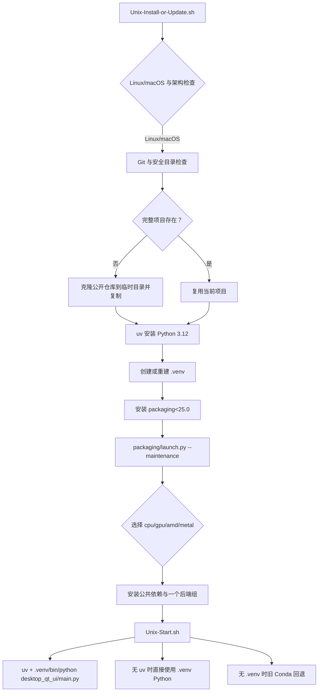

# Linux 与 macOS 安装

这里说明 Linux/macOS 的源码安装、更新和 Qt 桌面启动入口。它只负责 Unix 引导脚本、`.venv`、uv 和平台依赖选择；Windows 便携版、Docker、版本切换和卸载分别见对应安装页。

脚本会在脚本所在目录工作。可以在一个新的、可写且信任的目录中下载两个脚本，也可以在已经克隆的完整仓库根目录中运行安装脚本。安装过程中不会要求把密钥、Token 或用户图片写入命令行。

## 安装与启动

### 首次安装

Linux/macOS 共用 `Unix-Install-or-Update.sh` 与 `Unix-Start.sh` 两个脚本。快速安装：

```bash
curl -O https://raw.githubusercontent.com/hgmzhn/manga-translator-ui/main/Unix-Install-or-Update.sh
chmod +x Unix-Install-or-Update.sh
./Unix-Install-or-Update.sh
```

脚本会自动检查/安装 Git，用 uv 安装 Python 3.12，在项目目录创建 `.venv`，然后进入双语维护菜单，在菜单的“安装”操作中完成首次完整依赖安装。手动克隆方式：

```bash
git clone https://github.com/hgmzhn/manga-translator-ui.git
cd manga-translator-ui
chmod +x Unix-*.sh
./Unix-Install-or-Update.sh
```

不要把它放进含有无关文件的非空目录；脚本会拒绝在那里克隆。首次确认后，脚本检查平台和 Git，并在需要时引导安装 Git、uv、Python 3.12，随后创建项目根目录下的 `.venv`；引导脚本只预装维护菜单所需的 `packaging<25.0`，然后进入双语 Python 维护菜单。已下载完整仓库时，可直接在仓库根目录运行同一入口，它会复用该目录，不会再次克隆。

### 启动桌面 UI

安装完成后，在项目根目录运行：

```bash
./Unix-Start.sh
```

`Unix-Start.sh` 优先使用 `.venv/bin/python`，并优先通过 uv 执行 `desktop_qt_ui/main.py`；找不到 uv 时仍可直接调用 `.venv` Python。只有 `.venv` 不存在时，才按固定路径或 Conda 环境尝试旧环境回退。旧环境只适合兼容已有安装，不是新的安装路径。

可以先做不启动 UI 的检查：

```bash
MANGAT_DRY_RUN=1 ./Unix-Start.sh
```

该模式只打印将要执行的命令；它仍会检查项目文件和 `.venv`。安装引导脚本也支持 `MANGAT_AUTO_CONFIRM=1` 自动回答第一次确认，适合受控自动化，不应把它与未知目录或未知仓库地址组合使用。

### 维护菜单

`Unix-Install-or-Update.sh` 最终执行 `packaging/launch.py --maintenance`。菜单会显示当前分支和镜像源，并把语言选择持久化到 `packaging/maintenance_config.json`。更新、切换分支或 tag 前先备份未提交的源码和本地配置；更新操作可能改变工作树内容。菜单各项的实际文案与存储值见[界面选项对照表](../reference/options-i18n-matrix.md)。

## 平台依赖选择

项目要求 Python `>=3.12,<3.13`，即当前安装脚本固定使用 Python 3.12。`pyproject.toml` 把公共依赖与四个互斥 dependency group 分开；一次环境只能选择一个后端组。

各存储值对应的界面名称见[界面选项对照表](../reference/options-i18n-matrix.md)。

安装阶段的自动选择大致如下：

- Apple Silicon macOS 选择 `metal`，使用 PyTorch MPS 版本、CPU 版 ONNX Runtime，以及 Cocoa 框架支持。
- Linux NVIDIA 根据驱动报告的 CUDA 主版本选择 `cuda13.0` 或 `cuda12.6`；否则可以选择 `cpu`。
- Linux AMD 只在检测到受支持的 ROCm 架构时建议 `rocm7.2.1`；无法识别或不兼容时默认建议 `cpu`。强制 ROCm 选项明确提示兼容性不能保证。
- 无法检测硬件或检测到 Intel GPU 时提供手动选择，CPU 是兼容性优先的回退。

`uv sync` 的源码开发默认组是 `cuda13.0`、`packaging` 和 `test`，但 Unix 维护流程禁用默认组并根据检测结果只选择对应硬件变体，因此不会安装测试工具。不要手动同时启用 `cpu`、`cuda13.0`、`cuda12.6`、`rocm7.2.1`、`metal`；`tool.uv.conflicts` 已将它们声明为互斥。

## 安装脚本做了什么



引导脚本的职责止于项目、Python 和维护菜单的 bootstrap；完整依赖安装、代码更新、分支/tag、镜像源与依赖完整性检查由 `packaging/launch.py` 完成。启动脚本不会自动同步依赖，也不会把缺少 `.venv` 静默变成系统 Python；缺少环境时会要求重新运行安装入口。

在更新操作中，维护菜单会检查本地/远程版本和 commit，并检查当前 PyTorch 变体所需依赖；需要时再拉取代码和安装缺失依赖。网络失败可通过菜单切换镜像源重试，但镜像源不改变软件后端选择。

## 依赖、冲突与平台限制

- **Python**：只支持 3.12；3.13 或其他版本不能作为受支持环境。
- **后端互斥**：`cpu`、`cuda13.0`、`cuda12.6`、`rocm7.2.1`、`metal` 不能同时安装。两个 CUDA 组包含 `onnxruntime-gpu` 与 `xformers`；CPU 和 macOS Metal 使用 CPU 版 ONNX Runtime。
- **ROCm**：`rocm7.2.1` 组中的 PyTorch/Triton 条件限定 Linux x86_64；macOS 不应选择该组。不受支持的 AMD 架构即使强制安装也可能无法运行。
- **架构**：安装脚本明确支持 macOS `arm64`/`x86_64` 和 Linux `x86_64`/`amd64`；其他 Linux 架构需用户确认，项目未承诺 bundled wheels 可用。
- **编译与 wheel**：`pydensecrf` 按平台从项目声明的预编译 wheel 来源解析；目标平台没有匹配 wheel 时安装会失败，不应自行展示或提交私有 wheel。
- **图形前置**：桌面 UI 依赖 PyQt6。Linux 的 Qt/系统图形库、macOS 的图形权限与驱动仍由操作系统提供；无头服务器不是本页的桌面 UI 运行环境。
- **运行资源**：检测、OCR、修复、翻译和排版还可能按所选功能下载/读取模型、字体和字典。API 密钥只在用户自己的配置中填写，不能放进脚本参数、日志或截图。
