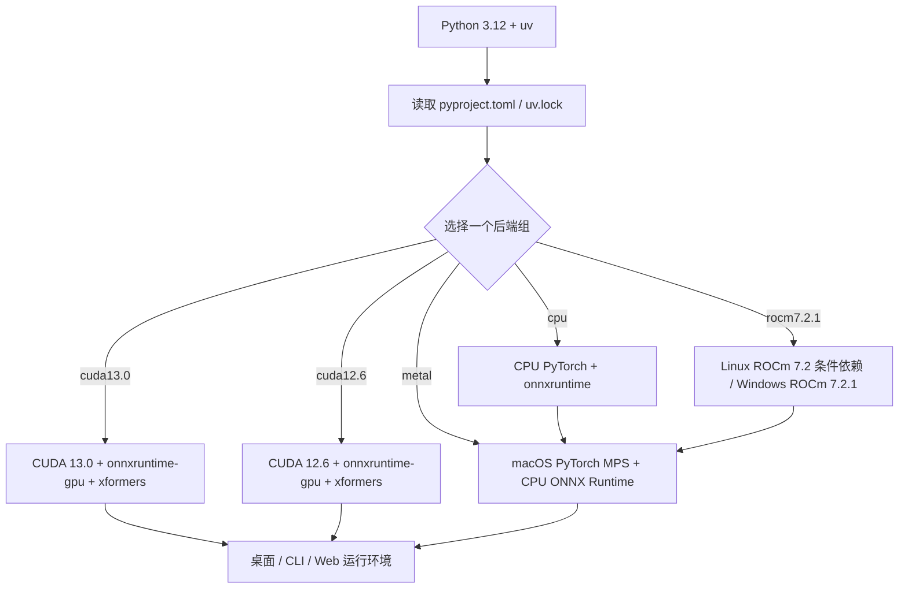

# 运行环境与依赖要求

## 适合哪些安装方式

这里说明安装前置：Python/uv 版本、CPU/NVIDIA/AMD/Apple Silicon 后端、公共 Python 包、模型、字体和字典。Windows 便携包菜单与更新见[Windows 便携版](./windows-portable.md)，Unix 脚本见[Linux 与 macOS](./linux-and-macos.md)，Docker 卷见[Docker](./docker.md)。这里不记录 API Key、用户配置或翻译质量。

当前定义以 `pyproject.toml` 与 `uv.lock` 为准；`requirements_cpu.txt`、`requirements_gpu.txt`、`requirements_amd.txt`、`requirements_metal.txt` 是保留的旧式/平台说明，不应与当前 uv 环境混装。

## 系统要求

| 项目 | 最低要求 | 推荐 |
| --- | --- | --- |
| 操作系统 | Windows 10/11（64 位）、Linux、macOS 12+（Apple Silicon） | 同最低要求 |
| 内存 | 8 GB | 16 GB 或更多 |
| 磁盘 | 5 GB 可用空间 | 10 GB SSD |
| Python（源码版） | 3.12（`>=3.12,<3.13`） | 3.12 |
| NVIDIA GPU | GTX 1060 及以上、6 GB 显存；GeForce 10 系必须使用 CUDA 12.6，CUDA 13.0 仅支持 Turing（计算能力 7.5）及更新架构 | 显存更大更佳 |
> GeForce 10 系列（如 GTX 1060/1070/1080）即使新驱动显示支持 CUDA 13，也必须选择 CUDA 12.6 包。RTX 20/30/40/50 系列在驱动支持 CUDA 13.0 时可选择 CUDA 13.0 包；RTX 50 系列推荐 CUDA 13.0。
| AMD GPU | 仅 RX 7000/9000 系列（RDNA 3/4），ROCm 为实验性支持；RX 5000/6000 请使用 CPU 版 | — |

> Windows AMD 可选择实验性的 AMD 发布便携包或通过维护脚本安装；两者均要求受支持的显卡、Radeon ROCm 7.2.1 和 AMD 26.2.2 驱动。ROCm 在 Windows 上仍属实验性路径。

## 安装前检查

1. 使用 Python **3.12**。约束为 `>=3.12,<3.13`，Python 3.13+ 不在支持范围内。
2. 安装 `uv`，在仓库根目录执行且只选择一个后端组。
3. 准备下载 PyTorch、模型和（启用语义断句时）HanLP 模型所需的网络与磁盘空间。
4. 在线翻译器仍需提供商凭据；凭据不属于本页。
5. Windows 用户请先确保已安装 Microsoft Visual C++ 运行库（[vc_redist.x64.exe](https://aka.ms/vs/17/release/vc_redist.x64.exe)）；缺少它可能导致程序启动报错（如缺少 VCRUNTIME140.dll）。

| 目标环境 | 命令 | 说明 |
| --- | --- | --- |
| NVIDIA CUDA 13.0（源码开发默认） | `uv sync` | 默认 `cuda13.0`、`packaging` 与 `test` 组；PyTorch 使用 cu130 |
| NVIDIA CUDA 12.6 | `uv sync --no-default-groups --group cuda12.6` | PyTorch 使用 cu126；与 CUDA 13.0 组位于同一源码分支 |
| CPU | `uv sync --no-default-groups --group cpu` | CPU PyTorch 与 `onnxruntime` |
| Linux AMD ROCm | `uv sync --no-default-groups --group rocm7.2.1` | 使用 ROCm 7.2 索引；Windows 安装器使用 ROCm 7.2.1 固定运行时 |
| macOS Apple Silicon | `uv sync --no-default-groups --group metal` | PyPI PyTorch/MPS；ONNX Runtime 仍为 CPU 版 |

源码安装步骤：安装 Git、uv 和 Python 3.12 → `git clone https://github.com/hgmzhn/manga-translator-ui.git` 并进入仓库根目录 → 按上表执行对应的 `uv sync` 命令 → 用 `uv run --no-sync` 启动。`uv.lock` 已锁定版本，必要时用 `uv sync --locked` 校验一致性。

完成后可用 `uv run --no-sync python -m desktop_qt_ui.main` 启动桌面 UI；`--no-sync` 不重新解析或安装依赖。

## 安装步骤

本页没有独立的桌面安装页：源码运行时通过终端选择依赖组，Windows 安装器检测显卡并选择方案。安装器文案来自 `packaging/launch.py` 与脚本，不是 `desktop_qt_ui/locales/*.json` 的桌面 i18n。

安装后桌面控件只改变运行行为，不替换已安装后端：

- “使用 GPU”（`label_use_gpu`）请求 GPU 加速，不会把 CPU 环境变成 CUDA 环境。
- “禁用 ONNX GPU 加速”（`label_disable_onnx_gpu`）仅关闭 ONNX Runtime GPU 路径。
- “翻译完成后卸载模型”（`label_unload_models_after_translation`）控制任务后释放显存/内存。
- “字体”（`label_font_family`）扫描系统字体和项目 `fonts/`；加入字体后重新打开下拉框刷新。

## 安装脚本做了什么

公共运行依赖在 `[project].dependencies`，硬件后端、打包和测试工具在 `[dependency-groups]`。`default-groups = ["cuda13.0", "packaging", "test"]` 使源码开发的 `uv sync` 默认采用 CUDA 13.0 并安装开发工具；安装器显式禁用默认组，只选择一个硬件组，因此不会检查 `test` 组。`conflicts` 声明 `cpu`、`cuda13.0`、`cuda12.6`、`rocm7.2.1`、`metal` 互斥。PyTorch/torchvision 按组绑定显式索引，两个 CUDA 组包含 `xformers`，Metal 不使用 CUDA 索引。

安装和模型是两个阶段。`manga_translator/utils/inference.py` 以 `models/` 为模型根目录，OCR、检测、修复、上色、超分模型通常在首次启用时创建目录并下载/加载。`rendering/chinese_linebreak.py` 检查 HanLP 模型；缺失时记录并回退普通换行。

## 环境与兼容性

- **CPU**：不需要 CUDA/ROCm，兼容性高但速度受 CPU/内存限制。
- **NVIDIA GPU**：当前组含 `torch==2.13.0`、`torchvision==0.28.0`、`onnxruntime-gpu==1.28.0`、`xformers==0.0.35`；驱动需支持对应 CUDA。
- **AMD ROCm**：Linux x86_64 由 `pytorch-rocm72` 提供；Windows AMD 由安装器先装 Radeon ROCm SDK、再装配套 PyTorch wheels，属实验性路径。
- **Metal**：Apple Silicon 使用 PyPI PyTorch/MPS，不装 CUDA、`onnxruntime-gpu` 或 `xformers`。

不要在同一环境追加另一后端，或混用 `onnxruntime` 与 `onnxruntime-gpu`、不同 CUDA/ROCm 索引的 Torch。更换后端应新建环境或清理后按一组同步。

| 组件 | 冲突/前置 | 处理 |
| --- | --- | --- |
| `pydensecrf` | Python 3.12 的 Windows/macOS/Linux x86_64 优先预编译 wheel，其他回退可能需 C++ 工具 | 让 uv 按平台 source 选择，不跨平台复制 wheel |
| `xformers` | 仅 GPU 组 | 不从旧 GPU 文件复制到其他组 |
| Torch/Triton | 必须匹配同一平台索引；Windows AMD 还需 SDK/驱动 | 用锁文件或安装器成套安装 |
| 旧 requirements | 版本可能与当前 pyproject/lock 不同 | 当前安装优先 `uv sync --locked` |

**硬件与资源前置**：GPU 需相应驱动；模型下载需网络和空间；`fonts/` 支持 `.ttf`、`.otf`、`.ttc`；`dict/` 包含 `.txt` 词典及 `.yaml`/`.json` 提示词。在线服务还需网络、模型名、地址和凭据。
