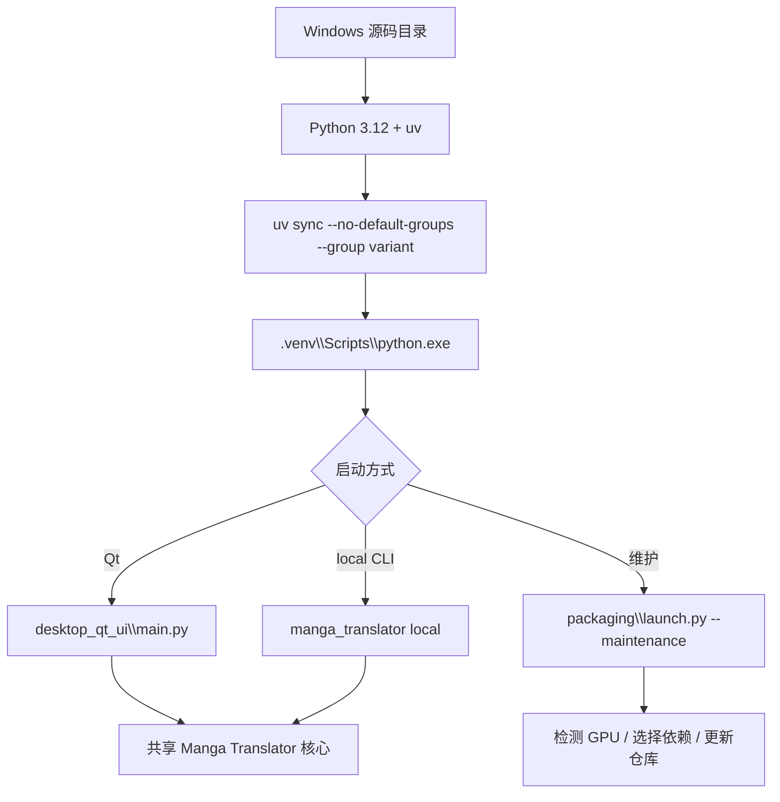

# Windows 源码安装

本页适合需要修改源码、运行未打包版本或希望自行管理 Python 环境的 Windows 用户。它说明从仓库到 Qt 启动的最小路径，不替代[安装要求](./requirements.md)中的硬件和依赖总表，也不替代[Windows 便携版](./windows-portable.md)的打包运行方式。

## 适合哪些安装方式 {#scope}

源码安装会在仓库目录内使用 Python 3.12 和 uv 管理依赖，随后直接启动 Qt 桌面程序或 CLI。它不安装 Windows 便携 Python，不创建 Conda 环境，也不会自动把源码环境变成 Docker 镜像；AMD Windows 的特殊 ROCm 安装仍由项目启动器处理。

如果只想解压即用，选择便携包；如果只部署浏览器服务，选择 Docker。源码环境的优点是可以切换分支、修改代码、运行测试和精确选择依赖组，代价是需要自行维护 Git、uv、Python、模型和驱动。

## 安装步骤 {#ui-operations}

### 准备仓库和工具

> Windows 用户请先确保已安装 Microsoft Visual C++ 运行库（[vc_redist.x64.exe](https://aka.ms/vs/17/release/vc_redist.x64.exe)）；缺少它可能导致程序启动报错（如缺少 VCRUNTIME140.dll）。

源码环境需要 Git、uv 和 Python 3.12（`>=3.12,<3.13`）。安装步骤：

1. 安装 [Git](https://git-scm.com/)、[uv](https://docs.astral.sh/uv/) 和 Python 3.12（可从 [python.org](https://www.python.org/downloads/) 下载 3.12 安装包，安装时勾选 “Add python.exe to PATH”）。
2. 克隆仓库并进入：
   ```powershell
   git clone https://github.com/hgmzhn/manga-translator-ui.git
   cd manga-translator-ui
   ```
3. 在仓库根目录按硬件执行一组 `uv sync`，见下一小节。

如果仓库已经存在，先进入仓库并确认工作区状态，再决定是否切换到 `main`、`beta` 或 tag。不要在有未提交修改时直接覆盖分支或执行会丢弃修改的 Git 操作。

### 按硬件选择一个依赖组

按硬件只选择一组依赖，命令在仓库根目录执行：

```powershell
# NVIDIA CUDA 13.0（源码开发默认）
uv sync

# NVIDIA CUDA 12.6
uv sync --no-default-groups --group cuda12.6

# CPU 版本
uv sync --no-default-groups --group cpu

# Linux AMD ROCm（实验性）
uv sync --no-default-groups --group rocm7.2.1

# macOS Apple Silicon / Metal
uv sync --no-default-groups --group metal
```

Windows 用户通常选择 CUDA 13.0、CUDA 12.6 或 CPU。Windows AMD 请使用安装器提供的 ROCm 7.2.1 流程；不要把 Linux ROCm 命令当成 Windows 固定 wheel 安装步骤。

### 启动源码程序

依赖同步完成后，在仓库根目录执行：

```powershell
# Qt 桌面界面
uv run --no-sync python -m desktop_qt_ui.main

# 命令行翻译单张图片
uv run --no-sync python -m manga_translator local -i <图片路径>
```

项目也提供 `Win-Start.bat`。它以脚本目录为当前目录，优先寻找包内 `packaging\python\python.exe`，其次回退到旧的 `manga-env`/`conda_env`；因此它不是源码环境的唯一启动器。源码环境应优先使用 `uv run` 命令，或在确认环境布局后直接调用 `.venv\Scripts\python.exe`。

### 维护和版本切换

需要由项目启动器执行安装/更新、检查 GPU 或切换版本时，可运行：

```powershell
uv run --no-sync python packaging\launch.py --maintenance
```

维护菜单提供安装、更新代码和依赖、切换 `main`/`beta`、按 tag 切换、切换 Git 镜像、重新检查版本、切换菜单语言和退出。切换分支/tag 前先保存自己的修改；维护菜单会操作仓库同步状态，不是只读检查。菜单各项的实际文案与存储值见[界面选项对照表](../reference/options-i18n-matrix.md)。

## 安装脚本做了什么 {#runtime}



`uv sync` 读取公共 `[project].dependencies` 和所选 dependency group，并依据 `tool.uv.sources` 为 CPU、CUDA 或 ROCm 的 PyTorch 选择索引。`uv run --no-sync` 使用现有 `.venv`，不会因为启动命令再次解析或升级依赖；依赖声明与 `uv.lock` 不一致时，应先重新锁定并同步，而不是忽略锁文件错误。

维护模式的 `prepare_environment` 会检测设备并检查当前 PyTorch 类型。自动模式可能在 NVIDIA、AMD、Apple Silicon、CPU 或 Intel GPU 路径之间选择；显式传入 `--requirements cpu|gpu|amd|metal` 时使用指定组，但仍会处理 AMD Windows 的额外流程和 PyTorch 不匹配。安装完成后，Qt 入口调用 `desktop_qt_ui.main`，CLI 入口调用 `manga_translator.__main__`；二者共享核心处理链。

## 环境与兼容性 {#dependencies}

- **Python 版本**：`pyproject.toml` 和启动器都限制 Python 3.12；Python 3.13 会被拒绝。检查 `uv run --no-sync python --version`，不要只检查系统默认 `python`。
- **后端组互斥**：`cpu`、`cuda13.0`、`cuda12.6`、`rocm7.2.1`、`metal` 在 `[tool.uv].conflicts` 中互斥。不要把多个后端组装进同一环境。
- **默认组**：项目默认组为 `cuda13.0`、`packaging` 和 `test`；其他运行环境使用 `--no-default-groups`，不会安装 `test` 组。
- **NVIDIA**：`cuda13.0` 使用 `pytorch-cu130`，`cuda12.6` 使用 `pytorch-cu126`；两者位于同一源码分支，并包含 `onnxruntime-gpu` 和 `xformers`。RTX 50 系列必须使用 CUDA 13.0 版本；其他支持 CUDA 13.0 及以上驱动的显卡也可运行 CUDA 12.6 版本。
- **ROCm**：Linux `rocm7.2.1` 组使用 ROCm 7.2 索引和平台标记的 torch/torchvision/triton；Windows 由启动器安装 ROCm SDK 7.2.1 与固定 PyTorch wheels，兼容性受驱动和 gfx 架构影响。
- **Metal**：`metal` 组面向 macOS Apple Silicon，使用普通 PyPI 的 MPS PyTorch、CPU ONNX Runtime 和 Cocoa；不要在 Windows 选择该组。
- **依赖冲突切换**：启动器检测到已安装 PyTorch 类型与目标不同，可能卸载 `torch`、`torchvision`、`torchaudio` 并清理 pip 缓存。先关闭其他使用 PyTorch 的 Python 进程。
- **模型和网络**：依赖安装不等于模型下载完成；检测器、OCR、翻译器和修复模型可能在首次运行时下载或读取本地模型。API 凭据和代理设置不要写进公开脚本。
