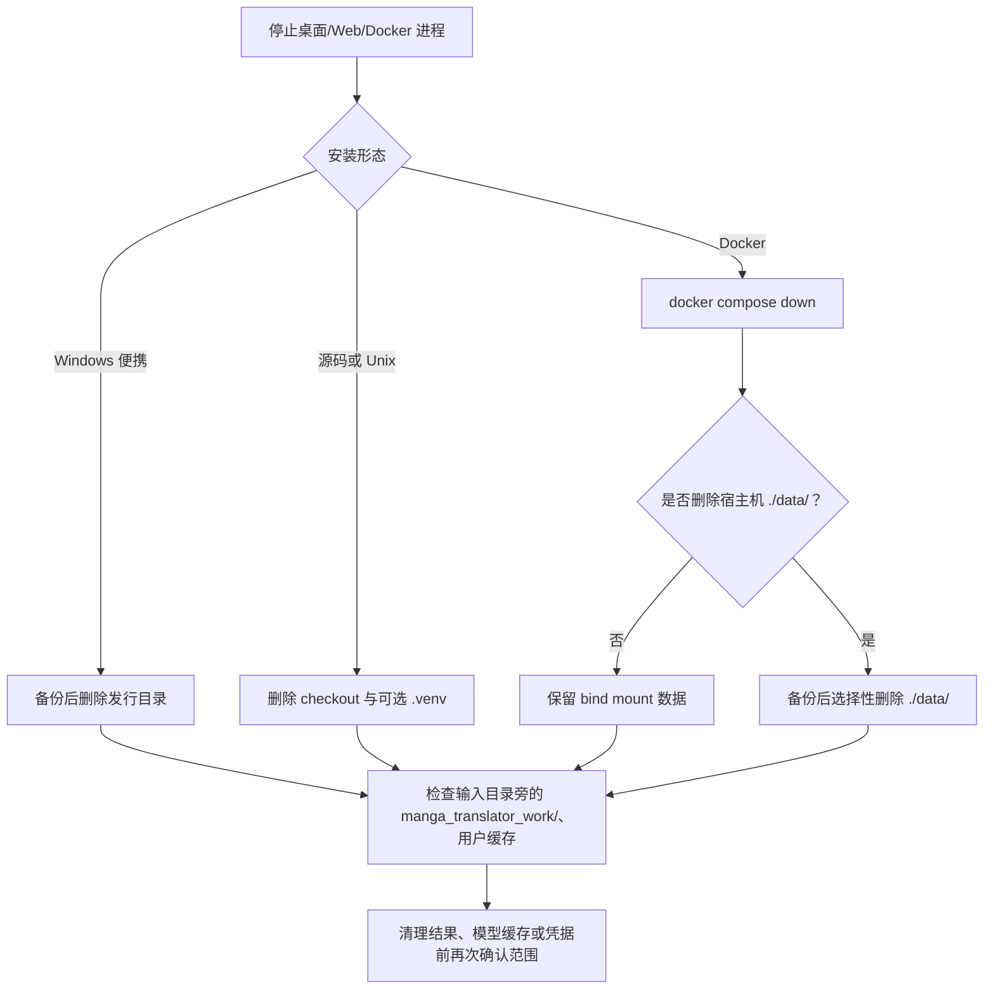

# 卸载与数据清理

## 适合哪些安装方式 {#scope}

这里说明如何停止应用后移除 Windows 便携版、源码/Unix 安装或 Docker 部署，以及哪些配置、模型、日志、结果和服务器资料需要单独处理。当前仓库的 `Win-*.bat`、`Unix-*.sh` 和 Docker Compose 没有提供一个统一的“卸载”按钮或卸载命令；卸载主要是删除安装目录、虚拟环境或宿主机挂载数据。

这里不替代[Windows 便携版](./windows-portable.md)、[Linux/macOS 安装](./linux-and-macos.md)和[Docker 安装](./docker.md)中的安装步骤，也不把应用内“清空结果”误写成完整卸载。

按安装形态卸载：

- **Windows 便携版（新版）**：完全绿色安装，**直接删除整个文件夹即可卸载**，没有其他步骤（不写注册表、不装服务）。可选清理：AI 模型缓存 `C:\Users\<你>\.cache\huggingface`、`.cache\torch` 可直接删除；`.gitconfig` 中的 git 安全目录记录可用 `git config --global --unset-all safe.directory` 清理。
- **旧版 Conda 布局**：先卸载 Miniconda——安装脚本装的 Miniconda3（程序目录内或磁盘根目录）里双击运行 `Uninstall-Miniconda3.exe`，卸载完残留文件夹直接删掉；自己单独安装且要继续使用的 Miniconda 只执行 `conda env remove -n manga-env -y`。然后删除整个程序文件夹（含 PortableGit、代码和脚本）。

下面按安装形态补充详细数据清理边界。

## 安装步骤 {#operations}

### 通用顺序

1. 等待当前任务结束，关闭桌面应用；Web 用户先停止服务，Docker 用户先执行 `docker compose down`。不要在进程仍写日志、结果或数据库时直接删除目录。
2. 备份需要保留的 `config/`、`.env`、`models/`、`result/`、`manga_translator_work/` 或服务器 `data/`。复制前逐项检查其中是否包含密钥、会话、提示词、用户图片和绝对路径。
3. 按下表删除对应安装目录或虚拟环境。只想释放空间时，先选择性清理缓存/结果，不要把它当成卸载完成。
4. 重新安装前确认没有旧环境路径仍被启动脚本优先使用，并在保留配置前检查其版本兼容性。

### 安装形态与删除动作

| 安装形态 | UI/命令动作 | 默认保留位置 | 删除范围 |
| --- | --- | --- | --- |
| Windows 便携版 | 关闭应用后删除包含 `Win-Start.bat` 的完整发行目录 | 发行目录中的 `config/`、`models/`、`result/`、资源和 `packaging/python/` | 整个发行目录；脚本没有注册表或服务卸载步骤 |
| Windows 旧 Conda 布局 | 先停用/移除仅供本项目使用的环境，再删除程序目录；共享 Conda 不要整体删除 | 外置 Miniconda、`manga-env` 或程序目录下 `conda_env/` | 仅删除确认属于本项目的环境和程序目录 |
| Linux/macOS 源码 | 停止进程后删除 checkout；若不保留环境，连同 `.venv/` 一起删除 | checkout 内 `.venv/`、`config/`、`models/`、`result/`、`logs/` | checkout 目录；输入目录旁的 `manga_translator_work/` 需另行处理 |
| Docker Compose | 在 Compose 所在目录执行 `docker compose down`，再按需删除宿主机 `data/` | `./data/config`、`server`、`models`、`result`、`logs`、`fonts`、`dict` | 容器/镜像与宿主机 bind mount 分开删除；`down` 不会自动删除 `./data/` |

### 应用内清理和 UI 文案

Web 管理界面中的清理功能只处理服务器清理服务定义的目录；它不是删除程序目录的卸载器。结果页的“清空翻译结果”只清空浏览器结果列表和 blob URL，不等同于删除宿主机结果文件。

清理相关界面文案的实际值见[界面选项对照表](../reference/options-i18n-matrix.md)。

## 安装脚本做了什么 {#runtime}

运行时路径由 `manga_translator.runtime_paths` 决定：源码运行时配置目录是项目根的 `config/`，冻结运行时是可执行文件旁的 `config/`。模型默认位于应用目录下的 `models/`；桌面日志位于应用目录下的 `result/`。若启用 `save_to_source_dir`，结果会写到输入图片所在目录的 `manga_translator_work/result/`，所以删除安装目录不会删除这些输入目录旁的产物。

Docker 把宿主机 `./data/{fonts,dict,result,models,logs,server,config}` 分别挂载到容器；删除容器不会删除这些宿主机文件。服务器数据还包括 `manga_translator/server/data` 下的管理员配置、用户资源和历史相关资料，必须先备份并脱敏再决定是否删除。

服务器自动清理默认关闭；默认配置为每 24 小时检查一次、删除超过 7 天的文件，并在相关目录总量超过 10 GiB 时按最旧文件继续删除。它只遍历服务器 `data/results`、用户字体和用户提示词目录，不清理应用安装目录、模型目录、桌面日志或输入旁的工作目录。

## 环境与兼容性 {#dependencies}

- **进程占用**：未停止的 Qt、Python、uvicorn 或 Docker 容器可能继续写文件，Windows 也可能拒绝删除 DLL；先关闭进程或停止容器。
- **便携 Python 与 Conda/venv**：`Win-Start.bat` 和 `Win-Install-or-Update.bat` 优先使用 `packaging/python/python.exe`，缺失时才查找 `manga-env` 或 `conda_env`。不要为了卸载便携版删除仍被其他项目使用的 Miniconda；不要让旧 PATH 指向已删除环境。
- **硬件依赖**：卸载 GPU 版只会移除应用目录内的环境和文件，不会替用户卸载系统 NVIDIA/AMD 驱动；驱动是其他软件的共享依赖。
- **Docker 持久化**：`docker compose down`、删除容器、删除镜像和删除 bind mount 是不同动作。删除 `./data/server` 会丢失 Web 账户/会话/历史及服务器资源；删除 `./data/models` 会导致以后重新下载模型。
- **缓存与凭据**：Hugging Face/Torch 等用户级缓存可能位于用户 profile 外部目录；`.env` 和配置文件可能含 API 凭据。删除前先决定是否迁移，分享日志前检查密钥、令牌、用户名、绝对路径和用户内容。
- **版本切换**：卸载不是更新。维护器更新时可能清理 uv/pip 下载缓存并移除不适合当前平台的启动文件，但不会替用户删除全部数据目录。
