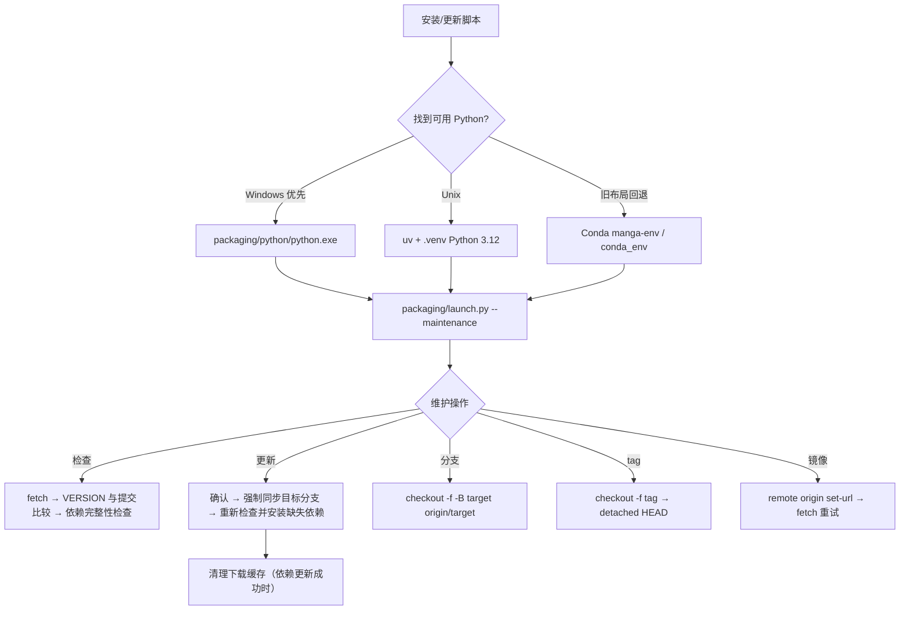

# 更新与版本切换

## 适合哪些安装方式 {#scope}

这里说明安装脚本交给 `packaging/launch.py --maintenance` 的更新维护流程：检查代码与依赖、切换 Git 分支或 tag、切换镜像源，以及维护菜单语言。它不替代首次安装、Windows 运行时选择、Linux/macOS 引导或卸载/数据清理页面；其中“版本”指代码版本和依赖环境，不是桌面应用内的翻译器设置。

维护菜单是交互式命令行界面。Windows 使用 `Win-Install-or-Update.bat`，Linux/macOS 使用 `Unix-Install-or-Update.sh` 引导；两者最终都进入同一个 Python 维护菜单。

## 安装步骤 {#operations}

### 运行维护菜单

更新、切换分支/版本、切换镜像都通过维护菜单完成；Windows 便携包、Linux/macOS 与源码环境的入口如下。源码环境可在仓库根目录运行 `uv run --no-sync python packaging\launch.py --maintenance` 直接进入维护菜单。

- Windows：在项目目录运行 `Win-Install-or-Update.bat`。脚本先切换到自身目录，再优先使用 `packaging\\python\\python.exe`；找不到时才使用旧 Conda 布局。
- Linux/macOS：运行 `Unix-Install-or-Update.sh`。脚本检查平台和 Git，在需要时引导安装 uv、Python 3.12 和 `.venv`，然后启动维护菜单。已有完整项目目录不会重复克隆；非空的无关目录会被拒绝。
- 维护菜单首次显示当前分支/tag 状态、镜像源、本地版本和远程版本。需要网络的检查失败时，远程版本显示为不可用，不应据此判断“已是最新”。

### 更新代码和依赖

1. 选择 `[2] 更新 (代码+依赖)`。
2. 菜单先执行远程 fetch，并比较 `packaging/VERSION` 与目标分支的版本，同时比较本地和远程提交；然后检查当前环境是否缺少 `pyproject.toml` 所声明的依赖。
3. 若代码和依赖均满足，显示无需更新；否则明确询问是否继续。输入 `y` 或 `yes` 才继续，其他输入取消。
4. 代码更新成功后会重新检查依赖，再按已检测到的 CPU/GPU/AMD/Metal 方案安装缺失项。代码同步失败时跳过依赖更新，避免把半套更新报告为成功。
5. 依赖失败时已成功安装的包会保留；可以重试，重试从剩余包继续。依赖更新成功后会自动清理 uv/pip 下载缓存；代码和依赖都完成才显示更新完成。

更新代码使用强制同步到 `origin/<分支>` 的方式，未提交修改可能被覆盖。执行前请在应用目录外备份需要保留的配置或资源，并先确认工作树状态；不要把维护脚本当作版本备份工具。

### 切换分支

选择 `[3] 切换分支 (main/beta)`，在 `main`（稳定版）和 `beta`（测试版）中选择。脚本 fetch 后以 `git checkout -f -B <目标> origin/<目标>` 强制同步，确认提示明确说明本地修改会被覆盖。切换成功后建议再选择一次更新，使依赖与新分支重新匹配。

从 tag 或游离提交切换分支时，当前状态会被标记为 `tag/detached`；更新比较会回落到 `main`，但不要把这当作自动回到 main。

### 按 tag 切换版本

选择 `[4] 切换版本 (按 tag)`。菜单获取 tag 列表，按创建时间倒序最多显示 20 项，也接受直接输入 tag 名。确认后执行强制 `git checkout`，进入 detached HEAD；成功后提示更新该版本依赖。要回到最新分支代码，使用 `[3] Switch branch`，不要在 detached 状态直接执行常规开发提交。

### 镜像、检查和语言

- `[5] 切换镜像源`：在 GitHub 官方源、Gitee 镜像或手动仓库地址之间选择，修改 `origin`；fetch 失败时菜单也会建议切换另一条线路后重试。包下载还会使用 PyPI/PyTorch 镜像回退，它与 Git 远程地址是两层配置。
- `[6] 重新检查版本`：只 fetch 并显示本地/远程版本和提交差异，不修改代码或依赖。
- `[7] 切换语言`：只改变维护菜单 `L()` 输出，并写入 `packaging/maintenance_config.json`；不改变桌面 Qt 的 `app.ui_language`。
- `[8] 退出`：离开维护菜单。更新或切换完成后，Windows 再运行 `Win-Start.bat`，Unix/macOS 再运行 `Unix-Start.sh`。

## 安装脚本做了什么 {#runtime}

更新判断不是只看版本字符串：代码更新条件包含 fetch 失败、远程 `packaging/VERSION` 不同或提交不同；依赖更新条件来自当前 PyTorch 方案和包完整性检查。代码更新完成后才重新计算依赖，避免用旧代码的依赖清单作结论。

包安装优先使用可发现的 uv 批量安装；uv 不可用时回退为 pip 逐包安装。普通包走 PyPI 镜像回退，PyTorch 包走对应 CPU/CUDA/ROCm 专用索引或其回退源。安装缓存清理不删除项目配置、模型或字体。

## 环境与兼容性 {#dependencies}

- `pyproject.toml` 要求 Python `>=3.12,<3.13`；Python 3.13 不可作为替代环境。
- `cpu`、`cuda13.0`、`cuda12.6`、`rocm7.2.1`、`metal` 是 uv 互斥 dependency groups。切换硬件后不要在同一个环境叠加多个后端；应按维护菜单检测结果重装匹配方案。
- Windows ROCm 7.2.1 由 `packaging/launch.py` 单独按 Radeon SDK → PyTorch 顺序处理。显卡品牌被检测到不等于驱动和 ROCm 已可用。
- 旧 Conda 只在便携 Python/Unix `.venv` 不可用时回退。混用 `packaging/python`、`.venv`、`conda_env` 或外部环境可能造成 DLL、Torch、ONNX Runtime 冲突。
- 代码更新可能覆盖本地源码修改；tag 会进入 detached HEAD。配置、提示词、模型、字体和工作目录资源应在切换前单独备份并审查。
- 更新需要 Git 和包索引/镜像网络；翻译 API 的运行时网络、密钥和配额是另一条链路。更新成功不代表 API 可用，也不保证模型已下载或显存足够。
