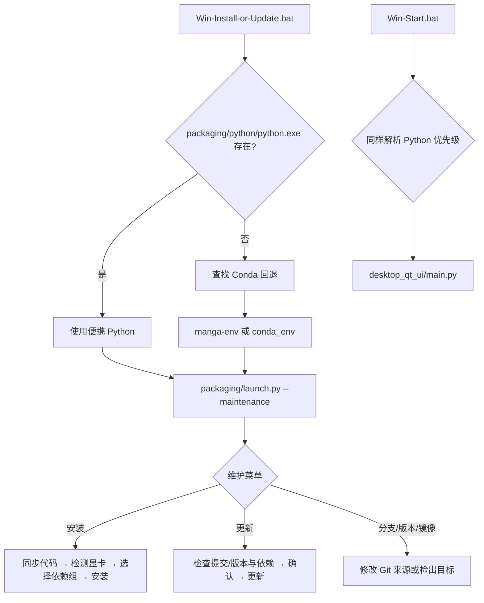

# Windows 便携版

## 适合哪些安装方式 {#scope}

这里说明仓库根目录下 `Win-Install-or-Update.bat`、`Win-Start.bat` 的 Windows 启动链、环境选择和维护菜单。它适用于源码/发行目录中已有这些脚本的 Windows 用户；它不替代从源码安装、Docker、Linux/macOS 或版本卸载页面，也不描述桌面翻译参数。

“便携”指脚本优先使用应用目录内的 `packaging/python/python.exe`，而不是要求用户先激活系统环境。若没有该解释器，当前脚本仍兼容旧版 Conda 布局；这不是两套可以同时混装的依赖方案。

## 安装步骤 {#operations}

### 首次安装或维护

> 安装前请先确保已安装 Microsoft Visual C++ 运行库（[vc_redist.x64.exe](https://aka.ms/vs/17/release/vc_redist.x64.exe)）；缺少它可能导致程序启动报错（如缺少 VCRUNTIME140.dll）。

便携安装包来自 GitHub Releases 的 `portable` 标签：

1. 前往 [便携整合包发布页](https://github.com/hgmzhn/manga-translator-ui/releases/tag/portable) 下载最新版本并解压；包内自带打包版 Python 3.12 和 uv，无需预装 Python。
2. 双击 `Win-Install-or-Update.bat` 打开维护菜单，选择 `[1] 安装`：
   - 选择下载线路（GitHub 官方 / Gitee 国内镜像，国内推荐 Gitee）。
   - 脚本强制同步最新代码；同步失败会提示切换线路重试。
   - 自动检测显卡（NVIDIA / AMD / 集显；多显卡时列出选择）。
   - 选择 PyTorch 版本：GeForce 10 系必须使用 `cuda12.6`；RTX 50 系必须使用 `cuda13.0`，如不支持请更新 NVIDIA 驱动；其他显卡按检测结果选择。
   - uv 批量安装依赖（PyPI 多镜像回退：清华 → 阿里 → 豆瓣 → 官方），失败可重试，已安装包保留。
   - 完成后自动清理下载缓存。
3. 安装完成后，以后每次使用双击 `Win-Start.bat` 启动。
4. 更新：再次双击 `Win-Install-or-Update.bat`，选择 `[2] 更新`。
5. 卸载：直接删除整个文件夹即可（新版为完全绿色安装，不写注册表；旧版 Conda 布局的卸载见[卸载与数据清理](./uninstall-and-data-cleanup.md)）。

> 如果安装一直失败，可以改用[下载发布便携包](./release-download.md)：从 GitHub Releases 下载 CPU、NVIDIA GPU 或 AMD 分卷包，解压 `.001` 后运行 `Win-Start.bat`，无需自行安装 Python。

`Win-Install-or-Update.bat` 与 `Win-Start.bat` 的启动链、环境选择和维护菜单行为见下文各节。

### 更新、分支和版本

- “更新”先检查远程代码版本/提交和当前 PyTorch 依赖；没有更新时明确提示无需更新，有更新时要求输入 `y/yes` 确认。
- “切换分支”在 `main` 与 `beta` 间切换；“切换版本”按 tag 切换。切换后不要把本地未提交修改当作可恢复备份，先自行备份并确认工作树状态。
- “切换镜像源”改变后续 Git/包下载的来源；网络失败不会被解释为安装成功。
- “重新检查版本”只做检查；“切换语言”改变维护菜单输出语言；“退出”离开菜单。

### 启动与错误反馈

`Win-Start.bat` 先输出 `Starting...`，运行 `desktop_qt_ui\\main.py`。应用正常关闭时显示 `Application closed.`；非零退出时显示错误码、建议重新安装和公开 Issue 地址，并询问是否打开维护脚本。若既找不到便携 Python，也找不到有效 Conda 环境，脚本报告环境缺失并退出，不会静默使用另一个 Python。

## 安装脚本做了什么 {#runtime}

批处理只负责定位运行时、设置 `PYTHONUTF8=1`、补充 PATH 并调用 Python。便携 Python 的优先级高于 Conda：脚本寻找 `packaging\\python\\python.exe`；缺失时才查找目录旁或盘符根目录的 `Miniconda3`、`CONDA_EXE` 能找到的 Conda 根、命名环境 `manga-env`，最后兼容应用目录下的 `conda_env`。Conda 回退通过 PATH 前置模拟激活，但不会修改系统环境。

`launch.py` 的安装流程从 `pyproject.toml` 读取依赖和 PyTorch 源；更新同时比较 `packaging/VERSION`、远程提交和依赖完整性。优先使用可找到的 uv 批量安装，找不到 uv 时按包使用 pip 回退，并在源失败时尝试其他配置的镜像。AMD Windows 路径会先检查显卡/驱动兼容性，再按脚本逻辑安装 Radeon SDK 与 PyTorch；不兼容时可能退回 CPU 或要求用户取消，不能把“检测到 AMD”当成成功启用 ROCm。

## 环境与兼容性 {#dependencies}

- **Python 版本**：当前启动器只接受 Python 3.12；`pyproject.toml` 约束为 `>=3.12,<3.13`。系统 Python 3.13 或其他版本不能作为便携运行时的替代品。
- **依赖组互斥**：`cpu`、`cuda13.0`、`cuda12.6`、`rocm7.2.1`、`metal` 在 uv 配置中互斥。不要把 CPU、NVIDIA CUDA、AMD ROCm 组叠加到同一个环境；切换硬件后应使用维护菜单检查并按提示重装匹配依赖。
- **Windows ROCm**：脚本单独处理 ROCm SDK 7.2.1/PyTorch 顺序，并提示驱动与支持列表限制。兼容性不能仅凭 AMD 显卡品牌判断。
- **旧 Conda**：只有便携解释器不存在时才回退。不要同时把 `packaging\\python`、`conda_env` 和外部环境的包混作一个环境；错误的 PATH 可能导致 DLL、Torch 或 ONNX Runtime 冲突。
- **GPU/CPU 资源**：GPU 依赖不等于模型已下载，也不保证显存足够；首次启动仍可能下载或初始化模型。CPU 方案可运行但通常更慢。安装失败时不要删除已成功包后反复切换方案。
- **网络**：安装/更新需要 Git、包索引或镜像网络；API 网络是应用运行时的另一条链路，不能用“安装成功”证明翻译 API 可用。
