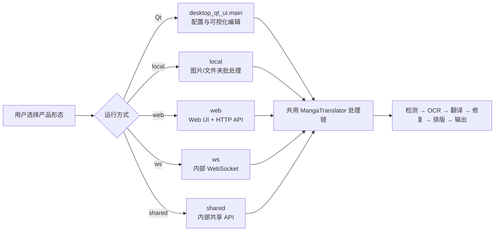

# 产品形态

本项目提供桌面 Qt 界面、`local` 命令行、Web 界面，以及供内部集成使用的 `ws` 与 `shared` 服务形态。它们共用翻译核心，但交互方式、网络边界和适用场景不同；先按使用方式选择，再进入具体参数页面。

这里仅帮助选择运行形态，不展开翻译参数、API 凭据、九种工作流或 HTTP 请求字段。共同输入和流程见[首次翻译](./first-translation.md)，安装方式见[Windows 便携版](../install/windows-portable.md)、[Linux/macOS 安装](../install/linux-and-macos.md)与[Docker 部署](../install/docker.md)。

## 先了解这些 {#scope}

| 形态 | 适合解决的问题 | 不负责的事情 |
| --- | --- | --- |
| Qt 桌面应用 | 本机选择文件、调整设置、查看进度，并在可视化编辑器中修改区域和样式 | 不把编辑器操作变成公共 HTTP API |
| `local` 命令行 | 对图片或文件夹执行可脚本化的本地翻译、输出和批处理 | 不监听端口，不提供浏览器工作区 |
| `web` Web UI | 通过浏览器上传、配置、启动任务、查看结果和历史；同一进程也提供 HTTP API | 不等于内部 `ws`/`shared` 协议 |
| `ws` WebSocket | 作为内部后端连接上游 WebSocket，为本地集成提供处理能力 | 不是面向普通用户的公开 Web API |
| `shared` 内部 API | 让本地集成调用共享的翻译实例 | 不是无需鉴权即可暴露到公网的服务 |
| Docker 部署 | 以容器方式运行 Web 形态，并通过卷保存资源和服务器数据 | 不是另一套翻译引擎；容器端口不能当作宿主机端口 |

## 如何选择与启动 {#choose-and-start}

### Qt 桌面应用 {#desktop}

适合第一次使用、需要逐项检查参数或需要翻译后手工修订的场景。启动后默认进入“翻译界面”，侧栏还提供“设置”“API 管理”“提示词管理”“替换规则”“富文本规则”“批量管理”和底部的“编辑器视图”。语言与主题位于通用设置区；切换语言后界面文字会立即刷新。

最短路径是：启动应用 → 在“API 管理”配置当前功能所需连接 → 在“翻译界面”加入图片或文件夹 → 选择工作流并开始。文件添加、输出目录、进度和编辑器细节由后续页面说明。

### 本地命令行 {#local-cli}

适合自动化、批量处理和无桌面环境。正式入口是：

```text
uv run --no-sync python -m manga_translator local -i <图片或文件夹> [选项]
```

`-i` 可接一个或多个输入；`-o` 指定输出目录，`--config` 指定配置文件，`--overwrite` 允许覆盖已有输出。`--format`、`--batch-size` 和 `--attempts` 是显式覆盖；只有启用 `--subprocess` 时，`--memory-limit`、`--memory-percent` 和 `--batch-per-restart` 才会被下游消费。不启动子进程时，不要把这些内存参数当作普通翻译参数。

当第一个参数不是正式模式且命令行包含 `-i`/`--input` 时，解析器会隐式插入 `local`；自动化脚本仍建议显式写出 `local`。

### Web 界面与服务器 {#web}

适合需要浏览器、多人权限或服务端任务历史的场景。正式入口是：

```text
uv run --no-sync python -m manga_translator web
```

默认监听 `0.0.0.0:8000`，可用 `MT_WEB_HOST` 和 `MT_WEB_PORT` 改写。`0.0.0.0` 只表示监听所有 IPv4 接口，不是浏览器地址；本机通常访问 `http://localhost:8000`。Docker GPU compose 将宿主机 `8001` 映射到容器 `8000`，访问端口应以实际映射为准。

Web 工作区可选择图片、目录以及 `image/*`、PDF、JSON、TXT 输入，选择工作流后启动任务；结果可预览、单项下载或批量下载。登录后的请求使用 `X-Session-Token`，并区分普通工作区与 `/admin` 管理界面。不要把令牌、API Key 或用户图片复制到文档、日志或截图。

### `ws` 与 `shared` 内部形态 {#internal-services}

只有在已有本地集成或上游服务要求时才选择它们。两者默认监听 `127.0.0.1:5003`，因此不会像 `web` 那样默认监听所有接口：

```text
uv run --no-sync python -m manga_translator ws
uv run --no-sync python -m manga_translator shared
```

`ws` 还连接默认上游 `ws://localhost:5000`，可通过 `--ws-url`、`--nonce` 等选项调整；`shared` 使用 `--nonce` 保护内部 API 通信。协议消息、锁、流式响应和 nonce/secret 契约属于开发者页面，这里不把它们宣传成普通公共 API。

### Docker {#docker}

Docker 适合已有容器运维流程、希望隔离依赖或运行 Web UI 的用户。CPU compose 服务把宿主机 `8000` 映射到容器 `8000`；GPU 服务把宿主机 `8001` 映射到容器 `8000`，并声明 NVIDIA GPU。持久化卷覆盖 `/app/fonts`、`/app/dict`、`/app/models`、`/app/config`、`/app/manga_translator/server/data` 等目录。

不要把 compose 中的管理员密码示例用于生产部署，也不要提交 `.env`。服务器数据、用户资源、会话、配额和历史元数据都应按敏感数据管理。

## 工作方式 {#runtime}

四种正式命令模式由同一个入口解析后分发；Qt 是独立的桌面入口，但最终与命令模式共用处理链：



命令行入口在分发前确保运行时文件，再调用 `local`、`web`、`ws` 或 `shared` 执行模块。Web 在核心处理链外增加认证、权限、并发、历史和下载票据；Docker 只是把 Web 进程与资源目录放入容器。`local` 普通运行会应用显式 CLI 覆盖；子进程模式另行管理内存阈值和重启。

## 选择时要注意 {#dependencies}

- **硬件**：各形态都可能加载 PyTorch、ONNX 或阶段模型；CPU/GPU/AMD/Metal 依赖组应按安装页选择。
- **配置**：`config/config.json`、发行示例和代码默认值属于不同层级；用户配置优先于示例，CLI 只覆盖实际写入的字段。
- **端口**：Web 默认 `8000`；WS/shared 默认 `5003`。同时运行内部服务时必须避免端口重复。
- **工作流**：九种工作流由配置字段驱动，特殊工作流通常不能进入 `batch_concurrent` 并发管线；具体跳过阶段见工作流矩阵。
- **网络与隐私**：Web 的 `0.0.0.0` 会扩大监听面；请求可能包含图片、OCR 文本和译文，公开部署前应配置鉴权、防火墙和安全的密钥注入。
- **编辑器**：可视化编辑器属于 Qt 桌面工作区；CLI/Web 生成项目 JSON 不代表具有同等编辑器交互。
