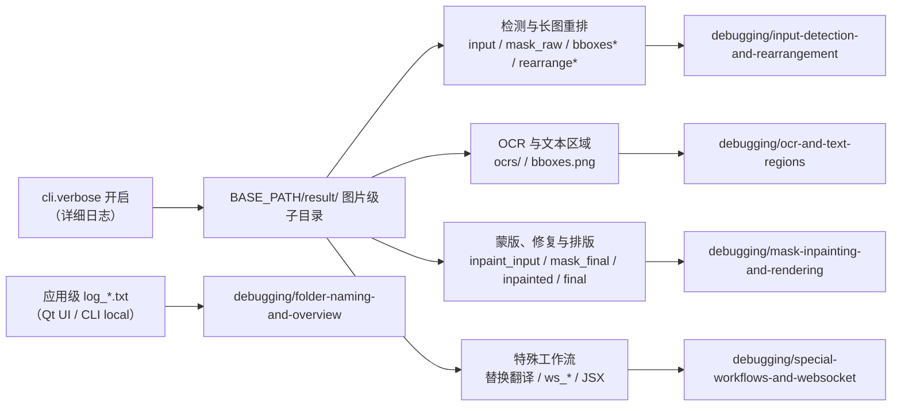

# 调试产物索引

当翻译结果异常或需要向开发者报告问题时，开启“详细日志”后，应用会在 `BASE_PATH/result/` 下写入调试图片、JSON、JSX 与日志文件。本页汇总这些调试产物的完整清单、触发条件与排查用途，并反向链接到 `debugging/` 下的专门页面；单个产物的深入解释不在此展开。

本索引只负责汇总与反向链接。命名规则、目录结构与“基础产物/条件产物”总览见[调试目录命名与总览](../debugging/folder-naming-and-overview.md)；各产物类别的深入说明分别见[输入检测与长图重排](../debugging/input-detection-and-rearrangement.md)、[OCR 与文本区域](../debugging/ocr-and-text-regions.md)、[蒙版、修复与排版](../debugging/mask-inpainting-and-rendering.md)、[特殊工作流与 WebSocket](../debugging/special-workflows-and-websocket.md)；清理、脱敏与对外分享见[如何阅读和分享一次调试运行](../debugging/how-to-read-and-share-a-debug-run.md)。

## 收录内容

- 这里仅汇总调试产物与触发条件，不重复各 `debugging/` 页面的运行机理、参数和文件格式说明。
- 所有图片级调试产物都受 `cli.verbose` 总开关控制（UI：详细日志）；关闭时不会生成带时间戳的图片级调试子目录。
- 图片级调试子目录名为 `{时间戳毫秒}-{图片 MD5 前 8 位}-{检测尺寸}-{目标语言}-{翻译器}`，由 `_set_image_context()` 在每张输入图开始处理时建立，位于 `BASE_PATH/result/` 下。
- 产物分为“基础产物”（verbose 正常流程最常出现）、“条件产物”（只在特定配置、检测器、工作流或模式下生成）和“目录级/回退产物”（`log_*.txt` 或未带图片级子目录的回退路径）三类。
- 当前代码搜索未发现仓库内对这些调试文件名的后续读回：它们是启用 verbose 的操作者或问题报告接收者的终端诊断写入。

## 操作方法

在设置页开启“详细日志”的完整操作步骤见[调试目录命名与总览](../debugging/folder-naming-and-overview.md)。这里仅记录与本索引直接相关的 UI 文案：

## 调试产物汇总

下表按“基础产物 / 条件产物 / 目录级与回退产物”分组，列出当前源码在不同模式下可能生成的完整产物集合。同一行中的“深入页面”指向该产物的专门解释页；“生成阶段与触发条件”只记录当前代码的写入点与开关。

### 基础产物

以下产物在 verbose 正常流程中最常出现；是否真正生成仍取决于检测/OCR 结果与翻译进度：

| 产物 | 生成阶段与触发条件 | 内容与排查用途 | 深入页面 |
| --- | --- | --- | --- |
| `input.png` | `_translate_until_translation()` 且 `verbose=True` | 处理前的输入图；检测/OCR 问题排查 | [输入检测与长图重排](../debugging/input-detection-and-rearrangement.md) |
| `mask_raw.png` | 检测后，`verbose=True` 且检测返回 `ctx.mask_raw` | 带颜色条的原始检测置信热图；检测阈值排查 | [输入检测与长图重排](../debugging/input-detection-and-rearrangement.md) |
| `bboxes_unfiltered.png` | 检测后仍有文本行 | 原图上的未过滤文本行框；检测/OCR 过滤排查 | [输入检测与长图重排](../debugging/input-detection-and-rearrangement.md) |
| `bboxes.png` | OCR 与文本行合并后存在 `ctx.text_regions` | 最终文本块可视化；合并/排序排查 | [OCR 与文本区域](../debugging/ocr-and-text-regions.md) |
| `ocrs/<序号>.png` | 各 OCR 实现，且文本区域未被前置过滤 | 透视裁切后的 OCR 输入；垂直文本会旋转 | [OCR 与文本区域](../debugging/ocr-and-text-regions.md) |
| `inpaint_input.png` | 翻译完成后存在 `ctx.mask` | 修复输入预览 | [蒙版、修复与排版](../debugging/mask-inpainting-and-rendering.md) |
| `mask_final.png` | 同上 | 最终用于修复的蒙版；修复范围排查 | [蒙版、修复与排版](../debugging/mask-inpainting-and-rendering.md) |
| `inpainted.png` | verbose 正常流程修复后 | 修复后的图像；修复结果排查 | [蒙版、修复与排版](../debugging/mask-inpainting-and-rendering.md) |
| `final.png` | `_revert_upscale()` 被调用、存在 `ctx.result` 且 verbose | 最终（或还原尺寸后）的 PIL 输出 | [蒙版、修复与排版](../debugging/mask-inpainting-and-rendering.md) |

### 条件产物

以下产物只在特定配置、检测器、工作流或模式下生成，不能描述成每次 verbose 运行必有：

| 产物 | 触发条件 | 内容与排查用途 | 深入页面 |
| --- | --- | --- | --- |
| `bboxes_unfiltered_labeled.png` | `ocr.merge_special_require_full_wrap=True` 且标签绘制器收到非空文本行 | 带序号/标签的文本行框；模型辅助合并排查 | [输入检测与长图重排](../debugging/input-detection-and-rearrangement.md) |
| `bboxes_with_scores.png`、`mask_binary.png` | 检测器第三返回值为评分框/二值掩码调试元组 | 检测评分框与配套二值掩码 | [输入检测与长图重排](../debugging/input-detection-and-rearrangement.md) |
| `hybrid_detection_boxes.png` | 检测器第三返回值为图像且 `detector.use_yolo_obb=True` | 主检测与 YOLO OBB 合并框图；混合检测排查 | [输入检测与长图重排](../debugging/input-detection-and-rearrangement.md) |
| `rearrange_<序号>.png` | 默认/DBConvNext/CTD 检测器触发长图重排计划 | 送入检测网络前的方形补边批次；长图重排排查 | [输入检测与长图重排](../debugging/input-detection-and-rearrangement.md) |
| `yolo_rearrange_<序号>.png` | `use_yolo_obb=True` 且 YOLO OBB 得到重排计划 | YOLO OBB 的单个重排 patch | [输入检测与长图重排](../debugging/input-detection-and-rearrangement.md) |
| `mask_bubble_clip_debug.png` | `limit_mask_dilation_to_bubble_mask=True` 且成功取得非空气泡掩码 | 气泡、裁剪前后和保护区域的叠加图 | [蒙版、修复与排版](../debugging/mask-inpainting-and-rendering.md) |
| `balloon_fill_boxes.png` | `layout_mode='balloon_fill'` 且渲染器返回非空调试图 | 气泡填充布局的渲染器调试图；排版问题排查 | [蒙版、修复与排版](../debugging/mask-inpainting-and-rendering.md) |
| `chinese_linebreak_debug.json` | 同上且累计了非空断句记录 | 中文断句记录；可能含原文/译文，分享前须脱敏 | [蒙版、修复与排版](../debugging/mask-inpainting-and-rendering.md) |
| `replace_debug_match.jpg`、`debug_extracted_text.png`、`inpainted.png` | 替换翻译工作流且 verbose | 匹配框/重叠信息、抽取文字与替换流程修复图 | [特殊工作流与 WebSocket](../debugging/special-workflows-and-websocket.md) |
| `ws_final.png`、`ws_render_in.png`、`ws_render_out.png`、`ws_mask.png`、`ws_inmask.png`、`ws_output.png` | WebSocket 模式且 verbose | WS 渲染各中间/最终 PNG | [特殊工作流与 WebSocket](../debugging/special-workflows-and-websocket.md) |
| `<输入文件名>_photoshop_script.jsx` | PSD 导出且 verbose 或 `script_only=True` | Photoshop 自动化脚本；可含图层文本和文件路径，分享前须脱敏 | [特殊工作流与 WebSocket](../debugging/special-workflows-and-websocket.md) |

### 目录级与回退产物

以下产物不在图片级子目录内，或走未带图片级子目录的回退路径：

| 产物 | 触发条件 | 内容与排查用途 | 深入页面 |
| --- | --- | --- | --- |
| `log_<yyyyMMddHHmmss>.txt` | Qt UI 启动或 CLI local 初始化日志 | 应用根级运行日志；不属于单图调试子目录 | [调试目录命名与总览](../debugging/folder-naming-and-overview.md) |
| `result/ocrs/<序号>.png` | 直接调用 OCR 实现且环境变量未设置、verbose | 不带图片级子目录的 OCR 裁切回退路径 | [OCR 与文本区域](../debugging/ocr-and-text-regions.md) |
| `result/rearrange_<序号>.png` | 长图重排但未提供 `result_path_fn` 回调 | 不带图片级子目录的重排回退路径 | [输入检测与长图重排](../debugging/input-detection-and-rearrangement.md) |
| `result/yolo_rearrange_<序号>.png` | YOLO OBB 重排但未提供 `result_path_fn` 回调 | 不带图片级子目录的 YOLO 重排回退路径 | [输入检测与长图重排](../debugging/input-detection-and-rearrangement.md) |

上图只描述“触发条件 -> 产物类别 -> 文档页面”的归属关系，不代表每次 verbose 运行都会生成全部产物；无文本早退、失败/取消与特殊工作流会跳过相应阶段。

## 触发条件速查

| 触发条件 | 生成的产物 | 深入页面 |
| --- | --- | --- |
| `cli.verbose` 开启 | 图片级调试子目录及其中全部产物 | [调试目录命名与总览](../debugging/folder-naming-and-overview.md) |
| 检测器第三返回值为评分框/二值掩码调试元组 | `bboxes_with_scores.png`、`mask_binary.png` | [输入检测与长图重排](../debugging/input-detection-and-rearrangement.md) |
| `detector.use_yolo_obb=True` | `hybrid_detection_boxes.png`、`yolo_rearrange_<序号>.png` | [输入检测与长图重排](../debugging/input-detection-and-rearrangement.md) |
| 长宽比/检测尺寸满足重排计划（默认/DBConvNext/CTD） | `rearrange_<序号>.png` | [输入检测与长图重排](../debugging/input-detection-and-rearrangement.md) |
| `ocr.merge_special_require_full_wrap=True` | `bboxes_unfiltered_labeled.png` | [输入检测与长图重排](../debugging/input-detection-and-rearrangement.md) |
| `limit_mask_dilation_to_bubble_mask=True` 且取得非空气泡掩码 | `mask_bubble_clip_debug.png` | [蒙版、修复与排版](../debugging/mask-inpainting-and-rendering.md) |
| `layout_mode='balloon_fill'` 且渲染器返回非空调试图 | `balloon_fill_boxes.png`、`chinese_linebreak_debug.json` | [蒙版、修复与排版](../debugging/mask-inpainting-and-rendering.md) |
| 替换翻译工作流 | `replace_debug_match.jpg`、`debug_extracted_text.png`、`inpainted.png` | [特殊工作流与 WebSocket](../debugging/special-workflows-and-websocket.md) |
| WebSocket 模式 | `ws_final.png` 等 `ws_*.png` | [特殊工作流与 WebSocket](../debugging/special-workflows-and-websocket.md) |
| PSD 导出（verbose 或 `script_only=True`） | `<输入文件名>_photoshop_script.jsx` | [特殊工作流与 WebSocket](../debugging/special-workflows-and-websocket.md) |
| Qt UI 启动 / CLI local 初始化 | `log_<yyyyMMddHHmmss>.txt` | [调试目录命名与总览](../debugging/folder-naming-and-overview.md) |

## 调试页面地图

| 调试页面 | 承接的产物与主题 |
| --- | --- |
| [调试目录命名与总览](../debugging/folder-naming-and-overview.md) | 子目录命名规则、`result/` 目录结构、基础/条件产物总览、`log_*.txt` |
| [输入检测与长图重排](../debugging/input-detection-and-rearrangement.md) | `input.png`、`mask_raw.png`、`bboxes*`、`hybrid_detection_boxes.png`、`rearrange_*`、`yolo_rearrange_*` |
| [OCR 与文本区域](../debugging/ocr-and-text-regions.md) | `ocrs/`、`bboxes.png`、OCR 裁切输入与编号行为 |
| [蒙版、修复与排版](../debugging/mask-inpainting-and-rendering.md) | `inpaint_input.png`、`mask_final.png`、`inpainted.png`、`mask_bubble_clip_debug.png`、`balloon_fill_boxes.png`、`chinese_linebreak_debug.json`、`final.png` |
| [特殊工作流与 WebSocket](../debugging/special-workflows-and-websocket.md) | 替换翻译产物、`ws_*.png`、`<输入文件名>_photoshop_script.jsx` |
| [如何阅读和分享一次调试运行](../debugging/how-to-read-and-share-a-debug-run.md) | 产物清理、脱敏、日志与目录的对外分享注意事项 |

## 使用说明

- 图片级调试子目录依赖 `cli.verbose`、图片上下文和 `result_sub_folder`；三者缺一都会落到不带图片级子目录的路径（`BASE_PATH/result/<产物>`）。
- `BASE_PATH` 在冻结打包运行与源码运行下指向不同位置（可执行文件目录 vs 仓库根目录），跨机器对照时要注意。
- 上表是当前源码在不同模式下可能生成的完整集合，不是某次运行必然生成的全部文件；条件产物不能写成每次必有。
- 所有调试图片、OCR 裁切图、断句 JSON、JSX 和日志都可能含用户图像、原文/译文、框坐标或本机路径；对外分享前必须脱敏，不能直接打包上传。
- 本索引不替代各 `debugging/` 页面；参数原理、文件格式与运行机理分别在对应功能页与调试页承接。

## 开发指南 {#developer-guide}

### 选项中英对照 {#option-matrix}

| UI 调用 key | English 实际值 | 简体中文实际值 |
| --- | --- | --- |
| `General` | General | 通用 |
| `label_verbose` | Verbose Logging | 详细日志 |
| `Open log folder` | Open log folder | 打开日志文件夹 |

`desc_cli_verbose` 说明面板的完整中英文案（含“开启后会在 result/ 目录生成 …”与实际代码命名规则的差异）已逐字记录在[调试目录命名与总览](../debugging/folder-naming-and-overview.md)，这里不重复。

### 关联文件与格式

| 文件/目录 | 格式与命名 | 说明 |
| --- | --- | --- |
| `BASE_PATH/result/` | 目录 | verbose 调试产物根目录 |
| `BASE_PATH/result/<图片级子目录>/` | 目录 | 每张输入图一个；命名规则见 folder-naming 页 |
| `BASE_PATH/result/<图片级子目录>/ocrs/` | 目录 | OCR 裁切输入，`<序号>.png` |
| `BASE_PATH/result/log_<yyyyMMddHHmmss>.txt` | UTF-8 文本日志 | Qt UI / CLI 运行日志，应用级 |
| 图片级产物（`input.png`、`bboxes.png`、`mask_raw.png`、`inpaint_input.png`、`mask_final.png`、`inpainted.png`、`final.png` 等） | PNG | 终端诊断写入，供人工排查 |
| 条件产物（JSON/JSX/JPG 等） | 见各调试页 | 触发条件见“调试产物汇总” |

### 代码位置 {#source-evidence}
| 层级 | 文件 | 本页核对内容 |
| --- | --- | --- |
| 路径契约 | `manga_translator/manga_translator.py`（`_result_path()`、`_set_image_context()`、各写入点） | 四分支路径、子目录命名与基础/条件产物写入点 |
| 检测与长图重排 | `manga_translator/detection/*.py`、`manga_translator/utils/generic.py`（`det_rearrange_forward()`）、`manga_translator/detection/yolo_obb.py` | `bboxes*`、`hybrid_detection_boxes.png`、`rearrange_*`、`yolo_rearrange_*` 触发条件 |
| OCR | `manga_translator/ocr/model_32px.py`、`model_48px.py`、`model_48px_ctc.py`、`model_manga_ocr.py`、`model_paddleocr.py`、`manga_translator/manga_translator.py`（`_run_ocr()`） | `ocrs/` 子目录、编号与 200px 压缩行为 |
| 蒙版/修复/排版 | `manga_translator/mask_refinement/__init__.py`、`manga_translator/manga_translator.py` | `mask_bubble_clip_debug.png`、`inpaint_input.png`、`mask_final.png`、`inpainted.png`、`balloon_fill_boxes.png`、`chinese_linebreak_debug.json`、`final.png` |
| 特殊工作流 | `manga_translator/utils/replace_translation.py`、`manga_translator/mode/ws.py`、`manga_translator/utils/photoshop_export.py` | 替换翻译、`ws_*.png`、PSD JSX 产物 |
| 应用级日志 | `desktop_qt_ui/main.py`、`manga_translator/mode/local.py` | `log_<yyyyMMddHHmmss>.txt` 生成 |
| UI/i18n | `desktop_qt_ui/ui/main_page/settings_tab_layout.json`、`desktop_qt_ui/ui/main_page/dynamic_settings.py`、`desktop_qt_ui/locales/en_US.json`、`zh_CN.json` | `label_verbose`、`desc_cli_verbose`、`Open log folder` 实际值 |
| 调查基线 | `doc/wiki/research/phase0-debug-artifact-path-trace.md`、`phase0-related-files-formats-debug-safety.md`、`phase0-page-coverage-matrix.md` | 产物清单、路径契约与覆盖矩阵 |
