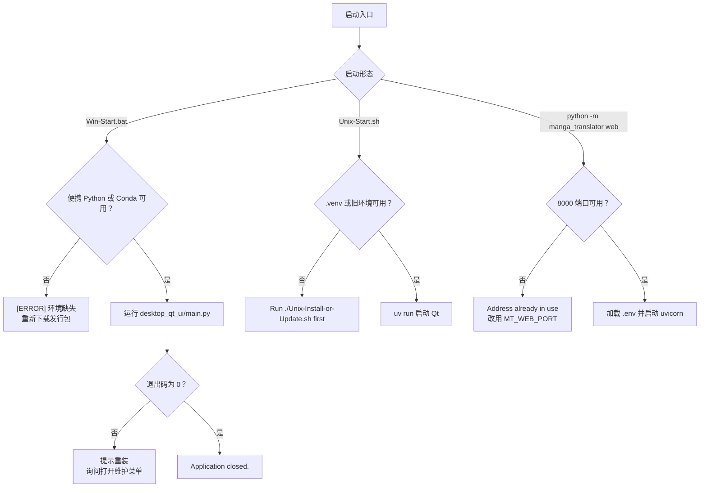

# 安装与启动故障排查

程序装不上、打不开或启动后立即退出时，先在下面按症状定位，再回到对应的安装页执行修复。这里仅处理安装与启动阶段的故障，不重复各安装页的完整步骤；安装流程分别见[安装要求](../install/requirements.md)、[Windows 便携版](../install/windows-portable.md)、[Windows 源码安装](../install/source-windows.md)、[Linux 与 macOS](../install/linux-and-macos.md)、[Docker 部署](../install/docker.md)、[更新与版本切换](../install/update-and-version-switching.md)和[卸载与数据清理](../install/uninstall-and-data-cleanup.md)。

模型加载、GPU 显存与内存问题见[模型、GPU 与内存](./model-gpu-and-memory.md)；API 鉴权、限流与超时见[API 鉴权、限流与超时](./api-auth-rate-limit-and-timeout.md)；输出 JSON 与排版问题见[输出 JSON 与排版](./output-json-and-rendering.md)；日志分享前的清理见[隐私、清理与日志分享](./privacy-cleanup-and-log-sharing.md)。

## 先确认问题 {#scope}

- 内容包括 Windows 便携版、源码/Unix、Docker 三种安装形态的安装失败，以及 Qt 桌面、CLI 和 Web 服务三种入口的启动失败。
- “安装失败”指环境创建、依赖下载或后端选择失败；“启动失败”指入口存在但无法进入可用状态，例如报错退出、端口占用或初始化失败。
- 安装成功不等于模型已下载、API 可用或 GPU 可用；这些属于后续运行问题，由对应排障页负责。

## 快速定位 {#quick-diagnosis}

| 症状 | 最可能原因 | 首先检查 |
| --- | --- | --- |
| `Win-Start.bat` 输出 `[ERROR] Application exited with code ...` | 运行环境或依赖损坏 | 查看 `result/log_*.txt`，再运行 `Win-Install-or-Update.bat` 选 `[1] Install` 重装；详见[Windows 便携版](../install/windows-portable.md) |
| `Win-Start.bat` 提示找不到便携 Python 与 Conda | 发行目录不完整 | 重新解压发行包，确认 `packaging/python/python.exe` 或 Conda 环境存在 |
| `Unix-Start.sh` 提示 `Run ./Unix-Install-or-Update.sh first` | 缺少项目文件或 `.venv` | 先运行 `Unix-Install-or-Update.sh` 完成安装；详见[Linux 与 macOS](../install/linux-and-macos.md) |
| `uv sync` 因网络失败 | 包源不可达 | 重试或切换镜像源，使用 `uv sync --locked`；详见[安装要求](../install/requirements.md) |
| 启动器提示 Python 版本错误 | 当前 Python 不是 3.12 | 安装 Python 3.12（`>=3.12,<3.13`），不要使用 3.13+ |
| Web 服务启动即报端口占用 | `8000` 端口已被占用 | 换 `MT_WEB_PORT` 或停止占用进程；Docker 见[Docker 部署](../install/docker.md) |
| 桌面窗口打开后立即消失 | 服务初始化失败或 Qt/Torch DLL 冲突 | 在终端运行以查看 stderr，检查 `result/log_*.txt` 中的未捕获异常 |

## 安装失败 {#installation-failures}

### Python 版本不符 {#python-version}

`packaging/launch.py` 只接受 Python 3.12：低于 3.12 输出 `错误: 需要 Python 3.12+`，高于 3.12 输出 `错误: 仅支持 Python 3.12,不支持更高版本` 并提示“请使用 Python 3.12 版本”。`pyproject.toml` 的约束为 `>=3.12,<3.13`。

修复：安装 Python 3.12 后重新执行 `uv sync`；不要用 Python 3.13+ 解释器复用旧的 `.venv`。

### 依赖安装失败与镜像回退 {#dependency-install}

安装器先使用项目声明的依赖源，失败后按 `packaging/launch.py` 的镜像列表逐个回退：普通包依次尝试清华、阿里、豆瓣与官方 PyPI 镜像，PyTorch 相关包按 `PYTORCH_INDEX_FALLBACKS`/`PYTORCH_INDEX_PRIORITY` 尝试镜像或官方源。所有源都失败时安装器抛出“所有镜像源均失败”并停止；已安装成功的包会保留，可从失败包继续重试。

- 网络代理、防火墙或证书问题会让所有源失败；先确认能访问 PyPI 与 PyTorch 下载地址。
- 源码环境使用 `uv sync --locked`；锁文件与 `pyproject.toml` 不一致时 uv 拒绝安装，不要手工混装跨平台 wheel。
- 启动器解析依赖声明依赖 `packaging<25.0`；版本过高时启动器先自动降级再继续。

### 依赖组冲突 {#dependency-groups}

`pyproject.toml` 声明 `cpu`、`cuda13.0`、`cuda12.6`、`rocm7.2.1`、`metal` 五个互斥硬件组；源码开发的 `uv sync` 默认安装 `cuda13.0`、`packaging` 与 `test`，维护安装器则禁用默认组并只选一个硬件组。同一环境叠加另一后端，或混用 `onnxruntime` 与 `onnxruntime-gpu`、不同 CUDA/ROCm 索引的 Torch，会造成 DLL、Torch 或 ONNX Runtime 冲突。启动器检测到已安装 PyTorch 类型与目标不一致时，会提示版本不匹配并重新安装所选后端。

### 找不到运行环境 {#missing-environment}

- Windows 便携版：`Win-Start.bat` 优先使用 `packaging/python/python.exe`，找不到时回退旧 Conda 布局（`manga-env` 或 `conda_env`）。两者都不存在时输出 `[ERROR] Neither bundled Python nor Conda environment was found.` 并提示重新下载发行包，不会静默使用系统 Python。
- Unix：`Unix-Start.sh` 优先 `.venv/bin/python`，其次旧 Conda 环境；都没有时提示 `Run ./Unix-Install-or-Update.sh first`。
- 源码环境：在项目根目录执行 `uv sync` 创建 `.venv`，再用 `uv run --no-sync python -m desktop_qt_ui.main` 启动，详见[Windows 源码安装](../install/source-windows.md)。

## 启动失败 {#startup-failures}

### Qt 桌面启动失败 {#qt-startup}

`desktop_qt_ui/main.py` 的启动顺序为：创建日志文件 → 确保运行时文件存在 → 启用 faulthandler → 创建 `QApplication` → 初始化服务 → 创建主窗口。日志写入 `result/log_<时间戳>.txt`（冻结版位于 `app.exe` 同级 `result/`，源码版位于项目根 `result/`）。关键失败点：

- 服务初始化失败时记录 `Fatal: Service initialization failed.` 并以退出码 1 结束；具体异常在日志中。
- 未捕获异常由全局异常处理器写入日志并输出到 stderr；Qt 内部错误经 Qt 消息处理器记录。
- PyTorch 在 PyQt6 之前导入，避免 Qt 与 `c10.dll` 的加载冲突；便携版还会注册 PyInstaller 目录的 DLL 搜索路径。混装环境或错误 PATH 常表现为启动即闪退。
- `Win-Start.bat` 对非零退出码输出 `[ERROR] Application exited with code ...`，建议先重装并询问是否打开 `Win-Install-or-Update.bat`。错误窗口里的本地路径和日志不要直接上传。

建议：先在终端直接运行启动命令以便看到 stderr；检查 `result/log_*.txt`；确认只使用一套环境；必要时用维护菜单 `[1] Install` 重装。

### Web 服务启动失败 {#web-startup}

`python -m manga_translator web` 默认监听 `0.0.0.0:8000`，可用 `--host`/`--port` 或 `MT_WEB_HOST`/`MT_WEB_PORT` 覆盖。启动时从应用目录读取 `.env`：存在时打印 `[INFO] Loaded environment variables from: ...` 并只列出 API 相关变量名；不存在时打印 `[WARNING] .env file not found at: ...`，该警告不是致命错误。

- 端口被占用时 uvicorn 抛出绑定错误；换端口或停止占用进程后重试。
- Docker 用 `curl http://localhost:8000/` 做健康检查，连续三次失败且超过 60 秒宽限期后容器标记为不健康，见[Docker 部署](../install/docker.md)。
- 首次访问 Web 登录页需按页面提示创建管理员账号；`MANGA_TRANSLATOR_ADMIN_PASSWORD` 是旧式管理密码设置，不会自动创建登录账号。

### CLI 启动即退出 {#cli-startup}

`manga_translator/__main__.py` 解析参数后按 `local`、`web`、`ws`、`shared` 分发。不带模式时打印帮助并退出；`local` 缺少 `-i` 输入时参数校验失败；未知模式输出 `Unknown mode` 并退出；异常路径打印异常类名与回溯后以退出码 1 结束。

注意：`__main__.py` 在解析参数前就导入 `torch`。PyTorch 缺失或 DLL 不兼容时，连 `--help` 也可能在解析前失败。先用 `uv run --no-sync python -m manga_translator --help` 与 `uv run --no-sync python -m manga_translator local --help` 确认入口可用，再处理具体输入。完整命令清单见 `doc/wiki/research/cli-command-inventory.md` 的正式子命令部分。

### 首次运行初始化 {#first-run}

所有入口启动时都会调用 `manga_translator/runtime_files.py` 的 `ensure_runtime_files()`，在 `config/` 下创建用户可编辑的运行时表（自定义 API 参数、AI OCR/渲染/上色提示词、文本过滤、文本替换、富文本规则、翻译模板）；失败只记录警告，不覆盖用户已有文件。Web 服务还会在 `manga_translator/server/data/` 下创建账号、会话、审计与权限数据文件。

模型下载是独立阶段：检测、OCR、修复等模型通常在首次启用时下载或加载；启用语义断句时 `rendering/chinese_linebreak.py` 检查 HanLP 模型，缺失时回退普通换行。安装成功不代表模型已下载，也不代表在线 API 可用。

## 日志与证据收集 {#logs-evidence}

| 入口 | 日志位置 | 内容 |
| --- | --- | --- |
| Qt 桌面 | `result/log_<时间戳>.txt` 与 `logs/` | 启动信息、警告、未捕获异常、faulthandler 崩溃栈 |
| CLI | stdout/stderr；`-v` 开启详细日志 | 模式分发、错误回溯、退出码 |
| Web 服务 | stdout/stderr 及服务器记录 | `.env` 加载、`[SERVER CONFIG]`、任务日志 |
| Docker | `docker compose logs <服务名>`；`./data/logs` | 容器 stdout 与健康检查结果 |

分享日志前删除 API Key、Token、用户名、私有绝对路径、图片路径、OCR/译文与提示词内容；错误窗口截图同样需要脱敏，详见[隐私、清理与日志分享](./privacy-cleanup-and-log-sharing.md)。

## 排障流程图 {#troubleshooting-flow}

上图只表达常见启动路径与错误反馈分支；真实退出码、镜像回退和 GPU 分支仍以源码与实际环境为准。
