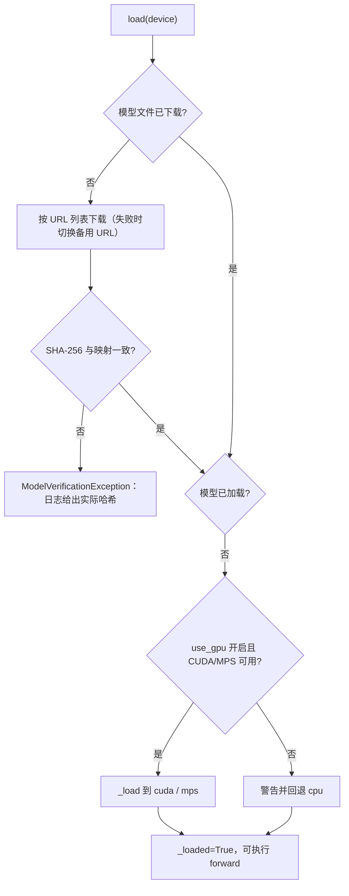
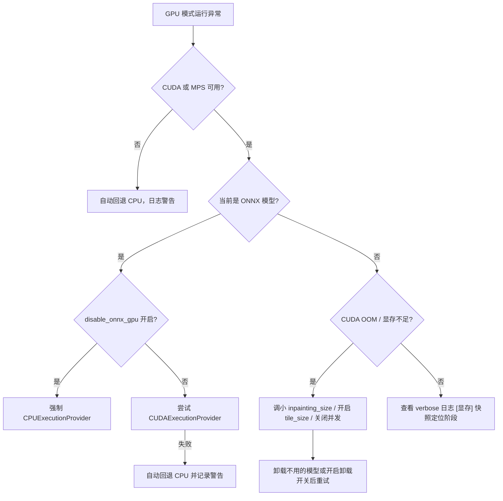
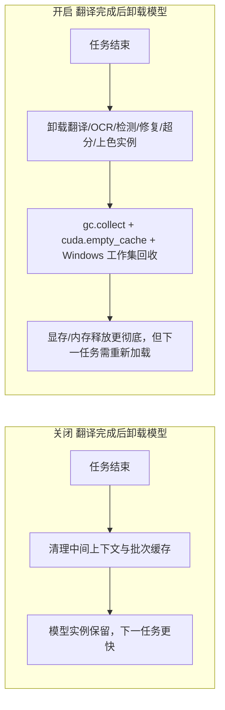

# 模型、GPU 与内存排障

当任务卡在模型下载、报“CUDA out of memory”、GPU 模式无法启动，或翻译结束后内存/显存没有回落时，本页用于定位模型加载、GPU 设备、显存（VRAM）与内存（RAM）相关问题。安装阶段的硬件后端依赖组见[运行环境与依赖要求](../install/requirements.md)，`app.unload_models_after_translation` 等开关在界面中的位置见[通用与应用设置](../desktop/settings/general-and-app.md)。这里不重复翻译、OCR、检测、修复、超分等参数页的完整说明，也不涉及 API 鉴权与限流（见[API 鉴权、限流与超时](./api-auth-rate-limit-and-timeout.md)）和 CLI 子进程的整机内存限制（见[子进程、内存与恢复](../cli/subprocess-memory-and-recovery.md)）。

## 先确认问题 {#feature-boundary}

- 本页负责：模型下载/校验失败、`cli.use_gpu` 设备选择、`cli.disable_onnx_gpu` 的 ONNX 路径、`app.unload_models_after_translation` 的任务后卸载，以及 `inpainting_size`、`tile_size` 等与显存相关的处置。
- 这里不负责：安装依赖组如何选择（见 `install/requirements.md`）、修复/超分参数的完整选项（见各自设置页）、日志与调试产物的分享规范（见[如何阅读与分享调试运行](../debugging/how-to-read-and-share-a-debug-run.md)）。
- 开关本身的 UI 归属在设置页记录；这里仅解释它们在模型、GPU 与内存排障中的用途和底层行为。

## 常见现象与快速定位 {#symptoms}

| 现象 | 常见原因 | 先查这里 |
| --- | --- | --- |
| 首次启用某模型卡在下载或报哈希校验失败 | 网络不可达、备用 URL 也失败、文件损坏或与实际权重不一致 | `models/` 子目录是否存在；日志中给出的实际哈希；[模型加载与下载](#model-loading) |
| 提示找不到 CUDA/Metal 设备并自动回退 CPU | 安装了 CPU 依赖组、驱动不匹配，或 `cli.use_gpu` 开启但设备不可用 | [运行环境与依赖要求](../install/requirements.md)；`label_use_gpu` |
| ONNX 模型加载报错或有 GPU 兼容问题 | ONNX Runtime 的 CUDA provider 不可用、DLL 冲突 | 开启 `label_disable_onnx_gpu` 强制 CPU 后观察是否恢复 |
| 报 CUDA out of memory / 显存不足 | 单次推理输入过大、`inpainting_size` 过大、并发或缓存占用峰值过高 | 调小 `inpainting_size`、开启 `tile_size`、关闭并发、开启卸载开关 |
| 任务结束后内存/显存没有回落 | 模型实例常驻缓存、Python 与 CUDA 缓存未回收 | 开启 `app.unload_models_after_translation`；查看 verbose 日志中的 `[显存]` 快照 |

## 界面中的相关开关 {#ui-controls}

### 设置 → 通用 {#general-group}

打开“设置”，选择“通用”分组。三个开关都位于该分组：

1. “使用 GPU”请求 GPU 加速。它只改变运行时的设备选择，不能把 CPU 依赖环境变成 CUDA 环境。
2. “禁用 ONNX GPU 加速”只关闭 ONNX Runtime 的 GPU 路径，强制其走 CPU。
3. “翻译完成后卸载模型”控制每次任务结束后的模型卸载与内存回收；开启后下一任务需要重新加载模型。

### 其他相关设置 {#other-settings}

- 修复尺寸 `inpainter.inpainting_size`：设置 → 蒙版与修复页。默认 `2048`，过大会直接导致显存不足。
- 超分分块 `upscale.tile_size`：设置 → 超分与上色页。`0` 表示不分块整图处理，分块可显著降低显存峰值。
- 并发批量 `cli.batch_concurrent`：设置 → 通用。并发会同时加载多张图的中间结果，放大显存与内存峰值；显存受限时可关闭。

## 关键设置 {#key-settings}

> 本页各参数的详细介绍（界面名称、存储键、默认值与生效阶段），见[选项与 i18n 对照参考](../reference/options-i18n-matrix.md)。

#### 使用 GPU {#cli-use-gpu}

“使用 GPU”开关位于“设置 → 通用”分组，请求 GPU 加速；它只改变运行时的设备选择，不能把 CPU 依赖环境变成 CUDA 环境。开启时界面显示“使用 GPU”；关闭时无独立界面文案，仅表示不使用 GPU。

#### 禁用 ONNX GPU 加速 {#cli-disable-onnx-gpu}

“禁用 ONNX GPU 加速”开关位于“设置 → 通用”分组，只关闭 ONNX Runtime 的 GPU 路径，强制其走 CPU，不影响 PyTorch/MPS 模型。开启时界面显示“禁用 ONNX GPU 加速”；关闭表示允许 ONNX 使用 CUDA provider。

#### 翻译完成后卸载模型 {#app-unload-models-after-translation}

“翻译完成后卸载模型”开关位于“设置 → 通用”分组，控制每次任务结束后的模型卸载与内存回收；开启后下一任务需要重新加载模型，首次响应会变慢。开启时界面显示“翻译完成后卸载模型”；关闭表示任务结束后保留模型实例。

## 问题怎样发生 {#runtime-behavior}

### 模型加载与下载 {#model-loading}

模型根目录是 `BASE_PATH/models`（`BASE_PATH` 在开发环境为仓库根目录，冻结包为可执行文件目录），检测、OCR、修复、超分、上色、翻译各模块使用独立子目录。加载时先检查文件是否已下载：缺失时按模块的模型清单从 URL 列表下载，计算 SHA-256 并与清单中的哈希比对；不一致时抛出校验异常并在日志中打印实际哈希。文件就绪后才把权重加载到对应设备。

下载失败或哈希不匹配时，先确认网络与 `models/` 目录权限，再按日志中的实际哈希核对映射或清理损坏文件后重试；不要把下载目录或日志中的本机路径直接复制到公开报告。

### GPU 与显存 {#gpu-and-vram}

设备选择发生在初始化阶段：`use_gpu=True` 且可用时选 `cuda`/`mps`，否则回退 `cpu` 并记录警告。ONNX 运行时未禁用 GPU 时优先使用 `CUDAExecutionProvider`，provider 缺失或会话创建失败会自动回退 `CPUExecutionProvider`。桌面端与 CLI 都在导入 PyTorch 前设置 `PYTORCH_ALLOC_CONF=expandable_segments:True`，以减少显存碎片、降低 OOM 概率。verbose 模式下，显存快照会以 `[显存]` 前缀写入日志（allocated/reserved/peak/free），用于定位阶段性增长。

OOM 是否出现还取决于图片尺寸、`batch_concurrent` 和同机其他进程占用；开启分块或卸载开关并不保证所有模型都不再报 OOM。

### 卸载与内存回收 {#memory-cleanup}

“翻译完成后卸载模型”在桌面端任务结束后触发完整内存清理；核心翻译器内部也会按批次清理：普通清理做限流垃圾回收与 CUDA 同步，激进模式还会执行显存缓存清空；MPS 没有等价缓存清空接口。

开启卸载并不表示第三方进程（浏览器、其他 PyTorch 程序）占用的显存也会立即归还，也不表示系统 RAM 使用率一定立刻降为零；它主要释放本进程持有的模型与缓存。

### 服务模式的空闲卸载 {#idle-unload}

`web`、`ws`、`shared` 模式支持 `--models-ttl`（秒，默认 `0`）。大于 `0` 时，后台会启动清理任务，对超过 TTL 未使用的模型执行卸载；为 `0` 时模型保持常驻。桌面端不使用该 CLI 参数，其行为由“翻译完成后卸载模型”控制。

## 相关设置与限制 {#dependencies}

- GPU 加速依赖安装阶段选择的后端组与驱动；装错依赖组或驱动不匹配时，`cli.use_gpu` 只会触发回退而不是修复环境，见[运行环境与依赖要求](../install/requirements.md)。
- `inpainting_size` 过大会直接 OOM；`upscale.tile_size` 分块可降低超分显存峰值；`cli.batch_concurrent` 会放大并发峰值，显存受限时建议关闭。
- `cli.disable_onnx_gpu` 只影响 ONNX 路径；PyTorch/MPS 模型仍按 `cli.use_gpu` 选择设备。
- 开启 `app.unload_models_after_translation` 会牺牲下一次任务的加载速度；它和 `models_ttl` 是不同入口（桌面开关 vs 服务模式 CLI 参数）。
- RAM 限制（子进程 RSS / 整机内存）与 VRAM 是两类问题，前者见[子进程、内存与恢复](../cli/subprocess-memory-and-recovery.md)。
- `cli.ignore_errors` 决定单张图失败是跳过还是中止；CUDA OOM 没有专门的中文友好提示，任务日志会保留原始 traceback，分享日志前按[隐私、清理与日志分享](./privacy-cleanup-and-log-sharing.md)清理。
