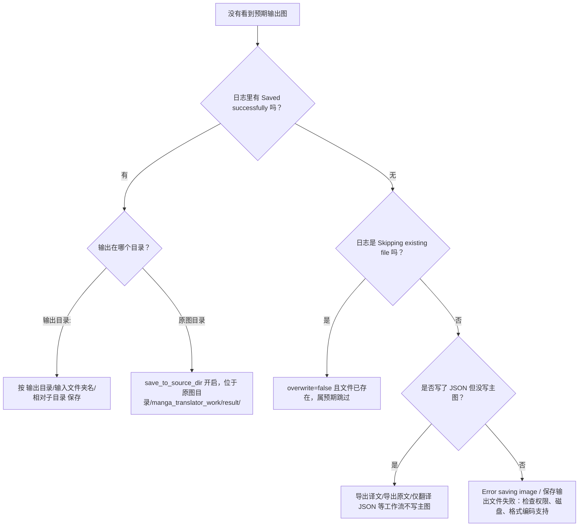
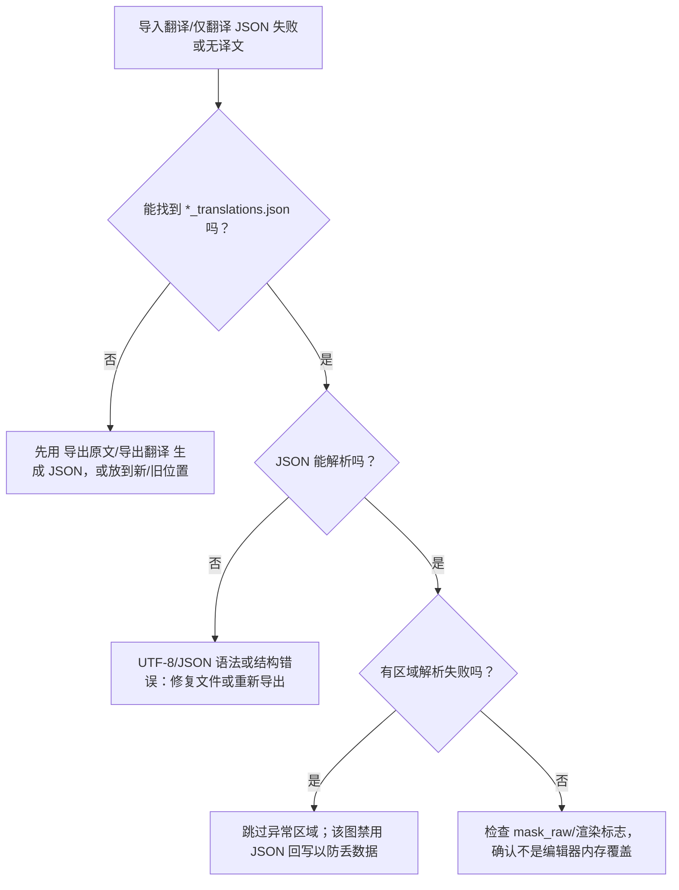
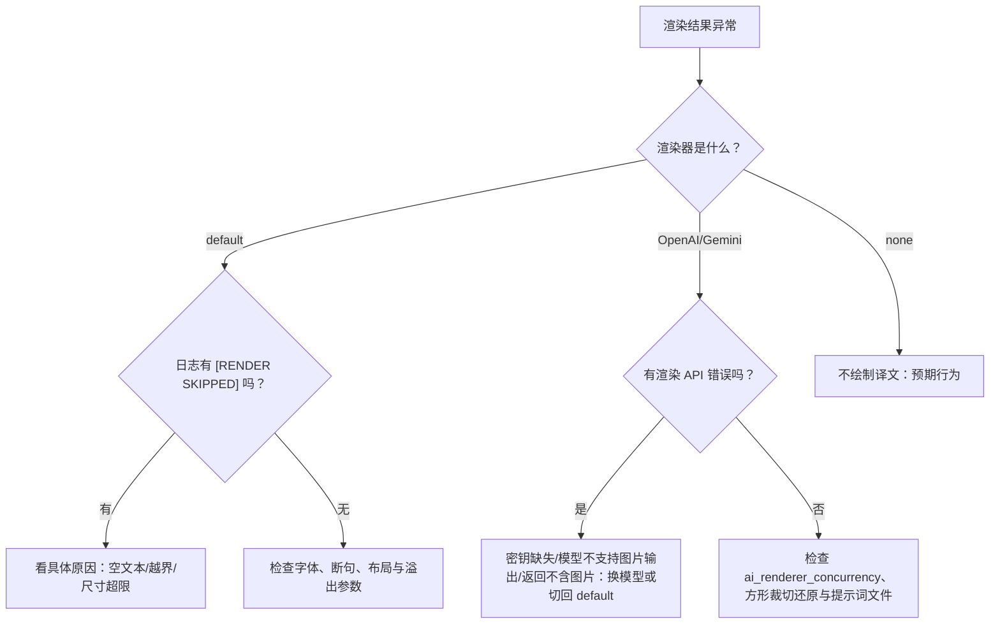

# 输出、JSON 与渲染排障

当任务结束后看不到输出图片、工程 JSON 读不进去、或最终图上没有译文或译文显示异常时，先在下面按“现象 → 日志 → 原因 → 处理”定位，再去对应功能页看参数与操作。本页与[输出目录与工作流](../desktop/translation/output-directory-and-workflow.md)、各[工作流](../workflows/normal.md)页、[编辑器导入导出与写回](../desktop/editor/import-export-and-writeback.md)和[排版与渲染](../desktop/settings/typesetting-and-rendering.md)互相链接，不重复正文：工作流输入输出、编辑器写回机制和渲染参数定义分别以对应页面为准。

## 先确认问题 {#feature-boundary}

- 本页负责“现象 → 原因 → 处理”的排障：主输出图（格式、位置、质量、覆盖）、`*_translations.json` 工程 JSON（查找、解析、蒙版、回写、备份）和文本渲染（本地 Qt、AI 渲染、字体、断句、布局）。
- 参数默认值、选项和 UI 操作属于设置页：[CLI、批量与输出](../desktop/settings/cli-batch-and-output.md) 记录 `format`、`save_quality`、`overwrite`、`save_text` 等，[排版与渲染](../desktop/settings/typesetting-and-rendering.md) 记录 `render.*` 全部参数。
- 九个工作流各自的输入、输出、跳过阶段和文件格式属于[工作流](../workflows/normal.md)页与[输出目录与工作流](../desktop/translation/output-directory-and-workflow.md)；编辑器工程数据读写属于[编辑器导入导出与写回](../desktop/editor/import-export-and-writeback.md)。
- 不负责：检测/OCR/翻译/修复/上色/超分失败（见对应设置页与调试页）、API 密钥/限流/超时（见[API 鉴权、限流与超时](./api-auth-rate-limit-and-timeout.md)）、日志与隐私清理（见[隐私清理与日志共享](./privacy-cleanup-and-log-sharing.md)）。

## 排查入口 {#start-with-logs}

先复现一次任务并保留日志，多数输出/JSON/渲染问题都能从日志定位到具体分支：

1. 打开“设置”→“通用”，开启“详细日志”，再复现一次任务。
2. 在 `result/` 目录查看 `log_<时间戳>.txt` 运行日志，以及 `<时间戳>-<图片名>-<目标语言>-<翻译器>/` 调试中间文件；清理方式见“详细日志”说明（先关闭 Qt UI 再删除）。
3. 按关键词过滤日志：`Saved successfully` / `Skipping existing file`、`JSON saved to` / `Failed to read or parse`、`[RENDER SKIPPED]`、`Error saving image`、`stage='rendering'` / `stage='saving'`。
4. 不要在公开报告或共享包里复制日志中的本机路径、译文正文、请求体和调试图片。

“翻译完成，成功保存 {count} 个文件”里的 `count` 是本次任务实际保存/跳过的文件数，不代表所有文件都重新渲染；跳过已存在文件时也会计入成功。

## 输出文件异常 {#output-file-issues}

主输出图路径由 `save_info`（输出目录、输入目录集合、`format`、`save_to_source_dir`、`overwrite`）经 `_calculate_output_path` 计算，不是固定目录。先确认“输出目录:”的值和是否开启了“输出到原图目录”。

### 输出图片缺失或位置不对 {#output-image-missing-or-misplaced}

| 现象 | 常见原因 | 处理 |
| --- | --- | --- |
| 输出图不在“输出目录:”里 | 开启了“输出到原图目录”，实际写入 `<原图目录>/manga_translator_work/result/` | 关闭“输出到原图目录”，或到该目录查找 |
| 输出目录里多了以输入文件夹名命名的子目录 | 路径保留逻辑按“输出目录 + 输入文件夹名 + 相对子目录”组织 | 属预期行为，不是错误 |
| 压缩包输入找不到输出 | 输出落在解压目录对应的压缩包输出目录（`original_images/` 的上级） | 见[输出目录与工作流](../desktop/translation/output-directory-and-workflow.md) |
| 完全没有输出图 | 该工作流不写主图（导出译文、导出原文、仅翻译 JSON），或 `overwrite=false` 且文件已存在被跳过 | 核对工作流类型与跳过日志 |
| 保存时报错 | 日志出现 `Error saving image to ...` 或“保存输出文件失败” | 检查输出目录权限、磁盘空间、格式编码支持 |

路径规则（源码 `_calculate_output_path`）：

- `save_to_source_dir=true` → `<原图目录>/manga_translator_work/result/<文件名>`。
- 否则 → `output_folder` 下按输入目录相对结构保存：`输出目录/<输入文件夹名>/<相对子目录>/<文件名>`；文件直接在输入根目录时省略相对子目录。
- 压缩包图片命中 `original_images/` 时，输出回到压缩包输出目录（`<输出目录>/.../<压缩包名>`）。
- `format` 为空、`不指定` 或 `none` 时保留原图文件名（原扩展名）；否则用 `<stem>.<format>`。
- 目标目录不存在时自动创建（`os.makedirs(..., exist_ok=True)`）。

### 输出格式与质量异常 {#output-format-and-quality}

“输出格式”下拉框的取值和编码行为如下，存储值 `不指定` 表示保留原扩展名：

| 存储值 | English | 简体中文 | 说明 |
| --- | --- | --- | --- |
| 空 / `不指定` / `none` | Not Specified | 不指定 | 保留原图扩展名 |
| `png` | png | png | PNG，无损 |
| `jpg` / `jpeg` / `jfif` | jpg / jpeg / jfif | jpg / jpeg / jfif | JPEG，强制 RGB 转换 |
| `webp` | webp | webp | 支持质量参数 |
| `avif` | avif | avif | 依赖 Pillow/平台 AVIF 编解码支持 |
| `bmp` | bmp | bmp | BMP，强制 RGB 转换 |
| `tiff` / `tif` | tiff / tif | tiff / tif | TIFF |
| `heic` / `heif` | heic / heif | heic / heif | HEIF，依赖平台编解码支持 |

| UI 调用 key | English 实际值 | 简体中文实际值 |
| --- | --- | --- |
| `label_format` | Output Format | 输出格式 |
| `label_save_quality` | Image Save Quality | 图像保存质量 |
| `desc_cli_format` | Output image format. Choose PNG, JPG/JPEG/JFIF, WebP, AVIF, BMP, TIFF/TIF, HEIC/HEIF, or leave empty to keep the original format. | 输出图片格式。可选 PNG、JPG/JPEG/JFIF、WebP、AVIF、BMP、TIFF/TIF、HEIC/HEIF，或留空保持原格式。 |
| `desc_cli_save_quality` | JPEG/WebP/AVIF/HEIC save quality (0-100). Higher values mean better quality but larger files. | JPEG/WebP/AVIF/HEIC 保存质量 (0-100)。值越高画质越好，文件越大。 |

行为要点：

- “图像保存质量”只影响 JPEG/WebP/AVIF/HEIF；PNG、BMP、TIFF 不受质量参数影响。
- JPEG/BMP 是无 alpha 的 RGB 格式：RGBA/调色板先转 RGB，alpha 被压平；CMYK 也会转 RGB。
- HEIC/HEIF、AVIF 依赖 Pillow 与平台编解码器；缺少支持时保存失败。统一保存入口 `save_pil_image` 会显式指定编码器并尽量保留源图 ICC 与 DPI 元数据。
- 服务端/CLI 的统一保存守卫（`save.py`）会在扩展名不在支持列表时抛出 `FormatNotSupportedException`。

### 覆盖与跳过行为 {#overwrite-and-skip}

- “覆盖已存在文件”：核心代码默认 `false`，Qt 模型与发行配置默认 `true`。
- 关闭时，目标输出文件已存在 → 跳过该图不覆盖，日志/摘要显示“⏭️ 已跳过 …（覆盖检测已禁用）”；跳过也计入成功，不会中断任务。
- 工作流前置覆盖检查：导出译文/导出原文检查对应 `originals/`、`translations/` 副文件，仅翻译 JSON 检查原文副文件，其余模式检查主输出图（`workflow_service`）；详细行为见对应工作流页。
- 排障：整批“没有新输出”时，先看是否 `overwrite=false` 且输出文件已经存在。

### PSD 与 JSX 导出 {#psd-and-jsx-export}

- “导出可编辑PSD”开启后把图层写到 `manga_translator_work/psd/<stem>.psd`；需要本机安装 Photoshop。
- “仅生成PSD脚本”只生成 `<stem>_photoshop_script.jsx`，不自动启动 Photoshop、不直接产出 PSD；非 verbose 且非 script-only 时临时脚本会被删除。
- PSD/JSX 导出失败只记录错误日志，不中断图片保存。
- JSX 可能包含图层文本和本机文件路径，外发前逐文件检查。

### 输出问题诊断流程 {#output-diagnostic-flow}

## 工程 JSON 问题 {#json-issues}

工程 JSON 是 `manga_translator_work/json/<stem>_translations.json`（新位置优先），旧位置为原图同目录 `<stem>_translations.json`。它同时是编辑器、导入翻译并渲染、仅翻译 JSON 的输入与回写目标；字段结构与手改风险见[编辑器导入导出与写回](../desktop/editor/import-export-and-writeback.md)。

### JSON 文件找不到 {#json-not-found}

读取顺序（`find_json_path`）：新位置 → 旧位置 → 旧 TXT（`<stem>_translations.txt`，无蒙版）→ 都没有则按无文本处理。

| 现象 | 常见原因 | 处理 |
| --- | --- | --- |
| 导入翻译并渲染报“未找到JSON文件” | 该图从未生成工程 JSON，或文件不在新/旧位置 | 先用“导出原文”或“导出翻译”生成 JSON（`import_mode_json_hint`），再重试 |
| 仅翻译（JSON）提示需要 JSON 数据 | 没有可解析的工程 JSON | 生成 JSON 后重试；成功后程序会删除 `<stem>_original.<扩展名>` 原文副文件 |
| 导入时读到了旧 TXT | 只有 `<stem>_translations.txt`，没有 JSON | 属兼容回退：区域可加载但没有蒙版和渲染样式 |
| Web 端导入提示只支持 JSON | 用户选择了 TXT 文件 | 按 `import_mode_json_only` 提示只传 JSON |

| UI 调用 key | English 实际值 | 简体中文实际值 |
| --- | --- | --- |
| `import_mode_no_json` | Import mode: JSON file not found | 导入翻译模式：未找到JSON文件 |
| `import_mode_json_only` | Import mode: Only JSON files are supported, TXT files are not supported | 导入翻译模式：只支持JSON文件，不支持TXT文件 |
| `import_mode_json_hint` | Hint: Please use 'Export Original' or 'Export Translation' to generate JSON files | 提示：请使用「导出原文」或「导出翻译」功能生成JSON文件 |
| `label_translate_json_only` | Translate JSON Only | 仅翻译（JSON） |
| `Start JSON Translation` | Start JSON Translation | 开始仅翻译（JSON） |
| `Tip: Requires existing JSON data. The app reads original text from JSON, translates it, writes results back to JSON, and deletes imagename_original.txt after success` | Tip: Requires existing JSON data. The app reads original text from JSON, translates it, writes results back to JSON, and deletes imagename_original.txt after success | 提示：需要预先存在 JSON 数据。程序会从 JSON 读取原文并执行翻译，完成后回写 JSON，并删除图片名_original.txt。 |

### JSON 解析失败或结构异常 {#json-parse-failure}

- 工程 JSON 按 UTF-8 读取；顶层必须是“原图绝对路径 → 数据”的非空对象，数据可以是旧格式（区域列表）或新格式（含 `regions` 的 dict）。
- 解析失败、空对象或值类型不对时，该图按无文本处理并记录日志（`Failed to read or parse translation file`、`JSON file ... is empty or invalid`、`Invalid data format`）。
- 区域级错误：`lines` 形状不是 `(N, 4, 2)` 时跳过该区域并计数；`TextBlock` 构造失败时先去掉 `translation_rich` 降级重试（丢样式不丢区域），仍失败才跳过。
- 有区域解析失败时，该图禁用 JSON 回写（`skipped JSON write-back to protect the project file`），防止异常区域连同原文、坐标在回写时永久丢失。
- 文本中的字面 `\\n` 会被转换成换行；区域缺 `target_lang` 时回退到配置目标语言。
- 手工修改 JSON 后应先用支持 JSON 校验的编辑器确认可解析，再执行导入/渲染。

| UI 调用 key | English 实际值 | 简体中文实际值 |
| --- | --- | --- |
| `{count} malformed regions skipped` | {count} malformed regions skipped | 跳过 {count} 个结构异常的区域 |
| `File not found` | File not found | 文件不存在 |
| `Error reading file: {error}` | Error reading file: {error} | 读取文件出错：{error} |
| `JSON format error` | JSON format error | JSON 格式错误 |
| `JSON root must be an object` | JSON root must be an object | JSON 顶层必须是对象 |
| `JSON value is empty` | JSON value is empty | JSON 值不能为空 |

上面三个 `JSON ...` 提示同时用于配置 JSON 编辑器（自定义 API 参数、过滤列表）；工程 JSON 自身的解析失败主要记录在日志中，见上文。

### 蒙版、覆盖层与渲染标志 {#mask-overlay-and-flags}

- `mask_raw` 落盘为 base64 编码的 PNG；读取支持 base64 字符串、内存 `ndarray`（编辑器直通）或数值列表；解码失败会记录 `Failed to decode base64 mask`。
- `mask_is_refined=true` 时，导入翻译并渲染可跳过再次蒙版细化，直接复用。
- `paint_overlay` / `stamp_overlay` 保存编辑器画笔/印章层：JSON 内 base64 优先，旧版单文件 `manga_translator_work/paint_overlay/<stem>_overlay.png` 兼容读取。
- 以下渲染标志由 `_save_text_to_file` 写入、`_load_text_and_regions_from_file` 读取；手删会改变后续渲染行为：

| JSON 字段 | 含义 | 影响 |
| --- | --- | --- |
| `skip_font_scaling` | `false` 表示导入渲染时重新智能排版；`true` 表示保留固定字号回放 | 导出原文/仅翻译 JSON 写入 `false`；导出译文写入 `true` |
| `skip_text_replacements` | `true` 表示译文已经是终稿，导入重渲染不再应用替换规则 | 渲染过的上下文写入 `true`；未渲染导出保持 `false` |
| `last_export_dir` | 主翻译流程本次输出目录 | 编辑器再导出时回写同一目录 |
| `upscale_ratio` 等标记 | 是否启用超分/上色 | 编辑器据此查找 `editor_base` 底图，无标记时视为过期删除 |

### JSON 写回、备份与恢复 {#json-writeback-and-backup}

- 普通翻译：`save_text`（图片可编辑）为真且该图存在 `text_regions` 时回写 JSON（空区域列表也会写）。
- 仅翻译 JSON 无条件回写；导出译文/导出原文写 `translations/`、`originals/` 文本副文件，不写主图。
- 批量管理在写 JSON 前于同目录写 `<json-file>.bak`（写入前备份每个文件）；恢复时覆盖 JSON 并删除 `.bak`，见[预览、应用与恢复](../desktop/batch-management/preview-apply-restore.md)。
- 输出目录下的 `translation_map.json` 记录“结果图 → 原图”映射，编辑器与文件列表用它解析原图；删除后编辑器仍可按输出图名回退。
- 排障“JSON 修改没生效”：检查编辑器是否正打开同一张图（内存快照会覆盖磁盘修改），或批量写入与编辑器同时操作同一 JSON；见编辑器页。

### JSON 问题诊断流程 {#json-diagnostic-flow}

## 渲染问题 {#rendering-issues}

渲染器（`render.renderer`）为 `default` 时使用本地 Qt 离屏渲染；`openai_renderer` / `gemini_renderer` 走 AI 图片渲染；`none` 不绘制译文。全部参数与选项见[排版与渲染](../desktop/settings/typesetting-and-rendering.md)，AI 渲染的 API 配置见 API 管理页。

### 图上没有任何译文 {#no-translation-drawn}

| 现象 | 常见原因 | 处理 |
| --- | --- | --- |
| 整张图没有任何文字 | 渲染器是 `none`（“不翻译”） | 属预期行为；切回 `default` 或 AI 渲染器 |
| 部分区域没有文字 | 该区域译文为空，渲染循环跳过（日志 `[RENDER] 跳过空文本区域`） | 检查 JSON 中该区域的 `translation` 字段 |
| 区域在图像外 | 布局计算把区域放到图外（日志 `Text region completely outside image bounds`） | 检查区域坐标/锚点是否异常 |
| 渲染被跳过 | 文本渲染返回 None、尺寸非法或超过 OpenCV 32767 限制（日志 `[RENDER SKIPPED] ...`） | 查看日志具体原因，调整字号或区域 |

### 字体与缺字 {#font-and-glyphs}

- “字体”下拉框枚举系统字体与项目 `fonts/` 目录下的 `.ttf`、`.otf`、`.ttc`；放入新字体后重新打开下拉框刷新。
- 找不到请求的字体家族时回退默认 `Microsoft YaHei UI`（日志 `Qt font family not found ... using ...`）；旧版字体文件路径配置会映射为家族名。
- 带方括号的 “Family [Foundry]” 字体名会被净化，避免 Qt 把方括号段当厂商名导致匹配退化。
- 缺字形：目标语言字形覆盖不全时会出现方框或替代字符；换用覆盖该语言字形集的字体。
- 注意字体许可证：不要把项目 `fonts/` 里的商业字体直接外发。

### AI 渲染器失败 {#ai-renderer-failures}

- 未配置渲染 API 密钥：开始翻译前 UI 会阻止启动并弹出“需要填写 API 密钥”，提示在 API 密钥(.env) 中填写 `RENDER_OPENAI_API_KEY`/`RENDER_GEMINI_API_KEY`（或回退 `OPENAI_API_KEY`/`GEMINI_API_KEY`）；运行中缺失则报 `... Renderer is not configured. Set ... in .env`。
- 模型不支持图片输出：错误分类提示“当前模型不支持渲染”，建议把“渲染器”切回 `default`，或在“API 管理 → 渲染”换支持图片输出/图片编辑的模型。
- 返回内容不含图片：Gemini 报 `response did not contain an image`；OpenAI 可能返回文本或触发审核拦截。
- 请求会把页面裁成方形再还原；失败重试走 API 候选轮换；并发受“AI 渲染并发数”限制，并发越高越容易触发限流。
- 排障步骤：① “API 管理 → 渲染”测试连接/测试当前页；② 换模型或换 Base 地址；③ 临时切回 `default` 验证本地渲染是否正常；④ 查日志中的 `render request` 错误。

| UI 调用 key | English 实际值 | 简体中文实际值 |
| --- | --- | --- |
| `label_renderer` | Renderer | 渲染器 |
| `label_ai_renderer_concurrency` | AI Renderer Concurrency | AI 渲染并发数 |
| `label_ai_renderer_prompt_path` | AI Renderer Prompt | AI 渲染提示词 |
| `API Keys Required` | API Keys Required | 需要填写 API 密钥 |
| `desc_render_renderer` | Rendering engine. default renderer; openai_renderer and gemini_renderer require the corresponding API Key in API Keys (.env), otherwise the UI will block translation start. | 渲染引擎。default 默认渲染器；openai_renderer / gemini_renderer 需要先在 API密钥(.env) 中填写对应 API Key，否则 UI 不会开始翻译。 |

### 断句、布局与溢出 {#linebreak-layout-and-overflow}

- “中文语义断句”需要本地 HanLP 模型；模型缺失或下载失败时回退普通换行（日志 `... falling back to normal line breaking`）。
- AI 断句检查失败（`BR markers missing` / `BRMarkersValidationException`）：建议关闭“AI断句检查”、提高“重试次数”、更换翻译模型，或关闭“AI断句自动扩大文字”。
- “智能气泡”排版（`balloon_fill`）需要 `original_img` 构建气泡蒙版；缺失时回退严格边界布局（日志 `balloon_fill mode requires original_img, fallback to strict layout`）。
- 溢出/裁切：固定字号、严格边界、最大/最小字号、禁用自动换行、强制横排等组合会收紧布局导致缩小或裁切；调整“排版模式”、最小字号、字体缩放比例等参数。
- 富文本规则 `rich_text_rules.yaml` 语法错误时，命中的区域不会应用富文本样式（编辑器可见错误状态）；不要外发真实规则内容。

| UI 调用 key | English 实际值 | 简体中文实际值 |
| --- | --- | --- |
| `label_layout_mode` | Layout Mode | 排版模式 |
| `label_semantic_linebreak` | Chinese Semantic Line Break | 中文语义断句 |
| `label_disable_auto_wrap` | AI Line Breaking | AI断句 |
| `label_check_br_and_retry` | AI Line Break Check | AI断句检查 |
| `label_optimize_line_breaks` | AI Line Break Auto Enlarge | AI断句自动扩大文字 |
| `desc_render_semantic_linebreak` | Use local HanLP models to line-break Chinese translations by semantic phrases. Currently supports Chinese target text only; falls back to normal wrapping if models are missing. | 使用本地 HanLP 模型按中文短语进行自动断句。目前仅支持中文译文；模型缺失时自动回退普通断句。 |

### 渲染问题诊断流程 {#rendering-diagnostic-flow}

## 相关设置与限制 {#dependencies-and-conflicts}

- 输出目录、`save_to_source_dir`、`format`、`overwrite` 与工作流类型相互影响；导出/JSON-only/替换翻译等模式不写主图。
- 关闭覆盖会同时影响图片、TXT 与 JSON 的跳过；`save_text=false` 时普通工作流不写 JSON，但仅翻译 JSON 仍无条件回写。
- `batch_concurrent` 与导入/导出/JSON-only/替换翻译等模式不兼容，强制按非并发处理，保证逐图文件回写顺序；见[CLI、批量与输出](../desktop/settings/cli-batch-and-output.md)。
- AI 渲染依赖 API 配置、网络与模型能力；并发、大图与富文本样式增加资源占用，取消任务时不应分享中间请求或用户图像。
- 字体、布局模式与 AI 断句互相约束；`check_br_and_retry` 有无限循环风险，需谨慎使用。
- PSD 导出依赖本机 Photoshop；JSX、JSON、TXT 可能包含文本与路径，外发前按[隐私清理与日志共享](./privacy-cleanup-and-log-sharing.md)脱敏。
