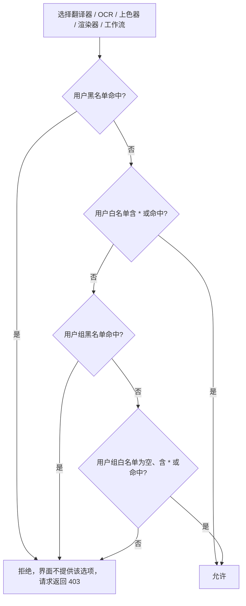
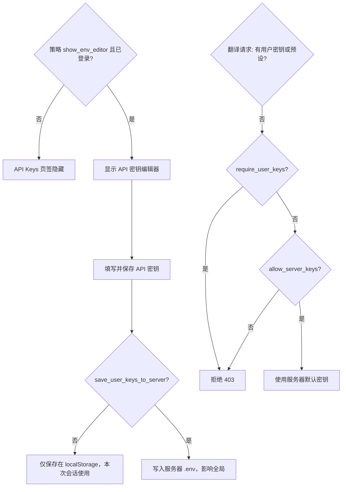
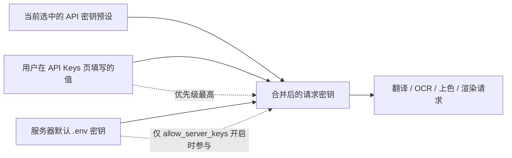

# 账号、权限与 API 密钥

多人共用一台翻译服务器时，这里说明如何创建和管理用户账号、控制每个用户能使用的翻译器/OCR/上色/渲染/工作流与参数，以及用户如何在自己的页面填写 API 密钥。首次启动没有任何账号时，登录页会引导创建第一个管理员；之后由管理员在“用户管理”“用户组管理”“配额管理”等界面分配权限。会话登录与失效细节见[登录、语言与会话](./login-language-and-session.md)，管理员控制台的整体结构见[管理员界面](./administrator-interface.md)，字体与提示词资源的上传权限见[资源、字体与提示词](./resources-fonts-and-prompts.md)。开发者直接调用 HTTP API 时的鉴权契约见[开发者 HTTP API：鉴权与错误](../developer/http-api/authentication-and-errors.md)与[管理员：用户、组、配额与审计](../developer/http-api/admin-users-groups-quota-audit.md)；这里仅写用户在浏览器中的操作。

## 页面与接口范围 {#feature-boundary}

- 内容包括浏览器中的账号生命周期（首次设置、登录、注册、改密、退出）、角色/用户组/功能权限与配额，以及用户侧 API 密钥编辑和策略。
- “用户账号”不等于“HTTP API 客户端”：`X-Session-Token` 的请求/响应格式、状态码和路由清单属于开发者 HTTP API 页面。
- 这里不介绍服务器启动、端口、CORS 与防火墙（见[部署、安全与故障排查](./deployment-security-and-troubleshooting.md)），也不介绍翻译任务本身（见[上传、配置与翻译](./upload-config-and-translate.md)）。
- API 密钥只描述管理和生效规则；不展示任何真实密钥、用户名、私有路径或用户填写内容。

## 用户账号 {#user-accounts}

### 首次设置管理员账号 {#initial-admin-setup}

服务器还没有任何账号时，`/auth/status` 返回 `need_setup`，登录页只显示“首次使用，请创建管理员账户”和“创建管理员账户”表单。填写“管理员用户名”（至少 2 个字符）、“管理员密码”（至少 6 个字符）和“确认密码”，提交后创建第一个 `admin` 角色账号并自动登录。登录页只会放行 `redirect=/admin` 这一个受控回跳，其他值一律回到主页。

### 登录、注册与强制改密 {#login-register-and-forced-password-change}

- “登录”页签使用“用户名”“密码”；失败时提示“用户名或密码错误”“用户不存在”或“账号已被禁用”。登录成功但账号带有 `must_change_password` 标记时（默认管理员强制设置），先弹出“需要修改密码”窗口，可“稍后修改”或“确认修改”。
- 只有当管理员在“服务器配置”中开启“允许用户注册”时，“注册”页签才会出现。注册成功后新账号为 `user` 角色，并加入“注册用户默认分组”（默认 `default`，`admin` 组不可选）。关闭注册时，直接调用注册接口会返回“注册功能未开启，请联系管理员”。
- 登录按 IP（15 次/10 分钟）和用户名（8 次/10 分钟）限速，注册按 IP（5 次/10 分钟）限速，超限提示稍后重试（`Retry-After`）。

### 修改密码、退出与会话状态 {#change-password-logout-and-session}

登录页“修改密码”窗口调用改密接口并验证旧密码；成功后会清除强制改密标记。退出登录会终止当前会话，前端无论结果如何都清空本地令牌并回到登录页。无效、过期或被停用的账号会被拒绝并回到登录页。

| UI 调用 key | English 实际值 | 简体中文实际值 |
| --- | --- | --- |
| `setup` 表单（login.html 硬编码） | 无 locale key，硬编码中文 | 首次使用，请创建管理员账户 / 管理员用户名 / 管理员密码 / 确认密码 / 创建管理员账户 |
| `login` 表单（login.html 硬编码） | 无 locale key，硬编码中文 | 请登录以继续使用 / 用户名 / 密码 / 登录 |
| `register` 表单（login.html 硬编码） | 无 locale key，硬编码中文 | 请登录或注册以继续使用 / 注册 |
| `change-password` 弹窗（login.html 硬编码） | 无 locale key，硬编码中文 | 需要修改密码 / 新密码 / 确认新密码 / 稍后修改 / 确认修改 |

## 权限与角色 {#permissions-and-roles}

新功能的权限在管理界面的权限编辑器里配置，完整操作见[管理界面 → 用户组与权限](../web/administrator-interface.md)；新增功能时需让该能力进入权限编辑器，见[新增或修改功能](../developer/adding-or-changing-a-feature.md)。

### 角色、用户组与继承 {#roles-groups-and-inheritance}

账号只有两种角色：`admin` 与 `user`。管理员可进入管理界面；普通用户只能使用被授权的能力。每个用户都属于一个用户组（默认 `default`，管理员通常属于 `admin` 组）。用户组的权限和配额作为“继承配置”，用户级设置可以覆盖：白名单可以解锁用户组禁用的项，黑名单可以额外禁用。

功能权限的判定优先级从高到低为：用户黑名单 → 用户白名单 → 用户组黑名单 → 用户组白名单。`*` 表示全部允许；用户白名单为空表示继承用户组。

### 功能权限、资源权限与配额 {#feature-resource-and-quota-permissions}

- 功能权限：翻译器、OCR、上色器、渲染器、工作流和参数各有 `allowed_*` / `denied_*` 两个列表。参数权限按配置键过滤（例如 `translator.target_lang`）。
- 资源权限：`can_upload_files` / `can_delete_files` 决定是否能上传/删除私有字体与提示词；若用户组配置了更细的 `can_upload_fonts`、`can_delete_fonts`、`can_upload_prompts`、`can_delete_prompts`，以用户组为准。
- 配额：`max_concurrent_tasks`（普通用户默认 2，管理员默认 10）限制同时运行的任务数；`daily_quota`（普通用户默认 100，`-1` 为无限制）限制每日任务量。用户组配额优先于用户级配额。超限返回 `429`。
- 上传限制还受服务器配置影响：`max_image_size_mb`、`max_images_per_batch`。

### 权限在界面上的体现 {#how-permissions-affect-the-ui}

前端加载 `/user/settings`、`/translators?mode=authenticated`、`/languages?mode=authenticated`、`/workflows?mode=authenticated`、`/config?mode=authenticated` 等数据，并按返回结果隐藏无权限的控件：API 密钥页签、字体/提示词上传区、参数分组（按 `data-key` 匹配 `allowed_parameters`）、工作流下拉选项等。隐藏控件只是用户体验层面的过滤，最终翻译请求仍由服务端再次校验；没有权限时服务端返回 `403`。

上图的拒绝既体现在下拉选项被过滤，也体现在服务端最终校验；普通用户即使手动构造请求也无法绕过。`admin` 链接只在当前会话角色为 `admin` 时显示。

## API 密钥管理 {#api-key-management}

### 用户侧 API 密钥编辑器 {#user-side-api-key-editor}

主页面设置区有“Basic Settings / Advanced Settings / Options / API Keys (.env)”四个页签。`API Keys (.env)` 页签初始隐藏，只有同时满足“已登录”且服务器策略 `show_env_editor` 开启时才显示。编辑器按“翻译器 / OCR模型 / 上色模型 / 渲染器”四类分组展示 API 字段；翻译组包含 OpenAI、Gemini、Sakura，OCR/上色/渲染组包含 OpenAI 与 Gemini 两组。字段标签来自 i18n（如 `label_OPENAI_API_KEY`），密钥字段使用 `password` 类型输入框，占位符是 `sk-...`、`AIza...` 这类脱敏示例，不包含真实密钥。Sakura 和 OCR/上色/渲染分组有硬编码中文提示，例如“Sakura 使用固定兼容密钥，只需要配置 API 地址和词典路径”“需单独配置，不会回落到翻译分组”。

保存按钮把当前填写的字段写入 `localStorage.user_env_vars`（刷新页面后仍保留），并发送到 `/env`。是否真正保存到服务器取决于策略 `save_user_keys_to_server`：关闭时提示“API 密钥仅在本次会话中使用，不会保存到服务器”；开启时写入服务器 `.env` 并立即生效。`/env` 与 `/env/effective` 永远不会返回服务器密钥明文，只返回来源元数据（用户填写 / 预设 / 服务器默认）和脱敏状态。

### API 密钥策略 {#api-key-policy}

每个用户看到的策略由“全局策略 + 用户组策略”合并得到，用户组策略优先。四项策略含义：

| 策略字段 | 关闭（默认） | 开启 |
| --- | --- | --- |
| `show_env_editor` | 用户主页不显示 `API Keys (.env)` 页签 | 已登录用户可查看并编辑密钥 |
| `allow_server_keys` | 禁止回落服务器默认密钥，用户只能靠预设或自己填写 | 允许使用服务器默认 `.env` 密钥 |
| `require_user_keys` | 没有用户密钥时允许回落服务器默认 | 没有用户密钥且没有预设时直接拒绝翻译请求（`403`） |
| `save_user_keys_to_server` | 用户密钥仅保存在浏览器/本次会话 | 用户填写的密钥写入服务器 `.env`，多用户环境不建议开启 |

策略控制的是“谁能编辑、能否回落、是否持久化”，不会把密钥明文返回给页面，也不会在文档或日志中展示真实值。

### 生效顺序与合并 {#effective-order-and-merging}

每次翻译请求的环境变量按“用户填写 > 当前选中的预设 > 服务器默认”合并，高优先级覆盖低优先级。预设来自管理员创建的“API 密钥预设”或用户组默认预设；`/env/effective` 返回当前生效的预设来源和每个字段的来源，供页面显示“继承自预设/服务器默认，值不会明文显示”。

合并只发生在服务端请求构建阶段；页面永远不会拿到合并后的完整明文密钥。

### 服务器默认密钥与预设 {#server-default-keys-and-presets}

管理员在“API密钥管理”模块维护“服务器默认API密钥”（`.env`）和“API密钥预设”。服务器默认密钥是没有任何用户/预设覆盖时的兜底；预设可以配置可见用户组，并被分配给用户或用户组作为默认。管理员还可在“用户管理”中为每个用户指定“API密钥预设”（默认“继承用户组设置”）。

## 权限、安全与限制 {#dependencies-and-conflicts}

- 注册是否可用取决于管理员“允许用户注册”开关；关闭后登录页不显示注册页签，接口也会拒绝。
- `save_user_keys_to_server` 开启会把用户密钥写入服务器 `.env`，任何用户保存都会影响全局，多用户环境应与用户组策略一起规划。
- 功能权限过滤的是“选项和请求”，不改变翻译器/OCR 本身的能力；`*` 白名单与黑名单同时存在时黑名单优先。
- 用户组配额优先于用户级配额，但用户级 `denied_*` 始终优先于用户组白名单；配置时应先看用户组再改用户。
- API 密钥页签隐藏不等于服务端禁用：`show_env_editor` 只控制页面编辑入口，最终请求是否使用服务器密钥由 `allow_server_keys` / `require_user_keys` 决定。

> 详见参考索引：[界面选项对照表](../reference/options-i18n-matrix.md)。
