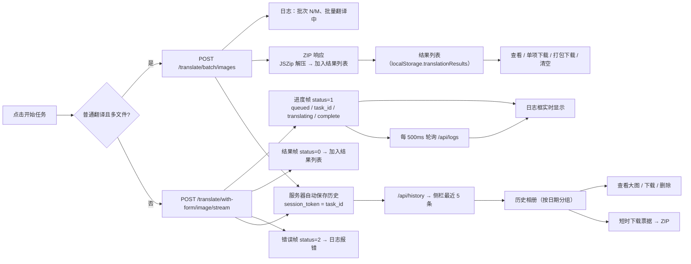

# Web 进度、结果与历史

开始翻译后，这里说明如何查看任务进度、在浏览器中预览和下载结果，以及如何管理保存在服务器上的历史记录。进度通过日志框实时输出，而不是百分比进度条；结果列表只存在于当前浏览器；历史记录保存在服务器上，同一账号换浏览器也能看到。上传、配置与启动翻译见[上传配置与翻译](./upload-config-and-translate.md)，会话与语言切换见[登录、语言与会话](./login-language-and-session.md)，管理员对全部历史与任务的管理见[管理员界面](./administrator-interface.md)。

## 页面与接口范围 {#feature-boundary}

- “结果列表”是当前浏览器内的临时视图，条目保存在 `localStorage.translationResults`（保存的是 blob 地址）；它不等于服务器历史，清空浏览器数据或更换浏览器后不可恢复。
- “历史记录”由服务器在翻译成功后自动写入并按用户隔离；普通用户只能看到自己的历史，是否可查看、下载、删除由权限决定，无权限时对应接口返回 403。
- 进度通过流式进度帧、每 500ms 一次的任务日志轮询和日志框呈现；界面没有百分比进度条。
- 这里仅写 Web 用户操作。流帧格式、历史与下载票据等 HTTP API 契约分别见[流式协议](../developer/http-api/streaming-protocol.md)与[历史、文件与下载票据](../developer/http-api/history-files-and-download-tickets.md)。

## 在 Web 界面中操作 {#ui-operations}

### 查看翻译进度 {#view-progress}

1. 点击“开始任务”后，右侧“日志输出”区域实时输出进度消息。
2. 单文件普通翻译走流式接口：进度消息来自两类来源：
   - 流响应中的进度帧（`status=1`），例如“加载图片中...”“初始化翻译器...”“翻译中...”“Done!”；
   - 任务开始后浏览器每 500ms 轮询 `/api/logs?limit=200&task_id=...`，按 `task_id` 拉取更完整的任务日志（检测、OCR、翻译器调用等细节），并用时间戳过滤已显示的日志。
3. 多文件普通翻译按 `cli.batch_size` 分批，日志依次输出“批次 N/M: X 个文件”“批量翻译中...”，最后输出“所有任务完成！”。
4. 排队与并发：超出并发限制时进度帧发送“排队中... (前面还有 N 个任务)”，获得槽位后发送“获得翻译槽位，开始处理...”。
5. 失败与取消：进度帧 `status=2` 携带错误信息并写入日志；管理员取消任务时任务以 499 结束。
6. 会话过期：日志轮询收到 401 时停止轮询并提示“登录状态已过期，已停止实时日志轮询。当前任务可能仍在继续，请重新登录后再查看日志。”

### 预览与管理结果 {#preview-and-manage-results}

1. 每张图片完成后自动加入“结果列表”，最新在前；ZIP 显示 📦，图片显示 🖼️。
2. 每个条目提供“查看”“下载”“×”（删除）三个操作：查看在新标签页打开图片，下载按原文件名保存，删除会释放对应的 blob URL。
3. 存在图片结果时显示“🔍 展开图片查看器”；工具栏还有“打包下载”和“清空”。“打包下载”用 JSZip 把所有结果打成 `translation_results_<时间戳>.zip`。
4. 图片查看器弹窗左侧是缩略图、右侧是大图，支持“下载”；移动端支持双指缩放。
5. 清空需要确认“确定要清空所有翻译结果吗？”，确认后释放所有 blob URL 并清空列表。

### 打开历史相册 {#open-history-gallery}

1. 页面加载时调用 `/api/history` 拉取当前用户的历史，“历史”区域只显示最近 5 条（时间 + “N 个文件”）。
2. 点击“📷 打开相册”或“📷 查看全部 (N)”打开“翻译历史相册”弹窗，历史按日期分组显示为卡片。
3. 卡片显示缩略图、时间和文件数，可勾选；缩略图与大图请求都携带 `X-Session-Token` 访问受保护的图片接口。
4. 点击卡片“查看”打开全屏图片查看器，左右方向键切换、Esc 关闭。

### 下载历史记录 {#download-history}

1. 单条历史：先取会话详情；只有 1 个文件时申请单文件下载票据，多个文件时申请整个会话的 ZIP 下载票据。
2. 勾选多条后用“下载选中”申请批量票据；未勾选时“下载全部”把当前全部历史打包为一个 ZIP（文件名前缀 `history_selected` / `history_all`）。
3. 票据是短时 URL（默认 5 分钟），下载完成后服务器会清理临时 ZIP 文件。

### 删除历史记录 {#delete-history}

1. 在相册卡片点击 🗑，确认“确定要删除这条翻译历史吗？”后调用 `DELETE /api/history/{token}`。
2. 删除同时移除服务器的会话目录与索引记录，本地相册列表同步刷新。
3. 无删除权限时接口返回 403，前端提示“删除失败”。

## 请求与数据流 {#runtime-behavior}

### 流式进度帧与日志轮询 {#stream-progress-and-log-polling}

单文件普通翻译调用 `POST /translate/with-form/image/stream`，响应是“1 字节状态 + 4 字节长度 + 数据”的自定义流帧：`status=1` 是进度 JSON（阶段包括 `task_id`、`start`、`image_loading`、`translator_init`、`translating`、`transforming`、`sending`、`complete`，以及排队时的 `queued`、`slot_acquired`），`status=0` 是结果图片数据，`status=2` 是错误。前端解析进度帧并把 `message` 写进日志框，用 `task_id` 阶段的值作为当前任务 ID。

多文件普通翻译走 `POST /translate/batch/images`：请求体带 base64 图片、配置、`batch_size` 和文件名，响应是带 `X-Content-Type: application/zip` 自定义头的 ZIP；前端用 JSZip 解压，把图片逐张加入结果列表。批量请求在前端用 `AbortController` 设置了 30 分钟超时。

### 结果列表与浏览器存储 {#results-list-and-local-storage}

每次完成（单文件流式、批量解压，或导出/导入等返回 blob 的路径）都会调用 `addResult()`，把 `{id, filename, imageData, type, timestamp}` 追加进 `resultsList` 并写入 `localStorage.translationResults`。`imageData` 是 `URL.createObjectURL()` 生成的 blob 地址。

blob 地址只在创建它的页面会话内有效：刷新页面或更换浏览器后，旧条目的预览/下载通常不再可用。历史记录才是跨浏览器、跨会话的持久保存。

### 服务器历史与下载票据 {#server-history-and-download-tickets}

只有走 `while_streaming` 流式管线的请求会自动写服务器历史：Web 前端中“普通翻译”单文件（`/translate/with-form/image/stream`）和批量翻译（每张图各一条，token 为 `{task_id}_{i}`）会保存；导出原文/导出译文、导入译文渲染、仅上色、仅超分、仅修复在 Web 前端调用的是非流式端点，不写服务器历史（这些工作流的 `/stream` 变体才会写）。保存时以 `task_id` 作为 `session_token`，把结果图复制进结果目录下的会话文件夹，并写 `metadata.json` 与索引记录；保存失败只写警告日志，不中断主流程。

历史列表、缩略图、大图、下载和删除都要求登录（请求携带 `X-Session-Token`）。下载不直接暴露文件路径，而是先申请短时票据：单个文件或整个会话一个票据，多条历史走 `batch-download-ticket`，票据 URL `GET /api/history/downloads/t/{ticket}` 默认 5 分钟内有效，取走后服务端清理临时 ZIP。

上图描述的是数据流，不代表每次运行都必然有历史：历史保存是尽力而为，失败只写警告；导出/导入/上色/超分/修复在 Web 前端走非流式端点时不产生历史条目，“结果列表”始终只存在于当前浏览器。本页或私有任务产物。

## 权限、安全与限制 {#dependencies-and-conflicts}

- 结果列表与服务器历史是两套独立机制：前者存 `localStorage.translationResults`（blob 地址），后者存服务器结果目录与 `translation_history.json`。不要混写。
- 进度可见性依赖会话：`session_token` 失效后，流式请求、历史接口和日志轮询都会 401；轮询会自动停止并提示重新登录。
- 历史按用户隔离：普通用户只能查看、下载、删除自己的历史；查看/删除权限由账号权限决定。管理员视角见[管理员界面](./administrator-interface.md)。
- 下载票据有 TTL（默认 5 分钟）且临时 ZIP 会被清理；长时间闲置后需要重新申请票据。
- 批量请求的 30 分钟前端超时与服务器 `timeout_keep_alive=1800` 对应，但不代表批内每张图都成功；取消或失败由服务器任务机制处理，见[翻译端点](../developer/http-api/translation-endpoints.md)。
- 日志内容可能包含业务文本与路径；分享前必须删除请求正文、日志消息、路径与凭据，见[隐私、清理与日志分享](../troubleshooting/privacy-cleanup-and-log-sharing.md)。

> 详见参考索引：[界面选项对照表](../reference/options-i18n-matrix.md)。
