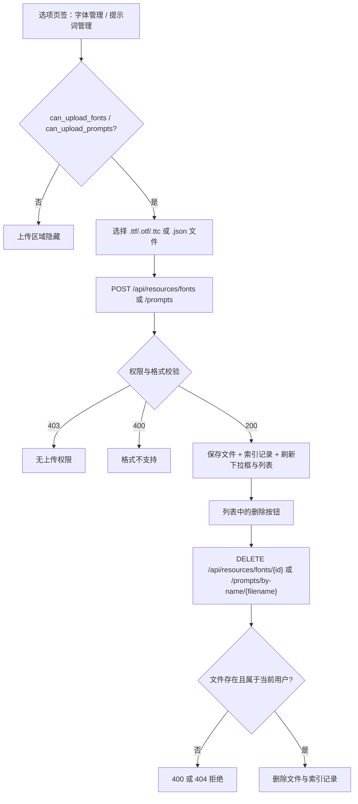
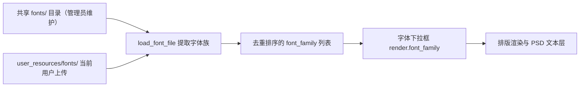
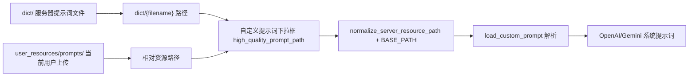

# 资源、字体与提示词

当服务器没有提供你需要的字体，或翻译器需要自定义提示词时，可以在 Web 工作区的“选项”页签上传自己的字体和提示词文件，并在配置下拉框中选择它们。这里主要说明普通用户的资源上传、列表、删除和配置使用；管理员维护的共享字体与提示词见[管理员界面](./administrator-interface.md)，HTTP 端点契约见[配置、环境与资源 API](../developer/http-api/config-env-and-resources.md)。

## 页面与接口范围 {#feature-boundary}

- 内容包括 Web 用户资源：字体（TTF/OTF/TTC）和提示词（JSON）的上传、列出、删除，以及 `render.font_family` 与 `translator.high_quality_prompt_path` 两个配置字段。
- 上传区域是否显示由 `/user/settings` 返回的 `can_upload_fonts`、`can_upload_prompts` 决定；删除是否允许由服务端权限检查决定。
- 不覆盖管理员维护的共享字体与提示词（`/upload/font`、`/upload/prompt`、`/fonts`、`/prompts` 管理端点），也不覆盖桌面端的提示词列表 CRUD（见[提示词列表、应用与预览](../desktop/prompts/list-apply-and-preview.md)）。
- 这里不展示任何真实 API Key、私有提示词正文或用户文件内容。

## 在 Web 界面中操作 {#ui-operations}

### 找到资源与配置入口 {#find-resource-entry}

登录后进入主工作区，右侧设置面板有“基本设置”（Basic Settings）、“高级设置”（Advanced Settings）、“选项”（Options）、“API密钥”（API Keys (.env)）四个页签。

- “字体管理”与“提示词管理”两个区域位于“选项”页签的右侧列。
- 只有 `can_upload_fonts` / `can_upload_prompts` 为真时对应上传区域才显示；区域隐藏不等于服务器禁止，权限最终由服务端校验。
- `render.font_family` 下拉框位于“高级设置”页签（render 分组），`translator.high_quality_prompt_path` 下拉框位于“基本设置”页签（translator 分组）；两者即使选项为空也会显示下拉框，并带“-- 不使用 --”空选项。

### 上传字体 {#upload-fonts}

1. 在“选项”页签的“字体管理”区域点击“上传字体文件”。
2. 文件选择框只允许 `.ttf`、`.otf`、`.ttc`；后端同样只接受这三种格式。
3. 上传成功后前端重新请求 `/config/options`，刷新“字体”下拉框和“已上传的字体”列表，并在日志输出“字体上传成功”。

### 上传提示词 {#upload-prompts}

1. 在“选项”页签的“提示词管理”区域点击“上传提示词文件”。
2. 文件选择框只允许 `.json`；服务端 `resource_service` 的 `PROMPT_FORMATS` 是 `.txt`/`.json`，但提示词加载器（`load_prompt_file`）只解析 `.json`/`.yaml`/`.yml`，因此请使用 JSON。
3. 上传成功后刷新“自定义提示词”下拉框和“已上传的提示词”列表。

### 删除资源 {#delete-resources}

- 字体行始终显示“删除”按钮；提示词行只有路径包含 `user_resources` 的用户资源才显示“删除”，服务器自带提示词显示“服务器提示词”标签。
- 点击“删除”会弹出确认框，确认后调用删除端点；前端随后刷新下拉框和列表。
- 前端不按 `can_delete_fonts` / `can_delete_prompts` 隐藏删除按钮，权限由服务端拒绝并返回 `403`。

## 参数与选项 {#parameters-and-options}

> 本页各参数的详细介绍（界面名称、存储键、默认值与生效阶段），见参考索引：[界面选项对照表](../reference/options-i18n-matrix.md)。

#### 字体 {#font-family}

“字体”下拉框位于“高级设置”页签（渲染分组），选择排版渲染与可编辑 PSD 文本层使用的字体；选项来自服务器共享字体目录与当前用户已上传字体的去重并集。详细说明见[排版与渲染](../desktop/settings/typesetting-and-rendering.md)。

#### 自定义提示词 {#high-quality-prompt-path}

“自定义提示词”下拉框位于“基本设置”页签（翻译分组），选择翻译请求使用的自定义提示词文件；选项来自服务器提示词目录（排除系统提示词）与当前用户上传的提示词。详细说明见[上下文与提示词](../desktop/translator/context-and-prompts.md)。

## 请求与数据流 {#runtime-behavior}

### 资源生命周期 {#resource-lifecycle}

限制说明：上传与删除都要求会话，并分别检查资源权限；即使界面显示了按钮，无权限的请求也会被服务端以 `403` 拒绝。

### 字体下拉列表如何合并 {#font-merge}

说明：`/config/options` 只返回字体族名称，不返回文件路径；`load_font_file` 会把字体注册进 Qt 字体库并返回家族名，因此刚上传的字体需要重新请求选项后才能出现在下拉框中。

### 提示词下拉列表如何合并 {#prompt-merge}

说明：`dict/` 扫描会排除 `system_prompt_hq`、`system_prompt_hq_format`、`system_prompt_line_break`、`glossary_extraction_prompt` 四个系统 stem；用户提示词路径来自 `get_user_prompts`，与服务器提示词拼接后按服务器提示词在前、用户提示词在后的顺序出现。

## 权限、安全与限制 {#dependencies-and-conflicts}

- 上传字体后必须先重新加载配置选项（聚焦下拉框或重新登录）才能在选择器中看到；字体未注册时渲染端会回退到默认家族。
- 提示词必须是可解析的 JSON；`.txt` 可上传但无法被加载，翻译时按缺失处理。
- 管理员共享字体/提示词与用户私有资源是两套存储与权限：共享资源见[管理员界面](./administrator-interface.md)，两套资源的 HTTP 契约见[配置、环境与资源 API](../developer/http-api/config-env-and-resources.md)。
- 资源权限由用户组配置（`can_upload_fonts`、`can_upload_prompts`、`can_delete_fonts`、`can_delete_prompts`）决定；前端隐藏只影响显示，不能绕过服务端检查。
- 上传的文件名会被清洗、重名会加数字后缀；不要依赖上传后的原始文件名。

> 详见参考索引：[界面选项对照表](../reference/options-i18n-matrix.md)。
