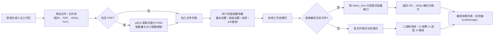

# Web 上传、配置与翻译

登录 Web 界面（`/`）后，主工作区用于完成"上传图片 → 配置参数 → 发起翻译"的完整流程：左侧面板添加文件、选择工作流模式并开始任务，右侧四个标签配置参数与 API 密钥。这里主要说明用户界面操作；浏览器实际调用的 HTTP 端点的请求、响应、鉴权与状态码契约见开发者文档 `../developer/http-api/translation-endpoints.md` 与 `../developer/http-api/streaming-protocol.md`。

## 页面与接口范围

- 内容包括 Web 用户界面中的上传、配置与发起翻译。登录与会话见[登录、语言与会话](./login-language-and-session.md)，进度、结果与历史见[进度、结果与历史](./progress-results-and-history.md)，账号、权限与 API 密钥见[账号、权限与 API 密钥](./accounts-permissions-and-api-keys.md)，字体与提示词上传见[资源、字体与提示词](./resources-fonts-and-prompts.md)，访问地址见[启动与访问](./launch-and-access.md)。
- Web 前端不是桌面 Qt 界面的直接复用：`index.html` 自带初始中文，`script.js` 通过 i18n key 覆盖一部分静态文字；"添加文件夹"、"文件列表"、"翻译结果"、"翻译历史"、"N 个文件"等仍是 HTML/脚本硬编码，没有对应 i18n key。
- 上传、PDF 提取、配置导入导出和结果列表都在浏览器本地完成；浏览器 `localStorage` 中的结果列表与服务器翻译历史是两套独立存储。
- 工作流模式下拉框控制的 `cli.load_text`、`cli.translate_json_only`、`cli.template`、`cli.generate_and_export`、`cli.colorize_only`、`cli.upscale_only`、`cli.inpaint_only`，以及 `cli.batch_size`、`cli.batch_concurrent`、`cli.use_gpu` 等键被服务器端 `SERVER_HIDDEN_CONFIG_KEYS` 隐藏，不显示在 Web 配置表单中；不要手工编辑这些键。
- 上传数量/大小限制、API 密钥编辑开关、字体与提示词上传权限来自 `/user/settings`；`0` 表示不限制。

## 在 Web 界面中操作

### 添加文件与文件夹

1. 左侧"文件列表"面板提供三个按钮："添加文件"（`Add Files`）、"添加文件夹"（HTML 硬编码中文，未走 i18n）、"清空"（`Clear List`）。
2. 点击"添加文件"打开系统多选对话框；点击"添加文件夹"选择整个目录。文件选择器的 `accept` 为 `image/*,.pdf,.json,.txt`。
3. 选择 PDF 时，浏览器用 pdf.js 按 2x 渲染每一页并提取为 PNG（文件名形如 `{原名}_page_{页码}.png`）。提取受 `max_pdf_size_mb`（前端兜底 50MB）与 `max_images_per_batch` 限制；超过配额只提取剩余页并写警告日志。PDF 相关日志文案是脚本内硬编码中文 fallback（`en_US`、`zh_CN` 两个 locale 均无这些 key）。
4. 同时选中的 `.json`、`_original.txt`、`_translated.txt` 会被按基础文件名与图片匹配，供"导入译文并渲染"模式使用；匹配成功或失败都会写入日志。
5. 列表项右侧 `✖` 移除单项；"清空"清空全部；文件计数显示 `N 个文件`（硬编码中文）。
6. 超过数量或大小限制时，前端弹出 `alert` 并拒绝本次添加。

### 配置参数

1. 右侧设置区有四个标签："基本设置"（`Basic Settings`）、"高级设置"（`Advanced Settings`）、"选项"（`Options`）、"API密钥"（`API Keys (.env)`）。标签切换只在本地显示，不触发网络请求。
2. 配置表单由 `GET /config?mode=authenticated` 返回的数据生成；下拉选项来自 `/config/options`、`/translators`、`/languages`、`/workflows`。标签优先使用 `label_<key>` 翻译键，其次 `t(key)`，最后显示格式化键名。
3. 服务器按用户权限过滤：无权限的参数整组隐藏（`allowed_parameters`）；工作流下拉只保留 `allowed_workflows`；"API密钥"标签由 `show_env_editor` 与登录状态共同决定；字体/提示词上传区由 `can_upload_fonts`/`can_upload_prompts` 决定。
4. 布尔参数显示为"是/否"下拉（`True`/`False`），数字为数字框，字符串/枚举为文本框或下拉框。
5. "导出配置"（`Export Config`）把当前表单值序列化为 `config.json` 下载；"导入配置"（`Import Config`）读取本地 JSON 并重新生成表单。导入导出都在浏览器本地完成，不经过服务器。
6. 需要 API 密钥时切换到"API密钥"标签：编辑器按翻译、OCR、上色、渲染四个分组渲染密钥输入框（password 或 text 类型），"保存 API 密钥"按钮把已填写的 key POST 到 `/env`，并暂存到 `localStorage.user_env_vars`。`/env` 与 `/env/effective` 不返回服务器密钥明文；本文档不收录任何真实密钥。

### 选择工作流模式

"翻译流程模式"（`Translation Workflow Mode:`）下拉框列出七种模式，可用选项由 `/workflows` 按权限返回。

### 发起翻译

1. 确认文件列表与参数后点击"开始翻译"（`Start Translation`）。文件列表为空时，日志提示先添加图片文件。
2. 普通翻译且文件数大于 1：按 `cli.batch_size`（前端读取缺失时兜底为 `5`）把文件分批，每批把图片转成 data URI 提交批量接口，请求带 30 分钟浏览器超时（`AbortController`）；响应为 ZIP，浏览器用 JSZip 解压并把图片逐张加入"翻译结果"列表；JSZip 不可用或解压失败时直接下载 ZIP。
3. 普通翻译单文件或非普通模式：逐文件提交。普通模式走二进制流接口，浏览器解析自定义帧（1 字节状态 + 4 字节长度 + 数据；`0`=结果数据、`1`=进度 JSON、`2`=错误）；进度消息写入"日志输出"，错误会中断当前文件。
4. API 密钥：单文件请求把当前输入的密钥作为 `user_env_vars` 表单字段一并提交；批量请求使用服务器端为该用户保存的密钥。`runtime_api.py` 把这些值映射到各 feature/provider 的运行时覆盖。
5. 任务日志：翻译过程中每 500ms 轮询新日志（`/api/logs?limit=200&task_id=...`），任务结束后按 `task_id` 拉取完整日志；轮询返回 `401` 时停止轮询并提示重新登录。
6. 完成后的图片出现在"翻译结果"列表，可查看大图、单项下载、打包下载或清空；该列表保存在浏览器 `localStorage`，与服务器历史记录无关。

## 参数与选项

> 本页各参数的详细介绍（界面名称、存储键、默认值与生效阶段），见参考索引：[界面选项对照表](../reference/options-i18n-matrix.md)。

#### 批量大小 {#cli-batch-size}

该参数不显示在 Web 配置表单中（服务器端直接隐藏）。它决定"普通翻译"且文件数大于 1 时每批提交给翻译服务的文件数；文件列表会按此值分批处理。默认值：`3`。详细说明见[CLI、批量与输出](../desktop/settings/cli-batch-and-output.md)。

#### 翻译器 {#translator}

"翻译器"下拉框位于设置区 → "基本设置"，选择翻译请求使用的翻译服务；选项由服务器返回并按权限过滤。它只决定翻译实现，与 OCR、上色、渲染的模型与密钥分组相互独立。默认值：`openai`。详细说明见[翻译器选择与目标语言](../desktop/translator/selection-and-languages.md)。

#### 目标语言 {#target-lang}

"目标语言"下拉框位于设置区 → "基本设置"，选择翻译输出的目标语言；所选翻译器必须支持该语言。它与"保留源语言"是两个独立选项。默认值：`CHS`。详细说明见[翻译器选择与目标语言](../desktop/translator/selection-and-languages.md)。

#### 保留源语言 {#keep-lang}

"保留源语言"下拉框位于设置区 → "基本设置"，选择按源语言过滤文本区域的策略；`none`（显示为"不过滤"）表示不按源语言过滤。开启后，检测语言与所选语言不匹配的区域不会被翻译。默认值：`none`。详细说明见[翻译器选择与目标语言](../desktop/translator/selection-and-languages.md)。

## 上传与翻译数据流

"普通翻译且多文件"走批量接口（返回 ZIP），其余模式逐文件提交。进度帧只出现在单文件普通翻译的二进制流中；批量接口在请求完成或取消后统一返回结果。

## 权限、安全与限制

- 上传限制（数量、单图大小、PDF 大小）来自 `/user/settings`，由管理员/用户组配额决定；`0` 表示不限制，前端在超出时拒绝添加。
- 配置表单内容由权限过滤：用户组可隐藏参数、设置默认值；用户白名单可以解锁被用户组禁用的参数；被过滤的参数不会显示，也不应手工注入。
- `cli.batch_size` 只控制普通翻译多文件的分批；它与 `context_size`、`batch_concurrent` 是不同层级，不能相互替代。
- "导入译文并渲染"需要图片与同名 JSON 同时上传；只上传图片会在日志中提示缺少 JSON，并跳过该文件。
- 批量接口与单文件接口的 API 密钥来源不同：单文件把当前输入的密钥随请求发送；批量接口使用服务器端保存的密钥。切换语言、刷新页面不会丢失已保存到 `/env` 的密钥，但会清空未保存的临时输入。
- 浏览器结果列表（`localStorage`）与服务器翻译历史是两套存储；清空结果列表不影响服务器历史。
- 上传与翻译涉及业务内容。共享日志、导出文件或调试目录前必须删除请求正文、历史页文本、路径与凭据。

> 详见参考索引：[界面选项对照表](../reference/options-i18n-matrix.md)。
