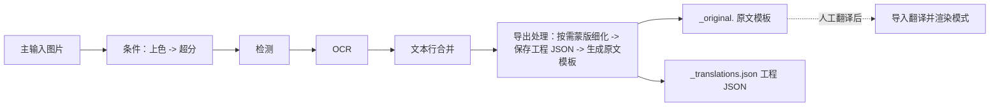

# 导出原文

当你想把原图上的文字先导出为文本、在外部人工翻译后再渲染回来时，使用“导出原文”模式。这是九种工作流中的“导出原图”工作流，界面中的名称是“导出原文”。它只对主输入图片执行条件上色/超分、检测、OCR 和文本行合并，然后跳过翻译、修复和渲染，写出每张图的工程 JSON 和 `<stem>_original.<template-format>` 原文模板；人工翻译这些模板后，再用[导入翻译并渲染](./import-translation-and-render.md)读回并渲染。

九个模式的整体对照和输出目录设置见[输出目录与工作流](../desktop/translation/output-directory-and-workflow.md)；`cli.template` 与 `cli.save_text` 的参数说明见[模式专属工作流与模板对齐](../desktop/settings/mode-specific.md#cli-template)和[CLI 批量与输出](../desktop/settings/cli-batch-and-output.md#cli-save-text)。

## 什么时候用 {#feature-boundary}

- 这里仅列出九种工作流中的“导出原文”（下拉框索引 `2`）。选择该模式时，界面先清空八个互斥工作流字段，再只把 `cli.template` 设为 `true` 并保存配置；运行时要同时满足 `cli.save_text=true` 才进入导出分支。
- 输入是主输入图片与可读取的翻译模板；输出是工程 JSON 与原文副文件，不写主输出图。每张图以输入图片的不含扩展名 `<stem>` 组织工作目录。
- 这里不重复检测、OCR、上色、超分、蒙版、修复或渲染各自的参数算法；工作流选择不是翻译器选择，也不是 API 候选槽切换（见[翻译器选择](../desktop/translator/selection-and-languages.md)）。

## 运行这个流程 {#ui-operations}

### 选择导出原文工作流 {#select-export-original}

1. 打开“翻译”页，在“翻译任务”卡片中点击“翻译流程模式：”下拉框。
2. 选择“导出原文”。切换时界面只把 `cli.template` 设为 `true`，其余七个工作流字段清为 `false` 并保存配置；标题变为“导出原文”，副标题显示对应提示。
3. 点击“仅生成原文模板”开始按钮启动任务。切换模式不会自动开始任务；任务进行中按钮会变为“停止翻译”等状态，见[进度、停止与任务状态](../desktop/translation/progress-stop-and-task-state.md)。

提示中的 `图片名` 是程序对输入 `<stem>` 的示例称呼，不是用户私有文件名；`manga_translator_work/originals/` 是每图工作目录下的固定子目录名。

## 处理顺序 {#runtime-behavior}

“导出原文”只有在 `template=true` **且** `save_text=true` 时才进入导出分支（源码中的 `is_template_save_mode`）。核心 `translate_batch()` 会强制 `batch_size=1` 逐张落盘，并把该模式列为 `batch_concurrent` 不兼容；桌面控制层也会把本次并发局部变量改为 `false`。高质量翻译流程同样会因导入/导出模式被跳过。

上图只表达阶段顺序：`_translate_until_translation()` 完成条件上色/超分、检测、OCR 和文本行合并；`_handle_template_and_save_text()` 再按需细化蒙版、保存 JSON 并生成原文模板。没有文本区域时仍会保存空 JSON 并生成空模板文件。

### 输入与发现规则 {#input-and-discovery}

- 主输入必须是文件服务支持的图片；添加文件夹时递归查找并按自然排序收集，跳过名为 `manga_translator_work` 的目录。压缩包和文档扩展名由同一服务识别，但压缩包内副文件与本工作流的配对尚未在所有环境中确认。
- 每图工作目录以输入图片的原始路径和不含扩展名的 `<stem>` 为基准：原文副文件写入 `manga_translator_work/originals/<stem>_original.<template-format>`。
- 需要可读取的模板文件；`config/translation_template.json` 缺失或无法读取时，`output_format` 回退为 `json`。
- 启用 `detector.import_yolo_labels` 且导入到 YOLO 标注时，检测阶段直接用导入框替代检测器结果，并标记为“template mode”。

### 跳过与保留的阶段 {#skipped-and-kept-stages}

- 跳过：翻译、修复、渲染和主输出图保存；不调用翻译服务，因此不产生 API 翻译请求。
- 保留：条件上色 → 条件超分 → 检测 → OCR → 文本行合并；有非空区域且有原始蒙版时执行蒙版细化。
- 例外：导入 YOLO 标签的导出模式跳过蒙版细化且不在 JSON 中保存蒙版。
- 边界：GUI 只设置 `template`，配置默认 `save_text=true`；若外部配置把 `save_text` 改为 `false`，将不会进入导出分支，实际退化路径需在实际环境中确认。

### 蒙版与 JSON 细节 {#mask-and-json-details}

- 工程 JSON 由 `_save_text_to_file()` 写入 `manga_translator_work/json/<stem>_translations.json`（新位置优先，回退图片同级旧位置）。
- 导出原文会在 JSON 中写入 `skip_font_scaling=false`，让后续导入渲染重新执行智能排版，不继承旧字号；因为翻译未运行，区域 `translation` 仍是原始值。
- 蒙版保存的是细化后的 `ctx.mask`（`mask_is_refined=true`），没有细化结果时保存原始 `mask_raw`（`mask_is_refined=false`）；导入 YOLO 标签的导出模式不保存蒙版。
- `generate_original_text()` 按模板把每个区域写成 `<original>` 行，`translation` 为空时用原文作为占位符；没有文本区域时记录日志并生成空文件。

### 输出文件 {#output-files}

| 输出 | 路径 | 说明 |
| --- | --- | --- |
| 工程 JSON | `manga_translator_work/json/<stem>_translations.json` | 区域、尺寸、蒙版和导出标记；导入渲染时读取 |
| 原文模板 | `manga_translator_work/originals/<stem>_original.<template-format>` | 扩展名由模板 `output_format` 决定，默认 `json`；无文本区域时生成空文件 |
| 主输出图 | 不写 | 渲染被跳过，导出不生成主图 |
| 编辑器底图 | `manga_translator_work/editor_base/<原图文件名>` | 仅当启用上色或超分时条件写入 |

## 输入、输出与限制 {#dependencies-and-conflicts}

- 依赖 `cli.save_text=true` 与可读取模板；`batch_concurrent` 不兼容，前端与核心都会按非并发处理，导出原文还强制 `batch_size=1`。
- `cli.overwrite=false` 时，开始前检查 `<stem>_original.<template-format>` 是否存在，存在则跳过该图并记入 skipped。
- 与导出翻译共享模板和 JSON 写入路径；与导入翻译并渲染构成“导出原文 → 人工翻译 → 导入渲染”的配对，见[导入翻译并渲染](./import-translation-and-render.md)。
- 显示名称描述“目标”，不自动启用或关闭上色/超分模型；上色器与倍率仍由 `colorizer.colorizer`、`upscale.upscale_ratio` 等常规参数决定。

## 继续阅读 {#related-pages}

- 其它工作流：[正常翻译流程](./normal.md) · [导出翻译](./export-translation.md) · [仅翻译（JSON）](./translate-json-only.md) · [导入翻译并渲染](./import-translation-and-render.md) · [仅上色](./colorize-only.md) · [仅超分](./upscale-only.md) · [仅修复](./inpaint-only.md) · [替换翻译](./replace-translation.md)
- 九种工作流的选择、输出目录与互斥写入：[输出目录与工作流](../desktop/translation/output-directory-and-workflow.md)
- 九种工作流的输入、跳过阶段与输出汇总：[工作流矩阵](../reference/workflow-matrix.md)
- 工作流字段互斥、参数覆盖与模板对齐：[模式专用工作流与模板对齐](../desktop/settings/mode-specific.md)

> 详见参考索引：[工作流矩阵](../reference/workflow-matrix.md)。
