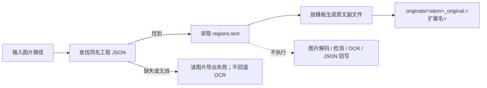

# 导出原文

“导出原文”默认沿用原来的图片检测/OCR与 JSON 写入流程。开启“设置 → 模式相关 → 文本导出 → 仅从本地 JSON 导出文本”后，改为从本地已有工程 JSON 读取 `regions[].text`，只生成 `<stem>_original.<template-format>` 原文副文件，不打开图片、不执行检测或 OCR，也不回写工程 JSON。

九个模式的整体对照和输出目录设置见[输出目录与工作流](../desktop/translation/output-directory-and-workflow.md)；开关与 `cli.template` 说明见[模式专属工作流与模板对齐](../desktop/settings/mode-specific.md#cli-export-from-local-json)。

## 什么时候用 {#feature-boundary}

- 选择“导出原文”（下拉框索引 `2`）会设置 `cli.template=true`；默认从主图检测/OCR并写原文副文件。
- 开关开启后，输入改为同名工程 JSON 与可读取模板；图片路径只用于定位 JSON，不会解码图片，输出不包含主图，也不修改 JSON。
- 开关关闭时沿用旧流程；旧流程要求 `cli.save_text=true`，并执行检测、OCR、蒙版与 JSON 写入。

## 运行这个流程 {#ui-operations}

### 选择导出原文工作流 {#select-export-original}

1. 打开“翻译”页，在“翻译任务”卡片中点击“翻译流程模式：”下拉框。
2. 选择“导出原文”。切换时界面只把 `cli.template` 设为 `true`，其余七个工作流字段清为 `false` 并保存配置；标题变为“导出原文”，副标题显示对应提示。
3. 点击“仅生成原文模板”开始按钮启动任务。切换模式不会自动开始任务；任务进行中按钮会变为“停止翻译”等状态，见[进度、停止与任务状态](../desktop/translation/progress-stop-and-task-state.md)。

提示中的 `图片名` 是程序对输入 `<stem>` 的示例称呼，不是用户私有文件名；`manga_translator_work/originals/` 是每图工作目录下的固定子目录名。

## 处理顺序 {#runtime-behavior}

开启 `cli.export_from_local_json` 时，`translate_batch()` 在图片物化前直接读取本地 JSON。找不到 JSON 时该图片明确失败，不会回退 OCR。开关默认关闭，关闭时进入原来的 `template + save_text` 分支。

### 输入与发现规则 {#input-and-discovery}

- 默认仍从翻译页文件列表选择图片路径；路径用于确定工作目录和同名工程 JSON，导出分支不会打开图片内容。
- 工程 JSON 必须位于新位置 `manga_translator_work/json/<stem>_translations.json` 或兼容的图片同级旧位置。
- 原文副文件写入 `manga_translator_work/originals/<stem>_original.<template-format>`；需要可读取模板，格式缺失或非法时回退 `json`。
- `detector.import_yolo_labels` 仅在关闭本地 JSON 开关后的旧检测流程中生效。

### 跳过与保留的阶段 {#skipped-and-kept-stages}

- 开关开启时跳过图片读取、上色、超分、检测、OCR、翻译、蒙版、修复、渲染、主图保存和 JSON 回写。
- 开关开启时保留从已有 JSON 读取 `regions[].text` 并按模板生成原文副文件；模板中 `<translated>` 仍可使用 JSON 内已有的 `translation`。
- 开关关闭时，旧流程执行条件上色、超分、检测、OCR、蒙版细化及 JSON 写入；仍不调用翻译服务。

### 工程 JSON 细节 {#mask-and-json-details}

- 开关开启时以只读方式打开工程 JSON，字节内容保持不变，不修改蒙版、字号、译文或任何编辑器字段。
- `generate_original_text()` 按模板导出非空原文，移除 `[BR]`；无区域时生成模板对应的空内容。

### 输出文件 {#output-files}

| 输出 | 路径 | 说明 |
| --- | --- | --- |
| 工程 JSON | `manga_translator_work/json/<stem>_translations.json` | 开关开启时必须预先存在、只读且保持不变 |
| 原文模板 | `manga_translator_work/originals/<stem>_original.<template-format>` | 两种路径都会写入；扩展名来自模板 `output_format` |
| 主输出图 | 不写 | 导出模式不渲染主图 |
| 编辑器底图 | 条件写入 | 仅开关关闭的旧流程可能执行上色或超分 |

## 输入、输出与限制 {#dependencies-and-conflicts}

- 开关开启时依赖已有工程 JSON 与可读取模板；缺少 JSON 时明确失败，不回退 OCR；`batch_concurrent` 不兼容。
- `cli.overwrite=false` 时，已有原文副文件会在开始前被跳过。
- `cli.save_text` 是“导出原文”工作流标志组合的一部分；开关开启时不会保存或覆盖 JSON。
- 开关关闭时沿用旧流程，此时受检测、OCR、上色、超分和 `save_text` 写入行为影响。

## 继续阅读 {#related-pages}

- 其它工作流：[正常翻译流程](./normal.md) · [导出翻译](./export-translation.md) · [仅翻译（JSON）](./translate-json-only.md) · [导入翻译并渲染](./import-translation-and-render.md) · [仅上色](./colorize-only.md) · [仅超分](./upscale-only.md) · [仅修复](./inpaint-only.md) · [替换翻译](./replace-translation.md)
- 九种工作流的选择、输出目录与互斥写入：[输出目录与工作流](../desktop/translation/output-directory-and-workflow.md)
- 九种工作流的输入、跳过阶段与输出汇总：[工作流矩阵](../reference/workflow-matrix.md)
- 工作流字段互斥、参数覆盖与模板对齐：[模式专用工作流与模板对齐](../desktop/settings/mode-specific.md)

> 详见参考索引：[工作流矩阵](../reference/workflow-matrix.md)。
