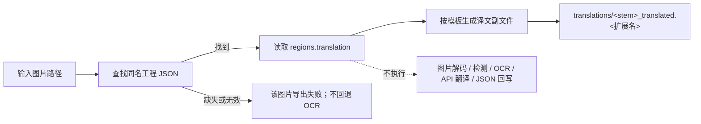

# 导出译文

“导出翻译”默认沿用原来的图片检测、OCR、翻译和 JSON 写入流程。开启“设置 → 模式相关 → 文本导出 → 仅从本地 JSON 导出文本”后，改为只把本地已有工程 JSON 中的译文导出到 `translations/` 副文件，不重新读取图片做检测或 OCR，不调用翻译 API，也不回写工程 JSON，因此不会覆盖用户编辑好的译文。

“导出翻译”与“导出原文”“仅翻译（JSON）”“导入翻译并渲染”构成模板/JSON 家族，区别见[导出原文](./export-original.md)、[仅翻译（JSON）](./translate-json-only.md)和[导入翻译并渲染](./import-translation-and-render.md)；九种工作流的整体边界见[输出目录与工作流](../desktop/translation/output-directory-and-workflow.md)，汇总表见[工作流矩阵](../reference/workflow-matrix.md)。

## 什么时候用

- 默认输入：主图片与可读取的导出模板；执行检测、OCR 和翻译。
- 开关开启后的输入：每张图片已有的 `manga_translator_work/json/<stem>_translations.json` 与可读取模板；图片文件只用于定位同名工程 JSON，不会被打开解码。
- 开关开启后读取 JSON `regions[].translation`，移除 `[BR]`，按模板写译文副文件，并跳过图片读取、上色、超分、检测、OCR、翻译、蒙版、修复、渲染、主图保存和工程 JSON 回写。
- 开关开启后的输出：`manga_translator_work/translations/<stem>_translated.<模板扩展名>`；原工程 JSON 保持不变。
- 工作流字段：下拉框第 1 项，运行时写入 `cli.generate_and_export=true`；GUI 切换保证八个工作流布尔字段互斥。

## 运行这个流程

### 选择导出译文工作流

1. 打开翻译页，在“翻译流程模式：”下拉框中选择“导出翻译”。
2. 页面标题变为“导出翻译”，副标题显示提示：导出翻译后可在 `manga_translator_work/translations/` 目录查看译文副文件。
3. 开始按钮变为“导出翻译”；点击后按该模式启动后端任务。

选择模式只写入配置并更新界面文案，不会自动开始任务。开始前应先添加主输入图片（“添加文件…”“添加文件夹…”或拖放），并保证导出模板存在或可解析。界面提示固定写作 `imagename_translated.txt`，但实际扩展名由模板的 `output_format` 决定（默认 `json`），提示文案不随模板扩展名变化。

“输出目录:”只决定主输出图的位置；导出翻译不写主图，因此本模式下它不影响 JSON 与译文副文件位置，这两类文件始终按输入图片的工作目录规则写入。

## 处理顺序

### 处理阶段与输出

开启 `cli.export_from_local_json` 时，`translate_batch()` 在图片物化之前直接进入本地 JSON 导出分支；缺少 JSON 时该图片明确失败，不回退 OCR。开关默认关闭，关闭时进入旧流水线。

### 模板导出细节

- 模板路径解析顺序：用户指定路径 > `MANGA_TEMPLATE_PATH` 环境变量 > 默认 `config/translation_template.json`。
- 模板首个 `output_format:` 行决定副文件扩展名；合法值为安全的 1–32 字符扩展名，缺失或非法时回退 `json`。
- `generate_translated_text()` 从工程 JSON 的 `regions` 收集条目：只包含非空原文区域，原文和译文都移除 `[BR]` 标记；`<original>` 填原文、`<translated>` 填译文，译文为空时导出空串（不回退原文，这与导出原文不同）。
- 模板必须至少包含一行 `<original>` 占位符，否则解析抛错，导出日志记为 “Failed to export clean text”。
- 内置默认模板的 `output_format` 为 `json`，占位符结构为 `<original>` / `<translated>` 行。

### 工程 JSON 边界

- 开关开启时，本地导出只读工程 JSON，不写 `skip_font_scaling`、蒙版、模型信息或任何其它字段。
- 用户编辑后的 `translation`、富文本、画笔/印章图层及未知扩展字段均原样保留。
- 开关关闭时，旧流程会重新生成并写回上述运行字段。

### 与并发和互斥的关系

- `batch_concurrent` 不兼容；本地 JSON 导出本身逐项处理且不会加载模型。
- GUI 切换时八个工作流字段互斥；`cli.export_from_local_json` 不是工作流字段，而是同时控制两种文本导出的独立开关。
- 开关关闭时按旧流程执行条件上色、超分、检测、OCR 和翻译，并可能产生相应资源与 API 成本。

## 输入、输出与限制

- 模板依赖：模板不可解析时译文副文件不产出，工程 JSON仍保持不变。
- 工程 JSON 依赖：仅开关开启时要求；找不到或无法读取时该图片失败，不自动回退到 OCR，避免意外重建并覆盖数据。
- `cli.overwrite=false`：GUI 开始前跳过译文副文件已存在的图片。
- `cli.save_text`：导出翻译不依赖它；开关开启时只读 JSON，不写 JSON。
- 开关关闭时，旧流程会使用上色、超分、检测、OCR、翻译模型和 API。
- 主输出目录、`save_to_source_dir`、`cli.format` 只影响主输出图；本模式不写主图，因此这些设置对本工作流输出无直接影响。

## 继续阅读 {#related-pages}

- 其它工作流：[正常翻译流程](./normal.md) · [导出原文](./export-original.md) · [仅翻译（JSON）](./translate-json-only.md) · [导入翻译并渲染](./import-translation-and-render.md) · [仅上色](./colorize-only.md) · [仅超分](./upscale-only.md) · [仅修复](./inpaint-only.md) · [替换翻译](./replace-translation.md)
- 九种工作流的选择、输出目录与互斥写入：[输出目录与工作流](../desktop/translation/output-directory-and-workflow.md)
- 九种工作流的输入、跳过阶段与输出汇总：[工作流矩阵](../reference/workflow-matrix.md)
- 工作流字段互斥、参数覆盖与模板对齐：[模式专用工作流与模板对齐](../desktop/settings/mode-specific.md)

> 详见参考索引：[工作流矩阵](../reference/workflow-matrix.md)。
