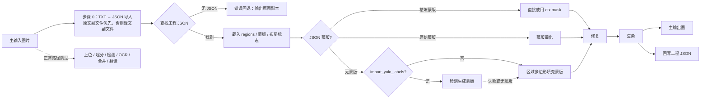

# 导入翻译并渲染

当译文已经存在（例如手工翻译了“导出原文”生成的 `imagename_original.txt`，或从“导出翻译”得到了译文副文件，或编辑器已保存工程 JSON），只需要把译文重新渲染到图片上时，使用“导入翻译并渲染”工作流。它从工程 JSON 载入文字区域、蒙版和布局标志，必要时先用 TXT 副文件更新 JSON，然后执行蒙版细化、修复和渲染，把结果写回工程 JSON 并输出主图；正常路径不运行上色、超分、检测、OCR、文本行合并和翻译。

“导入翻译并渲染”与“导出原文”“导出翻译”“仅翻译（JSON）”构成模板/JSON 家族，区别见[导出原文](./export-original.md)、[导出翻译](./export-translation.md)和[仅翻译（JSON）](./translate-json-only.md)；九种工作流的整体边界见[输出目录与工作流](../desktop/translation/output-directory-and-workflow.md)，汇总表见[工作流矩阵](../reference/workflow-matrix.md)。

## 什么时候用

- 输入：主输入图片（与正常翻译相同的文件发现规则），以及每张图必须能找到的工程 JSON；可选输入是原文/译文副文件（TXT 导入）和已存在的修复图。
- 执行阶段：JSON/内存载荷读取 →（已有精炼蒙版则复用，否则）蒙版细化 → 修复 → 渲染 → 主图保存与 JSON 回写。JSON 无蒙版且开启 `detector.import_yolo_labels` 时额外执行检测生成蒙版。
- 跳过阶段：上色、超分、检测、OCR、文本行合并和翻译（YOLO 缺蒙版时的检测是唯一例外）。
- 输出文件：主输出图、更新后的工程 JSON；重新执行修复且 `save_text=true` 时还写修复图；启用 `export_editable_psd` 时导出 PSD。
- 工作流字段：下拉框第 4 项，运行时写入 `cli.load_text=true`；GUI 切换保证八个工作流布尔字段互斥。

## 运行这个流程

### 选择导入翻译并渲染工作流

1. 准备每张图的工程 JSON（`manga_translator_work/json/<stem>_translations.json`，兼容图片同级的旧位置）。需要手工翻译时，先运行“导出原文”，翻译 `manga_translator_work/originals/` 下的 `imagename_original.txt`。
2. 打开翻译页，在“翻译流程模式：”下拉框中选择“导入翻译并渲染”。
3. 页面标题变为“导入翻译并渲染”，副标题提示：将从 `manga_translator_work/originals/` 或 `translations/` 目录读取 TXT 文件并渲染（优先使用 `_original.txt`）。
4. 开始按钮变为“导入翻译并渲染”；点击后按该模式启动后端任务。

选择模式只写入配置并更新界面文案，不会自动开始任务。开始前应先添加主输入图片（“添加文件…”“添加文件夹…”或拖放），并确认每张图都有可解析的工程 JSON；缺少 JSON 的图片会进入错误回退分支（根据当前实现，运行提示待验证）。

界面提示固定写作 `_original.txt`/“TXT 文件”，但实际副文件扩展名由模板 `output_format` 决定（默认 `json`），提示文案不随模板扩展名变化。

## 处理顺序

### 输入发现与 TXT 导入

`translate_batch()` 在逐图处理前先执行 `_preprocess_load_text_mode()`：对每张图用 `find_json_path()` 查找工程 JSON（新位置 `manga_translator_work/json/<stem>_translations.json` 优先，回退图片同级 `<stem>_translations.json`），再用 `find_txt_files()` 查找原文和译文副文件。原文副文件（`originals/<stem>_original.<模板扩展名>`）优先，不存在时才使用译文副文件（`translations/<stem>_translated.<模板扩展名>`）。没有 JSON 或没有 TXT 的图片跳过导入（前者会在逐图阶段报错）。

找到 JSON 和 TXT 后，`safe_update_large_json_from_text()` 按 `config/translation_template.json` 的占位符结构解析 TXT，用“原文精确匹配 → 空白归一化模糊匹配”更新每个区域的 `translation` 字段，并通过临时文件原子写回。导入成功后强制写 `skip_font_scaling=false`，保证本次渲染重新执行智能字号缩放，而不是沿用旧字号。模板缺失时 `_get_default_template_path()` 会自动创建内置默认模板；TXT 解析失败（例如模板没有 `<original>` 占位符）时导入被跳过，只写调试日志。

### 处理阶段与输出

上面的 Mermaid 是阶段与分支。限制说明：检测只在“JSON 无蒙版且 `import_yolo_labels=true`”时额外运行；AI renderer（`renderer` 为 OpenAI/Gemini）会跳过真正修复并用工作图作为渲染底图；已存在修复图只在 JSON 带蒙版时复用，否则重新修复。

### 蒙版、修复与渲染

- 载入时若 JSON 标记 `mask_is_refined=true`，蒙版直接作为 `ctx.mask` 使用；否则作为 `ctx.mask_raw` 进入蒙版细化。
- JSON 无蒙版时：开启 `import_yolo_labels` 先尝试检测生成蒙版（失败则回退），否则直接用区域 `lines` 多边形填充生成蒙版。
- 修复阶段顺序：AI renderer 跳过 → 编辑器内存载荷自带修复图 → 磁盘已有修复图（要求 JSON 带蒙版）→ 重新运行修复。重新修复时若 `save_text=true` 会写 `manga_translator_work/inpainted/<stem>_inpainted.<原扩展名>`。
- 渲染按 JSON 的 `skip_font_scaling` 控制是否跳过智能字号缩放（缺省视为 `true`；TXT 导入后会写 `false`；导出翻译写出的 JSON 会保留固定字号回放），按 `skip_text_replacements` 控制是否再应用文本替换规则。
- 载入时区域 `translation` 为空会用原文填充，`target_lang` 缺失时回退到配置的目标语言。

### JSON 回写与编辑器导出

渲染完成后，`_save_text_to_file()` 把最新 regions（含 `translation`、`font_size` 等渲染后字段）回写工程 JSON：保留已有 `paint_overlay`/`stamp_overlay` 图层、记录 `last_export_dir`、保存蒙版与 `mask_is_refined`；渲染过时写 `skip_text_replacements=true`。若有区域解析失败（`region_parse_failures > 0`），出于保护工程文件的目的跳过回写，避免丢失区域。

编辑器“导出”通道不经过磁盘 JSON：`export_service.py` 通过 `set_preloaded_load_text_payload()` 注入内存载荷，后端把这种载荷视为已授权终稿，只做纯渲染——跳过文本替换、跳过 JSON 回写，修复图直接使用编辑器提供的结果。该通道的 UI 操作和工程保存由编辑器页面说明，这里仅说明它与文件式导入共享 `load_text` 分支。

### 与并发和互斥的关系

- `batch_concurrent` 不兼容：桌面控制层和 `translate_batch()` 都把它视为不兼容模式，强制按非并发处理；界面仍保存并发配置也不会变成并发管线。
- 手工叠加多个工作流字段不是受支持组合。GUI 切换时八个布尔字段互斥；从配置同步下拉框时，导入翻译的优先级低于替换翻译、仅修复、仅超分、仅上色。
- 本模式不执行翻译服务调用，也不按 `colorizer.colorizer`/`upscale.upscale_ratio` 做条件上色与超分；主输出尺寸基于原图。

## 输入、输出与限制

- 工程 JSON 是硬性前置：`find_json_path()` 找不到 JSON 时逐图阶段报“翻译文件缺失/无效”，错误回退分支输出原图副本（根据当前实现，用户可见提示可能因版本而异）。
- TXT 导入依赖模板：模板缺失时自动创建默认模板；模板不可解析或 TXT 无有效条目时导入被跳过（仅调试日志），译文不会更新。
- `cli.overwrite=false`：GUI 开始前跳过主输出图已存在的图片（检查 `_calculate_output_path()` 的结果）。
- `cli.save_text`：本模式的 JSON 回写不依赖它，但重新生成的修复图只有 `save_text=true` 才落盘。
- `detector.import_yolo_labels`：只在 JSON 无蒙版时触发检测补蒙版；有蒙版时该参数不影响本工作流。
- `render.enable_template_alignment` 是替换翻译专用设置，与本工作流无关。
- 修复与渲染仍按所选模型产生模型、显存和 API 成本；这里不重复其参数说明。
- 主输出目录、`save_to_source_dir`、`cli.format` 决定主输出图的位置与扩展名；JSON、修复图和副文件始终按输入图片的工作目录规则写入。

## 继续阅读 {#related-pages}

- 其它工作流：[正常翻译流程](./normal.md) · [导出原文](./export-original.md) · [导出翻译](./export-translation.md) · [仅翻译（JSON）](./translate-json-only.md) · [仅上色](./colorize-only.md) · [仅超分](./upscale-only.md) · [仅修复](./inpaint-only.md) · [替换翻译](./replace-translation.md)
- 九种工作流的选择、输出目录与互斥写入：[输出目录与工作流](../desktop/translation/output-directory-and-workflow.md)
- 九种工作流的输入、跳过阶段与输出汇总：[工作流矩阵](../reference/workflow-matrix.md)
- 工作流字段互斥、参数覆盖与模板对齐：[模式专用工作流与模板对齐](../desktop/settings/mode-specific.md)

> 详见参考索引：[工作流矩阵](../reference/workflow-matrix.md)。
