# 正常翻译流程

“正常翻译流程”是翻译页“翻译流程模式：”下拉框的默认选项，也是九种工作流中唯一执行完整翻译链路的模式。需要从图片检测文字、识别并翻译、修复原文字区域并渲染译文时使用本模式；其余八个模式会跳过大部分阶段，总览见[输出目录与工作流](../desktop/translation/output-directory-and-workflow.md)。

这里主要说明正常模式的输入、完整处理阶段、跳过条件和输出文件。添加文件、列表状态和拖拽见[文件列表与输入](../desktop/translation/file-list-and-input.md)，开始、停止、取消和进度状态见[进度、停止与任务状态](../desktop/translation/progress-stop-and-task-state.md)，各阶段的参数算法见对应的设置页（检测、OCR 过滤与合并、翻译、蒙版与修复、排版与渲染、超分与上色、CLI 批量与输出）。

## 什么时候用

- 输入：主输入图片，通过“添加文件”“添加文件夹”或拖拽加入。添加文件夹时递归查找受支持的图片扩展名、按自然排序收集，并跳过名为 `manga_translator_work` 的目录。
- 处理阶段：条件上色 → 条件超分 → 检测 → OCR → 文本行合并 → 翻译 → 蒙版细化 → 修复 → 渲染 → 保存主输出图。
- 跳过条件：检测后无文本行、OCR 后无文本、翻译后区域为空、取消、AI renderer 跳过修复等，见下文“跳过条件”。
- 输出：主输出图；启用 `cli.save_text`（界面“图片可编辑”）时还写工程 JSON 和修复图；启用上色或超分时写编辑器底图。
- 正常模式是九种工作流中唯一允许进入 `batch_concurrent` 并发管线的模式；其余八个模式在桌面控制层和核心 `translate_batch()` 中都被视为不兼容，按非并发处理。
- 这里不解释各检测器、OCR、翻译器、修复器、渲染器的参数算法，那些内容在各设置页；工作流下拉框、输出目录控件和九种模式的互斥写入见[输出目录与工作流](../desktop/translation/output-directory-and-workflow.md)。

## 运行这个流程

### 添加输入并选择工作流

1. 打开“翻译”页签。页头默认标题为“正常翻译流程”，副标题为“提示：标准翻译流程，会进行检测、OCR、翻译和渲染”。
2. 点击“添加文件”或“添加文件夹”加入图片，也可以直接拖入文件或文件夹；点击“清空列表”可清空当前列表。
3. 在“翻译流程模式：”下拉框中确认选中“正常翻译流程”。切换下拉框时，GUI 会先把八个互斥的工作流字段全部清为 `false`，再只设置所选模式对应的字段并保存配置；正常模式对应八个字段全部为 `false`。
4. 在“输出目录:”输入框填写路径，或把输出文件夹拖入输入框；占位文案为“选择或拖入输出文件夹...”。点击“浏览...”选择目录，点击“打开”调用系统打开该目录。
5. 点击“开始翻译”开始任务。运行中按钮文案变为“停止翻译”，再点击可请求停止，随后进入“停止中...”状态。

## 处理顺序

### 主流水线

正常模式对每张图按以下顺序执行；上色、超分、修复是否实际发生由对应参数决定，不是模式强制。检测没有找到文本行、OCR 没有识别出文本时直接提前返回，不进入后续阶段。

```mermaid
flowchart LR
    Input["主输入图片"] --> Colorize{"colorizer.colorizer\n!= none?"}
    Colorize -- "否" --> UpscaleQ{"upscale.upscale_ratio\n非空?"}
    Colorize -- "是" --> Colorized["上色"]
    Colorized --> UpscaleQ
    UpscaleQ -- "否" --> Detect["检测"]
    UpscaleQ -- "是" --> Upscaled["超分"]
    Upscaled --> Detect
    Detect --> HasLines{"检测到文本行?"}
    HasLines -- "否" --> SkipRegion["跳过：输出输入图/超分图\n(skip-no-regions)"]
    HasLines -- "是" --> OCR["OCR"]
    OCR --> HasText{"识别出文本?"}
    HasText -- "否" --> SkipText["跳过：输出输入图/超分图\n(skip-no-text)"]
    HasText -- "是" --> Merge["文本行合并"]
    Merge --> Translate["翻译"]
    Translate --> Mask["蒙版细化"]
    Mask --> AIQ{"renderer 是\nAI renderer?"}
    AIQ -- "是" --> RenderBase["跳过修复：工作图作渲染底图"]
    AIQ -- "否" --> Inpaint["修复"]
    RenderBase --> Render["渲染"]
    Inpaint --> Render
    Render --> Output["主输出图"]
    Render -. "save_text 或 text_output_file" .-> Json["工程 JSON"]
    Inpaint -. "save_text" .-> Inpainted["修复图"]
    Colorized -. "上色或超分启用" .-> EditorBase["编辑器底图"]
    Upscaled -. "上色或超分启用" .-> EditorBase
```

上图表达的是阶段顺序、跳过分支和输出分支，不代表每次运行都经过全部阶段：`colorizer.colorizer=none`、`upscale_ratio` 为空、无文本、AI renderer 和取消都会走相应旁路。修复图和编辑器底图只在对应条件下写入。

### 跳过条件

| 条件 | 触发点 | 结果 |
| --- | --- | --- |
| 检测后没有文本行（`textlines` 为空） | `_translate_until_translation()` 检测之后 | 进度状态 `skip-no-regions`；结果设为输入图或超分图，不执行 OCR、翻译、蒙版、修复和渲染 |
| OCR 后没有文本（`textlines` 为空） | 同一函数的 OCR 之后 | 进度状态 `skip-no-text`；结果设为输入图或超分图，不执行翻译和渲染 |
| 翻译后 `text_regions` 为空 | `_complete_translation_pipeline()` | 进度状态 `error-translating`；结果设为输入图或超分图 |
| 翻译返回 `cancel` | 同一函数 | 进度状态 `cancelled`；结果设为输入图或超分图 |
| `renderer` 为 AI renderer（`openai_renderer` / `gemini_renderer`） | 修复步骤 | 跳过修复，把工作图作为渲染底图 |
| 蒙版为空或全零 | 修复步骤 | 跳过修复，`img_inpainted = img_rgb` |
| `revert_upscaling=true` | 保存前 | 进度状态 `downscaling`；结果缩回输入尺寸 |

“输入图或超分图”指无文本提前返回时 `ctx.result = ctx.upscaled`，随后若开启 `revert_upscaling` 会缩回原尺寸。`cli.skip_no_text`（界面“跳过无文本图像”）是存储的 CLI 字段，在当前代码中未发现主翻译路径消费该字段；无文本图的内建提前退出由 `skip-no-regions`/`skip-no-text` 状态触发，二者是否叠加或冲突需在实际环境中确认。

### 输出与文件写入

- 主输出图：由 `_calculate_output_path()` 决定，输出目录下保留输入文件夹名与相对层级；`save_to_source_dir=true`（界面“输出到原图目录”）时改到原图同级 `manga_translator_work/result/`；`cli.format` 为空或 `none` 时保留原扩展名，否则使用指定扩展名。保存统一走 `_save_and_cleanup_context()`。
- 工程 JSON：`save_text`（界面“图片可编辑”）或 `text_output_file` 启用时写 `manga_translator_work/json/<stem>_translations.json`，内容包含 `regions`、`original_width`、`original_height`、蒙版 `mask_raw`（`save_mask` 启用时）、超分/上色信息与渲染后标记；这是后续“导入翻译并渲染”和编辑器回写的依据。
- 修复图：`save_text` 启用且本图存在 `img_inpainted` 时写 `manga_translator_work/inpainted/<stem>_inpainted.<原扩展名>`；AI renderer 跳过修复时保存的是工作图底图。
- 编辑器底图：启用上色或超分时写 `manga_translator_work/editor_base/<原文件名>`，供编辑器作为可编辑底图。
- `cli.overwrite`（界面“覆盖已存在文件”）为 `false` 时，GUI 开始前按主输出图是否存在过滤文件；全部文件都被跳过时会在翻译开始前结束，并提示删除同名文件或开启覆盖。

## 输入、输出与限制

- `batch_size` 与 `batch_concurrent`：正常模式是九种模式中唯一允许并发管线的模式；其余八个模式在桌面控制层和核心 `translate_batch()` 中都被视为不兼容，会把本次局部变量改为非并发。并发不表示所有图片同时请求 API，阶段级并行、背压与失败隔离见[CLI 批量与输出](../desktop/settings/cli-batch-and-output.md)。
- `cli.save_text`：同时控制普通模式的工程 JSON 与修复图写入；默认值为 `true`。
- 上色、超分、检测、OCR、修复、渲染是否实际执行由对应参数决定（如 `colorizer.colorizer`、`upscale.upscale_ratio`、`render.renderer`），详见各设置页。
- 上下文页数、术语、替换规则、API 候选轮换和重试会影响翻译与渲染质量，但不改变正常模式的阶段顺序。
- 输出目录不存在、不可写或无法打开时，任务会失败或给出提示；具体文字可能随系统和版本不同。

## 继续阅读 {#related-pages}

- 其它工作流：[导出原文](./export-original.md) · [导出翻译](./export-translation.md) · [仅翻译（JSON）](./translate-json-only.md) · [导入翻译并渲染](./import-translation-and-render.md) · [仅上色](./colorize-only.md) · [仅超分](./upscale-only.md) · [仅修复](./inpaint-only.md) · [替换翻译](./replace-translation.md)
- 九种工作流的选择、输出目录与互斥写入：[输出目录与工作流](../desktop/translation/output-directory-and-workflow.md)
- 九种工作流的输入、跳过阶段与输出汇总：[工作流矩阵](../reference/workflow-matrix.md)
- 工作流字段互斥、参数覆盖与模板对齐：[模式专用工作流与模板对齐](../desktop/settings/mode-specific.md)

> 详见参考索引：[工作流矩阵](../reference/workflow-matrix.md)。
