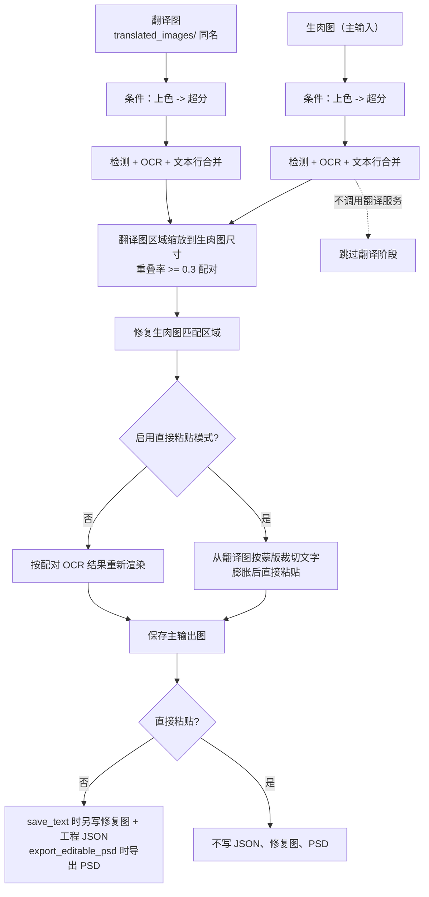

# 替换翻译

当你有一张未翻译的“生肉图”和一张已经翻译好的同作品图片（例如汉化版、修复版或不同分辨率的版本），又缺少可复用的工程 JSON 时，使用“替换翻译”工作流。它对生肉图和翻译图分别执行检测与 OCR，按缩放后的区域重叠配对，把翻译图中的译文迁移到生肉图：修复生肉图原文区域后重新渲染，或直接从翻译图裁切文字粘贴。整个过程不调用翻译服务。

这里主要说明该工作流的输入、跳过阶段和输出文件。九种工作流的整体边界见[输出目录与工作流](../desktop/translation/output-directory-and-workflow.md)，汇总表见[工作流矩阵](../reference/workflow-matrix.md)；添加文件、列表和拖放见[文件列表与输入](../desktop/translation/file-list-and-input.md)。

## 什么时候用

- 输入：主输入图片是生肉图，发现规则与正常翻译相同；每张生肉图必须在同图工作目录 `manga_translator_work/translated_images/` 下放置一张同名翻译图。
- 配对查找：先在 `translated_images/` 中找同扩展名的翻译图，再依次尝试其他受支持的图片扩展名；找不到时该张图跳过并记为失败。
- 执行阶段：对生肉图和翻译图各执行条件上色 → 条件超分 → 检测 → OCR → 文本行合并；把翻译图区域缩放到生肉图尺寸后按重叠率（阈值 `0.3`，以小框为基准）配对；修复生肉图的匹配区域；最后重新渲染或直接粘贴。
- 跳过阶段：翻译服务调用。翻译阶段（`translator`）完全不执行，译文来自翻译图的 OCR 结果。
- 输出文件：主输出图。非直接粘贴且 `save_text=true` 时另写修复图和工程 JSON；直接粘贴时明确不写二者，也不导出 PSD。
- 工作流字段：下拉框索引 8 写入 `cli.replace_translation=true`；GUI 切换保证八个工作流布尔字段互斥。

## 运行这个流程

### 选择替换翻译工作流

1. 打开翻译页，在“翻译流程模式：”下拉框中选择“替换翻译”。
2. 页面标题变为“替换翻译”，副标题提示把翻译图放到 `manga_translator_work/translated_images` 并与生肉图同名。
3. 开始按钮变为“开始替换翻译”；点击后按该模式启动后端任务。

选择模式只写入配置并更新界面文案，不会自动开始任务。开始前应添加生肉图，并把与生肉图同名的翻译图放进 `manga_translator_work/translated_images/`。配对优先使用同扩展名文件；`translated_images/` 目录不存在或没有同名图片时，对应生肉图会被跳过并计入失败。

“输出目录:”决定主输出图的位置；修复图、工程 JSON 和配对图始终按输入图片的工作目录规则定位，不随“输出目录:”改变。

界面提示里的 `manga_translator_work/translated_images` 是程序固定文案和工作目录名，不是用户私有路径；“与生肉图同名”指文件名（不含扩展名）一致。

## 处理顺序

### 输入与配对

`find_translated_image()` 以生肉图路径调用 `get_work_dir()` 得到同图工作目录，再拼接 `translated_images/<stem><ext>`。查找顺序是先同扩展名，后遍历 `SUPPORTED_IMAGE_EXTENSIONS`；因此 `.png` 生肉图可以配 `.jpg` 翻译图，但同名同扩展名永远优先。

配对按以下步骤进行：

1. 对生肉图执行 `_translate_until_translation()`（条件上色 → 条件超分 → 检测 → OCR → 文本行合并），并按 `ocr.prob` 过滤低置信度区域。
2. 对翻译图执行同样的前半段流水线，同样过滤。
3. 把翻译图区域缩放到生肉图尺寸（按宽高比例）。
4. 计算重叠率并以 `iou_threshold=0.3`（以小框为基准）匹配；`create_matched_regions()` 生成用于渲染的配对区域，未匹配上的生肉区域不会被修复。

### 处理阶段与输出

下面的 Mermaid 展示双图流水线、两种收尾方式和跳过阶段；它与正常翻译的主要差异是翻译图作为第二输入、不调用翻译服务，以及可选的直接粘贴分支。

限制说明：配对阈值是固定的 `0.3` 重叠率，不以任何用户参数调节；翻译图与生肉图尺寸不同时通过缩放对齐，缩放本身不保证文本位置完美重合，未匹配区域会保留生肉图原文。

### 两种收尾方式

- 重新渲染（默认）：关闭“启用直接粘贴模式”时，把配对后的 OCR 结果作为 `text_regions` 交给 `_run_text_rendering()`，按常规排版参数重新渲染译文；修复图和工程 JSON 在 `save_text=true` 时写出。
- 直接粘贴：开启“启用直接粘贴模式”时，从翻译图取蒙版（优先翻译图的原始蒙版，缺失时用生肉图蒙版），按 `paste_mask_dilation_pixels` 膨胀，再从翻译图裁切文字合成到修复图上，保留翻译图原始字体样式；不写 JSON、修复图和 PSD，`export_editable_psd` 也被忽略。

无论哪种收尾方式，主输出图都会按 `_calculate_output_path()` 保存。

### 跳过与失败路径

- 找不到配对翻译图：该张图跳过并记为失败，不产出主输出图。
- 生肉图未检测到文本区域，或过滤后无有效区域：直接输出原图作为主输出图，不修复、不渲染。
- 翻译图未检测到文本区域：直接输出原图。
- 匹配结果为空（没有需要修复的区域）：保存原图。
- 取消：每一步之间检查 `_check_cancelled()`，停止后不再处理后续图片；每张图处理完立即清理上下文内存。

### 与并发和互斥的关系

- `batch_concurrent` 不兼容：桌面控制层和 `translate_batch()` 都把它视为不兼容模式，强制按非并发处理；界面仍保存并发配置也不会变成并发管线。
- 手工叠加多个工作流字段不是受支持组合。`translate_batch()` 的分派顺序里，替换翻译分支优先于 load_text、translate_json_only 和常规预处理；GUI 切换时八个字段互斥。
- 与正常翻译一样，预处理阶段仍会按 `colorizer.colorizer` 和 `upscale.upscale_ratio` 对两张图执行条件上色与超分；这些值不是本工作流的强制开关。

## 输入、输出与限制

- 翻译图依赖：`translated_images/` 目录缺失、目录存在但没有同名文件，都会跳过该张图。配对图与生肉图不同名、不同分辨率或文本位置偏差过大时，配对结果会变少，未匹配区域保留原文。
- `render.enable_template_alignment`：设置说明明确为替换翻译专用；开启走直接粘贴，不写 JSON、修复图或 PSD；关闭时以 OCR 得到的配对区域重新渲染。
- `cli.save_text=false`：非直接粘贴时不写修复图和工程 JSON，只保留主输出图；直接粘贴本来就不写二者。
- `cli.overwrite=false`：GUI 开始前按“普通翻译”分支检查主输出图是否已存在，存在则跳过该张图。
- 蒙版细化：修复阶段按 `inpainter` 配置选择模型；修复模型为 `none` 时使用替换翻译专用检测模块重新取原始蒙版并用 `REFINEMASK_INPAINT` 精炼，否则走常规 `_run_mask_refinement`，随后按 `mask_dilation_offset` 做额外膨胀。
- 上色、超分、检测、OCR 仍按所选参数产生模型、显存和网络成本；这里不重复其参数说明。
- 主输出目录、`save_to_source_dir`、`cli.format` 只影响主输出图；JSON、修复图和配对图不受影响。

## 继续阅读 {#related-pages}

- 其它工作流：[正常翻译流程](./normal.md) · [导出原文](./export-original.md) · [导出翻译](./export-translation.md) · [仅翻译（JSON）](./translate-json-only.md) · [导入翻译并渲染](./import-translation-and-render.md) · [仅上色](./colorize-only.md) · [仅超分](./upscale-only.md) · [仅修复](./inpaint-only.md)
- 九种工作流的选择、输出目录与互斥写入：[输出目录与工作流](../desktop/translation/output-directory-and-workflow.md)
- 九种工作流的输入、跳过阶段与输出汇总：[工作流矩阵](../reference/workflow-matrix.md)
- 工作流字段互斥、参数覆盖与模板对齐：[模式专用工作流与模板对齐](../desktop/settings/mode-specific.md)

> 详见参考索引：[工作流矩阵](../reference/workflow-matrix.md)。
