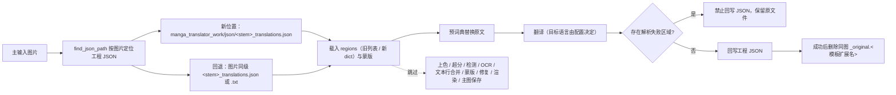

# 仅翻译（JSON）

当每张图已经存在工程 JSON（例如“导出原文”生成的 `manga_translator_work/json/<stem>_translations.json`，或编辑器中保存过的工程），并且你只想让程序重新翻译 JSON 里的原文、把译文写回 JSON，而不想重新检测、OCR、修复或渲染成图时，使用“仅翻译（JSON）”工作流。它从 JSON 载入文本区域，执行预词典替换和翻译，回写工程 JSON，成功后删除同图的原文副文件；不执行上色、超分、检测、OCR、文本行合并、蒙版、修复和渲染，也不写主输出图。

“仅翻译（JSON）”与“导出译文”“导出原文”“导入翻译并渲染”构成模板/JSON 家族，区别见[导出译文](./export-translation.md)、[导出原文](./export-original.md)和[导入翻译并渲染](./import-translation-and-render.md)；九种工作流的整体边界见[输出目录与工作流](../desktop/translation/output-directory-and-workflow.md)，汇总表见[工作流矩阵](../reference/workflow-matrix.md)。`cli.translate_json_only` 的参数定义见[模式专属工作流与模板对齐](../desktop/settings/mode-specific.md#cli-translate-json-only)。

## 什么时候用 {#feature-boundary}

- 这里仅列出九种工作流中的“仅翻译（JSON）”（下拉框索引 `3`）。选择该模式时，界面先清空八个互斥工作流字段，再只把 `cli.translate_json_only` 设为 `true` 并保存配置。
- 输入：主输入图片（与正常翻译相同的文件发现规则），且每张图必须能找到可解析的工程 JSON；JSON 接受旧格式（值是一个区域列表）或新格式（值是含 `regions` 的 dict）两种结构。
- 执行阶段：从 JSON 载入区域与蒙版 → 预词典替换 → 翻译 → JSON 回写；成功后删除同图 `<stem>_original.<模板扩展名>` 原文副文件。
- 跳过阶段：条件上色、条件超分、检测、OCR、文本行合并、蒙版细化、修复、渲染和主输出图保存。
- 输出文件：回写 `manga_translator_work/json/<stem>_translations.json`（新位置优先；读取自旧位置时回写仍落到新位置）。
- 工作流字段：下拉框索引 `3` → `cli.translate_json_only=true`；GUI 切换保证八个工作流布尔字段互斥。

## 运行这个流程 {#ui-operations}

### 选择仅翻译（JSON）工作流 {#select-translate-json-only}

1. 打开“翻译”页，在“翻译任务”卡片中点击“翻译流程模式：”下拉框。
2. 选择“仅翻译（JSON）”。切换时界面只把 `cli.translate_json_only` 设为 `true`，其余七个工作流字段清为 `false` 并保存配置；标题变为“仅翻译（JSON）”，副标题显示对应提示。
3. 点击“开始仅翻译（JSON）”开始按钮启动任务。切换模式不会自动开始任务；任务进行中按钮会变为“停止翻译”等状态，见[进度、停止与任务状态](../desktop/translation/progress-stop-and-task-state.md)。

副标题里的 `图片名` 是程序对输入 `<stem>` 的示例称呼，不是用户私有文件名；`manga_translator_work/json/` 是每图工作目录下的固定子目录名。提示中的 `imagename_original.txt` 只是固定示例文案，实际扩展名由模板 `output_format` 决定（默认 `json`），删除原文副文件时按该扩展名定位。

“输出目录:”只决定主输出图的位置；本模式不写主图，因此它不影响 JSON 的读取与回写位置，这两者始终按输入图片的工作目录规则定位。

## 处理顺序 {#runtime-behavior}

### 输入与发现规则 {#input-and-discovery}

- 主输入图片：与正常翻译相同的文件发现规则（“添加文件…”/“添加文件夹…”或拖放；递归查找、自然排序、跳过名为 `manga_translator_work` 的目录）。
- JSON 查找：`find_json_path()` 先查新位置 `manga_translator_work/json/<stem>_translations.json`，再回退旧位置（图片同级的 `<stem>_translations.json`）。两种位置都找不到且存在旧格式 `<stem>_translations.txt` 时，回退到 TXT 读取（该格式没有蒙版）。
- 找不到 JSON 时，该图抛出 `FileNotFoundError` 并标记失败，不进入翻译和回写。
- JSON 结构兼容两种格式：旧格式把图片键对应的值存为区域列表；新格式存为 dict，包含 `regions`、`mask_raw`（base64/列表）、`mask_is_refined`、`skip_font_scaling`、`skip_text_replacements` 等字段。代码不校验图片键名，直接取第一个值；区域缺 `target_lang` 时用配置 `translator.target_lang` 回填。

### 跳过与保留的阶段 {#skipped-and-kept-stages}

下面的 Mermaid 展示阶段顺序、解析失败保险丝和输出文件；它是九种工作流矩阵中的“JSON 读取 → 翻译 → JSON 回写”分支，与导出原文/导出译文共享 JSON 读写设施，但跳过它们的图像阶段。

### JSON 回写细节 {#json-writeback-details}

- 回写调用 `_save_text_to_file()`：写入 `regions`（每区域含坐标、原文、译文、字号等渲染字段）、`original_width`、`original_height`，并强制 `skip_font_scaling=false`（与导出原文一致），使后续“导入翻译并渲染”重新执行智能排版，不继承旧字号。
- `skip_text_replacements` 保持缺省 `false`：本模式不渲染，JSON 里存的是替换规则生效前的原始译文，导入渲染时才应用文本替换规则。
- 蒙版：从 JSON 载入的 `mask_raw`（base64/列表解码）写回；`mask_is_refined` 状态保留。已有 JSON 中的 `paint_overlay`、`stamp_overlay`（编辑器画笔/印章图层）和 `last_export_dir` 会被保留，避免回写覆盖丢失。
- 保险丝：区域解析失败（`load_text_parse_failures > 0`）时禁止回写，改为显式失败并保留原文件，避免把丢失的区域永久覆盖进工程 JSON。
- 成功后调用 `_delete_original_txt_after_json_translation()` 删除同图原文副文件；删除失败只记录警告，不使任务失败。

### 输出文件 {#output-files}

| 输出 | 路径 | 说明 |
| --- | --- | --- |
| 工程 JSON（回写） | `manga_translator_work/json/<stem>_translations.json` | 新位置优先；即使读取自旧位置，回写也落到新位置 |
| 原文副文件（删除） | `manga_translator_work/originals/<stem>_original.<模板扩展名>` | 成功翻译后删除；扩展名由模板 `output_format` 决定，默认 `json` |
| 主输出图 | 不写 | 渲染被跳过，本模式不生成主图 |

## 输入、输出与限制 {#dependencies-and-conflicts}

- 依赖每张图存在可解析的工程 JSON；找不到或解析失败时该图失败并保留原文件。
- `batch_concurrent` 不兼容：桌面控制层和 `translate_batch()` 都把它视为不兼容模式，强制按非并发处理；界面仍保存并发配置也不会变成并发管线。
- 手工叠加多个工作流字段不是受支持组合。运行时 `translate_batch()` 的分派顺序里，`load_text` 的 TXT 预导入先执行、`replace_translation` 优先分派，之后才处理 `translate_json_only`；GUI 切换时八个字段互斥。
- 不受 `cli.save_text` 控制：JSON-only 分支在翻译后无条件回写 JSON；这与导出原文要求 `template=true` 且 `save_text=true` 不同。
- 高质量翻译器（`openai_hq`/`gemini_hq`）在本模式下被当作导入/导出模式，跳过专用高质量流程，走标准翻译流程并记录日志警告。
- 本模式仍按所选翻译器产生 API/模型成本；上色、超分、检测、OCR、修复和渲染不产生成本（阶段被跳过）。
- 主输出目录、`save_to_source_dir`、`cli.format` 只影响主输出图；本模式不写主图，因此这些设置对本工作流输出无直接影响。

## 继续阅读 {#related-pages}

- 其它工作流：[正常翻译流程](./normal.md) · [导出原文](./export-original.md) · [导出翻译](./export-translation.md) · [导入翻译并渲染](./import-translation-and-render.md) · [仅上色](./colorize-only.md) · [仅超分](./upscale-only.md) · [仅修复](./inpaint-only.md) · [替换翻译](./replace-translation.md)
- 九种工作流的选择、输出目录与互斥写入：[输出目录与工作流](../desktop/translation/output-directory-and-workflow.md)
- 九种工作流的输入、跳过阶段与输出汇总：[工作流矩阵](../reference/workflow-matrix.md)
- 工作流字段互斥、参数覆盖与模板对齐：[模式专用工作流与模板对齐](../desktop/settings/mode-specific.md)

> 详见参考索引：[工作流矩阵](../reference/workflow-matrix.md)。
