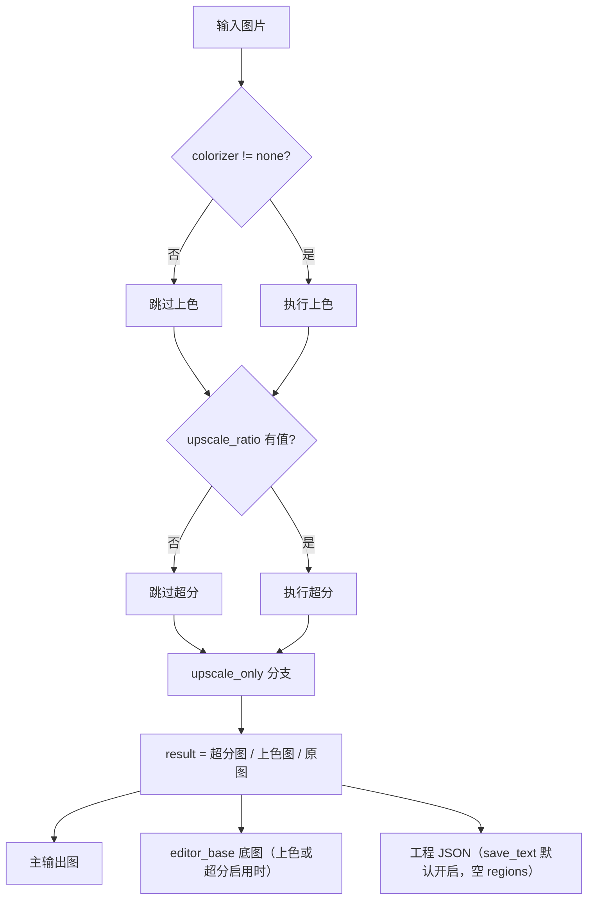

# 仅超分

当只需要批量放大图片（例如为后续人工修图、打印或存档提高分辨率），不需要检测、OCR、翻译、修复和排版渲染时，使用“仅超分”工作流。它把每张输入图片送入超分模型后直接写出主输出图，不生成翻译文本，也不走蒙版、修复和渲染阶段。

“仅超分”与“仅上色”“仅修复”同属旁路工作流：它们都跳过翻译链路的后半段，区别只在保留哪个前置阶段。九种工作流的整体边界见[输出目录与工作流](../desktop/translation/output-directory-and-workflow.md)，汇总表见[工作流矩阵](../reference/workflow-matrix.md)；超分模型、倍率、分块等参数说明见[超分与上色](../desktop/settings/upscale-and-colorization.md)。

## 什么时候用

- 输入：主输入图片（与正常翻译相同的文件发现规则：添加文件、添加文件夹或拖放，文件夹递归查找并按自然排序，跳过名为 `manga_translator_work` 的目录）。
- 执行阶段：上色（条件）→ 超分（条件）。`colorizer.colorizer` 不为 `none` 时先执行上色；`upscale.upscale_ratio` 有值时执行超分。
- 跳过阶段：检测、OCR、文本行合并、翻译、蒙版细化、修复、排版渲染。`upscale_only` 分支把 `text_regions` 置为空列表，不进入翻译与渲染分支。
- 输出文件：主输出图（由输出路径计算决定，见“关联文件与格式”）；上色或超分任一启用时还写入编辑器底图 `manga_translator_work/editor_base/<原始文件名>`。
- 工作流字段：下拉框第 6 项（索引 6），运行时写入 `cli.upscale_only=true`；GUI 切换时八个工作流布尔字段互斥。

“仅超分”不会强制倍率：`upscale_only=true` 只决定跳过哪些阶段，是否真的放大由 `upscale_ratio` 决定。倍率为空时输出就是上色结果（上色器开启时）或原图。源代码也不会在该模式自动关闭上色，因此界面提示“仅对图片进行超分处理”与上色器已开启时的实际前置上色不完全一致。

## 运行这个流程

### 选择仅超分工作流

1. 打开翻译页，在“翻译流程模式：”下拉框中选择“仅超分”。
2. 页面标题变为“仅超分”，副标题显示提示：仅对图片进行超分处理，不进行检测、OCR、翻译和渲染。
3. 开始按钮变为“开始超分”；点击后按该模式启动后端任务。

选择模式只写入配置并更新界面文案，不会自动开始任务。开始前应先添加主输入图片（“添加文件…”“添加文件夹…”或拖放），并按需在“设置 → Mode Specific → Upscaling”中选择超分模型与倍率；倍率保持“不使用”时本模式不会改变图像。

## 处理顺序

### 处理分支与输出

桌面任务经 `translate_batch()` 进入标准或高质量批处理循环，每张图调用 `_translate_until_translation()` 完成条件上色与条件超分；`upscale_only` 分支在超分完成后直接返回 `ctx.result = ctx.upscaled`，后续的检测、OCR、翻译和渲染阶段被整体跳过。

上图是仅超分实际分支：倍率为空时输出仍是上色图或原图；编辑器底图只在 `colorizer != none` 或 `upscale_ratio` 有值时才写入；工程 JSON 的写入取决于 `cli.save_text`/`text_output_file`（见“依赖与冲突”），并以实际输出为准。本模式不会因为界面仍保存并发配置就变成并发管线。

## 输入、输出与限制

- `upscale_only=true` 不强制倍率：`upscale_ratio` 为“不使用”时输出为上色结果或原图；界面提示与代码实际行为不完全一致（代码不会自动关闭上色）。
- 上色前置：`colorizer.colorizer` 非 `none` 时，仅超分也会先执行上色，产生模型、显存和 API 成本；倍率为空时输出保留该上色结果。
- `revert_upscaling` 只恢复输出尺寸，不取消超分；超分后的图像先放大再缩小，仍会产生超分计算。
- `tile_size=0` 只关闭分块，不等于关闭超分；空值使用运行时默认 400。
- `cli.overwrite=false`：GUI 开始前按主输出图检查（“普通模式”分支），主输出图已存在则跳过该图片。
- `cli.save_text`：默认 `true`。批处理循环在 `save_text` 或 `text_output_file` 开启时，即使 `text_regions` 为空也会调用 `_save_text_to_file`，因此默认配置下仅超分还会写出含空 `regions` 的工程 JSON（记录 `upscale_ratio`、`upscaler` 与 `last_export_dir`）。研究矩阵只列出主图和编辑器底图两种输出，实际文件保留以实际输出为准。
- `batch_concurrent` 不兼容：桌面控制层与 `translate_batch()` 都把仅超分视为不兼容模式，强制按非并发处理。
- 手工叠加多个工作流字段不是受支持组合；GUI 切换时八个字段互斥，核心分派也不以多字段叠加为准。
- 主输出目录、`save_to_source_dir`、`cli.format` 决定主输出图位置与扩展名；JSON 与编辑器底图始终按输入图片的工作目录规则写入，不受输出目录影响。
- 本模式不渲染，因此不写 `skip_text_replacements`；已有 JSON 中的画笔/印章图层会被保留。

## 继续阅读 {#related-pages}

- 其它工作流：[正常翻译流程](./normal.md) · [导出原文](./export-original.md) · [导出翻译](./export-translation.md) · [仅翻译（JSON）](./translate-json-only.md) · [导入翻译并渲染](./import-translation-and-render.md) · [仅上色](./colorize-only.md) · [仅修复](./inpaint-only.md) · [替换翻译](./replace-translation.md)
- 九种工作流的选择、输出目录与互斥写入：[输出目录与工作流](../desktop/translation/output-directory-and-workflow.md)
- 九种工作流的输入、跳过阶段与输出汇总：[工作流矩阵](../reference/workflow-matrix.md)
- 工作流字段互斥、参数覆盖与模板对齐：[模式专用工作流与模板对齐](../desktop/settings/mode-specific.md)

> 详见参考索引：[工作流矩阵](../reference/workflow-matrix.md)。
